## k9mail-k-9
----
#### Metrics provided by Detekt
* Number of lines of code 14374
* Number of Kotlin files: 232
* Cyclomatic complexity: 2241
* Cyclomatic complexity by thousands of lines: 271 

----
**17** features analyzed

*	<a href="#type_inference">Type Inference</a> 
*	<a href="#lambda">Lambda</a> 
*	<a href="#safe_call">Safe Call</a> 
*	<a href="#when_expr">When expression</a> 
*	<a href="#companion_object">Companion Object</a> 
*	<a href="#unsafe_call">Unsafe Call</a> 
*	<a href="#string_template">String Template</a> 
*	<a href="#func_with_default_value">Function with Default Value</a> 
*	<a href="#singleton">Singleton</a> 
*	<a href="#smart_cast">Smart Cast</a> 
*	<a href="#range_expr">Range Expression</a> 
*	<a href="#func_call_with_named_arg">Function call with Named Argument</a> 
*	<a href="#data_class">Data Class</a> 
*	<a href="#extension_function">Extension Function</a> 
*	<a href="#property_delegation">Property Delegation</a> 
*	<a href="#destructuring_declaration">Destructuring Declaration</a> 
*	<a href="#inline_func">Inline Function</a> 

### <a name="type_inference">Type Inference</a>
----
#### Functions
* **Sudden Rise - Exponential:** 
    * **R_Squared:** 0.9889068
* **Constant Rise - Linear:** 
    * **R_Squared:** 0.9447077
* **Sudden Rise Plateau - Logarithm:** 
    * **R_Squared:** 0.27277163
* **Plateau Sudden Rise - Binary Sigmoid:** 
    * **R_Squared:** 0.05887148

**Plots** :chart_with_upwards_trend:
-----

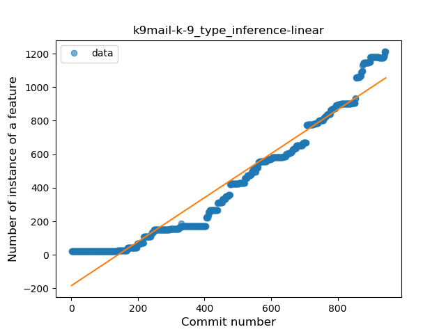
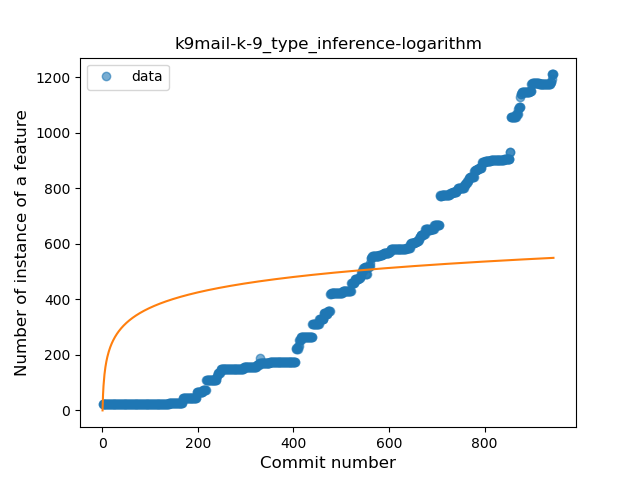
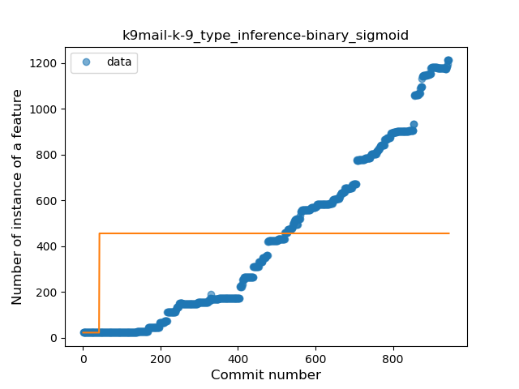
### <a name="lambda">Lambda</a>
----
#### Functions
* **Sudden Rise - Exponential:** 
    * **R_Squared:** 0.95741746
* **Constant Rise - Linear:** 
    * **R_Squared:** 0.94394281
* **Plateau Sudden Rise - Binary Sigmoid:** 
    * **R_Squared:** 0.4281787
* **Sudden Rise Plateau - Logarithm:** 
    * **R_Squared:** 0.28044367

**Plots** :chart_with_upwards_trend:
-----

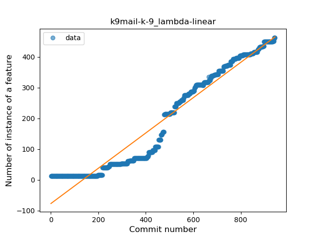

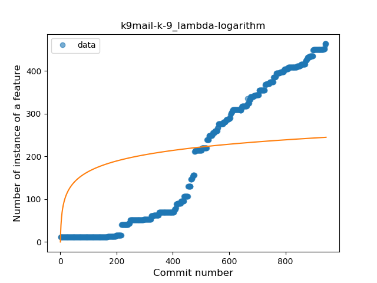
### <a name="safe_call">Safe Call</a>
----
#### Functions
* **Sudden Rise - Exponential:** 
    * **R_Squared:** 0.9125301
* **Constant Rise - Linear:** 
    * **R_Squared:** 0.86771241
* **Sudden Rise Plateau - Logarithm:** 
    * **R_Squared:** 0.21921641
* **Plateau Sudden Rise - Binary Sigmoid:** 
    * **R_Squared:** 0.0068539

**Plots** :chart_with_upwards_trend:
-----

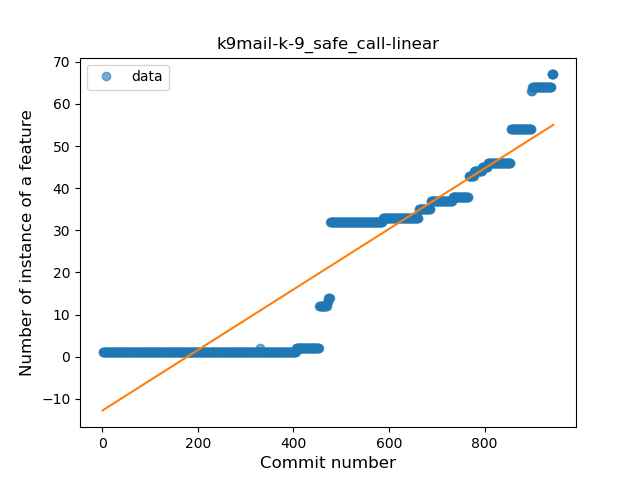
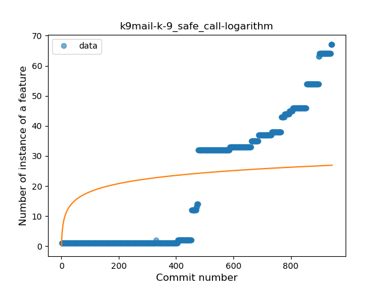
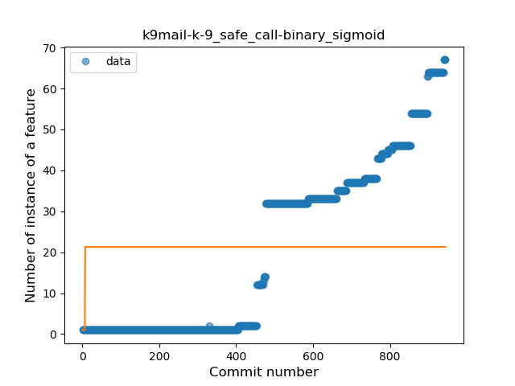
### <a name="when_expr">When expression</a>
----
#### Functions
* **Constant Rise - Linear:** 
    * **R_Squared:** 0.9659166
* **Sudden Rise - Exponential:** 
    * **R_Squared:** 0.96607019
* **Sudden Rise Plateau - Logarithm:** 
    * **R_Squared:** 0.39289367

**Plots** :chart_with_upwards_trend:
-----

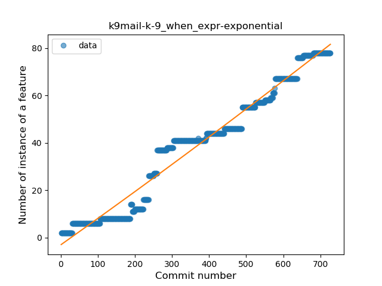
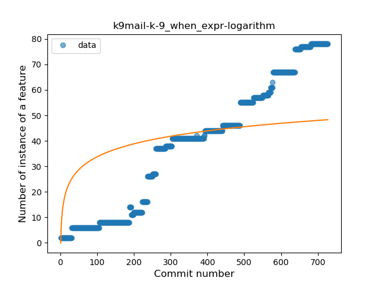
### <a name="companion_object">Companion Object</a>
----
#### Functions
* **Constant Rise - Linear:** 
    * **R_Squared:** 0.97357018
* **Sudden Rise Plateau - Logarithm:** 
    * **R_Squared:** 0.4034753
* **Plateau Sudden Rise - Binary Sigmoid:** 
    * **R_Squared:** 0.04694167

**Plots** :chart_with_upwards_trend:
-----

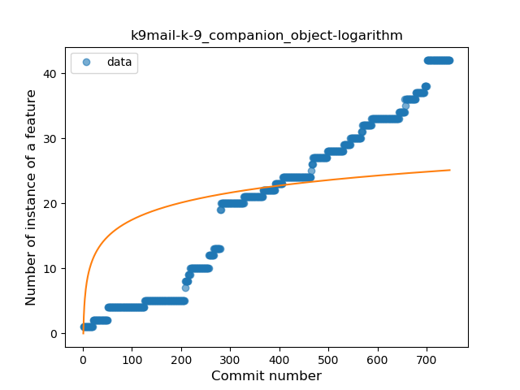
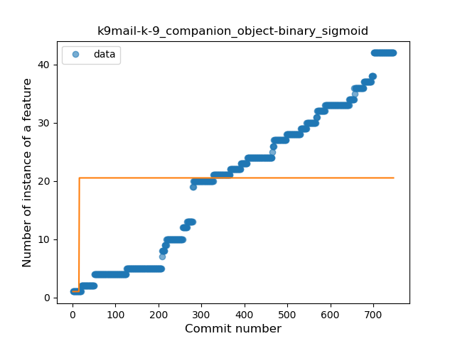
### <a name="unsafe_call">Unsafe Call</a>
----
#### Functions
* **Constant Rise - Linear:** 
    * **R_Squared:** 0.84385498
* **Sudden Rise Plateau - Logarithm:** 
    * **R_Squared:** 0.55166903

**Plots** :chart_with_upwards_trend:
-----

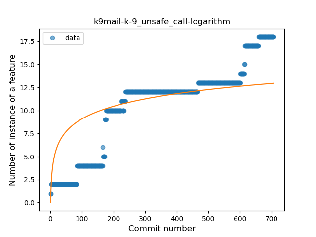
### <a name="string_template">String Template</a>
----
#### Functions
* **Plateau Gradual Rise - Sigmoid:** 
    * **R_Squared:** 0.91842706
* **Sudden Rise - Exponential:** 
    * **R_Squared:** 0.88496538
* **Constant Rise - Linear:** 
    * **R_Squared:** 0.47971657
* **Sudden Rise Plateau - Logarithm:** 
    * **R_Squared:** 0.09162946

**Plots** :chart_with_upwards_trend:
-----

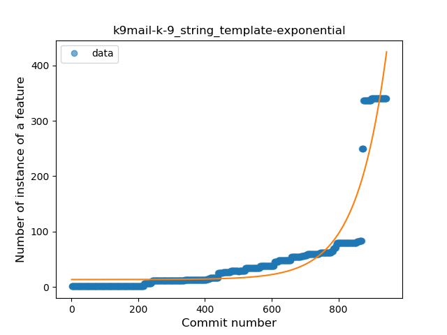
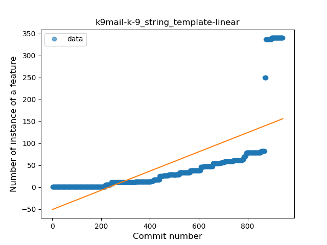
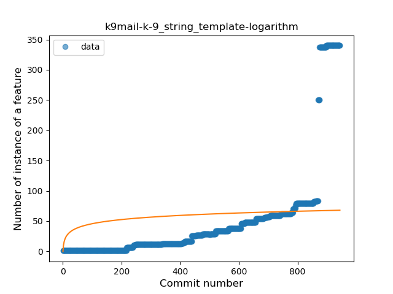
### <a name="func_with_default_value">Function with Default Value</a>
----
#### Functions
* **Plateau Gradual Rise - Sigmoid:** 
    * **R_Squared:** 0.97763321
* **Sudden Rise - Exponential:** 
    * **R_Squared:** 0.94450014
* **Constant Rise - Linear:** 
    * **R_Squared:** 0.93374086
* **Sudden Rise Plateau - Logarithm:** 
    * **R_Squared:** 0.2888526

**Plots** :chart_with_upwards_trend:
-----

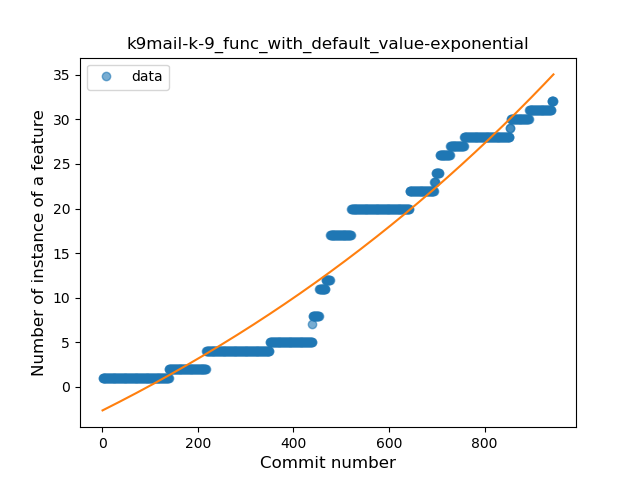
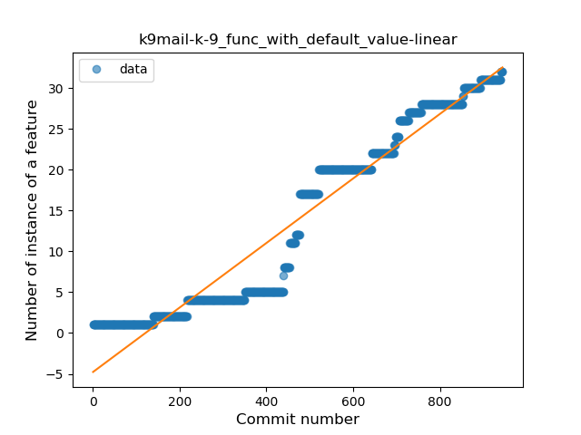
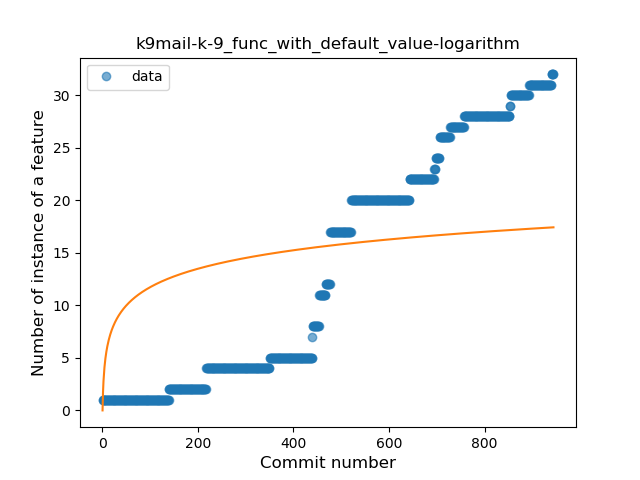
### <a name="singleton">Singleton</a>
----
#### Functions
* **Constant Rise - Linear:** 
    * **R_Squared:** 0.95534549
* **Sudden Rise - Exponential:** 
    * **R_Squared:** 0.96078676
* **Sudden Rise Plateau - Logarithm:** 
    * **R_Squared:** 0.41527261

**Plots** :chart_with_upwards_trend:
-----

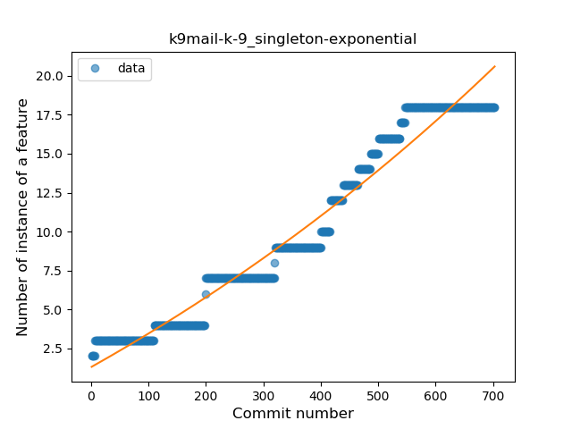
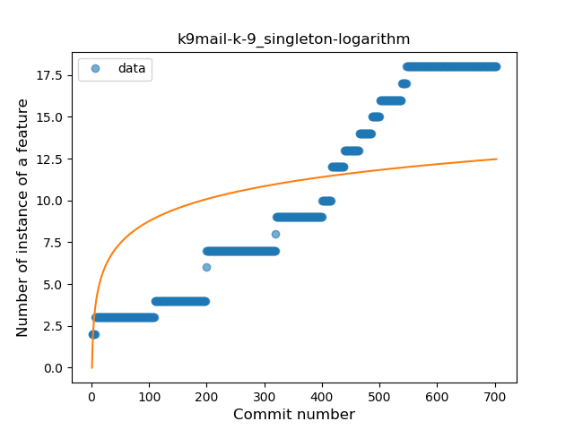
### <a name="smart_cast">Smart Cast</a>
----
#### Functions
* **Sudden Rise - Exponential:** 
    * **R_Squared:** 0.94055534
* **Constant Rise - Linear:** 
    * **R_Squared:** 0.85161465
* **Sudden Rise Plateau - Logarithm:** 
    * **R_Squared:** 0.34728206

**Plots** :chart_with_upwards_trend:
-----

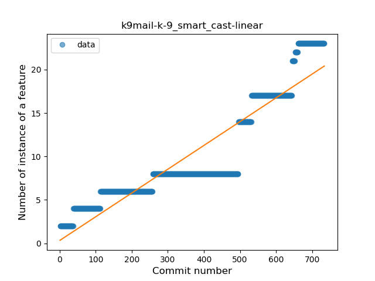
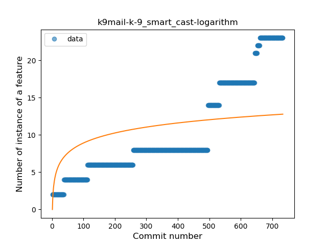
### <a name="range_expr">Range Expression</a>
----
#### Functions
* **Constant Rise - Linear:** 
    * **R_Squared:** 0.89283388
* **Plateau Gradual Rise - Sigmoid:** 
    * **R_Squared:** 0.90028514
* **Sudden Rise Plateau - Logarithm:** 
    * **R_Squared:** 0.59939252

**Plots** :chart_with_upwards_trend:
-----

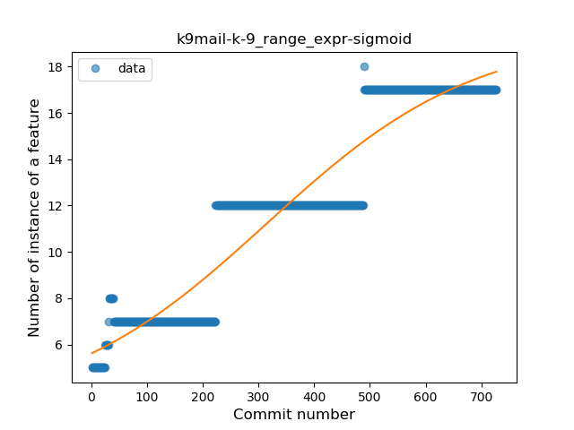
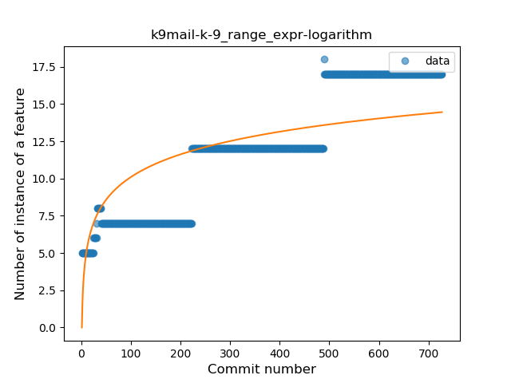
### <a name="func_call_with_named_arg">Function call with Named Argument</a>
----
#### Functions
* **Sudden Rise - Exponential:** 
    * **R_Squared:** 0.94153245
* **Constant Rise - Linear:** 
    * **R_Squared:** 0.91823907
* **Sudden Rise Plateau - Logarithm:** 
    * **R_Squared:** 0.38068065

**Plots** :chart_with_upwards_trend:
-----

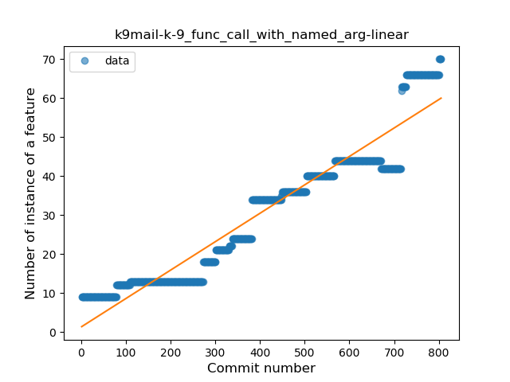
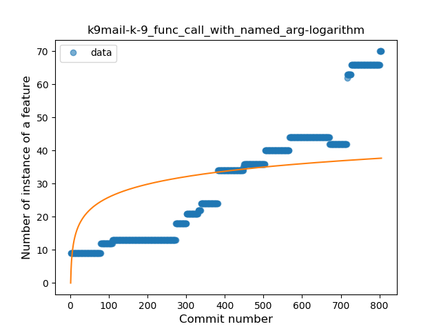
### <a name="data_class">Data Class</a>
----
#### Functions
* **Constant Rise - Linear:** 
    * **R_Squared:** 0.97050147
* **Sudden Rise - Exponential:** 
    * **R_Squared:** 0.97188806
* **Sudden Rise Plateau - Logarithm:** 
    * **R_Squared:** 0.37145488

**Plots** :chart_with_upwards_trend:
-----

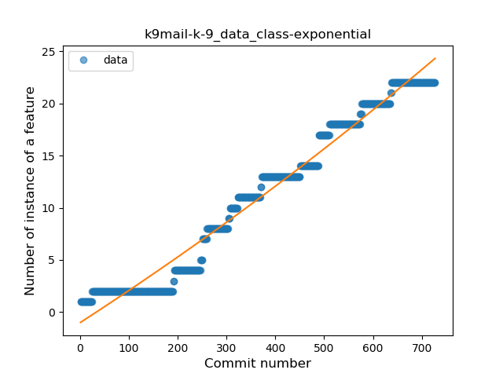
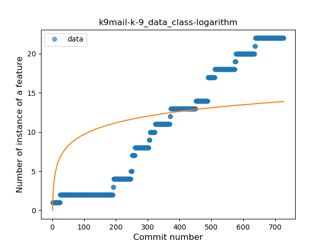
### <a name="extension_function">Extension Function</a>
----
#### Functions
* **Constant Rise - Linear:** 
    * **R_Squared:** 0.89071576
* **Sudden Rise - Exponential:** 
    * **R_Squared:** 0.89614033
* **Plateau Sudden Rise - Binary Sigmoid:** 
    * **R_Squared:** 0.72151049
* **Sudden Rise Plateau - Logarithm:** 
    * **R_Squared:** 0.26888568

**Plots** :chart_with_upwards_trend:
-----

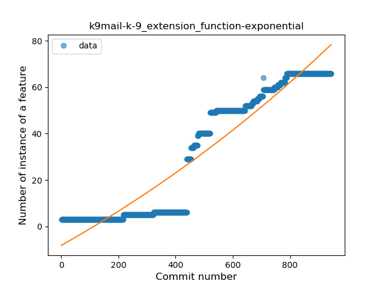
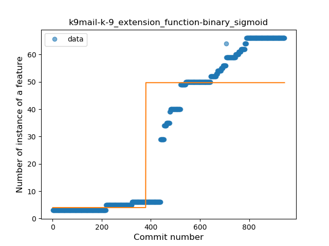
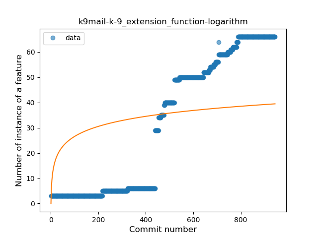
### <a name="property_delegation">Property Delegation</a>
----
#### Functions
* **Plateau Gradual Rise - Sigmoid:** 
    * **R_Squared:** 0.95466638
* **Constant Rise - Linear:** 
    * **R_Squared:** 0.79508568
* **Sudden Rise Plateau - Logarithm:** 
    * **R_Squared:** 0.590119

**Plots** :chart_with_upwards_trend:
-----

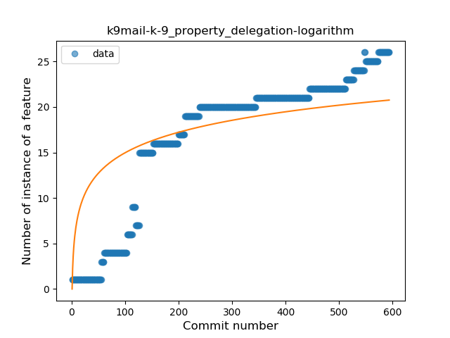
### <a name="destructuring_declaration">Destructuring Declaration</a>
----
#### Functions
* **Sudden Rise - Exponential:** 
    * **R_Squared:** 0.91532252
* **Constant Rise - Linear:** 
    * **R_Squared:** 0.88542724
* **Sudden Rise Plateau - Logarithm:** 
    * **R_Squared:** 0.34460295
* **Plateau Gradual Rise - Sigmoid:** 
    * **R_Squared:** 0.19011789

**Plots** :chart_with_upwards_trend:
-----

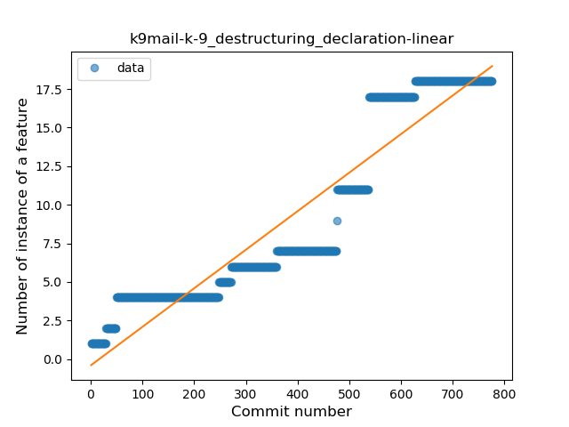
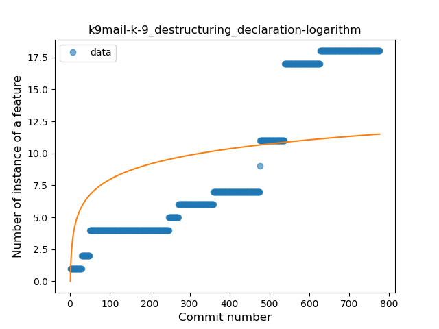
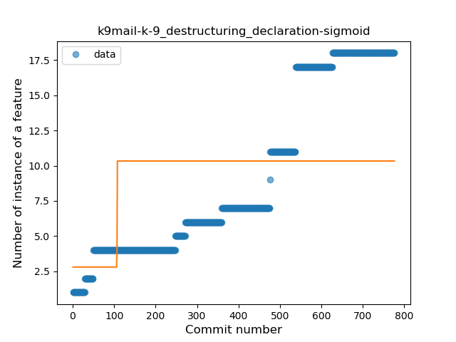
### <a name="inline_func">Inline Function</a>
----
#### Functions
* **Sudden Rise Plateau - Logarithm:** 
    * **R_Squared:** 0.80501372
* **Constant Rise - Linear:** 
    * **R_Squared:** 0.50521667

**Plots** :chart_with_upwards_trend:
-----

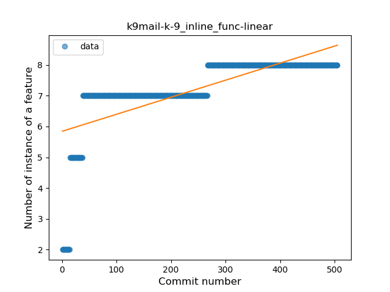
