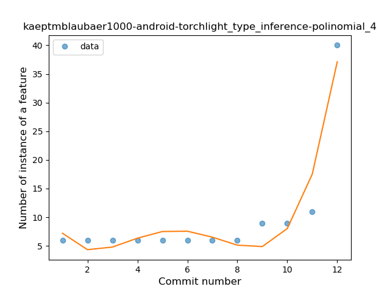
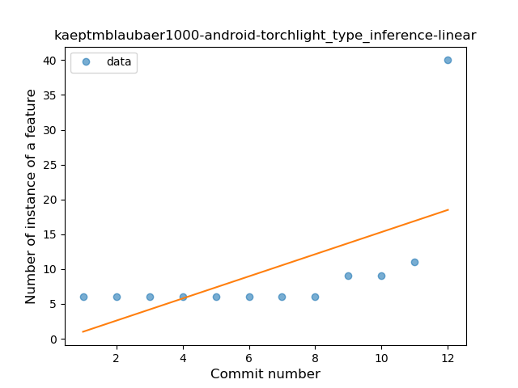
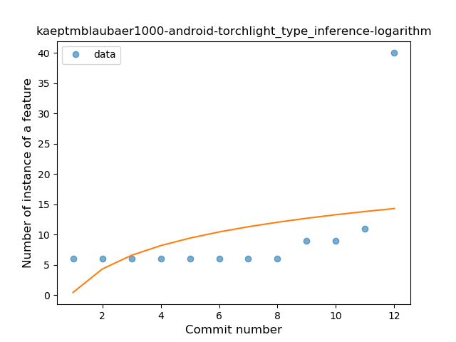
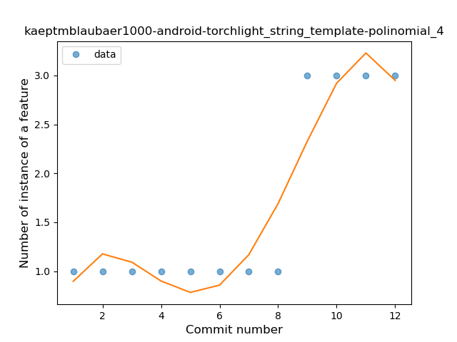
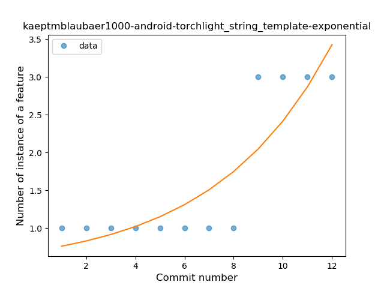
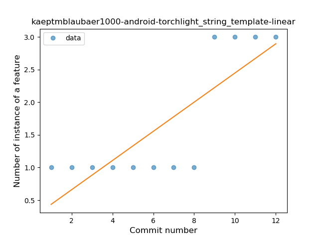
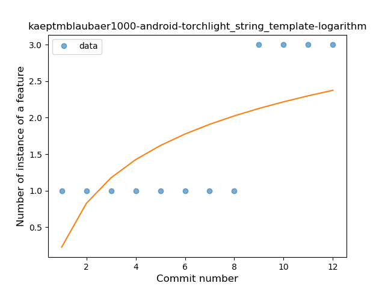
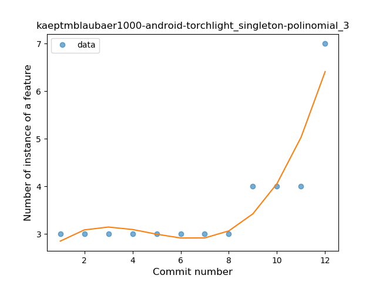
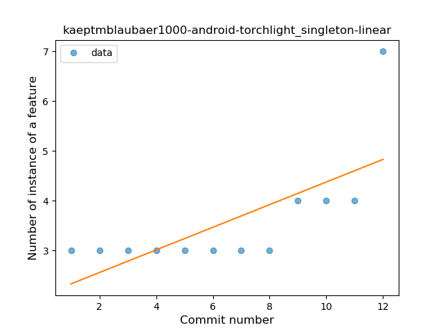
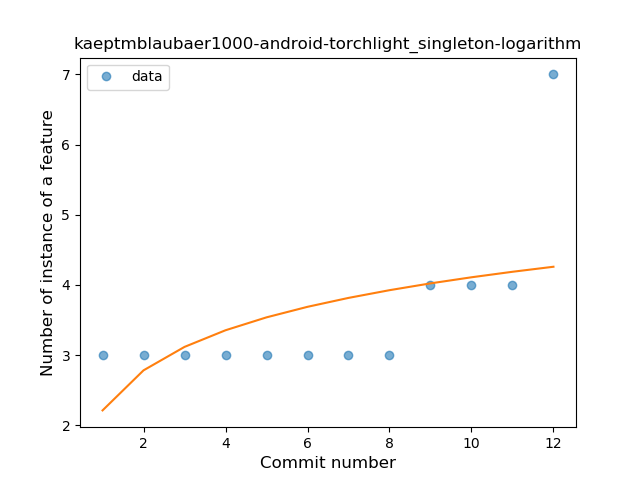

## kaeptmblaubaer1000-android-torchlight
----
#### Metrics provided by Detekt
* Number of lines of code 1240
* Number of Kotlin files: 17
* Cyclomatic complexity: 183
* Cyclomatic complexity by thousands of lines: 305 

----
**3** features analyzed

*	<a href="#type_inference">Type Inference</a> 
*	<a href="#string_template">String Template</a> 
*	<a href="#singleton">Singleton</a> 

### <a name="type_inference">Type Inference</a>
----
#### Functions
* **Sudden Rise - Exponential:** 
    * **R_Squared:** 0.98934511
* **Instability - Polinomial 4:** 
    * **R_Squared:** 0.92202908
* **Instability - Polinomial 3:** )
    * **R_Squared:** 0.83466182
* **Constant Rise - Linear:** 
    * **R_Squared:** 0.35130485
* **Sudden Rise Plateau - Logarithm:** 
    * **R_Squared:** 0.18946648

**Plots** :chart_with_upwards_trend:
-----

### <a name="string_template">String Template</a>
----
#### Functions
* **Plateau Sudden Rise - Binary Sigmoid:** 
    * **R_Squared:** 1.0
* **Instability - Polinomial 4:** 
    * **R_Squared:** 0.89277389
* **Sudden Rise - Exponential:** 
    * **R_Squared:** 0.76765152
* **Constant Rise - Linear:** 
    * **R_Squared:** 0.67132867
* **Sudden Rise Plateau - Logarithm:** 
    * **R_Squared:** 0.44155684

**Plots** :chart_with_upwards_trend:
-----

### <a name="singleton">Singleton</a>
----
#### Functions
* **Sudden Rise - Exponential:** 
    * **R_Squared:** 0.93230227
* **Instability - Polinomial 3:** )
    * **R_Squared:** 0.87756006
* **Constant Rise - Linear:** 
    * **R_Squared:** 0.49517522
* **Sudden Rise Plateau - Logarithm:** 
    * **R_Squared:** 0.28603849

**Plots** :chart_with_upwards_trend:
-----

