## kamgurgul-cpu-info
----
#### Metrics provided by Detekt
* Number of lines of code 7717
* Number of Kotlin files: 84
* Cyclomatic complexity: 697
* Cyclomatic complexity by thousands of lines: 231 

----
**16** features analyzed

*	<a href="#type_inference">Type Inference</a> 
*	<a href="#lambda">Lambda</a> 
*	<a href="#safe_call">Safe Call</a> 
*	<a href="#when_expr">When expression</a> 
*	<a href="#companion_object">Companion Object</a> 
*	<a href="#unsafe_call">Unsafe Call</a> 
*	<a href="#string_template">String Template</a> 
*	<a href="#func_with_default_value">Function with Default Value</a> 
*	<a href="#singleton">Singleton</a> 
*	<a href="#smart_cast">Smart Cast</a> 
*	<a href="#range_expr">Range Expression</a> 
*	<a href="#func_call_with_named_arg">Function call with Named Argument</a> 
*	<a href="#data_class">Data Class</a> 
*	<a href="#extension_function">Extension Function</a> 
*	<a href="#property_delegation">Property Delegation</a> 
*	<a href="#inline_func">Inline Function</a> 

### <a name="type_inference">Type Inference</a>
----
#### Functions
* **Sudden Rise Plateau - Logarithm:** 
    * **R_Squared:** 0.80483685
* **Constant Rise - Linear:** 
    * **R_Squared:** 0.6093513

**Plots** :chart_with_upwards_trend:
-----

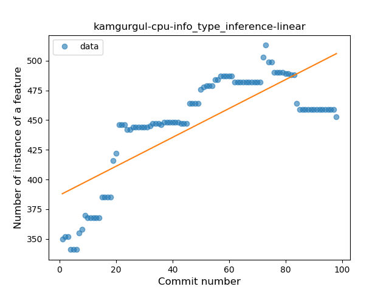
### <a name="lambda">Lambda</a>
----
#### Functions
* **Instability - Polinomial 3:** )
    * **R_Squared:** 0.89304379
* **Sudden Rise Plateau - Logarithm:** 
    * **R_Squared:** 0.59615316
* **Constant Rise - Linear:** 
    * **R_Squared:** 0.26523538

**Plots** :chart_with_upwards_trend:
-----

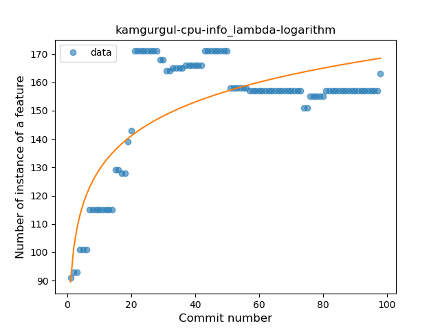
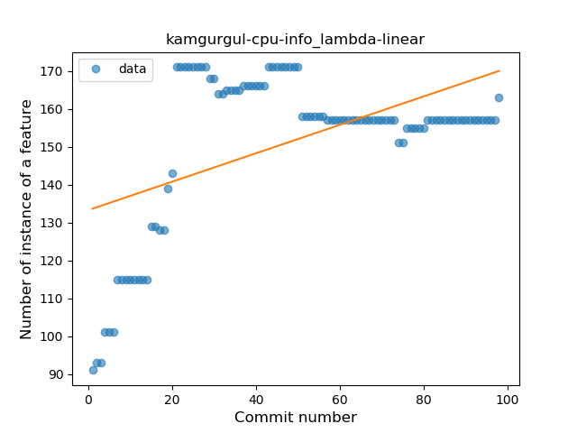
### <a name="safe_call">Safe Call</a>
----
#### Functions
* **Sudden Rise - Exponential:** 
    * **R_Squared:** 0.2401987
* **Constant Rise - Linear:** 
    * **R_Squared:** 0.19626279
* **Sudden Rise Plateau - Logarithm:** 
    * **R_Squared:** 0.13115514

**Plots** :chart_with_upwards_trend:
-----

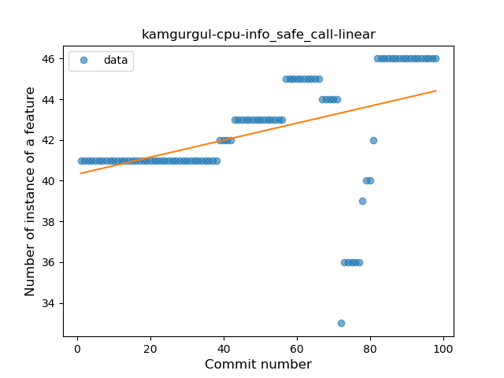
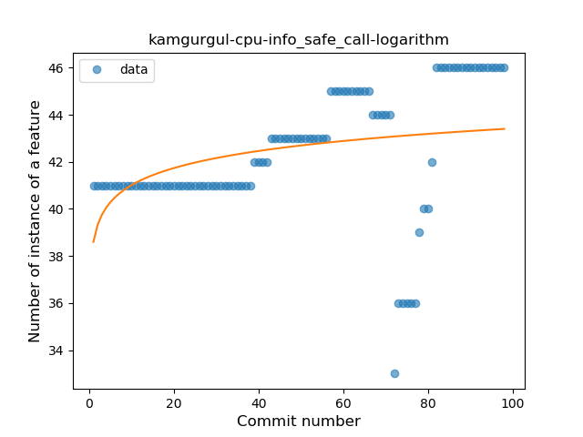
### <a name="when_expr">When expression</a>
----
#### Functions
* **Sudden Rise Plateau - Logarithm:** 
    * **R_Squared:** 0.63061457
* **Constant Rise - Linear:** 
    * **R_Squared:** 0.46538132

**Plots** :chart_with_upwards_trend:
-----

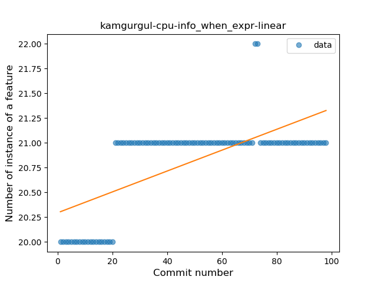
### <a name="companion_object">Companion Object</a>
----
#### Functions
* **Plateau Gradual Rise - Sigmoid:** 
    * **R_Squared:** 0.76967296
* **Sudden Rise Plateau - Logarithm:** 
    * **R_Squared:** 0.38295269
* **Constant Rise - Linear:** 
    * **R_Squared:** 0.13277178

**Plots** :chart_with_upwards_trend:
-----

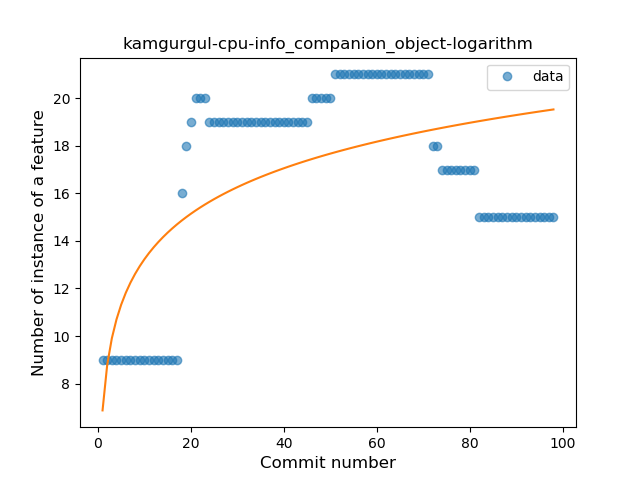
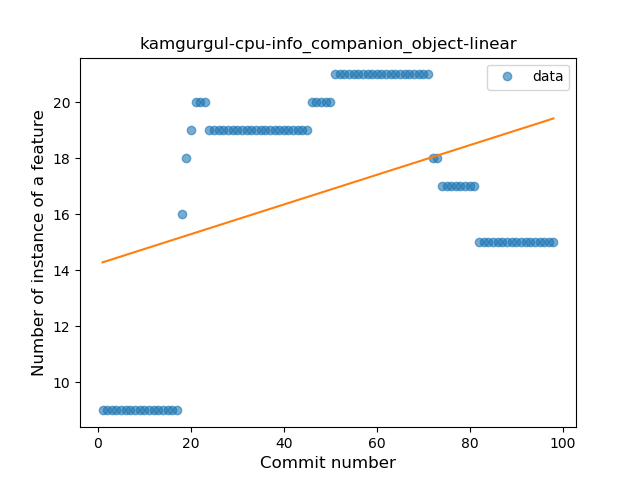
### <a name="unsafe_call">Unsafe Call</a>
----
#### Functions
* **Constant Rise - Linear:** 
    * **R_Squared:** 0.9053238
* **Sudden Rise Plateau - Logarithm:** 
    * **R_Squared:** 0.78800525

**Plots** :chart_with_upwards_trend:
-----

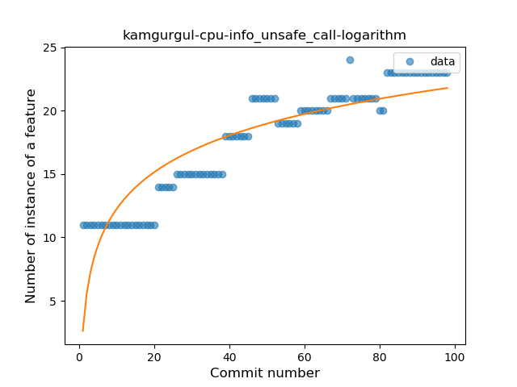
### <a name="string_template">String Template</a>
----
#### Functions
* **Sudden Rise Plateau - Logarithm:** 
    * **R_Squared:** 0.86537685
* **Constant Rise - Linear:** 
    * **R_Squared:** 0.72903703

**Plots** :chart_with_upwards_trend:
-----

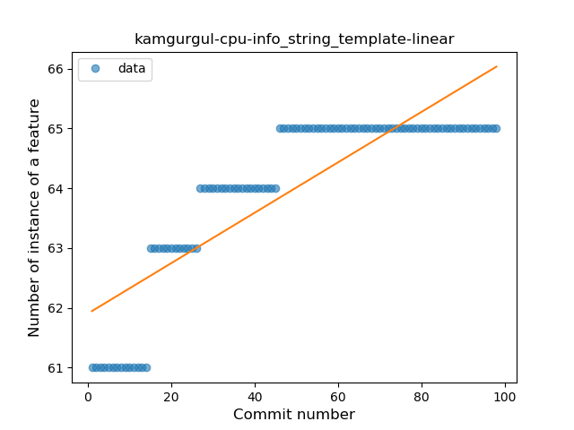
### <a name="func_with_default_value">Function with Default Value</a>
----
#### Functions
* **Plateau Sudden Rise - Binary Sigmoid:** 
    * **R_Squared:** 0.93315053
* **Constant Rise - Linear:** 
    * **R_Squared:** 0.78827638
* **Sudden Rise Plateau - Logarithm:** 
    * **R_Squared:** 0.73066113

**Plots** :chart_with_upwards_trend:
-----

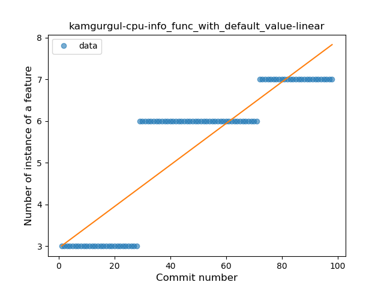
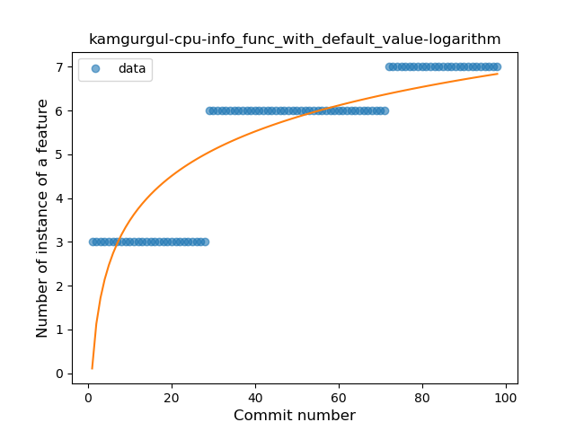
### <a name="singleton">Singleton</a>
----
#### Functions
* **Plateau Gradual Rise - Sigmoid:** 
    * **R_Squared:** 0.53501235
* **Sudden Rise Plateau - Logarithm:** 
    * **R_Squared:** 0.22635062
* **Constant Rise - Linear:** 
    * **R_Squared:** 0.20583541

**Plots** :chart_with_upwards_trend:
-----

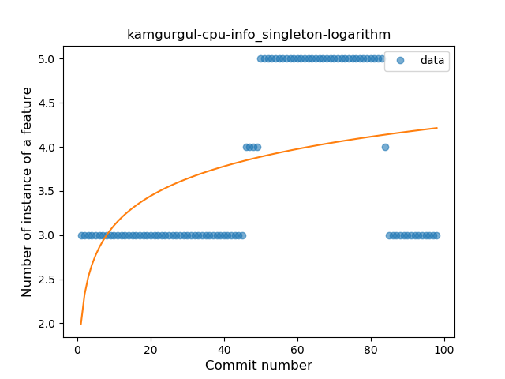
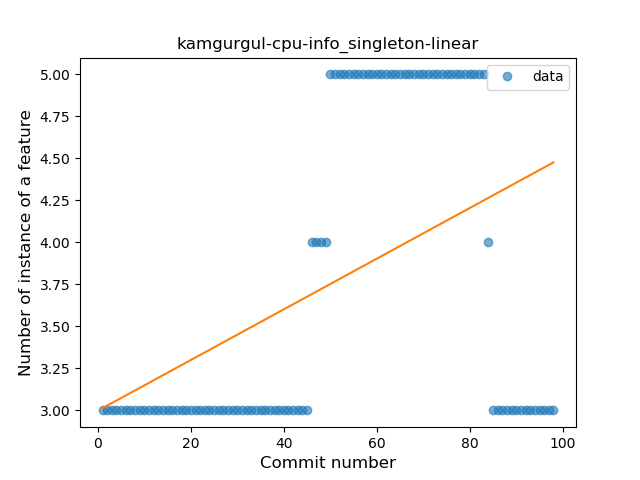
### <a name="smart_cast">Smart Cast</a>
----
#### Functions
* **Sudden Rise Plateau - Logarithm:** 
    * **R_Squared:** 0.24971543
* **Constant Rise - Linear:** 
    * **R_Squared:** 0.07594311

**Plots** :chart_with_upwards_trend:
-----

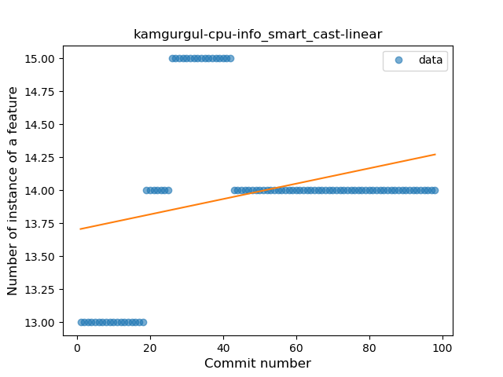
### <a name="range_expr">Range Expression</a>
----
#### Functions
* **Sudden Rise - Exponential:** 
    * **R_Squared:** 0.88395936
* **Plateau Gradual Rise - Sigmoid:** 
    * **R_Squared:** 0.88559375
* **Constant Rise - Linear:** 
    * **R_Squared:** 0.83354835
* **Sudden Rise Plateau - Logarithm:** 
    * **R_Squared:** 0.49147983

**Plots** :chart_with_upwards_trend:
-----

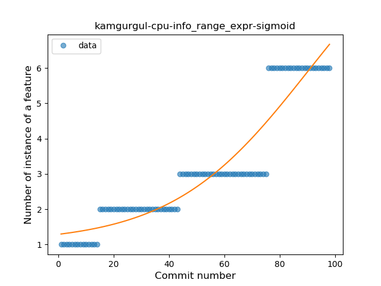
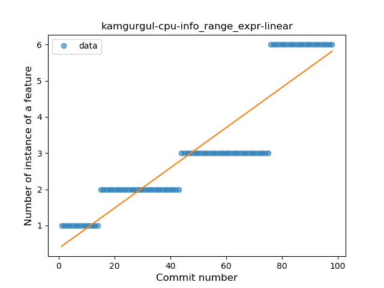
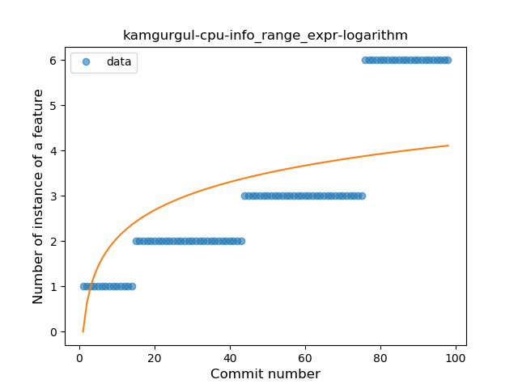
### <a name="func_call_with_named_arg">Function call with Named Argument</a>
----
#### Functions
* **Plateau Gradual Rise - Sigmoid:** 
    * **R_Squared:** 0.96341621
* **Sudden Rise - Exponential:** 
    * **R_Squared:** 0.82843728
* **Constant Rise - Linear:** 
    * **R_Squared:** 0.54491295
* **Sudden Rise Plateau - Logarithm:** 
    * **R_Squared:** 0.14411615

**Plots** :chart_with_upwards_trend:
-----

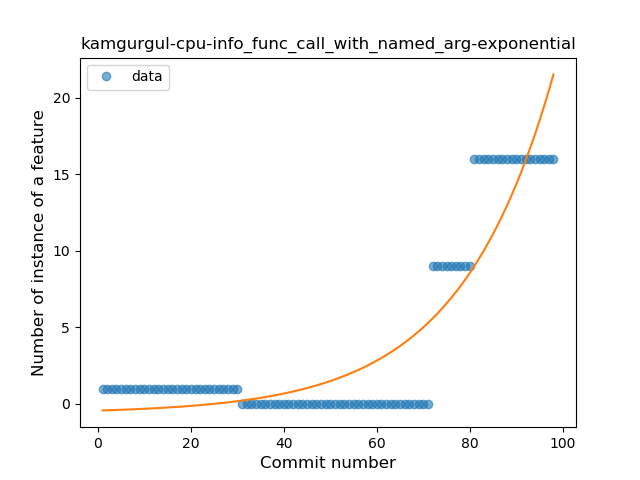
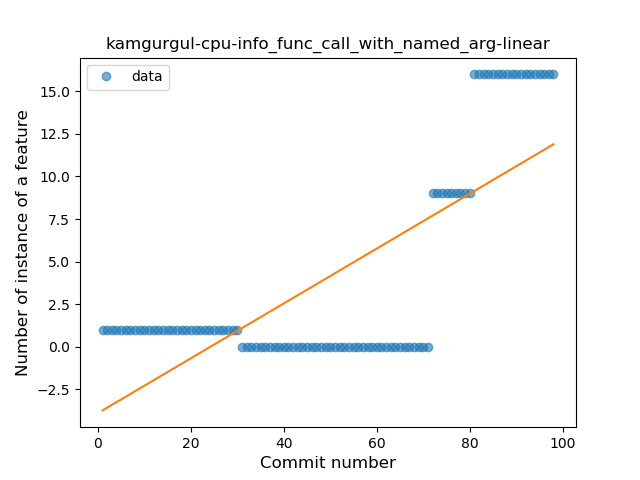
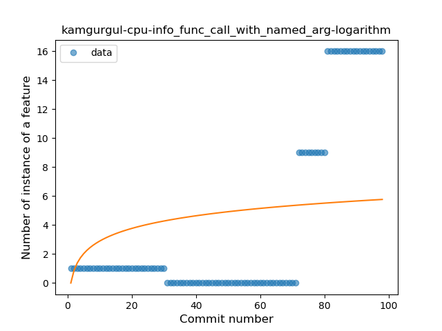
### <a name="data_class">Data Class</a>
----
#### Functions
* **Sudden Rise Plateau - Logarithm:** 
    * **R_Squared:** 0.7016786
* **Constant Rise - Linear:** 
    * **R_Squared:** 0.61506519

**Plots** :chart_with_upwards_trend:
-----

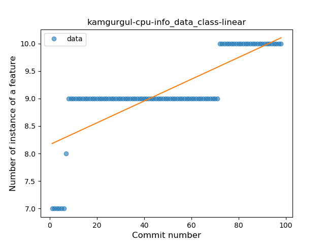
### <a name="extension_function">Extension Function</a>
----
#### Functions
* **Sudden Rise - Exponential:** 
    * **R_Squared:** 0.66787071
* **Constant Rise - Linear:** 
    * **R_Squared:** 0.61937876
* **Sudden Rise Plateau - Logarithm:** 
    * **R_Squared:** 0.41777769

**Plots** :chart_with_upwards_trend:
-----

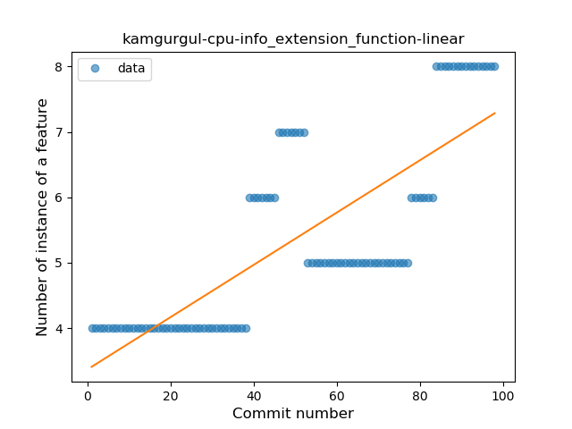
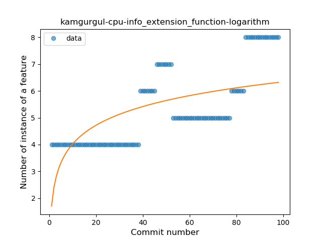
### <a name="property_delegation">Property Delegation</a>
----
#### Functions
* **Instability - Polinomial 3:** )
    * **R_Squared:** 0.85315194
* **Constant Decline - Linear:** 
    * **R_Squared:** 0.6984185
* **Plateau Sudden Decline - Binary Sigmoid:** 
    * **R_Squared:** 0.23306306
* **Sudden Rise Plateau - Logarithm:** 
    * **R_Squared:** -0.0

**Plots** :chart_with_upwards_trend:
-----

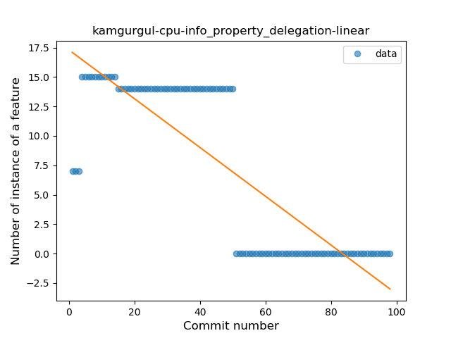
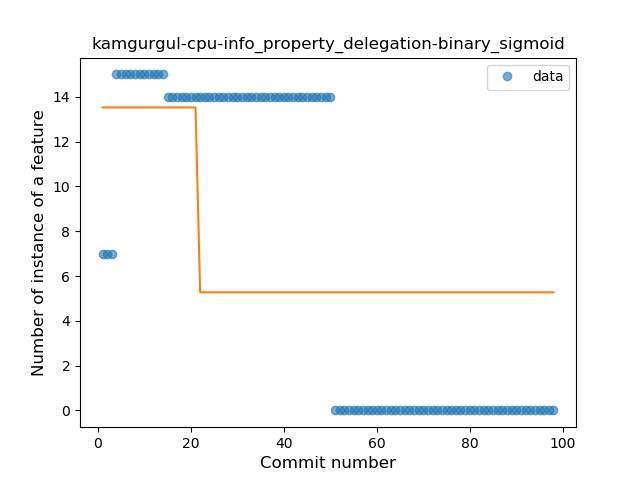
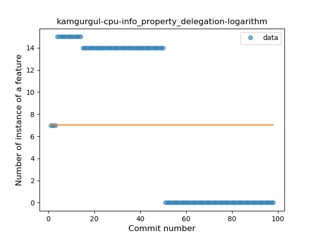
### <a name="inline_func">Inline Function</a>
----
#### Functions
* **Plateau Gradual Rise - Sigmoid:** 
    * **R_Squared:** 0.97067253
* **Sudden Rise - Exponential:** 
    * **R_Squared:** 0.86333204
* **Constant Rise - Linear:** 
    * **R_Squared:** 0.52790615
* **Sudden Rise Plateau - Logarithm:** 
    * **R_Squared:** 0.24255097

**Plots** :chart_with_upwards_trend:
-----

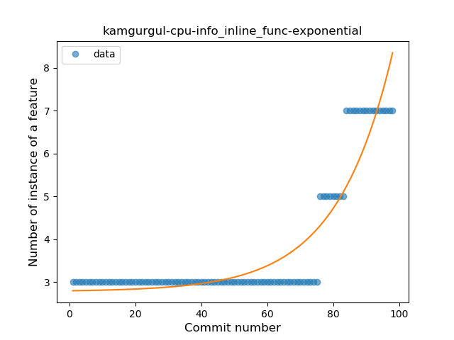
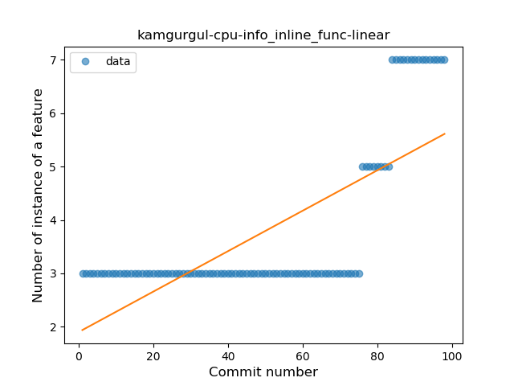
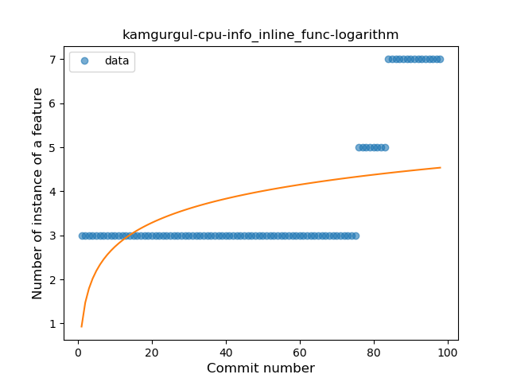
