## kirimin-mitsumine
----
#### Metrics provided by Detekt
* Number of lines of code 4687
* Number of Kotlin files: 96
* Cyclomatic complexity: 588
* Cyclomatic complexity by thousands of lines: 238 

----
**14** features analyzed

*	<a href="#type_inference">Type Inference</a> 
*	<a href="#lambda">Lambda</a> 
*	<a href="#safe_call">Safe Call</a> 
*	<a href="#when_expr">When expression</a> 
*	<a href="#companion_object">Companion Object</a> 
*	<a href="#unsafe_call">Unsafe Call</a> 
*	<a href="#string_template">String Template</a> 
*	<a href="#func_with_default_value">Function with Default Value</a> 
*	<a href="#singleton">Singleton</a> 
*	<a href="#smart_cast">Smart Cast</a> 
*	<a href="#range_expr">Range Expression</a> 
*	<a href="#func_call_with_named_arg">Function call with Named Argument</a> 
*	<a href="#data_class">Data Class</a> 
*	<a href="#extension_function">Extension Function</a> 

### <a name="type_inference">Type Inference</a>
----
#### Functions
* **Sudden Rise Plateau - Logarithm:** 
    * **R_Squared:** 0.4455058
* **Constant Rise - Linear:** 
    * **R_Squared:** 0.09692927

**Plots** :chart_with_upwards_trend:
-----

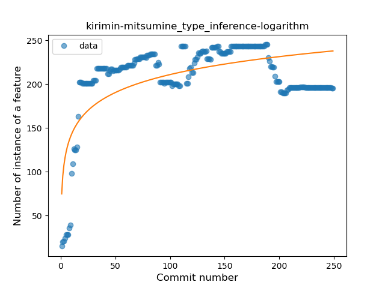
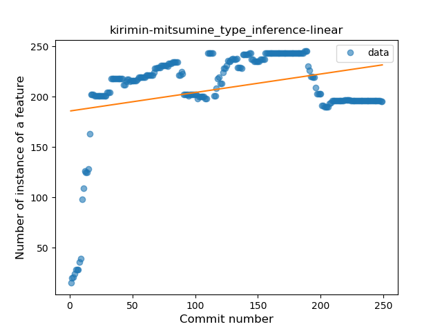
### <a name="lambda">Lambda</a>
----
#### Functions
* **Sudden Rise Plateau - Logarithm:** 
    * **R_Squared:** 0.32416214
* **Constant Rise - Linear:** 
    * **R_Squared:** 0.05496456

**Plots** :chart_with_upwards_trend:
-----

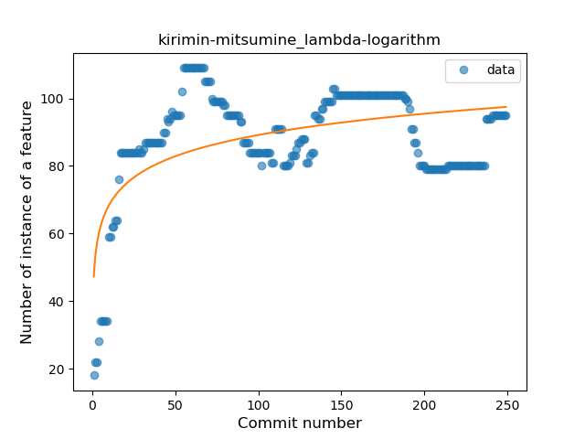
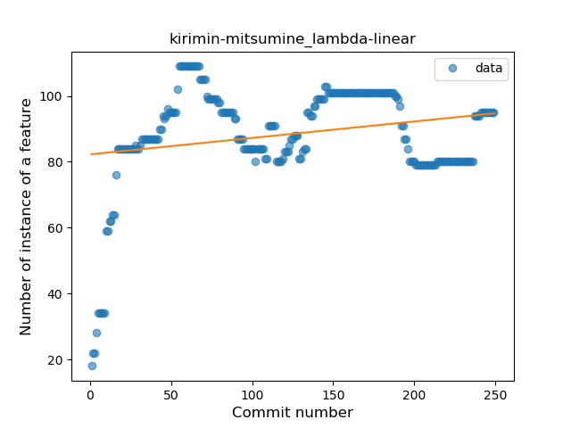
### <a name="safe_call">Safe Call</a>
----
#### Functions
* **Plateau Gradual Rise - Sigmoid:** 
    * **R_Squared:** 0.86915607
* **Constant Rise - Linear:** 
    * **R_Squared:** 0.41734011
* **Sudden Rise Plateau - Logarithm:** 
    * **R_Squared:** 0.32899091

**Plots** :chart_with_upwards_trend:
-----

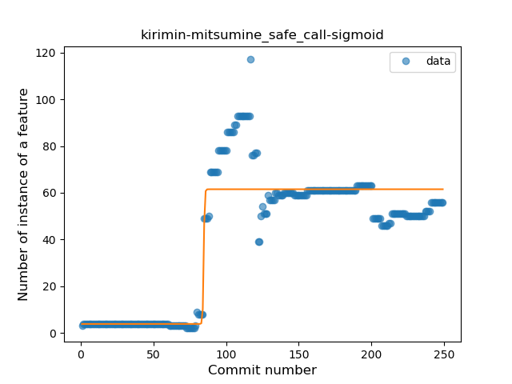
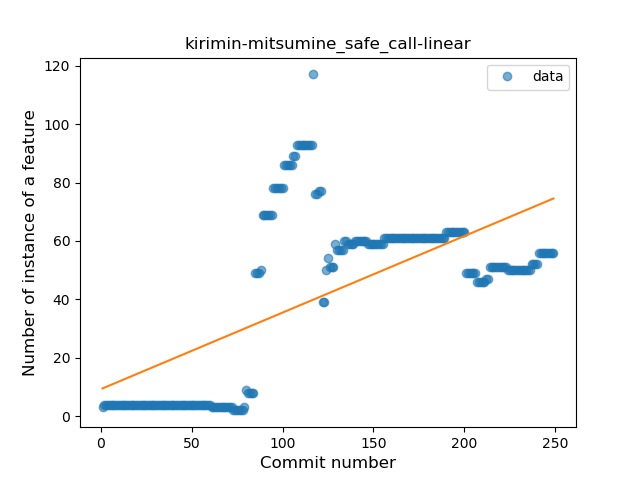
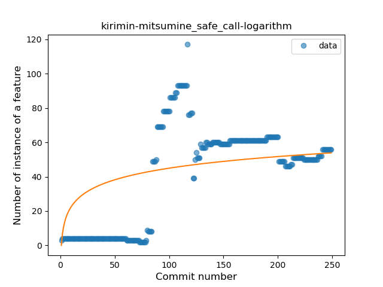
### <a name="when_expr">When expression</a>
----
#### Functions
* **Plateau Gradual Rise - Sigmoid:** 
    * **R_Squared:** 0.95656644
* **Constant Rise - Linear:** 
    * **R_Squared:** 0.93548708
* **Sudden Rise Plateau - Logarithm:** 
    * **R_Squared:** 0.58627177

**Plots** :chart_with_upwards_trend:
-----

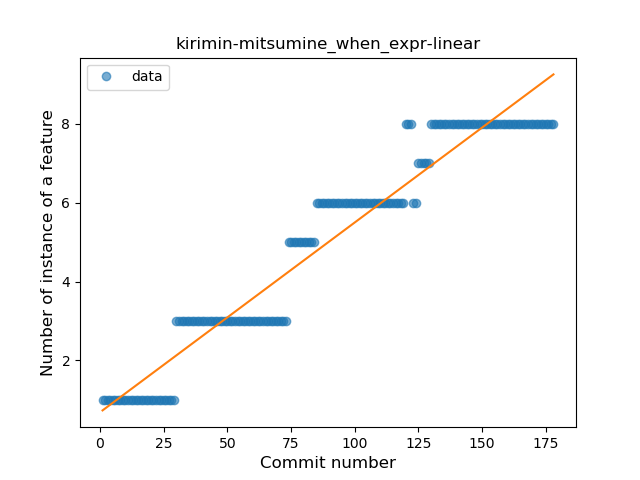
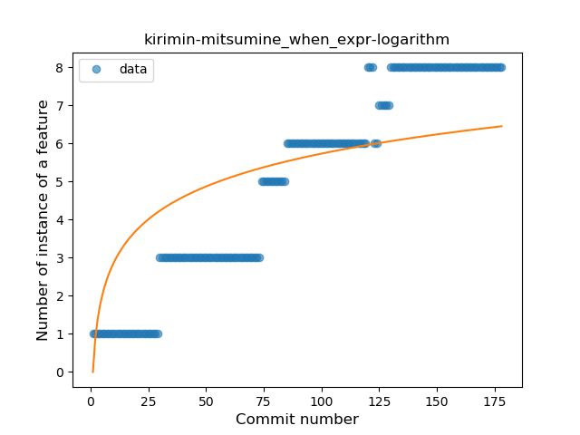
### <a name="companion_object">Companion Object</a>
----
#### Functions
* **Constant Decline - Linear:** 
    * **R_Squared:** 0.22439963
* **Plateau Sudden Rise - Binary Sigmoid:** 
    * **R_Squared:** 0.10495426
* **Sudden Decline - Exponential:** 
    * **R_Squared:** 0.0
* **Sudden Rise Plateau - Logarithm:** 
    * **R_Squared:** -0.0

**Plots** :chart_with_upwards_trend:
-----

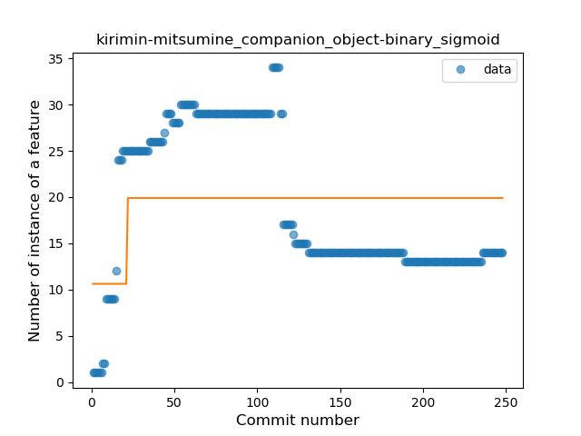

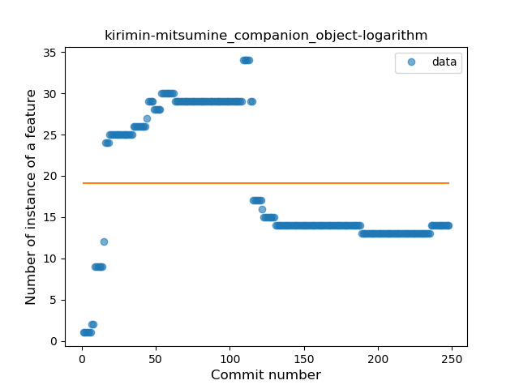
### <a name="unsafe_call">Unsafe Call</a>
----
#### Functions
* **Constant Decline - Linear:** 
    * **R_Squared:** 0.06064976
* **Plateau Sudden Rise - Binary Sigmoid:** 
    * **R_Squared:** 0.02881472
* **Sudden Decline - Exponential:** 
    * **R_Squared:** -0.0
* **Sudden Rise Plateau - Logarithm:** 
    * **R_Squared:** -0.0

**Plots** :chart_with_upwards_trend:
-----

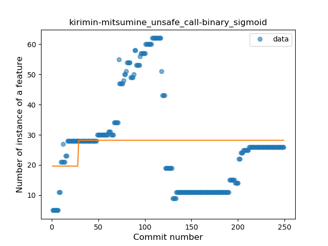

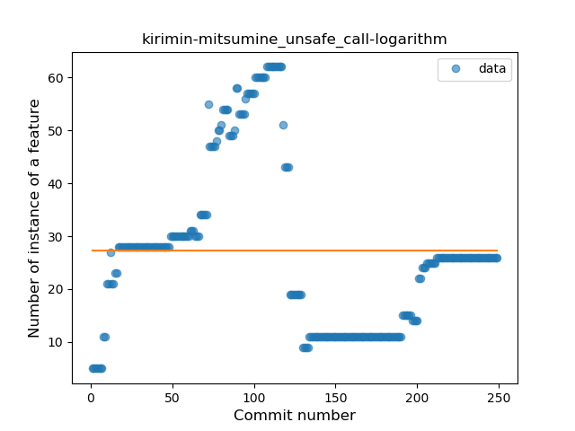
### <a name="string_template">String Template</a>
----
#### Functions
* **Plateau Gradual Rise - Sigmoid:** 
    * **R_Squared:** 0.89111772
* **Constant Rise - Linear:** 
    * **R_Squared:** 0.81540576
* **Sudden Rise Plateau - Logarithm:** 
    * **R_Squared:** 0.68461199

**Plots** :chart_with_upwards_trend:
-----

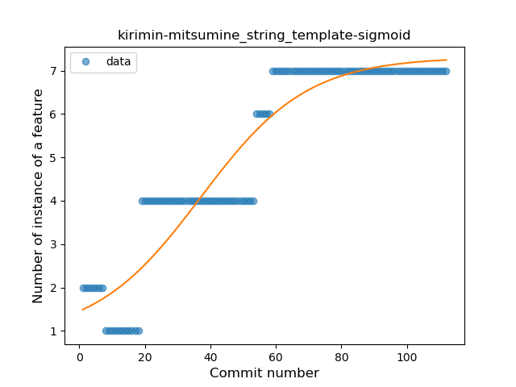
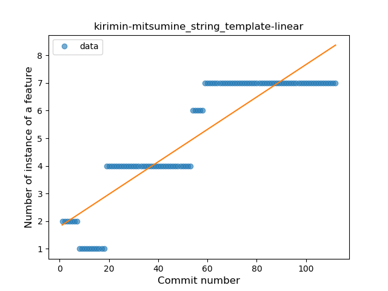
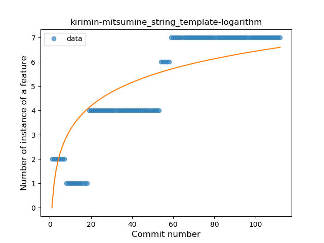
### <a name="func_with_default_value">Function with Default Value</a>
----
#### Functions
* **Plateau Gradual Rise - Sigmoid:** 
    * **R_Squared:** 0.89007893
* **Constant Rise - Linear:** 
    * **R_Squared:** 0.86923289
* **Sudden Rise Plateau - Logarithm:** 
    * **R_Squared:** 0.49264524

**Plots** :chart_with_upwards_trend:
-----

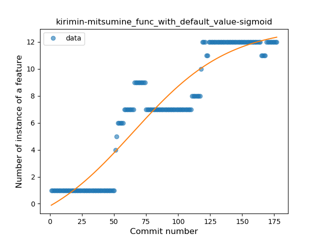
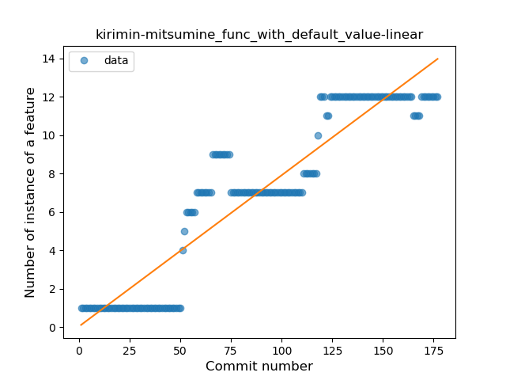
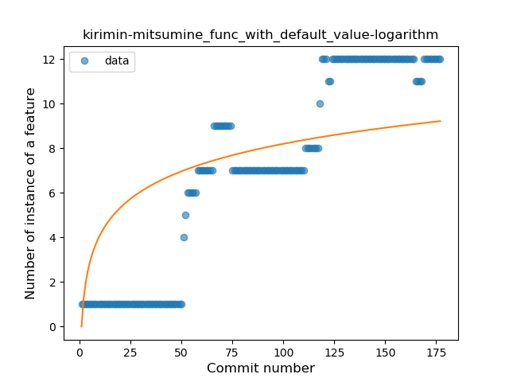
### <a name="singleton">Singleton</a>
----
#### Functions
* **Plateau Gradual Decline - Sigmoid:** 
    * **R_Squared:** 0.91857751
* **Constant Decline - Linear:** 
    * **R_Squared:** 0.54769866
* **Sudden Rise Plateau - Logarithm:** 
    * **R_Squared:** -0.0

**Plots** :chart_with_upwards_trend:
-----

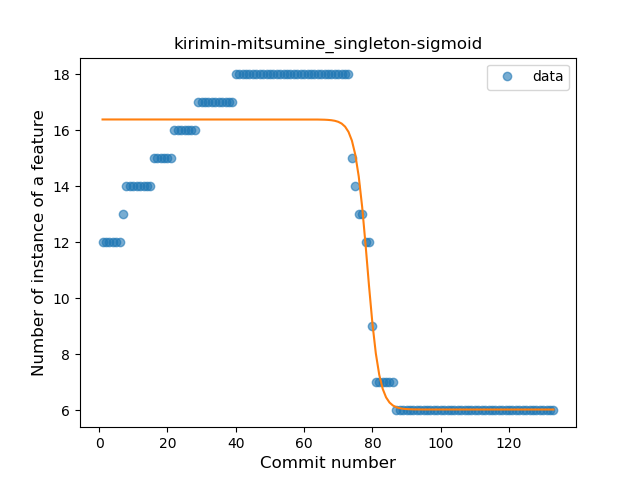
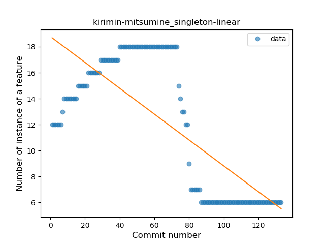
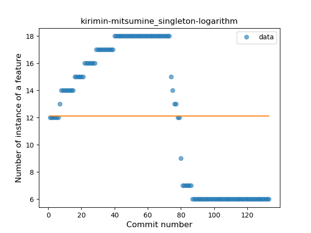
### <a name="smart_cast">Smart Cast</a>
----
#### Functions
* **Plateau Gradual Rise - Sigmoid:** 
    * **R_Squared:** 0.91891329
* **Sudden Rise - Exponential:** 
    * **R_Squared:** 0.90818184
* **Constant Rise - Linear:** 
    * **R_Squared:** 0.80909763
* **Sudden Rise Plateau - Logarithm:** 
    * **R_Squared:** 0.28784909

**Plots** :chart_with_upwards_trend:
-----

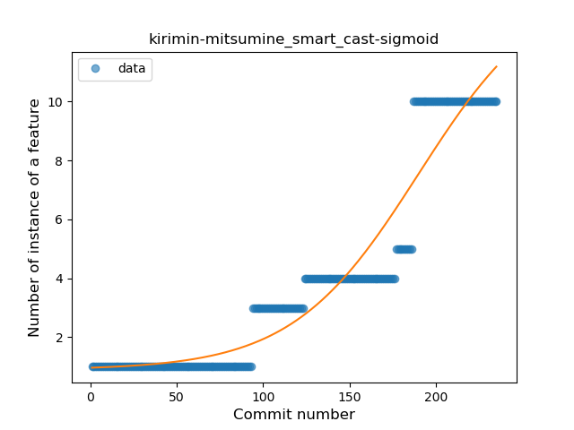

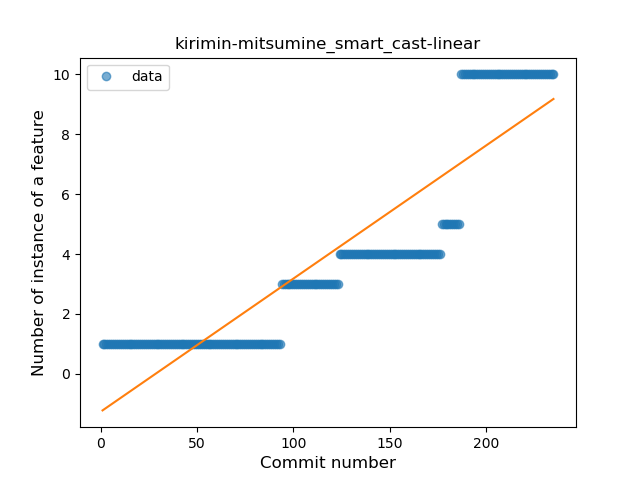
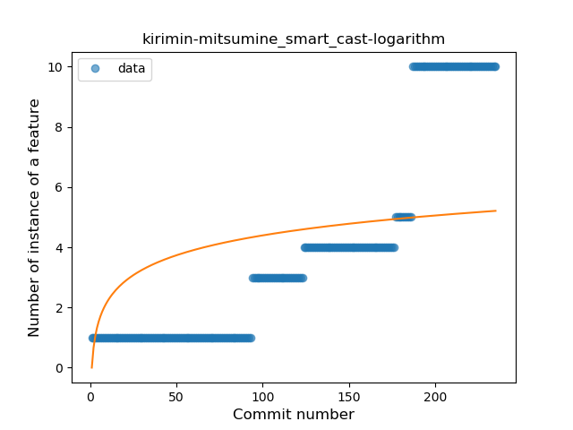
### <a name="range_expr">Range Expression</a>
----
#### Functions
* **Constant Decline - Linear:** 
    * **R_Squared:** 0.1574523
* **Plateau Gradual Rise - Sigmoid:** 
    * **R_Squared:** 0.1200315
* **Sudden Rise Plateau - Logarithm:** 
    * **R_Squared:** -0.0

**Plots** :chart_with_upwards_trend:
-----

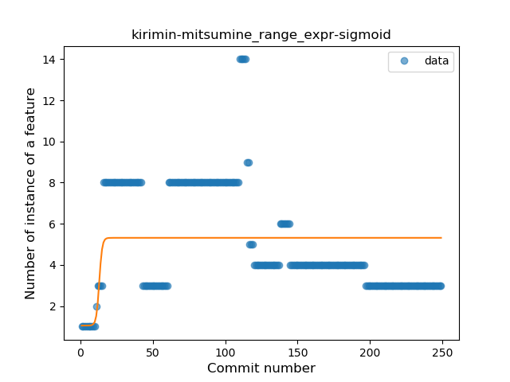
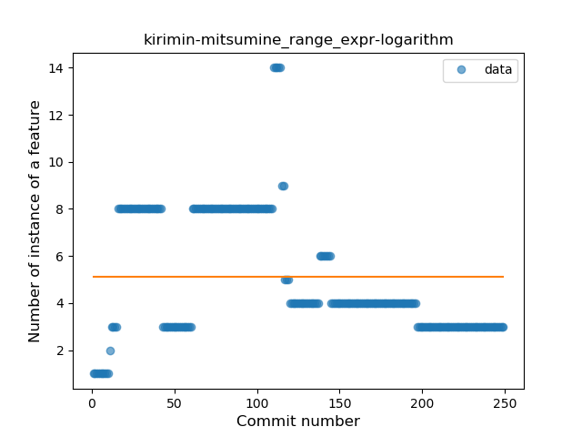
### <a name="func_call_with_named_arg">Function call with Named Argument</a>
----
#### Functions
* **Plateau Gradual Rise - Sigmoid:** 
    * **R_Squared:** 0.959539
* **Sudden Rise - Exponential:** 
    * **R_Squared:** 0.80396935
* **Constant Rise - Linear:** 
    * **R_Squared:** 0.73680715
* **Sudden Rise Plateau - Logarithm:** 
    * **R_Squared:** 0.38904905

**Plots** :chart_with_upwards_trend:
-----

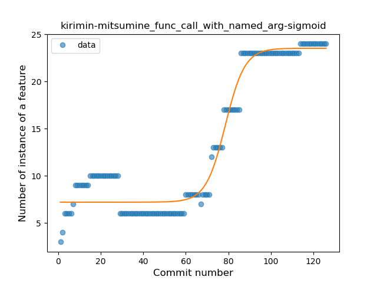
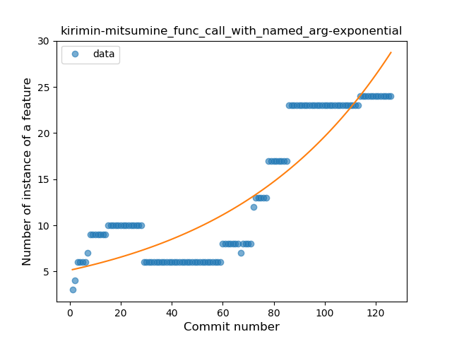
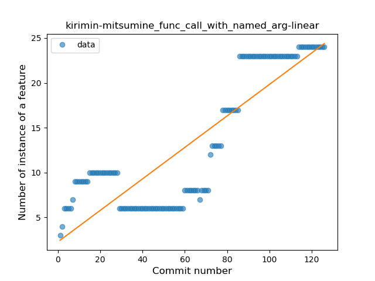
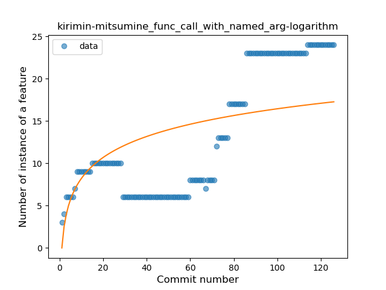
### <a name="data_class">Data Class</a>
----
#### Functions
* **Plateau Gradual Rise - Sigmoid:** 
    * **R_Squared:** 0.93609584
* **Instability - Polinomial 3:** )
    * **R_Squared:** 0.86864583
* **Sudden Rise Plateau - Logarithm:** 
    * **R_Squared:** 0.7071325
* **Constant Rise - Linear:** 
    * **R_Squared:** 0.34866616

**Plots** :chart_with_upwards_trend:
-----

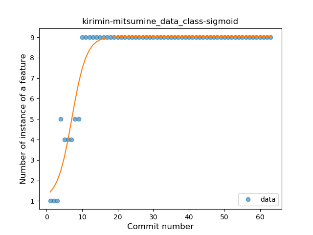
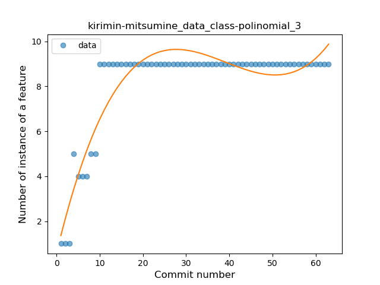
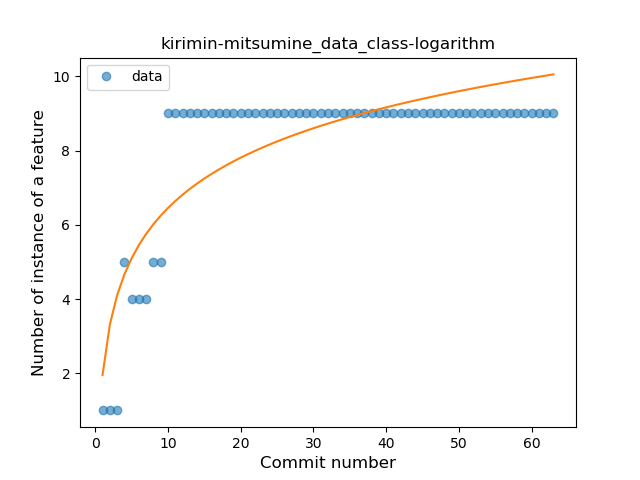
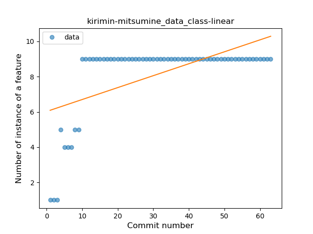
### <a name="extension_function">Extension Function</a>
----
#### Functions
* **Sudden Decline - Exponential:** 
    * **R_Squared:** 0.59928498
* **Constant Decline - Linear:** 
    * **R_Squared:** 0.52424061
* **Sudden Rise Plateau - Logarithm:** 
    * **R_Squared:** -0.0

**Plots** :chart_with_upwards_trend:
-----

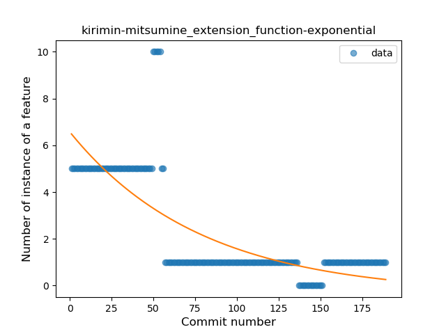
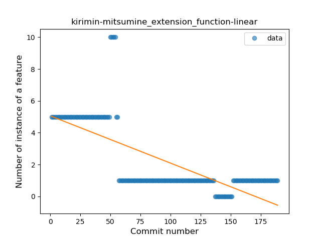
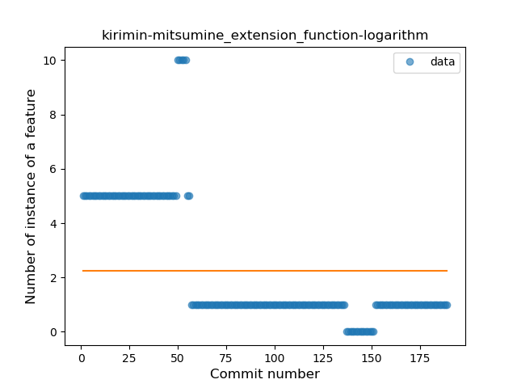
