## klassm-andFHEM
----
#### Metrics provided by Detekt
* Number of lines of code 29379
* Number of Kotlin files: 363
* Cyclomatic complexity: 2866
* Cyclomatic complexity by thousands of lines: 244 

----
**17** features analyzed

*	<a href="#type_inference">Type Inference</a> 
*	<a href="#lambda">Lambda</a> 
*	<a href="#safe_call">Safe Call</a> 
*	<a href="#when_expr">When expression</a> 
*	<a href="#companion_object">Companion Object</a> 
*	<a href="#unsafe_call">Unsafe Call</a> 
*	<a href="#string_template">String Template</a> 
*	<a href="#func_with_default_value">Function with Default Value</a> 
*	<a href="#singleton">Singleton</a> 
*	<a href="#smart_cast">Smart Cast</a> 
*	<a href="#range_expr">Range Expression</a> 
*	<a href="#func_call_with_named_arg">Function call with Named Argument</a> 
*	<a href="#data_class">Data Class</a> 
*	<a href="#extension_function">Extension Function</a> 
*	<a href="#property_delegation">Property Delegation</a> 
*	<a href="#destructuring_declaration">Destructuring Declaration</a> 
*	<a href="#overloaded_op">Overloaded Operator</a> 

### <a name="type_inference">Type Inference</a>
----
#### Functions
* **Constant Rise - Linear:** 
    * **R_Squared:** 0.9125576
* **Sudden Rise Plateau - Logarithm:** 
    * **R_Squared:** 0.62073901
* **Plateau Gradual Rise - Sigmoid:** 
    * **R_Squared:** 0.52312103

**Plots** :chart_with_upwards_trend:
-----

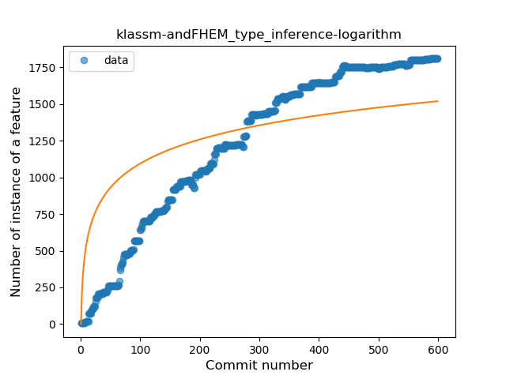
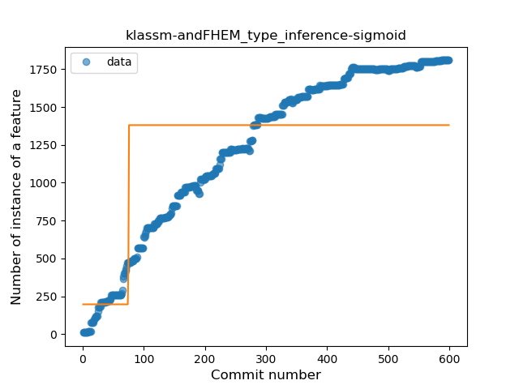
### <a name="lambda">Lambda</a>
----
#### Functions
* **Constant Rise - Linear:** 
    * **R_Squared:** 0.96013178
* **Plateau Sudden Rise - Binary Sigmoid:** 
    * **R_Squared:** 0.79478063
* **Sudden Rise Plateau - Logarithm:** 
    * **R_Squared:** 0.51434666

**Plots** :chart_with_upwards_trend:
-----

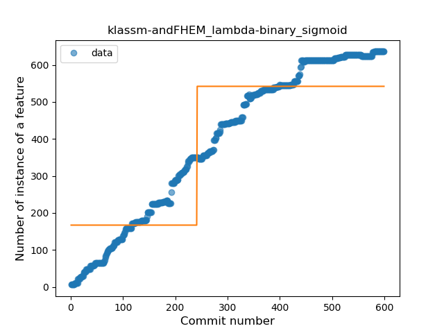
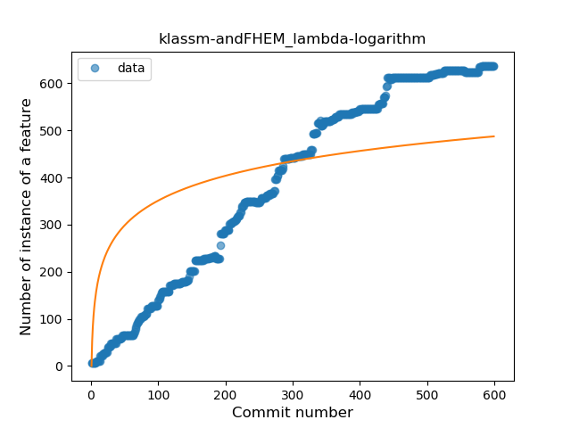
### <a name="safe_call">Safe Call</a>
----
#### Functions
* **Constant Rise - Linear:** 
    * **R_Squared:** 0.90218453
* **Plateau Sudden Rise - Binary Sigmoid:** 
    * **R_Squared:** 0.60709363
* **Sudden Rise Plateau - Logarithm:** 
    * **R_Squared:** 0.44677066

**Plots** :chart_with_upwards_trend:
-----

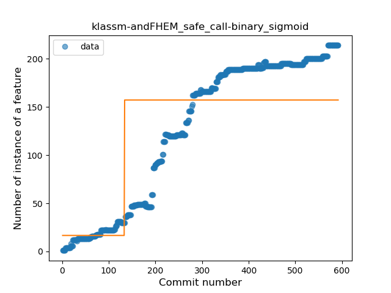
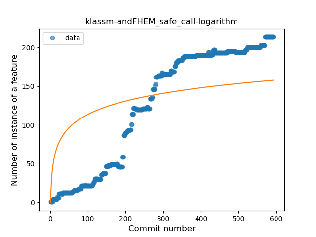
### <a name="when_expr">When expression</a>
----
#### Functions
* **Constant Rise - Linear:** 
    * **R_Squared:** 0.87118421
* **Sudden Rise Plateau - Logarithm:** 
    * **R_Squared:** 0.72419777

**Plots** :chart_with_upwards_trend:
-----

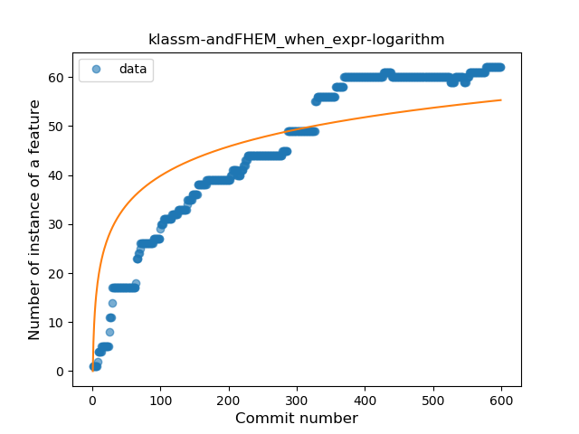
### <a name="companion_object">Companion Object</a>
----
#### Functions
* **Constant Rise - Linear:** 
    * **R_Squared:** 0.93236962
* **Sudden Rise Plateau - Logarithm:** 
    * **R_Squared:** 0.5573565
* **Plateau Sudden Rise - Binary Sigmoid:** 
    * **R_Squared:** 0.40193172

**Plots** :chart_with_upwards_trend:
-----

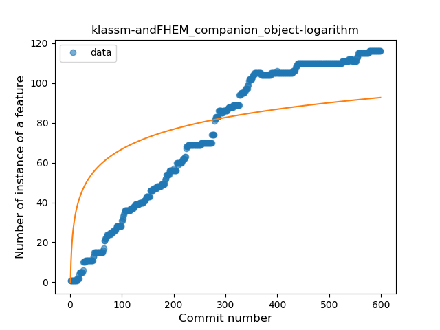
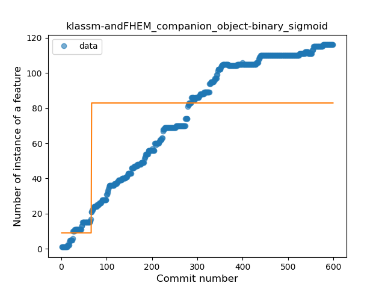
### <a name="unsafe_call">Unsafe Call</a>
----
#### Functions
* **Sudden Rise Plateau - Logarithm:** 
    * **R_Squared:** 0.72063453
* **Constant Rise - Linear:** 
    * **R_Squared:** 0.61359199
* **Plateau Sudden Rise - Binary Sigmoid:** 
    * **R_Squared:** 0.5221724

**Plots** :chart_with_upwards_trend:
-----

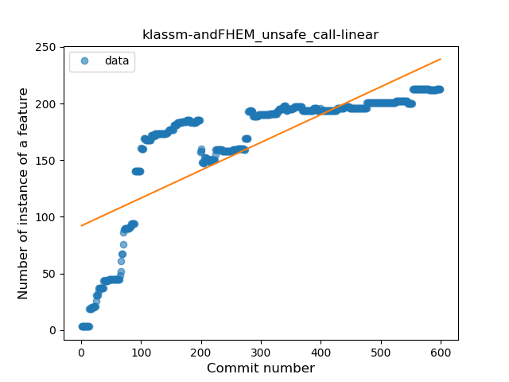
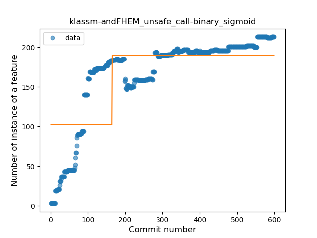
### <a name="string_template">String Template</a>
----
#### Functions
* **Constant Rise - Linear:** 
    * **R_Squared:** 0.97971998
* **Sudden Rise Plateau - Logarithm:** 
    * **R_Squared:** 0.47849994
* **Plateau Sudden Rise - Binary Sigmoid:** 
    * **R_Squared:** 0.22895352

**Plots** :chart_with_upwards_trend:
-----

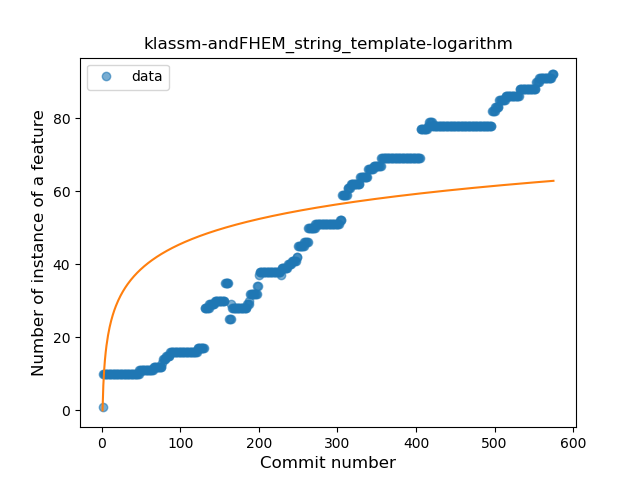
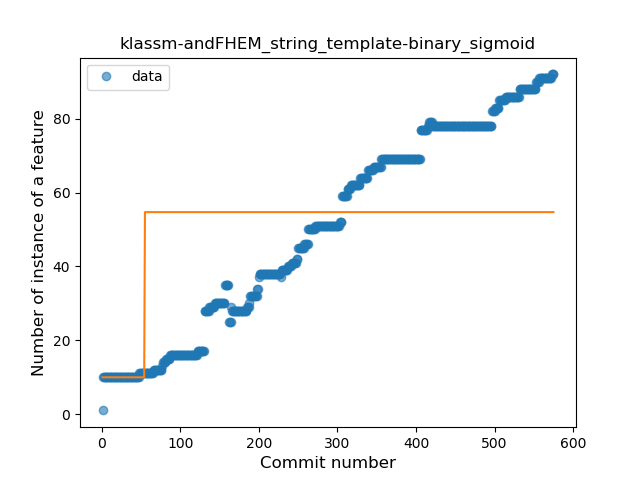
### <a name="func_with_default_value">Function with Default Value</a>
----
#### Functions
* **Constant Rise - Linear:** 
    * **R_Squared:** 0.91693893
* **Sudden Rise Plateau - Logarithm:** 
    * **R_Squared:** 0.46959688

**Plots** :chart_with_upwards_trend:
-----

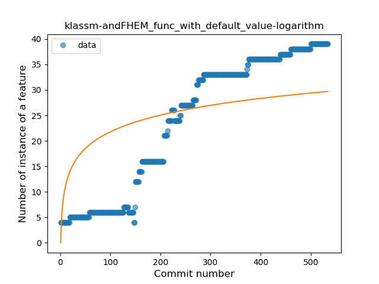
### <a name="singleton">Singleton</a>
----
#### Functions
* **Plateau Gradual Rise - Sigmoid:** 
    * **R_Squared:** 0.96548057
* **Constant Rise - Linear:** 
    * **R_Squared:** 0.91171492
* **Sudden Rise Plateau - Logarithm:** 
    * **R_Squared:** 0.41173457

**Plots** :chart_with_upwards_trend:
-----

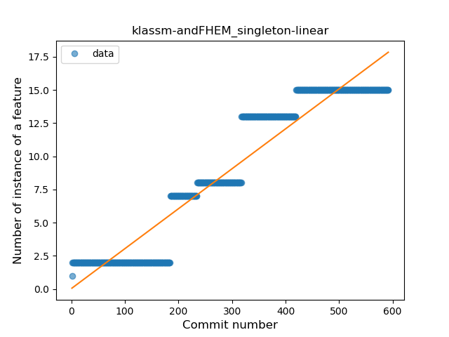
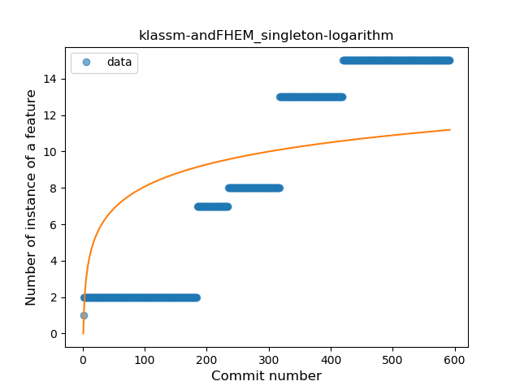
### <a name="smart_cast">Smart Cast</a>
----
#### Functions
* **Constant Rise - Linear:** 
    * **R_Squared:** 0.79564791
* **Sudden Rise Plateau - Logarithm:** 
    * **R_Squared:** 0.67567784
* **Plateau Sudden Rise - Binary Sigmoid:** 
    * **R_Squared:** 0.30990332

**Plots** :chart_with_upwards_trend:
-----

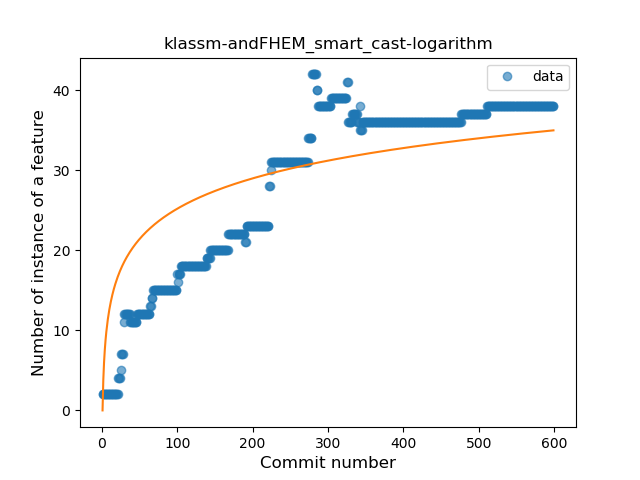
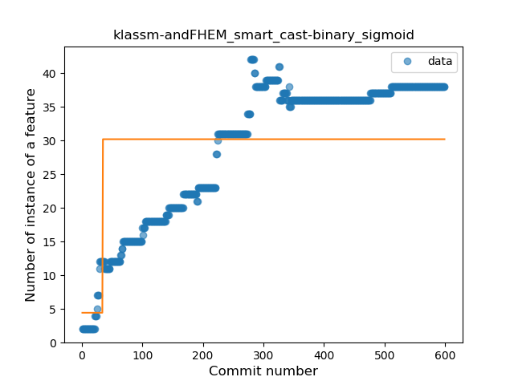
### <a name="range_expr">Range Expression</a>
----
#### Functions
* **Constant Rise - Linear:** 
    * **R_Squared:** 0.6615179
* **Sudden Rise Plateau - Logarithm:** 
    * **R_Squared:** 0.4731942

**Plots** :chart_with_upwards_trend:
-----

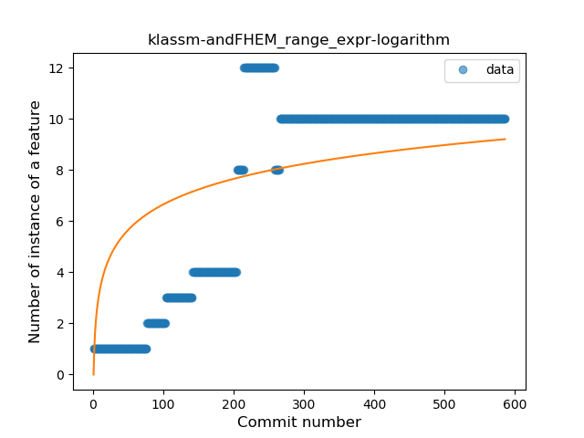
### <a name="func_call_with_named_arg">Function call with Named Argument</a>
----
#### Functions
* **Constant Rise - Linear:** 
    * **R_Squared:** 0.95420815
* **Sudden Rise - Exponential:** 
    * **R_Squared:** 0.96229169
* **Sudden Rise Plateau - Logarithm:** 
    * **R_Squared:** 0.36068312
* **Plateau Sudden Rise - Binary Sigmoid:** 
    * **R_Squared:** 0.22258955

**Plots** :chart_with_upwards_trend:
-----

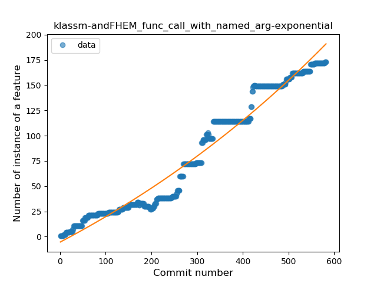

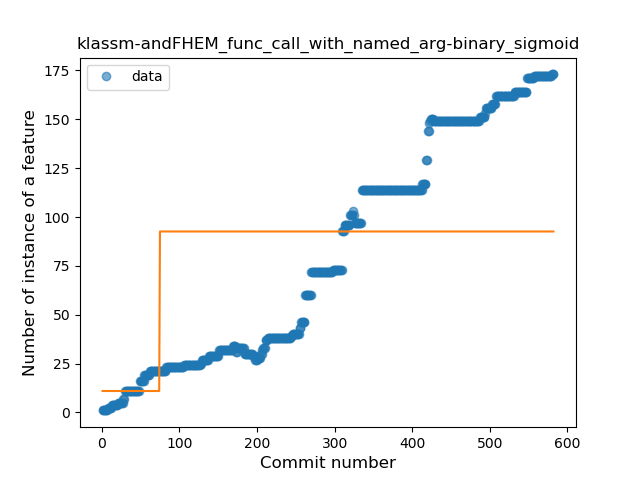
### <a name="data_class">Data Class</a>
----
#### Functions
* **Constant Rise - Linear:** 
    * **R_Squared:** 0.90722876
* **Sudden Rise - Exponential:** 
    * **R_Squared:** 0.91039413
* **Sudden Rise Plateau - Logarithm:** 
    * **R_Squared:** 0.31553331
* **Plateau Sudden Rise - Binary Sigmoid:** 
    * **R_Squared:** 0.04684425

**Plots** :chart_with_upwards_trend:
-----

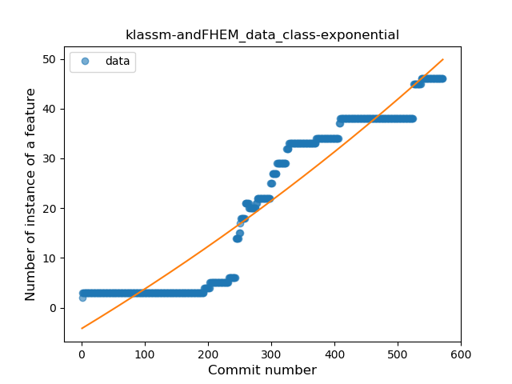
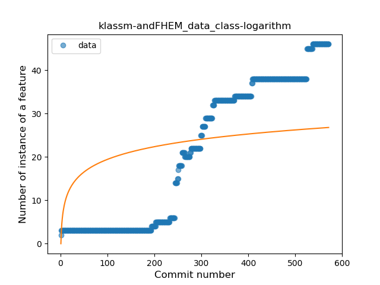
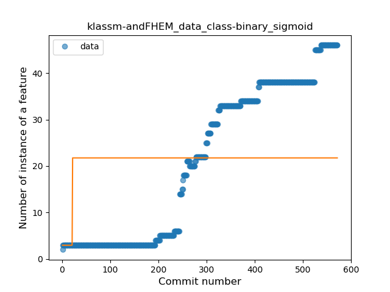
### <a name="extension_function">Extension Function</a>
----
#### Functions
* **Plateau Sudden Rise - Binary Sigmoid:** 
    * **R_Squared:** 1.0
* **Constant Rise - Linear:** 
    * **R_Squared:** 0.73178348
* **Sudden Rise Plateau - Logarithm:** 
    * **R_Squared:** 0.56138273

**Plots** :chart_with_upwards_trend:
-----

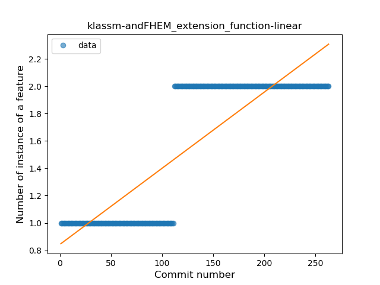
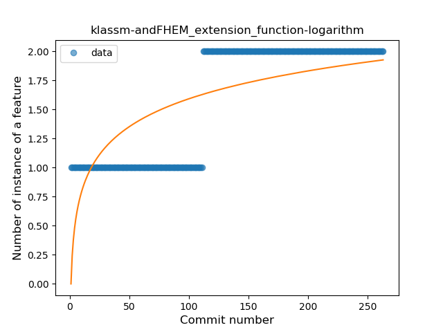
### <a name="property_delegation">Property Delegation</a>
----
#### Functions
* **Plateau Gradual Rise - Sigmoid:** 
    * **R_Squared:** 0.99456867
* **Sudden Rise Plateau - Logarithm:** 
    * **R_Squared:** 0.63065481
* **Constant Rise - Linear:** 
    * **R_Squared:** 0.32986851

**Plots** :chart_with_upwards_trend:
-----

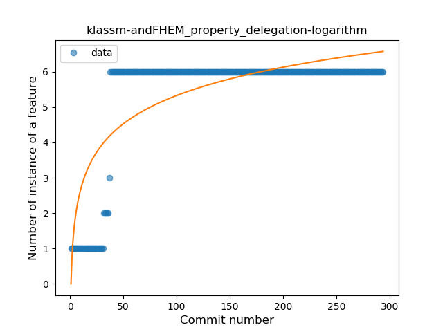
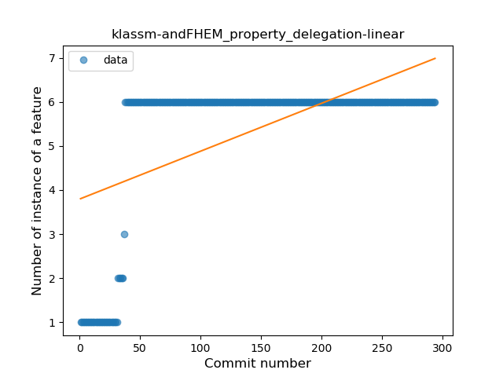
### <a name="destructuring_declaration">Destructuring Declaration</a>
----
#### Functions
* **Plateau Gradual Rise - Sigmoid:** 
    * **R_Squared:** 0.97268662
* **Constant Rise - Linear:** 
    * **R_Squared:** 0.92650842
* **Sudden Rise Plateau - Logarithm:** 
    * **R_Squared:** 0.46646836

**Plots** :chart_with_upwards_trend:
-----

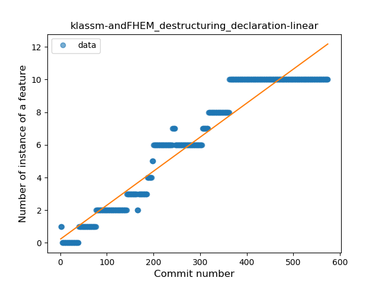
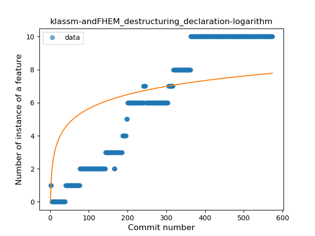
### <a name="overloaded_op">Overloaded Operator</a>
----
#### Functions
* **Plateau Gradual Rise - Sigmoid:** 
    * **R_Squared:** 0.97641133
* **Constant Rise - Linear:** 
    * **R_Squared:** 0.80568944
* **Sudden Rise Plateau - Logarithm:** 
    * **R_Squared:** 0.39204929

**Plots** :chart_with_upwards_trend:
-----

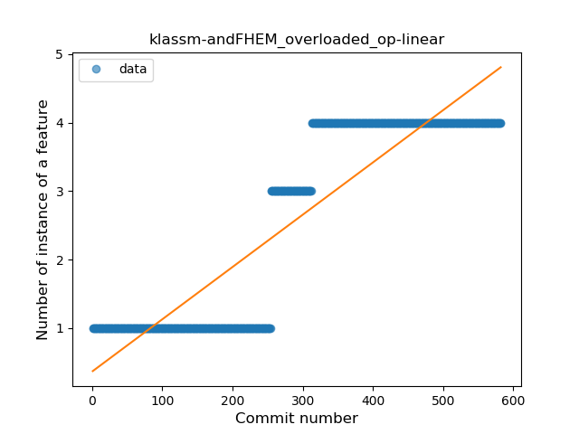
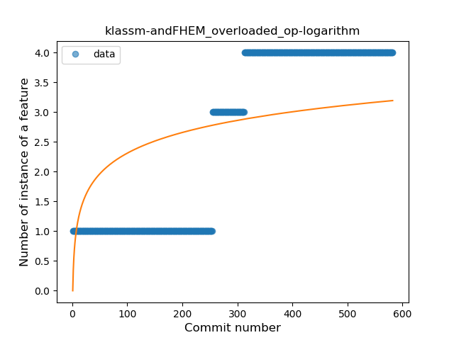
