## lenchan139-NCBookmark
----
#### Metrics provided by Detekt
* Number of lines of code 1756
* Number of Kotlin files: 13
* Cyclomatic complexity: 262
* Cyclomatic complexity by thousands of lines: 240 

----
**5** features analyzed

*	<a href="#type_inference">Type Inference</a> 
*	<a href="#lambda">Lambda</a> 
*	<a href="#unsafe_call">Unsafe Call</a> 
*	<a href="#string_template">String Template</a> 
*	<a href="#range_expr">Range Expression</a> 

### <a name="type_inference">Type Inference</a>
----
#### Functions
* **Instability - Polinomial 4:** 
    * **R_Squared:** 0.92645672
* **Instability - Polinomial 3:** )
    * **R_Squared:** 0.89135263
* **Sudden Rise - Exponential:** 
    * **R_Squared:** 0.8357818
* **Constant Rise - Linear:** 
    * **R_Squared:** 0.81332428
* **Sudden Rise Plateau - Logarithm:** 
    * **R_Squared:** 0.55669781

**Plots** :chart_with_upwards_trend:
-----

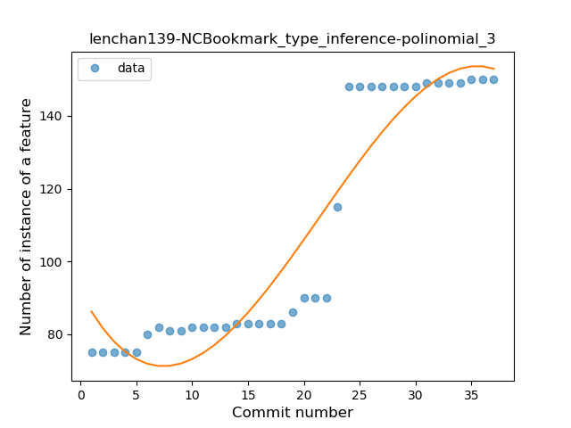
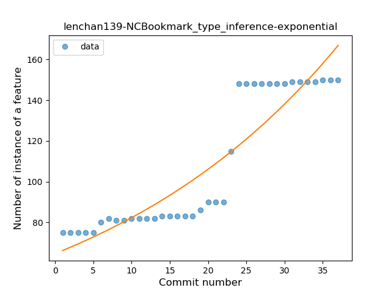
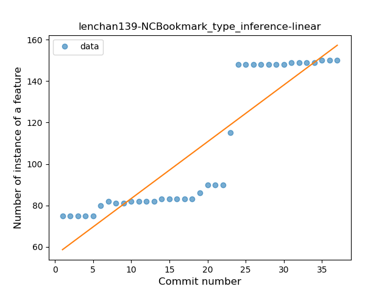

### <a name="lambda">Lambda</a>
----
#### Functions
* **Instability - Polinomial 4:** 
    * **R_Squared:** 0.91198324
* **Sudden Rise - Exponential:** 
    * **R_Squared:** 0.84090787
* **Constant Rise - Linear:** 
    * **R_Squared:** 0.80758815
* **Sudden Rise Plateau - Logarithm:** 
    * **R_Squared:** 0.54836616

**Plots** :chart_with_upwards_trend:
-----

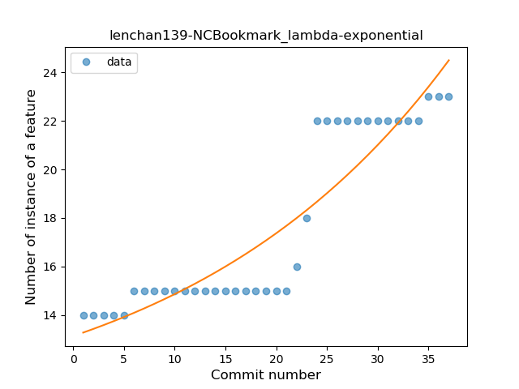
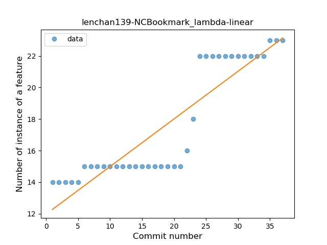
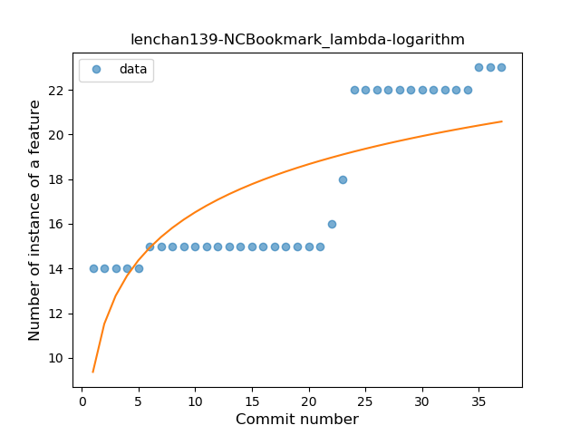
### <a name="unsafe_call">Unsafe Call</a>
----
#### Functions
* **Sudden Rise - Exponential:** 
    * **R_Squared:** 0.87947766
* **Constant Rise - Linear:** 
    * **R_Squared:** 0.82906376
* **Sudden Rise Plateau - Logarithm:** 
    * **R_Squared:** 0.51574693

**Plots** :chart_with_upwards_trend:
-----

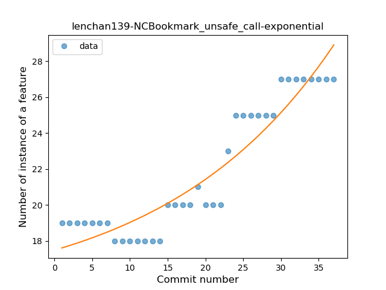
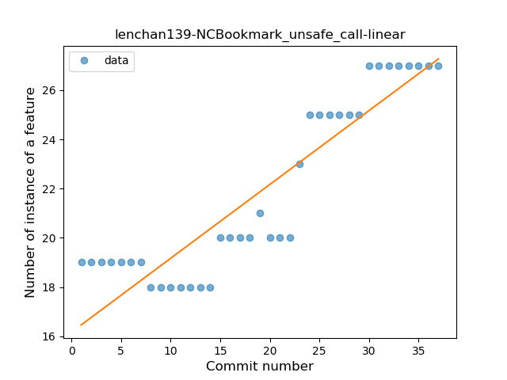
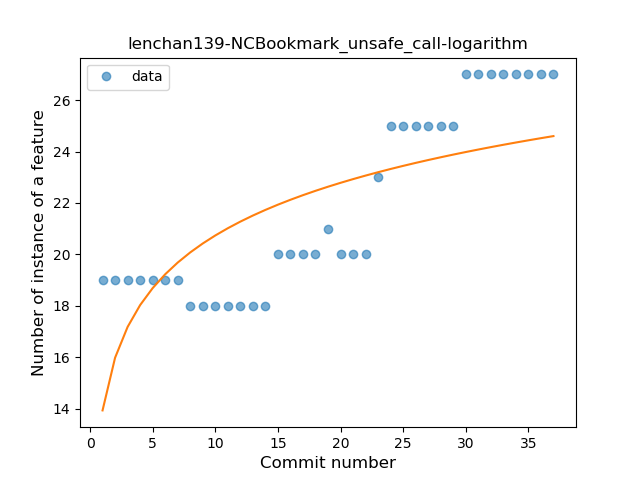
### <a name="string_template">String Template</a>
----
#### Functions
* **Plateau Sudden Rise - Binary Sigmoid:** 
    * **R_Squared:** 1.0
* **Instability - Polinomial 3:** )
    * **R_Squared:** 0.81725808
* **Sudden Rise Plateau - Logarithm:** 
    * **R_Squared:** 0.68559381
* **Constant Rise - Linear:** 
    * **R_Squared:** 0.46052632

**Plots** :chart_with_upwards_trend:
-----

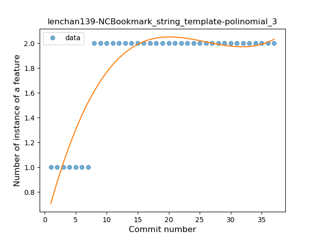
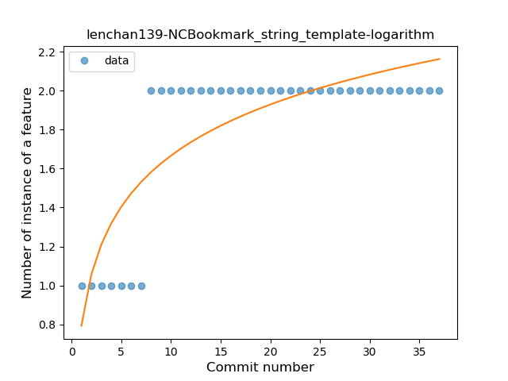
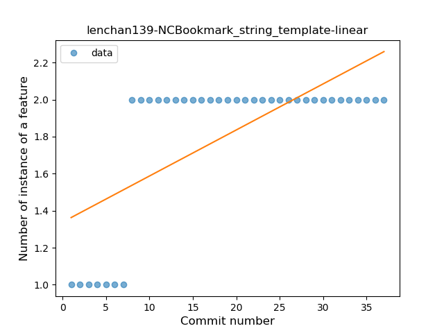
### <a name="range_expr">Range Expression</a>
----
#### Functions
* **Constant Rise - Linear:** 
    * **R_Squared:** 0.89284907
* **Sudden Rise - Exponential:** 
    * **R_Squared:** 0.89502853
* **Sudden Rise Plateau - Logarithm:** 
    * **R_Squared:** 0.711507
* **Plateau Sudden Rise - Binary Sigmoid:** 
    * **R_Squared:** 0.10861803

**Plots** :chart_with_upwards_trend:
-----

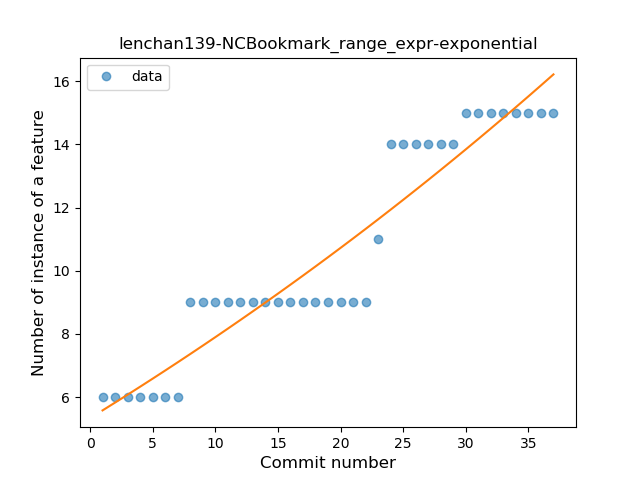
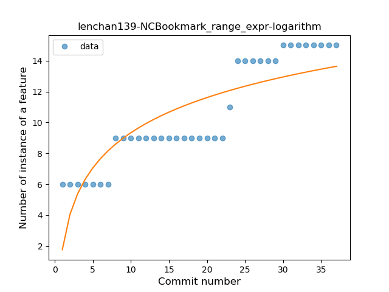
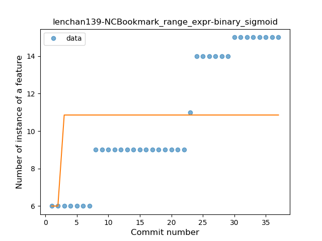
