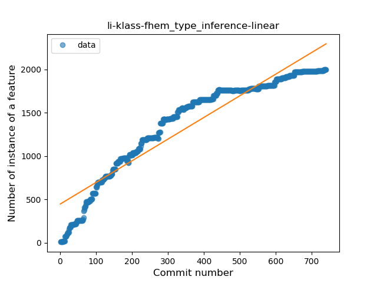
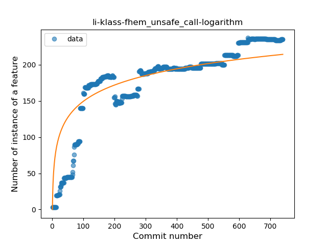
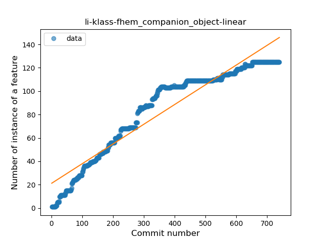
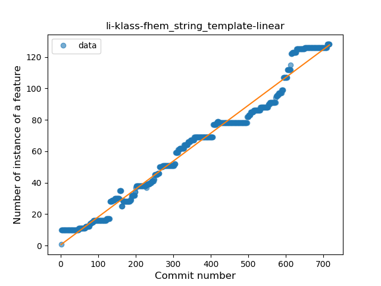
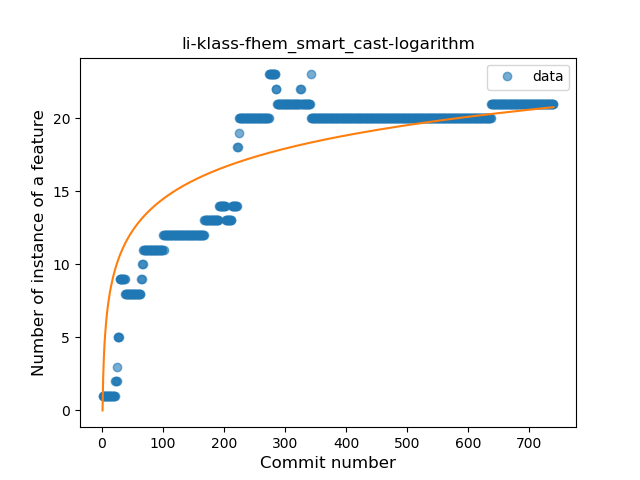
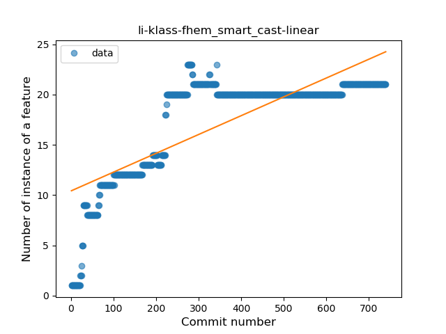
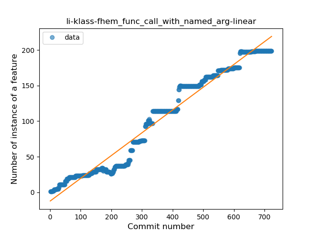
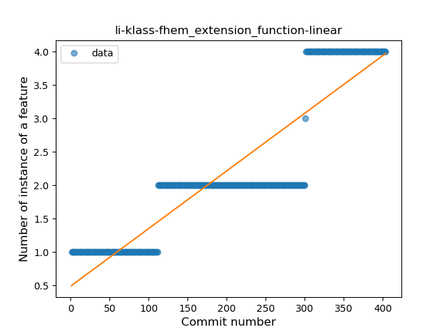
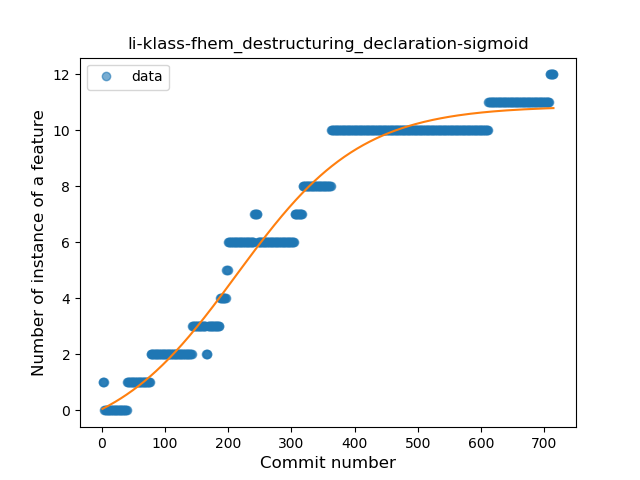
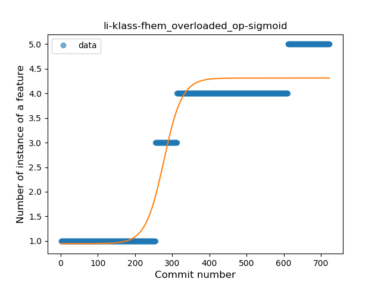

## li-klass-fhem
----
#### Metrics provided by Detekt
* Number of lines of code 32972
* Number of Kotlin files: 415
* Cyclomatic complexity: 3140
* Cyclomatic complexity by thousands of lines: 241 

----
**19** features analyzed

*	<a href="#type_inference">Type Inference</a> 
*	<a href="#lambda">Lambda</a> 
*	<a href="#safe_call">Safe Call</a> 
*	<a href="#when_expr">When expression</a> 
*	<a href="#unsafe_call">Unsafe Call</a> 
*	<a href="#companion_object">Companion Object</a> 
*	<a href="#string_template">String Template</a> 
*	<a href="#func_with_default_value">Function with Default Value</a> 
*	<a href="#singleton">Singleton</a> 
*	<a href="#range_expr">Range Expression</a> 
*	<a href="#smart_cast">Smart Cast</a> 
*	<a href="#data_class">Data Class</a> 
*	<a href="#func_call_with_named_arg">Function call with Named Argument</a> 
*	<a href="#extension_function">Extension Function</a> 
*	<a href="#property_delegation">Property Delegation</a> 
*	<a href="#destructuring_declaration">Destructuring Declaration</a> 
*	<a href="#overloaded_op">Overloaded Operator</a> 
*	<a href="#coroutine">Coroutine</a> 
*	<a href="#sealed_class">Sealed Class</a> 

### <a name="type_inference">Type Inference</a>
----
#### Functions
* **Constant Rise - Linear:** 
    * **R_Squared:** 0.8932719
* **Sudden Rise Plateau - Logarithm:** 
    * **R_Squared:** 0.63980149
* **Plateau Gradual Rise - Sigmoid:** 
    * **R_Squared:** 0.44987804

**Plots** :chart_with_upwards_trend:
-----

### <a name="lambda">Lambda</a>
----
#### Functions
* **Constant Rise - Linear:** 
    * **R_Squared:** 0.9551463
* **Plateau Sudden Rise - Binary Sigmoid:** 
    * **R_Squared:** 0.74048753
* **Sudden Rise Plateau - Logarithm:** 
    * **R_Squared:** 0.52960037

**Plots** :chart_with_upwards_trend:
-----

### <a name="safe_call">Safe Call</a>
----
#### Functions
* **Constant Rise - Linear:** 
    * **R_Squared:** 0.89423022
* **Plateau Sudden Rise - Binary Sigmoid:** 
    * **R_Squared:** 0.62792695
* **Sudden Rise Plateau - Logarithm:** 
    * **R_Squared:** 0.48428353

**Plots** :chart_with_upwards_trend:
-----

### <a name="when_expr">When expression</a>
----
#### Functions
* **Constant Rise - Linear:** 
    * **R_Squared:** 0.82703346
* **Sudden Rise Plateau - Logarithm:** 
    * **R_Squared:** 0.74848049

**Plots** :chart_with_upwards_trend:
-----

### <a name="unsafe_call">Unsafe Call</a>
----
#### Functions
* **Sudden Rise Plateau - Logarithm:** 
    * **R_Squared:** 0.74043987
* **Constant Rise - Linear:** 
    * **R_Squared:** 0.69152036
* **Plateau Sudden Rise - Binary Sigmoid:** 
    * **R_Squared:** 0.46457366

**Plots** :chart_with_upwards_trend:
-----

### <a name="companion_object">Companion Object</a>
----
#### Functions
* **Constant Rise - Linear:** 
    * **R_Squared:** 0.90969728
* **Sudden Rise Plateau - Logarithm:** 
    * **R_Squared:** 0.58513965
* **Plateau Sudden Rise - Binary Sigmoid:** 
    * **R_Squared:** 0.43593696

**Plots** :chart_with_upwards_trend:
-----

### <a name="string_template">String Template</a>
----
#### Functions
* **Constant Rise - Linear:** 
    * **R_Squared:** 0.97907558
* **Sudden Rise - Exponential:** 
    * **R_Squared:** 0.98148382
* **Sudden Rise Plateau - Logarithm:** 
    * **R_Squared:** 0.43007462
* **Plateau Sudden Rise - Binary Sigmoid:** 
    * **R_Squared:** 0.16067584

**Plots** :chart_with_upwards_trend:
-----

### <a name="func_with_default_value">Function with Default Value</a>
----
#### Functions
* **Constant Rise - Linear:** 
    * **R_Squared:** 0.89223
* **Sudden Rise Plateau - Logarithm:** 
    * **R_Squared:** 0.51407194
* **Plateau Sudden Rise - Binary Sigmoid:** 
    * **R_Squared:** 0.13564677

**Plots** :chart_with_upwards_trend:
-----

### <a name="singleton">Singleton</a>
----
#### Functions
* **Constant Rise - Linear:** 
    * **R_Squared:** 0.85503466
* **Sudden Rise Plateau - Logarithm:** 
    * **R_Squared:** 0.46141297

**Plots** :chart_with_upwards_trend:
-----

### <a name="range_expr">Range Expression</a>
----
#### Functions
* **Constant Rise - Linear:** 
    * **R_Squared:** 0.57472541
* **Sudden Rise Plateau - Logarithm:** 
    * **R_Squared:** 0.51061906

**Plots** :chart_with_upwards_trend:
-----

### <a name="smart_cast">Smart Cast</a>
----
#### Functions
* **Sudden Rise Plateau - Logarithm:** 
    * **R_Squared:** 0.75188197
* **Constant Rise - Linear:** 
    * **R_Squared:** 0.61476989

**Plots** :chart_with_upwards_trend:
-----

### <a name="data_class">Data Class</a>
----
#### Functions
* **Constant Rise - Linear:** 
    * **R_Squared:** 0.91479182
* **Sudden Rise Plateau - Logarithm:** 
    * **R_Squared:** 0.34872179

**Plots** :chart_with_upwards_trend:
-----

### <a name="func_call_with_named_arg">Function call with Named Argument</a>
----
#### Functions
* **Constant Rise - Linear:** 
    * **R_Squared:** 0.96724659
* **Sudden Rise Plateau - Logarithm:** 
    * **R_Squared:** 0.38614101
* **Plateau Sudden Rise - Binary Sigmoid:** 
    * **R_Squared:** 0.32515133

**Plots** :chart_with_upwards_trend:
-----

### <a name="extension_function">Extension Function</a>
----
#### Functions
* **Sudden Rise - Exponential:** 
    * **R_Squared:** 0.85289413
* **Plateau Gradual Rise - Sigmoid:** 
    * **R_Squared:** 0.85407408
* **Constant Rise - Linear:** 
    * **R_Squared:** 0.81454944
* **Sudden Rise Plateau - Logarithm:** 
    * **R_Squared:** 0.41814631

**Plots** :chart_with_upwards_trend:
-----

### <a name="property_delegation">Property Delegation</a>
----
#### Functions
* **Plateau Gradual Rise - Sigmoid:** 
    * **R_Squared:** 0.99480815
* **Sudden Rise Plateau - Logarithm:** 
    * **R_Squared:** 0.57684387
* **Constant Rise - Linear:** 
    * **R_Squared:** 0.23265556

**Plots** :chart_with_upwards_trend:
-----

### <a name="destructuring_declaration">Destructuring Declaration</a>
----
#### Functions
* **Plateau Gradual Rise - Sigmoid:** 
    * **R_Squared:** 0.97582618
* **Constant Rise - Linear:** 
    * **R_Squared:** 0.89269132
* **Sudden Rise Plateau - Logarithm:** 
    * **R_Squared:** 0.50709776

**Plots** :chart_with_upwards_trend:
-----

### <a name="overloaded_op">Overloaded Operator</a>
----
#### Functions
* **Plateau Gradual Rise - Sigmoid:** 
    * **R_Squared:** 0.93925829
* **Constant Rise - Linear:** 
    * **R_Squared:** 0.85233114
* **Sudden Rise Plateau - Logarithm:** 
    * **R_Squared:** 0.4365446

**Plots** :chart_with_upwards_trend:
-----

### <a name="coroutine">Coroutine</a>
----
#### Functions
* **Plateau Gradual Rise - Sigmoid:** 
    * **R_Squared:** 0.91407666
* **Sudden Rise - Exponential:** 
    * **R_Squared:** 0.87829045
* **Constant Rise - Linear:** 
    * **R_Squared:** 0.73989154
* **Sudden Rise Plateau - Logarithm:** 
    * **R_Squared:** 0.26441406

**Plots** :chart_with_upwards_trend:
-----

### <a name="sealed_class">Sealed Class</a>
----
#### Functions
* **Plateau Sudden Rise - Binary Sigmoid:** 
    * **R_Squared:** 0.47866685
* **Constant Rise - Linear:** 
    * **R_Squared:** 0.26861873
* **Sudden Rise Plateau - Logarithm:** 
    * **R_Squared:** 0.22657502

**Plots** :chart_with_upwards_trend:
-----

