## ligi-IPFSDroid
----
#### Metrics provided by Detekt
* Number of lines of code 815
* Number of Kotlin files: 12
* Cyclomatic complexity: 126
* Cyclomatic complexity by thousands of lines: 301 

----
**9** features analyzed

*	<a href="#type_inference">Type Inference</a> 
*	<a href="#lambda">Lambda</a> 
*	<a href="#safe_call">Safe Call</a> 
*	<a href="#when_expr">When expression</a> 
*	<a href="#unsafe_call">Unsafe Call</a> 
*	<a href="#string_template">String Template</a> 
*	<a href="#singleton">Singleton</a> 
*	<a href="#func_call_with_named_arg">Function call with Named Argument</a> 
*	<a href="#property_delegation">Property Delegation</a> 

### <a name="type_inference">Type Inference</a>
----
#### Functions
* **Plateau Gradual Rise - Sigmoid:** 
    * **R_Squared:** 0.96025621
* **Constant Rise - Linear:** 
    * **R_Squared:** 0.58517462
* **Sudden Rise Plateau - Logarithm:** 
    * **R_Squared:** 0.5921298

**Plots** :chart_with_upwards_trend:
-----

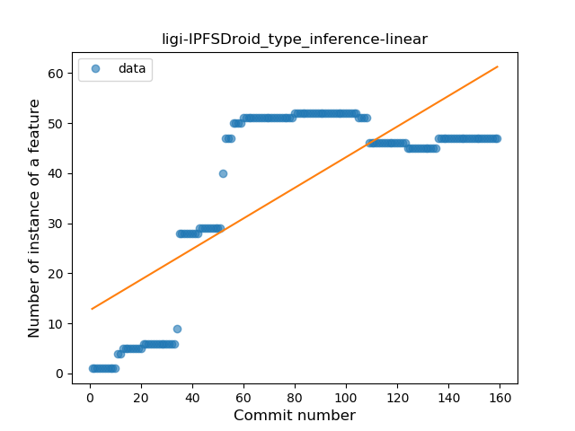
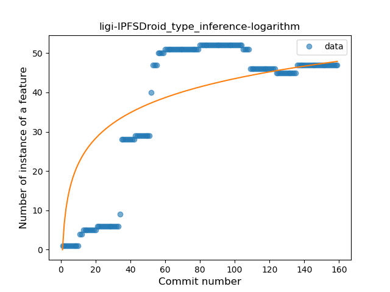
### <a name="lambda">Lambda</a>
----
#### Functions
* **Plateau Sudden Rise - Binary Sigmoid:** 
    * **R_Squared:** 0.84948833
* **Constant Rise - Linear:** 
    * **R_Squared:** 0.55461162
* **Sudden Rise Plateau - Logarithm:** 
    * **R_Squared:** 0.55756365

**Plots** :chart_with_upwards_trend:
-----

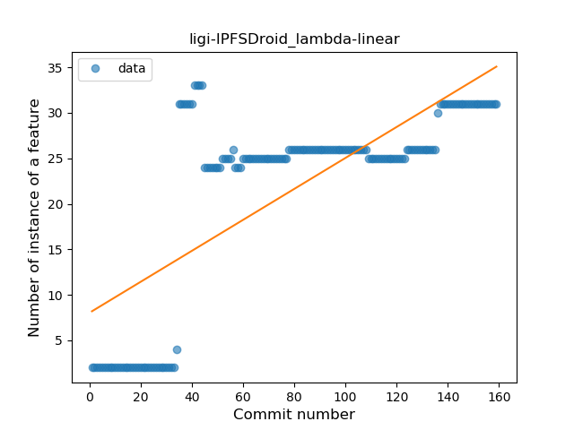
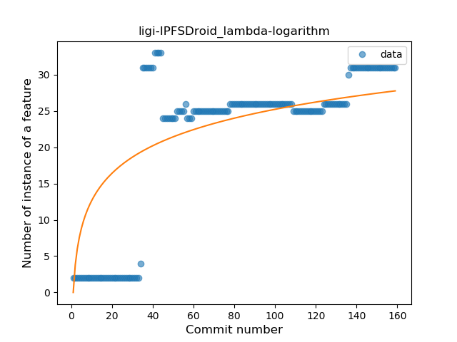
### <a name="safe_call">Safe Call</a>
----
#### Functions
* **Sudden Rise Plateau - Logarithm:** 
    * **R_Squared:** 0.84956946
* **Constant Rise - Linear:** 
    * **R_Squared:** 0.79272325

**Plots** :chart_with_upwards_trend:
-----

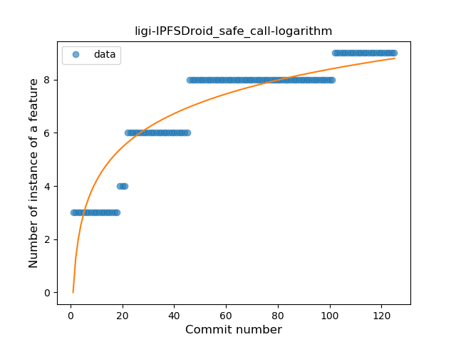
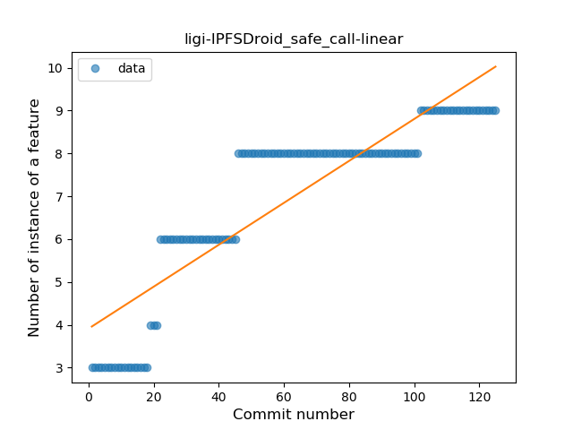
### <a name="when_expr">When expression</a>
----
#### Functions
* **Plateau Gradual Rise - Sigmoid:** 
    * **R_Squared:** 0.98397894
* **Constant Rise - Linear:** 
    * **R_Squared:** 0.79268591
* **Sudden Rise Plateau - Logarithm:** 
    * **R_Squared:** 0.75770875

**Plots** :chart_with_upwards_trend:
-----

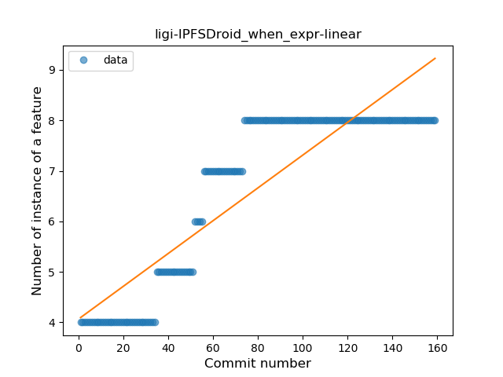
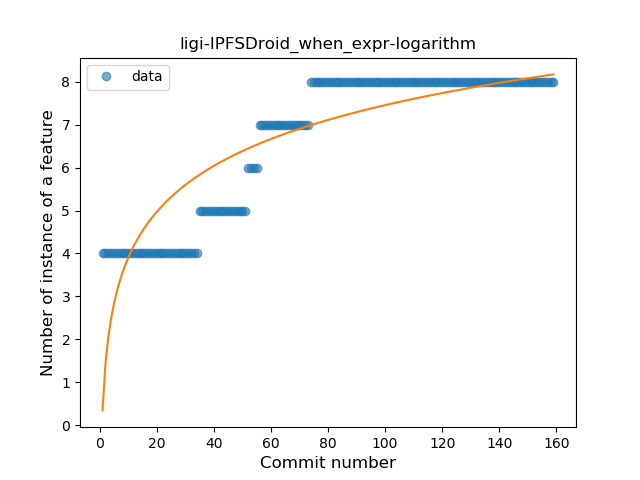
### <a name="unsafe_call">Unsafe Call</a>
----
#### Functions
* **Plateau Gradual Rise - Sigmoid:** 
    * **R_Squared:** 0.42271562
* **Sudden Rise Plateau - Logarithm:** 
    * **R_Squared:** 0.0713839
* **Constant Decline - Linear:** 
    * **R_Squared:** 0.00186874
* **Sudden Decline - Exponential:** 
    * **R_Squared:** 0.00091902

**Plots** :chart_with_upwards_trend:
-----

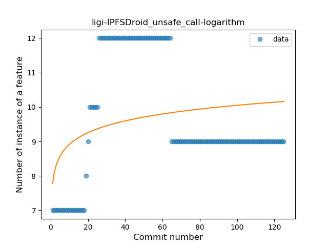
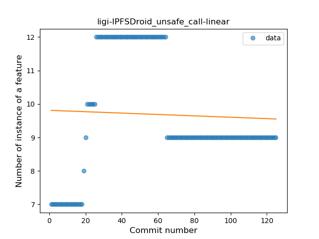
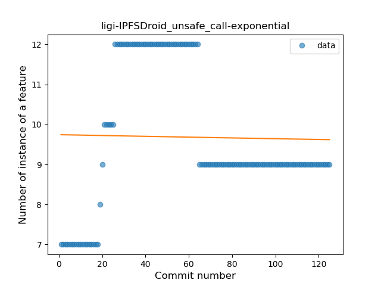
### <a name="string_template">String Template</a>
----
#### Functions
* **Sudden Rise Plateau - Logarithm:** 
    * **R_Squared:** 0.53418097
* **Constant Rise - Linear:** 
    * **R_Squared:** 0.20457409

**Plots** :chart_with_upwards_trend:
-----

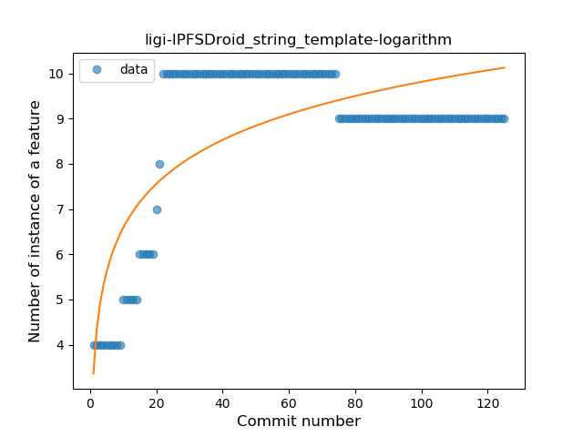
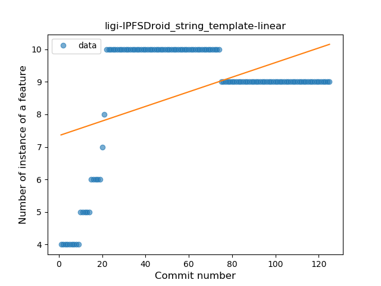
### <a name="singleton">Singleton</a>
----
#### Functions
* **Plateau Sudden Rise - Binary Sigmoid:** 
    * **R_Squared:** 1.0
* **Sudden Rise Plateau - Logarithm:** 
    * **R_Squared:** 0.67824362
* **Constant Rise - Linear:** 
    * **R_Squared:** 0.54840093

**Plots** :chart_with_upwards_trend:
-----

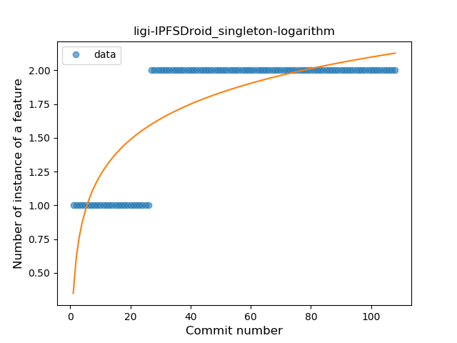
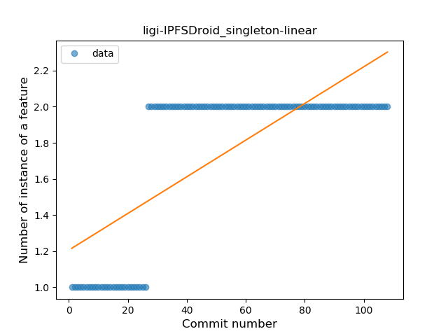
### <a name="func_call_with_named_arg">Function call with Named Argument</a>
----
#### Functions
* **Plateau Sudden Rise - Binary Sigmoid:** 
    * **R_Squared:** 1.0
* **Sudden Rise - Exponential:** 
    * **R_Squared:** 0.77348098
* **Constant Rise - Linear:** 
    * **R_Squared:** 0.53259362
* **Sudden Rise Plateau - Logarithm:** 
    * **R_Squared:** 0.24836177

**Plots** :chart_with_upwards_trend:
-----

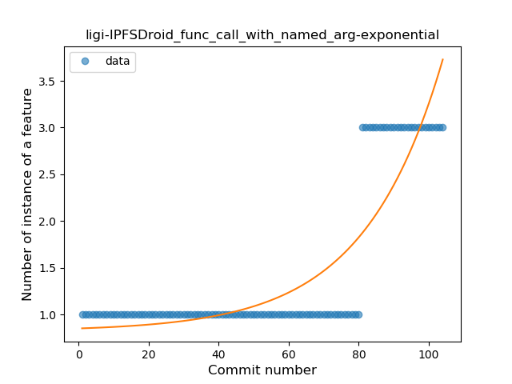
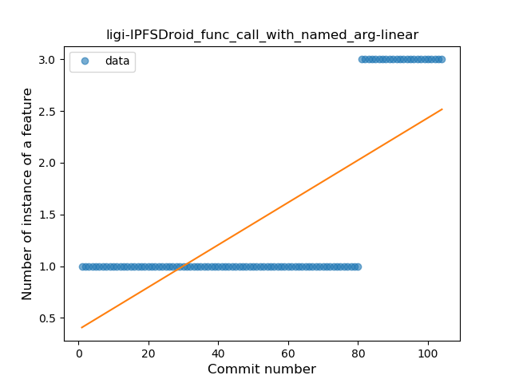
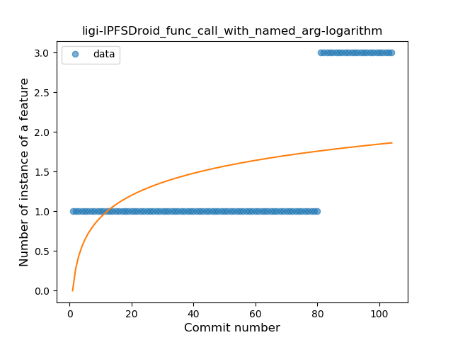
### <a name="property_delegation">Property Delegation</a>
----
#### Functions
* **Constant Decline - Linear:** 
    * **R_Squared:** 0.06211742
* **Sudden Rise Plateau - Logarithm:** 
    * **R_Squared:** -0.0

**Plots** :chart_with_upwards_trend:
-----

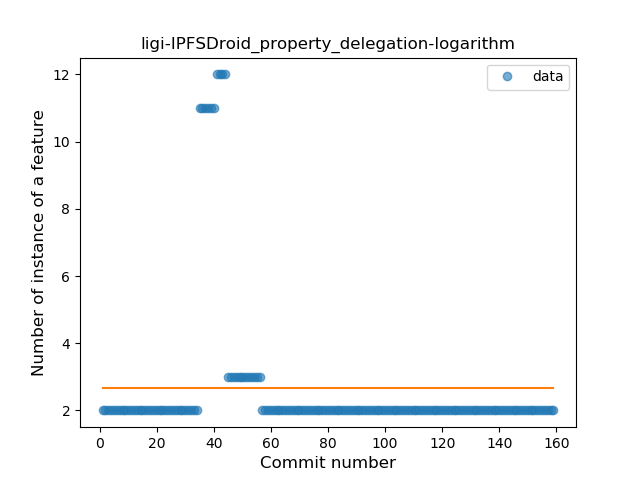
