## ligi-MaterialTeaTimer
----
#### Metrics provided by Detekt
* Number of lines of code 455
* Number of Kotlin files: 11
* Cyclomatic complexity: 53
* Cyclomatic complexity by thousands of lines: 250 

----
**6** features analyzed

*	<a href="#type_inference">Type Inference</a> 
*	<a href="#lambda">Lambda</a> 
*	<a href="#safe_call">Safe Call</a> 
*	<a href="#when_expr">When expression</a> 
*	<a href="#singleton">Singleton</a> 
*	<a href="#property_delegation">Property Delegation</a> 

### <a name="type_inference">Type Inference</a>
----
#### Functions
* **Instability - Polinomial 3:** )
    * **R_Squared:** 0.39166522
* **Sudden Rise Plateau - Logarithm:** 
    * **R_Squared:** 0.1703657
* **Constant Rise - Linear:** 
    * **R_Squared:** 0.01466682

**Plots** :chart_with_upwards_trend:
-----

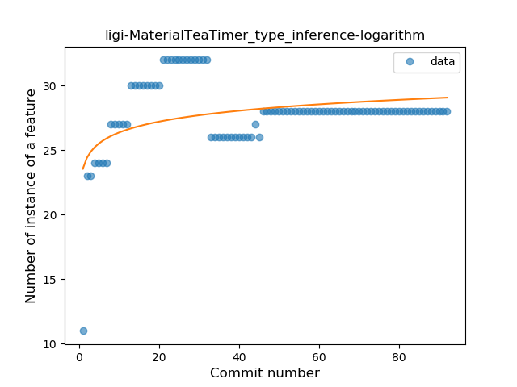
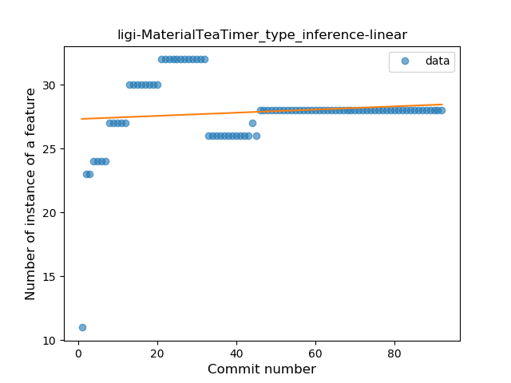
### <a name="lambda">Lambda</a>
----
#### Functions
* **Plateau Sudden Rise - Binary Sigmoid:** 
    * **R_Squared:** 0.90833391
* **Instability - Polinomial 3:** )
    * **R_Squared:** 0.90900736
* **Sudden Rise Plateau - Logarithm:** 
    * **R_Squared:** 0.63383703
* **Constant Rise - Linear:** 
    * **R_Squared:** 0.26570772

**Plots** :chart_with_upwards_trend:
-----

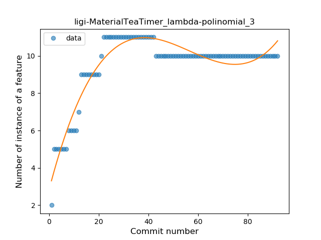
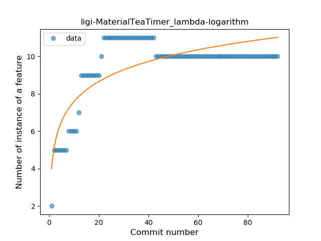
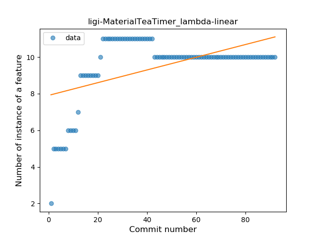
### <a name="safe_call">Safe Call</a>
----
#### Functions
* **Plateau Sudden Decline - Binary Sigmoid:** 
    * **R_Squared:** 1.0
* **Sudden Decline - Exponential:** 
    * **R_Squared:** 0.79624166
* **Constant Decline - Linear:** 
    * **R_Squared:** 0.29634146
* **Sudden Rise Plateau - Logarithm:** 
    * **R_Squared:** -0.0

**Plots** :chart_with_upwards_trend:
-----

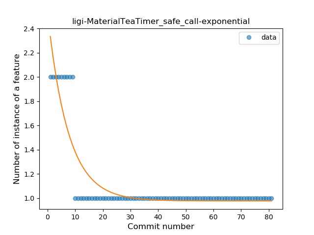
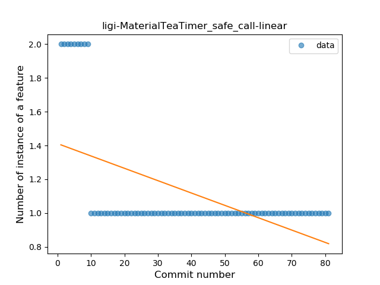

### <a name="when_expr">When expression</a>
----
#### Functions
* **Plateau Sudden Rise - Binary Sigmoid:** 
    * **R_Squared:** 1.0
* **Sudden Rise Plateau - Logarithm:** 
    * **R_Squared:** 0.58858692
* **Constant Rise - Linear:** 
    * **R_Squared:** 0.27003334

**Plots** :chart_with_upwards_trend:
-----

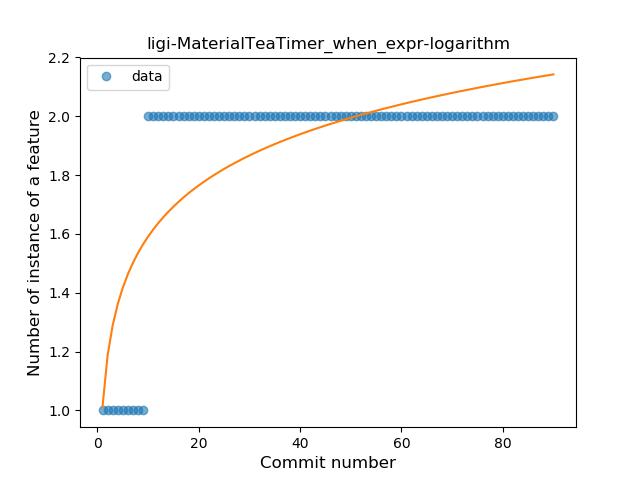
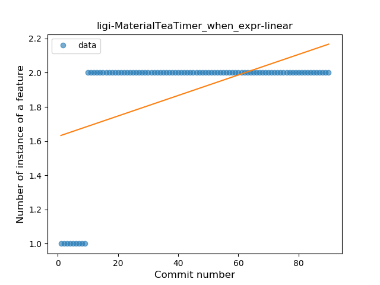
### <a name="singleton">Singleton</a>
----
#### Functions
* **Plateau Gradual Rise - Sigmoid:** 
    * **R_Squared:** 0.35295114
* **Sudden Rise Plateau - Logarithm:** 
    * **R_Squared:** 0.07562476
* **Constant Decline - Linear:** 
    * **R_Squared:** 0.00233754

**Plots** :chart_with_upwards_trend:
-----

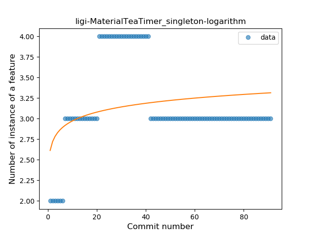
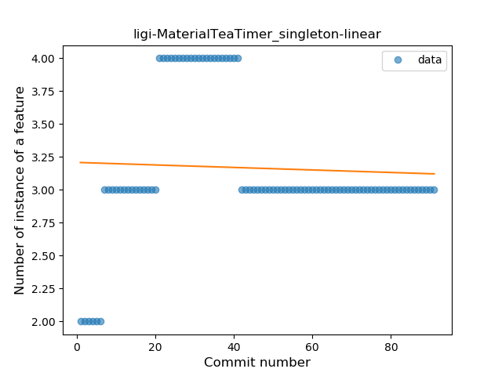
### <a name="property_delegation">Property Delegation</a>
----
#### Functions
* **Plateau Sudden Rise - Binary Sigmoid:** 
    * **R_Squared:** 1.0
* **Sudden Rise Plateau - Logarithm:** 
    * **R_Squared:** 0.6818268
* **Constant Rise - Linear:** 
    * **R_Squared:** 0.51449275

**Plots** :chart_with_upwards_trend:
-----

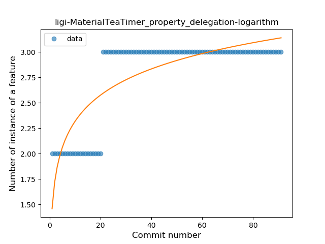
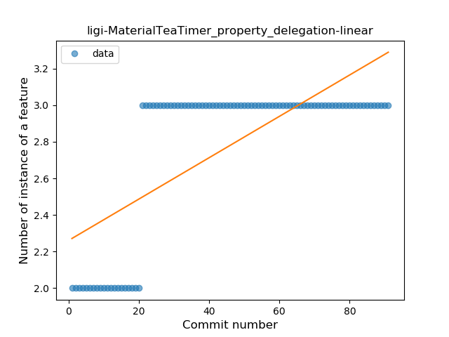
