## ligi-PassAndroid
----
#### Metrics provided by Detekt
* Number of lines of code 8011
* Number of Kotlin files: 129
* Cyclomatic complexity: 1045
* Cyclomatic complexity by thousands of lines: 280 

----
**15** features analyzed

*	<a href="#type_inference">Type Inference</a> 
*	<a href="#lambda">Lambda</a> 
*	<a href="#safe_call">Safe Call</a> 
*	<a href="#when_expr">When expression</a> 
*	<a href="#companion_object">Companion Object</a> 
*	<a href="#unsafe_call">Unsafe Call</a> 
*	<a href="#string_template">String Template</a> 
*	<a href="#func_with_default_value">Function with Default Value</a> 
*	<a href="#singleton">Singleton</a> 
*	<a href="#smart_cast">Smart Cast</a> 
*	<a href="#range_expr">Range Expression</a> 
*	<a href="#func_call_with_named_arg">Function call with Named Argument</a> 
*	<a href="#extension_function">Extension Function</a> 
*	<a href="#property_delegation">Property Delegation</a> 
*	<a href="#destructuring_declaration">Destructuring Declaration</a> 

### <a name="type_inference">Type Inference</a>
----
#### Functions
* **Constant Rise - Linear:** 
    * **R_Squared:** 0.90839303
* **Sudden Rise - Exponential:** 
    * **R_Squared:** 0.91285804
* **Sudden Rise Plateau - Logarithm:** 
    * **R_Squared:** 0.420249
* **Plateau Sudden Rise - Binary Sigmoid:** 
    * **R_Squared:** 0.39719628

**Plots** :chart_with_upwards_trend:
-----

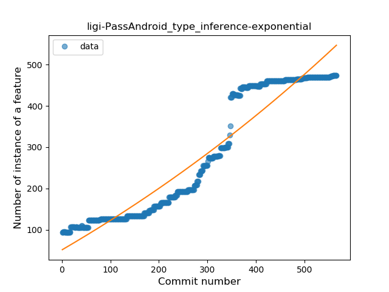
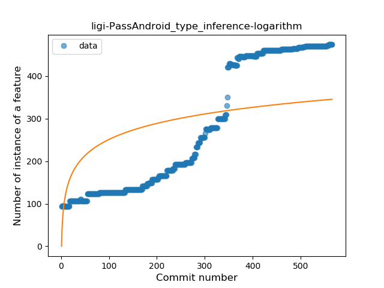
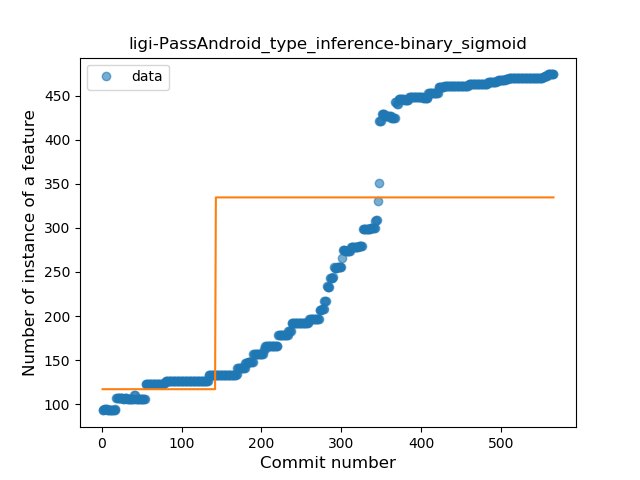
### <a name="lambda">Lambda</a>
----
#### Functions
* **Constant Rise - Linear:** 
    * **R_Squared:** 0.9573815
* **Sudden Rise - Exponential:** 
    * **R_Squared:** 0.95752923
* **Sudden Rise Plateau - Logarithm:** 
    * **R_Squared:** 0.4275596
* **Plateau Sudden Rise - Binary Sigmoid:** 
    * **R_Squared:** 0.28909735

**Plots** :chart_with_upwards_trend:
-----

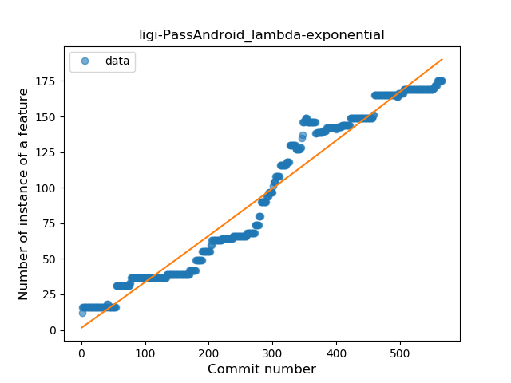
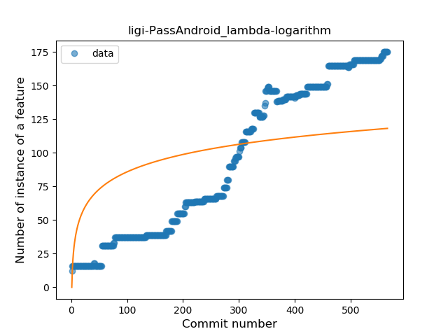
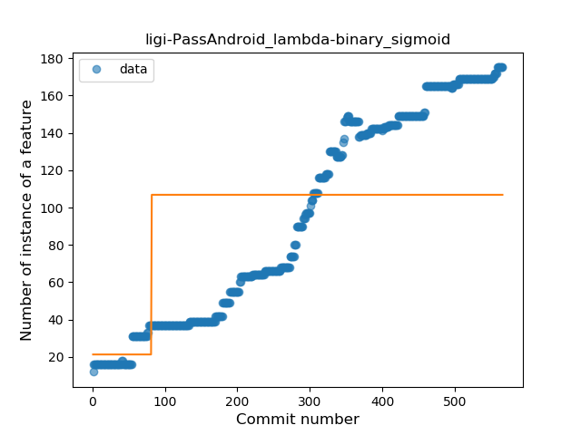
### <a name="safe_call">Safe Call</a>
----
#### Functions
* **Plateau Gradual Rise - Sigmoid:** 
    * **R_Squared:** 0.97789989
* **Sudden Rise - Exponential:** 
    * **R_Squared:** 0.89444496
* **Constant Rise - Linear:** 
    * **R_Squared:** 0.88185454
* **Sudden Rise Plateau - Logarithm:** 
    * **R_Squared:** 0.26323253

**Plots** :chart_with_upwards_trend:
-----

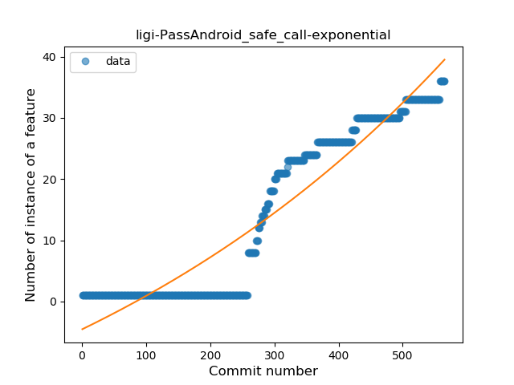
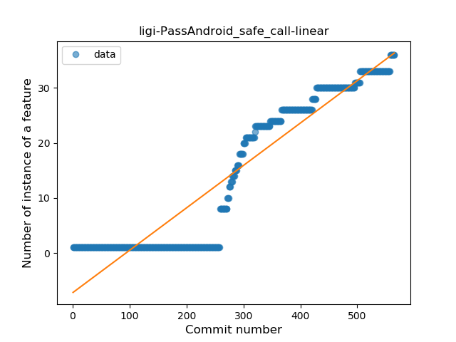
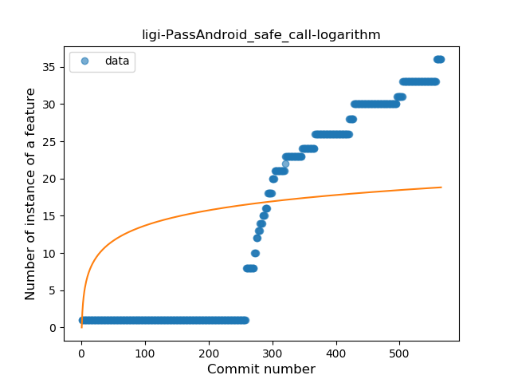
### <a name="when_expr">When expression</a>
----
#### Functions
* **Plateau Gradual Rise - Sigmoid:** 
    * **R_Squared:** 0.98750553
* **Constant Rise - Linear:** 
    * **R_Squared:** 0.90615961
* **Sudden Rise Plateau - Logarithm:** 
    * **R_Squared:** 0.34522099

**Plots** :chart_with_upwards_trend:
-----

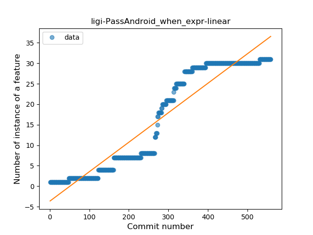
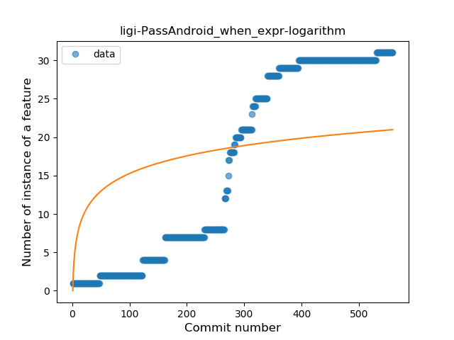
### <a name="companion_object">Companion Object</a>
----
#### Functions
* **Sudden Rise - Exponential:** 
    * **R_Squared:** 0.90514827
* **Constant Rise - Linear:** 
    * **R_Squared:** 0.88607245
* **Sudden Rise Plateau - Logarithm:** 
    * **R_Squared:** 0.35795534

**Plots** :chart_with_upwards_trend:
-----

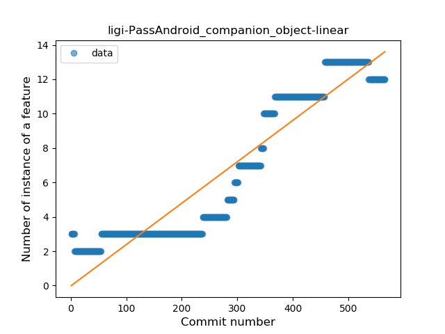
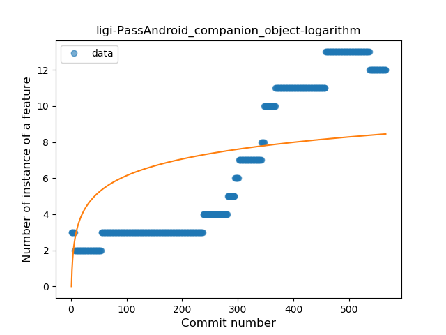
### <a name="unsafe_call">Unsafe Call</a>
----
#### Functions
* **Constant Rise - Linear:** 
    * **R_Squared:** 0.91443644
* **Sudden Rise - Exponential:** 
    * **R_Squared:** 0.91468321
* **Plateau Sudden Rise - Binary Sigmoid:** 
    * **R_Squared:** 0.44496346
* **Sudden Rise Plateau - Logarithm:** 
    * **R_Squared:** 0.33064984

**Plots** :chart_with_upwards_trend:
-----

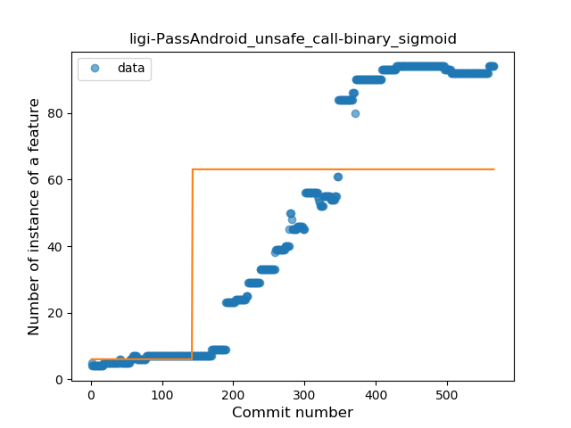
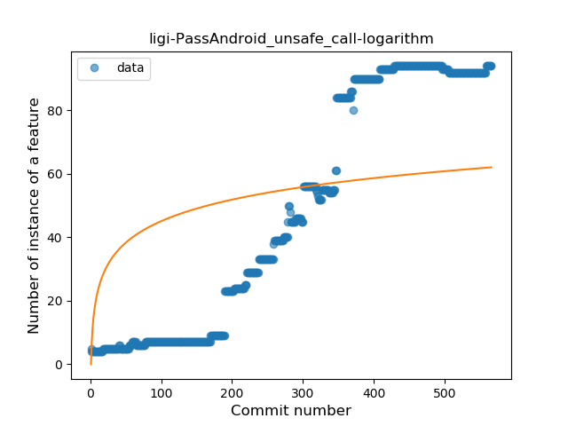
### <a name="string_template">String Template</a>
----
#### Functions
* **Constant Rise - Linear:** 
    * **R_Squared:** 0.91623841
* **Sudden Rise Plateau - Logarithm:** 
    * **R_Squared:** 0.51311141
* **Plateau Sudden Rise - Binary Sigmoid:** 
    * **R_Squared:** 0.00443925

**Plots** :chart_with_upwards_trend:
-----

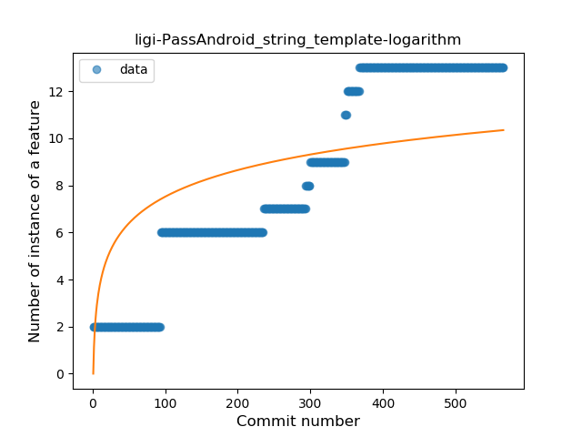
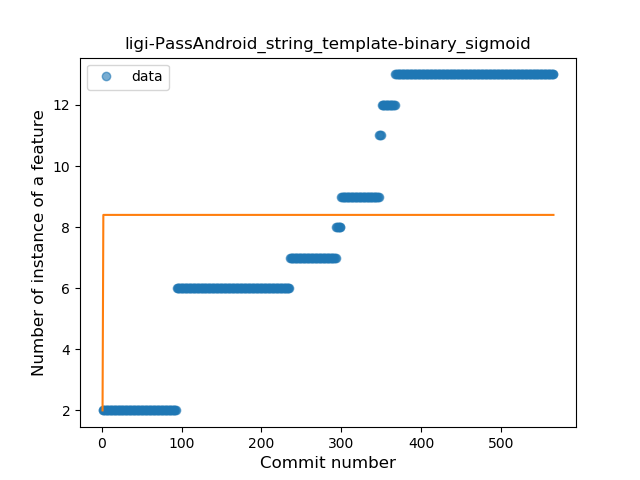
### <a name="func_with_default_value">Function with Default Value</a>
----
#### Functions
* **Plateau Gradual Rise - Sigmoid:** 
    * **R_Squared:** 0.93212082
* **Constant Rise - Linear:** 
    * **R_Squared:** 0.88511561
* **Sudden Rise - Exponential:** 
    * **R_Squared:** 0.89060037
* **Sudden Rise Plateau - Logarithm:** 
    * **R_Squared:** 0.56538225

**Plots** :chart_with_upwards_trend:
-----

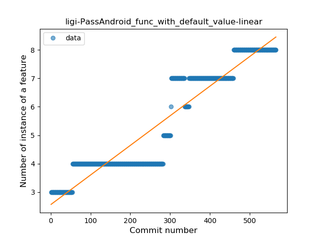
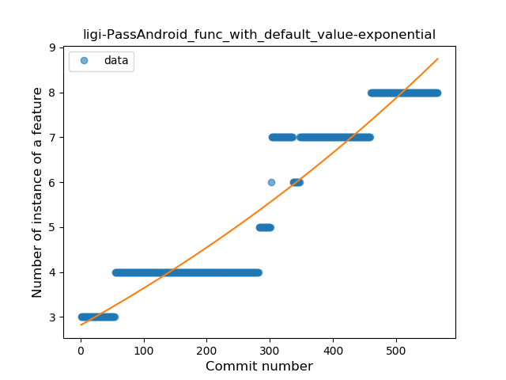
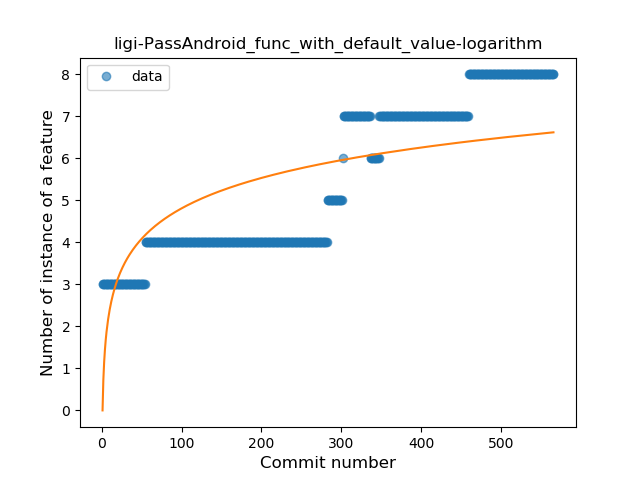
### <a name="singleton">Singleton</a>
----
#### Functions
* **Plateau Gradual Rise - Sigmoid:** 
    * **R_Squared:** 0.5028458
* **Sudden Rise Plateau - Logarithm:** 
    * **R_Squared:** 0.3758311
* **Constant Rise - Linear:** 
    * **R_Squared:** 0.20272689

**Plots** :chart_with_upwards_trend:
-----

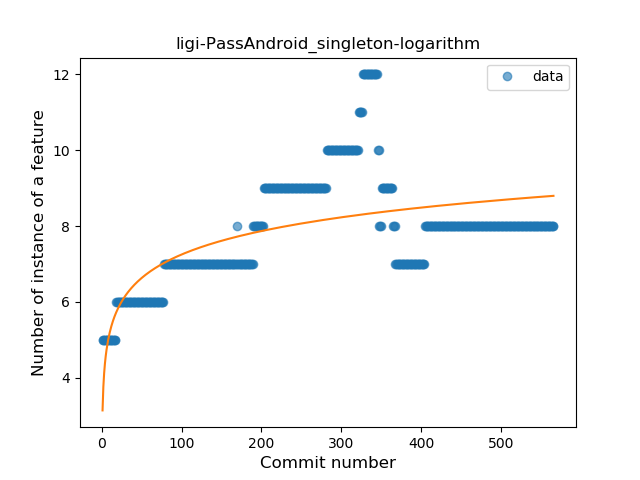
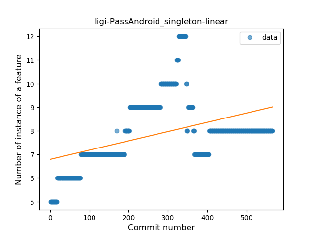
### <a name="smart_cast">Smart Cast</a>
----
#### Functions
* **Plateau Sudden Rise - Binary Sigmoid:** 
    * **R_Squared:** 1.0
* **Constant Rise - Linear:** 
    * **R_Squared:** 0.67031432
* **Sudden Rise Plateau - Logarithm:** 
    * **R_Squared:** 0.53372702

**Plots** :chart_with_upwards_trend:
-----

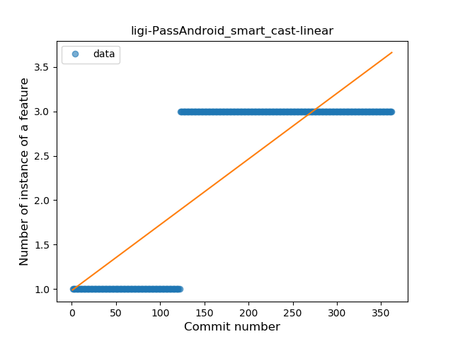
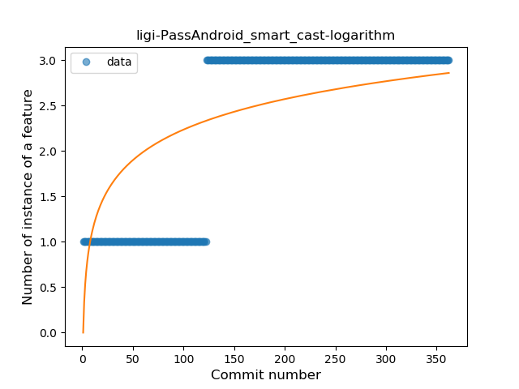
### <a name="range_expr">Range Expression</a>
----
#### Functions
* **Plateau Gradual Rise - Sigmoid:** 
    * **R_Squared:** 0.97675762
* **Sudden Rise - Exponential:** 
    * **R_Squared:** 0.8950407
* **Constant Rise - Linear:** 
    * **R_Squared:** 0.80086832
* **Sudden Rise Plateau - Logarithm:** 
    * **R_Squared:** 0.2635116

**Plots** :chart_with_upwards_trend:
-----

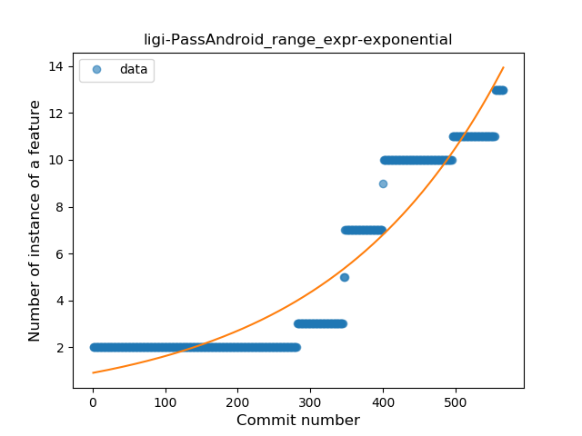
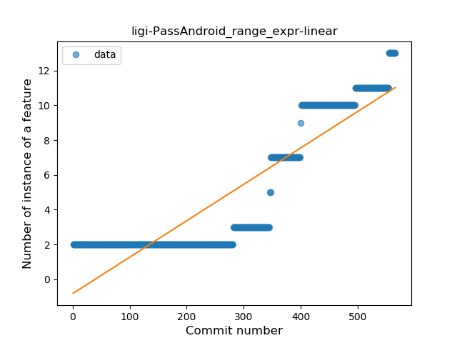
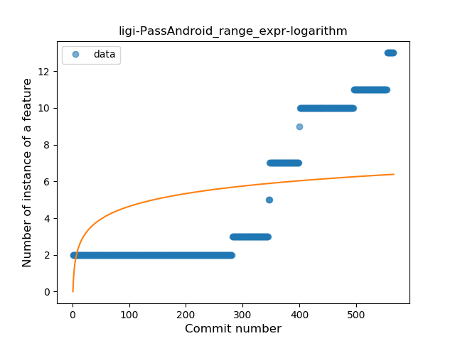
### <a name="func_call_with_named_arg">Function call with Named Argument</a>
----
#### Functions
* **Sudden Rise - Exponential:** 
    * **R_Squared:** 0.97385702
* **Plateau Gradual Rise - Sigmoid:** 
    * **R_Squared:** 0.97539102
* **Constant Rise - Linear:** 
    * **R_Squared:** 0.91073033
* **Sudden Rise Plateau - Logarithm:** 
    * **R_Squared:** 0.51743981

**Plots** :chart_with_upwards_trend:
-----

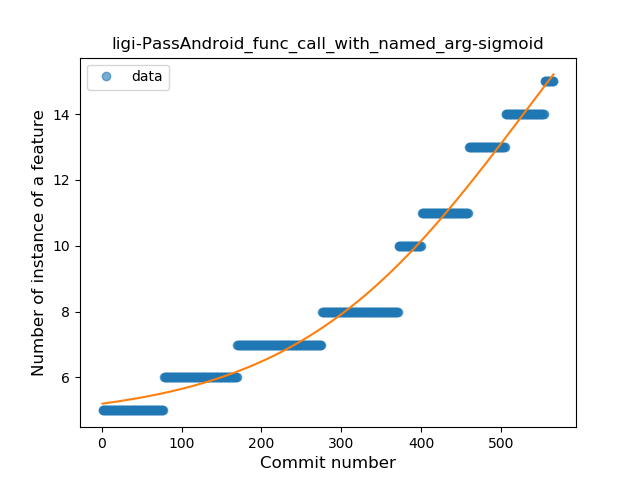
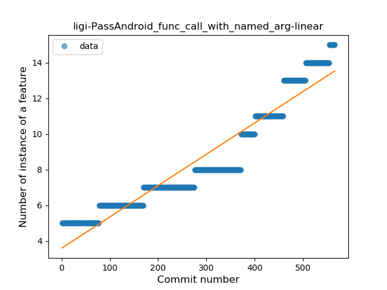
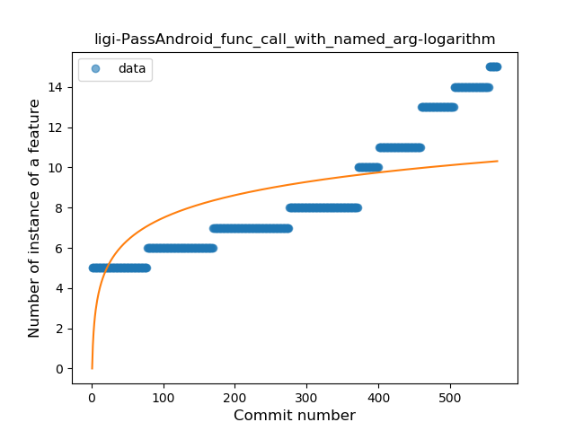
### <a name="extension_function">Extension Function</a>
----
#### Functions
* **Plateau Sudden Rise - Binary Sigmoid:** 
    * **R_Squared:** 0.96119903
* **Sudden Rise Plateau - Logarithm:** 
    * **R_Squared:** 0.72227258
* **Constant Rise - Linear:** 
    * **R_Squared:** 0.60173417

**Plots** :chart_with_upwards_trend:
-----

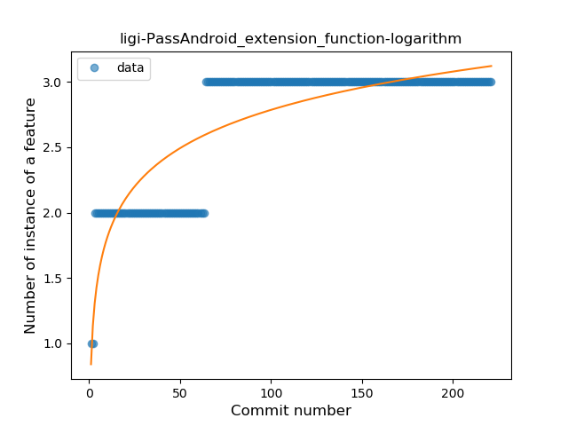
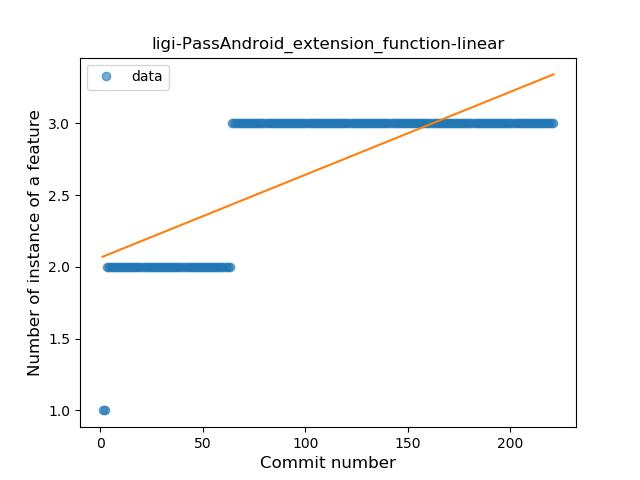
### <a name="property_delegation">Property Delegation</a>
----
#### Functions
* **Constant Rise - Linear:** 
    * **R_Squared:** 0.65935927
* **Sudden Rise Plateau - Logarithm:** 
    * **R_Squared:** 0.57057268
* **Plateau Sudden Rise - Binary Sigmoid:** 
    * **R_Squared:** 0.09337438

**Plots** :chart_with_upwards_trend:
-----

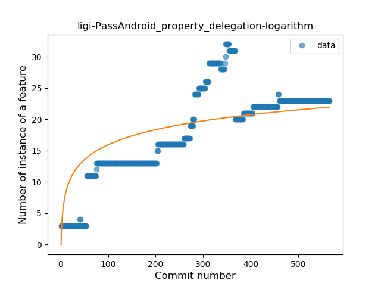
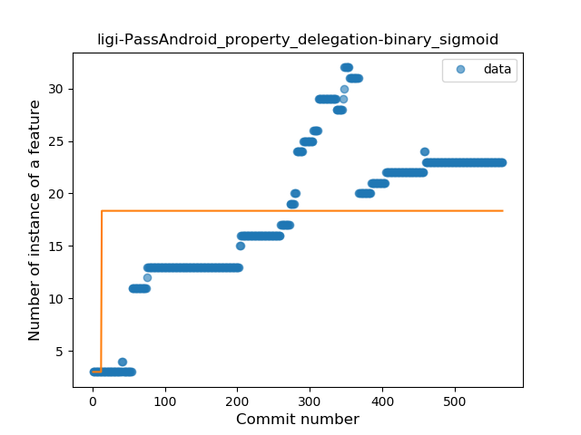
### <a name="destructuring_declaration">Destructuring Declaration</a>
----
#### Functions
* **Plateau Sudden Rise - Binary Sigmoid:** 
    * **R_Squared:** 1.0
* **Sudden Rise Plateau - Logarithm:** 
    * **R_Squared:** 0.30103564
* **Constant Rise - Linear:** 
    * **R_Squared:** 0.06547085

**Plots** :chart_with_upwards_trend:
-----

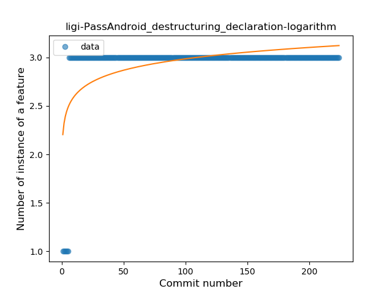
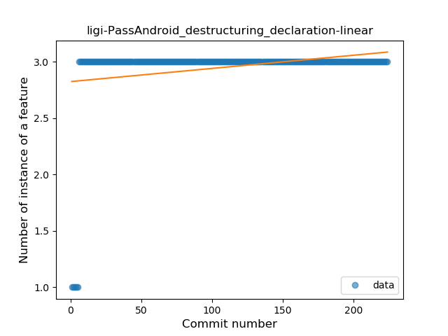
