## ligi-SurvivalManual
----
#### Metrics provided by Detekt
* Number of lines of code 1439
* Number of Kotlin files: 34
* Cyclomatic complexity: 190
* Cyclomatic complexity by thousands of lines: 281 

----
**14** features analyzed

*	<a href="#type_inference">Type Inference</a> 
*	<a href="#lambda">Lambda</a> 
*	<a href="#safe_call">Safe Call</a> 
*	<a href="#when_expr">When expression</a> 
*	<a href="#unsafe_call">Unsafe Call</a> 
*	<a href="#string_template">String Template</a> 
*	<a href="#func_with_default_value">Function with Default Value</a> 
*	<a href="#singleton">Singleton</a> 
*	<a href="#smart_cast">Smart Cast</a> 
*	<a href="#range_expr">Range Expression</a> 
*	<a href="#func_call_with_named_arg">Function call with Named Argument</a> 
*	<a href="#data_class">Data Class</a> 
*	<a href="#extension_function">Extension Function</a> 
*	<a href="#property_delegation">Property Delegation</a> 

### <a name="type_inference">Type Inference</a>
----
#### Functions
* **Constant Rise - Linear:** 
    * **R_Squared:** 0.86494776
* **Sudden Rise Plateau - Logarithm:** 
    * **R_Squared:** 0.76581241
* **Plateau Sudden Rise - Binary Sigmoid:** 
    * **R_Squared:** 0.48662395

**Plots** :chart_with_upwards_trend:
-----

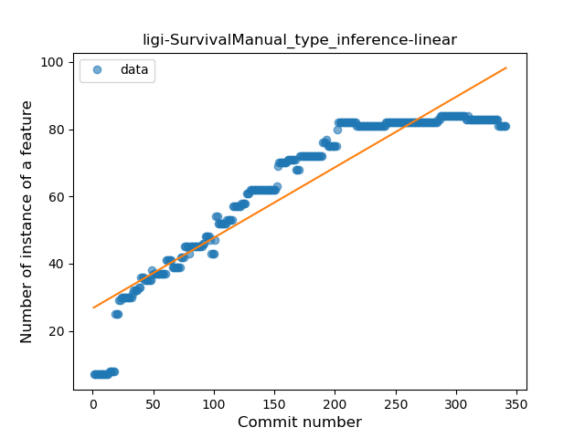
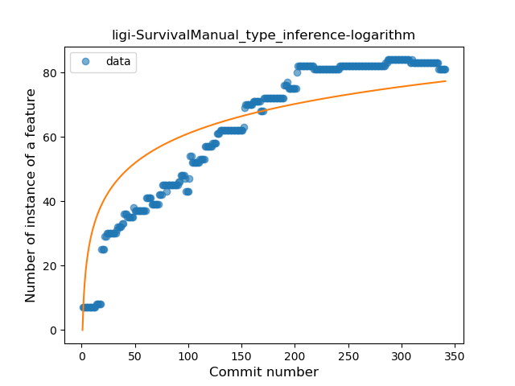
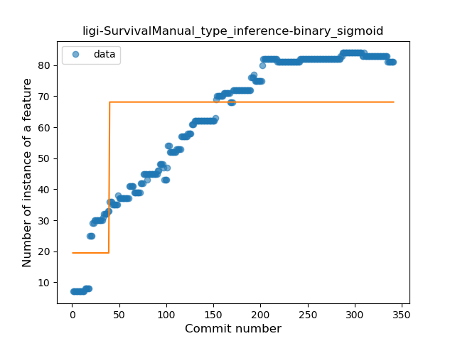
### <a name="lambda">Lambda</a>
----
#### Functions
* **Constant Rise - Linear:** 
    * **R_Squared:** 0.94990156
* **Sudden Rise Plateau - Logarithm:** 
    * **R_Squared:** 0.53227029

**Plots** :chart_with_upwards_trend:
-----

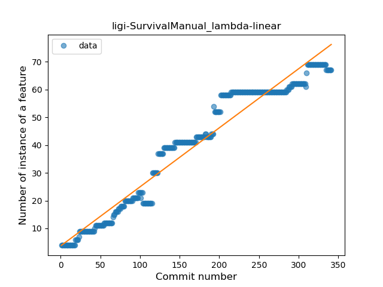
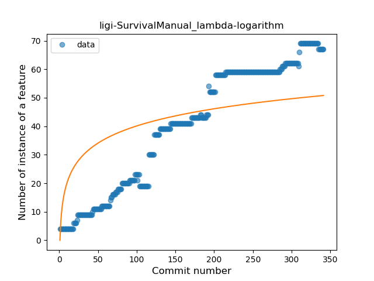
### <a name="safe_call">Safe Call</a>
----
#### Functions
* **Sudden Rise Plateau - Logarithm:** 
    * **R_Squared:** 0.59404083
* **Constant Rise - Linear:** 
    * **R_Squared:** 0.58198379

**Plots** :chart_with_upwards_trend:
-----

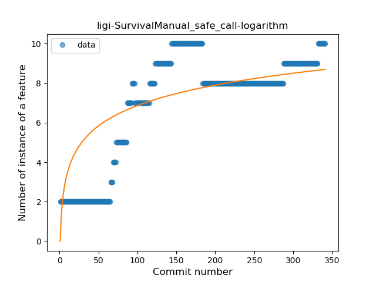
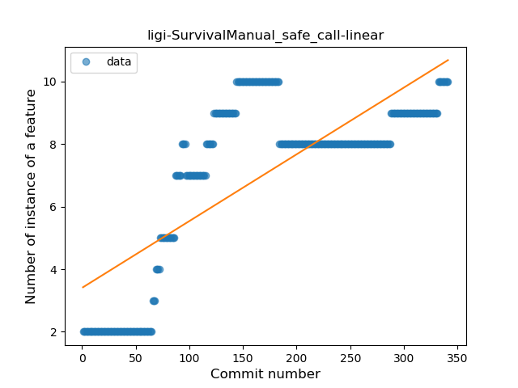
### <a name="when_expr">When expression</a>
----
#### Functions
* **Plateau Gradual Rise - Sigmoid:** 
    * **R_Squared:** 0.7434655
* **Sudden Rise Plateau - Logarithm:** 
    * **R_Squared:** 0.56180248
* **Constant Rise - Linear:** 
    * **R_Squared:** 0.26792996

**Plots** :chart_with_upwards_trend:
-----

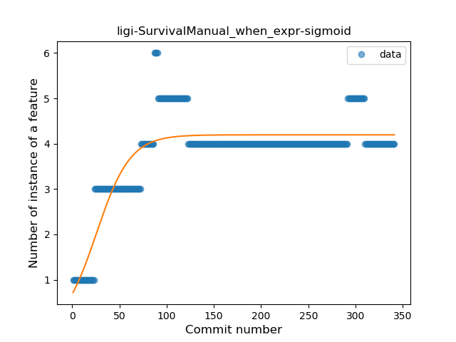
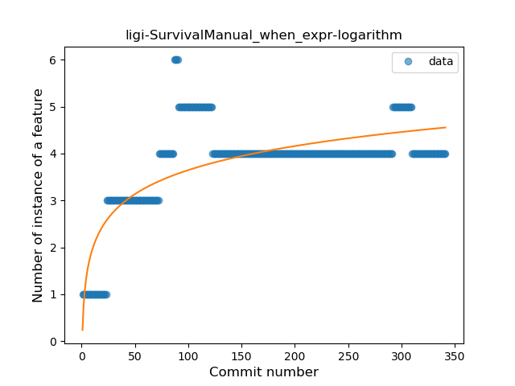
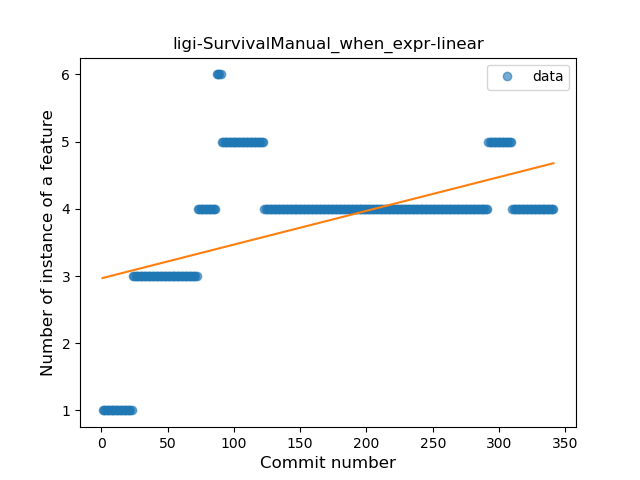
### <a name="unsafe_call">Unsafe Call</a>
----
#### Functions
* **Constant Rise - Linear:** 
    * **R_Squared:** 0.93174197
* **Sudden Rise Plateau - Logarithm:** 
    * **R_Squared:** 0.6156732

**Plots** :chart_with_upwards_trend:
-----

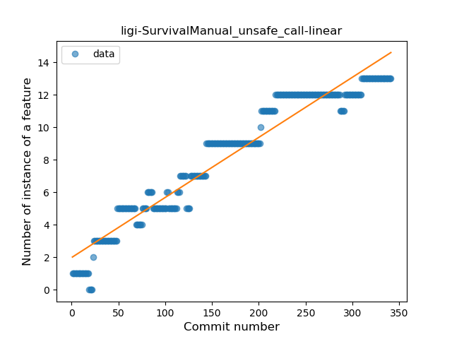
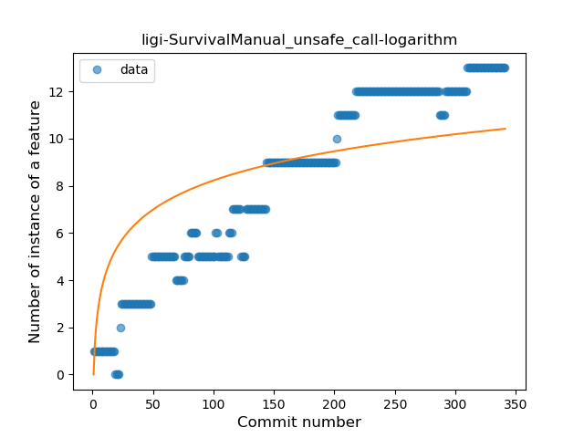
### <a name="string_template">String Template</a>
----
#### Functions
* **Plateau Gradual Rise - Sigmoid:** 
    * **R_Squared:** 0.95072192
* **Constant Rise - Linear:** 
    * **R_Squared:** 0.91829138
* **Sudden Rise Plateau - Logarithm:** 
    * **R_Squared:** 0.45763951

**Plots** :chart_with_upwards_trend:
-----

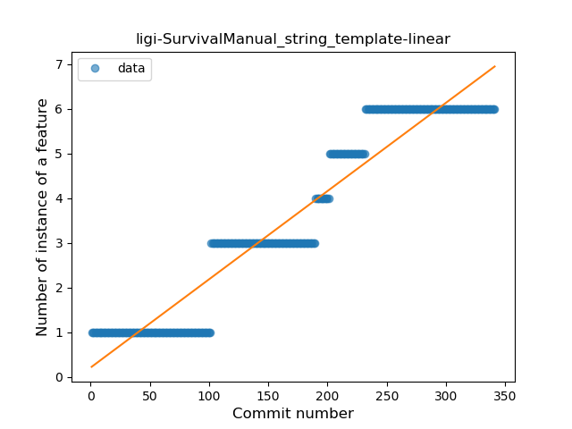
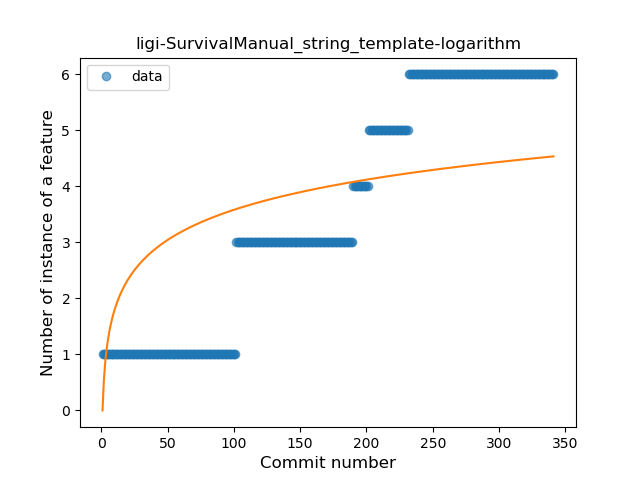
### <a name="func_with_default_value">Function with Default Value</a>
----
#### Functions
* **Plateau Sudden Rise - Binary Sigmoid:** 
    * **R_Squared:** 1.0
* **Constant Rise - Linear:** 
    * **R_Squared:** 0.64802391
* **Sudden Rise Plateau - Logarithm:** 
    * **R_Squared:** 0.63114399

**Plots** :chart_with_upwards_trend:
-----

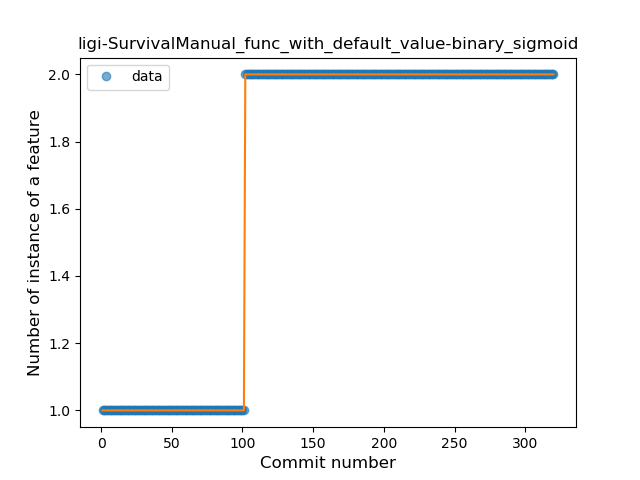
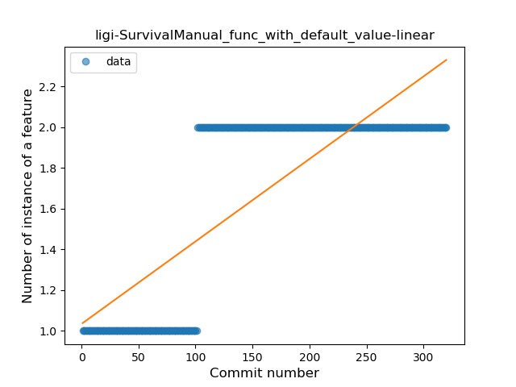
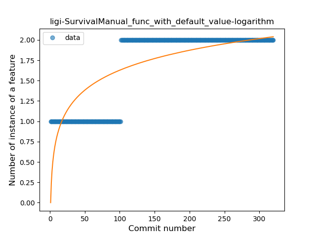
### <a name="singleton">Singleton</a>
----
#### Functions
* **Plateau Gradual Rise - Sigmoid:** 
    * **R_Squared:** 0.41946696
* **Sudden Rise Plateau - Logarithm:** 
    * **R_Squared:** 0.2449022
* **Constant Rise - Linear:** 
    * **R_Squared:** 0.11121213

**Plots** :chart_with_upwards_trend:
-----

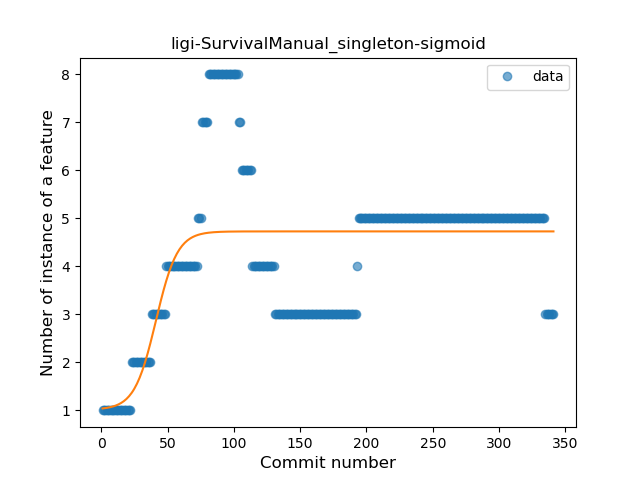
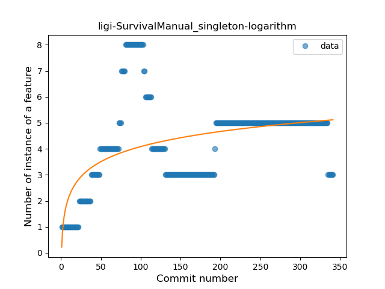
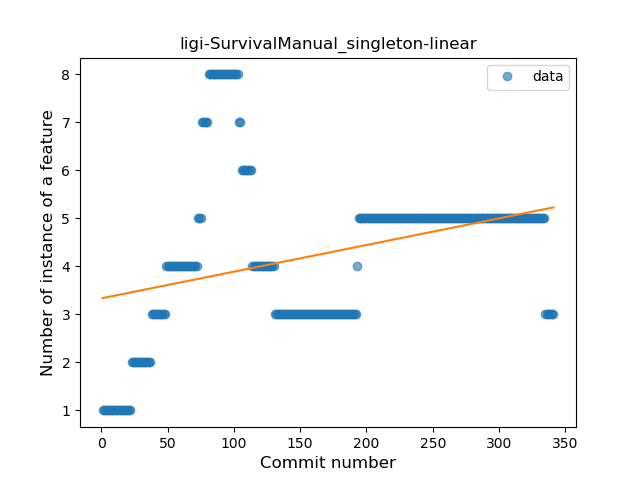
### <a name="smart_cast">Smart Cast</a>
----
#### Functions
* **Plateau Sudden Rise - Binary Sigmoid:** 
    * **R_Squared:** 1.0
* **Sudden Rise Plateau - Logarithm:** 
    * **R_Squared:** 0.49100603
* **Constant Rise - Linear:** 
    * **R_Squared:** 0.16479453

**Plots** :chart_with_upwards_trend:
-----

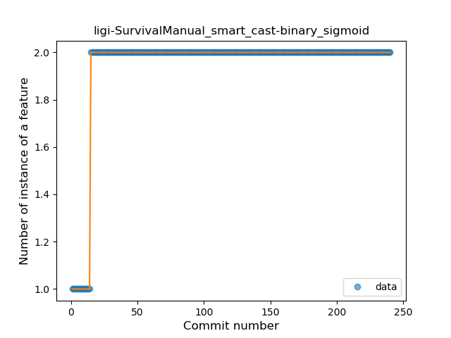
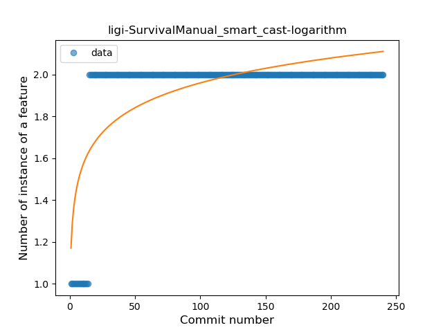
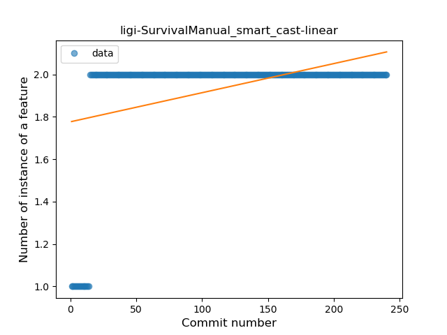
### <a name="range_expr">Range Expression</a>
----
#### Functions
* **Plateau Sudden Rise - Binary Sigmoid:** 
    * **R_Squared:** 1.0
* **Sudden Rise Plateau - Logarithm:** 
    * **R_Squared:** 0.49100603
* **Constant Rise - Linear:** 
    * **R_Squared:** 0.16479453

**Plots** :chart_with_upwards_trend:
-----

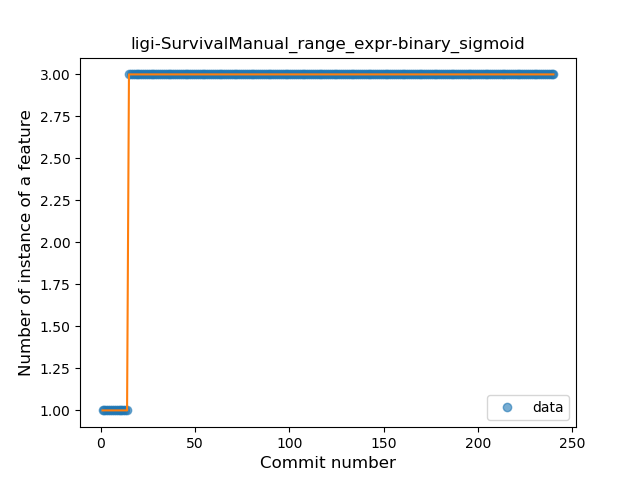

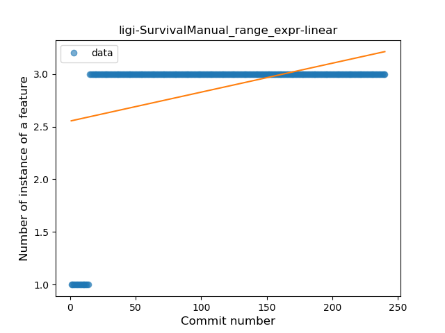
### <a name="func_call_with_named_arg">Function call with Named Argument</a>
----
#### Functions
* **Constant Decline - Linear:** 
    * **R_Squared:** 0.03373221
* **Sudden Rise Plateau - Logarithm:** 
    * **R_Squared:** 0.00725236

**Plots** :chart_with_upwards_trend:
-----

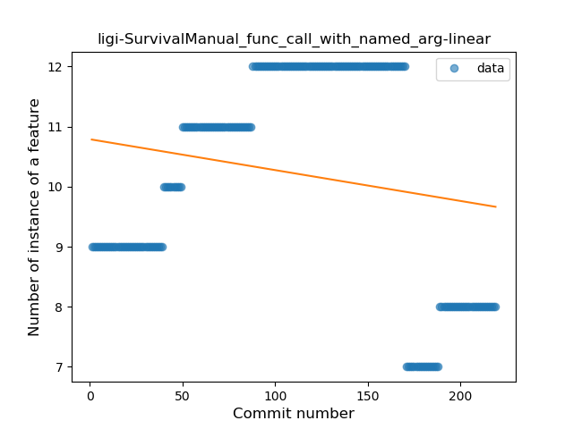
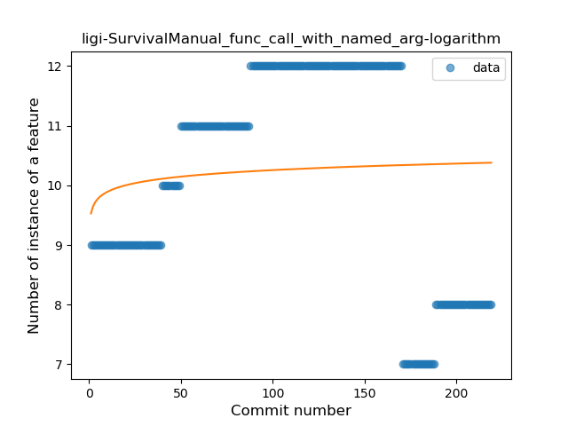
### <a name="data_class">Data Class</a>
----
#### Functions
* **Plateau Sudden Rise - Binary Sigmoid:** 
    * **R_Squared:** 1.0
* **Constant Rise - Linear:** 
    * **R_Squared:** 0.67389134
* **Sudden Rise Plateau - Logarithm:** 
    * **R_Squared:** 0.62523834

**Plots** :chart_with_upwards_trend:
-----

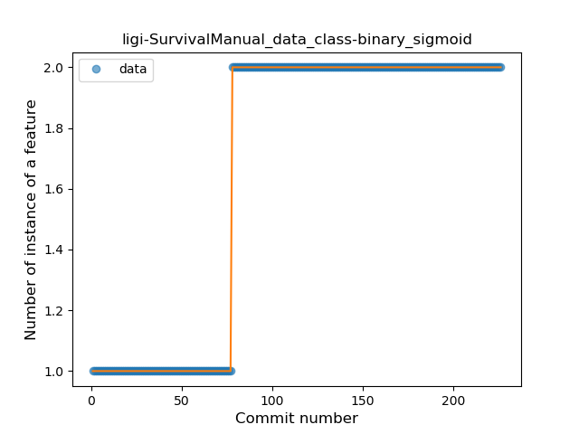
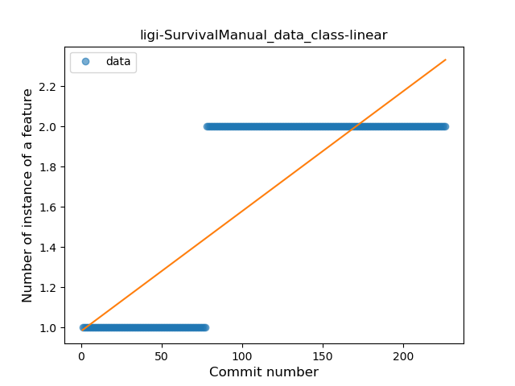
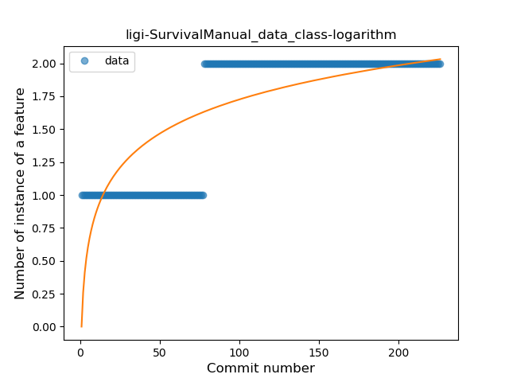
### <a name="extension_function">Extension Function</a>
----
#### Functions
* **Plateau Gradual Rise - Sigmoid:** 
    * **R_Squared:** 0.97326296
* **Constant Rise - Linear:** 
    * **R_Squared:** 0.76924856
* **Sudden Rise Plateau - Logarithm:** 
    * **R_Squared:** 0.61470124

**Plots** :chart_with_upwards_trend:
-----

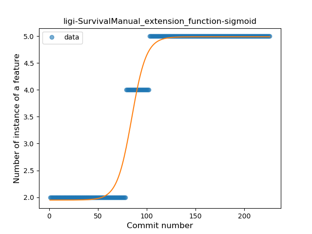
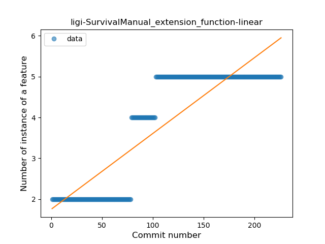
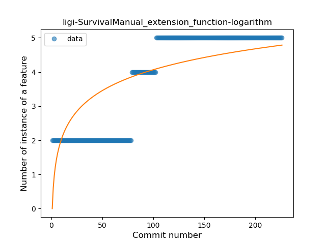
### <a name="property_delegation">Property Delegation</a>
----
#### Functions
* **Constant Rise - Linear:** 
    * **R_Squared:** 0.8886182
* **Sudden Rise Plateau - Logarithm:** 
    * **R_Squared:** 0.74470906

**Plots** :chart_with_upwards_trend:
-----

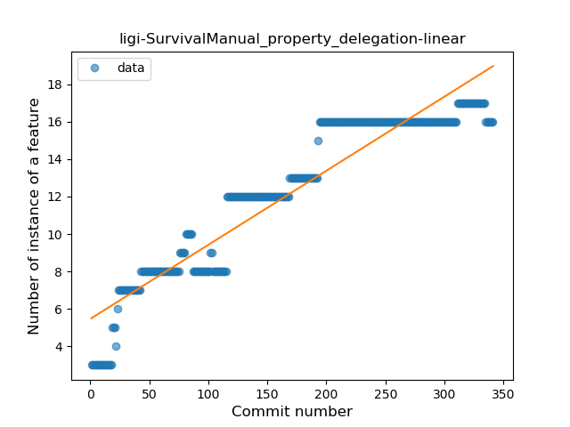
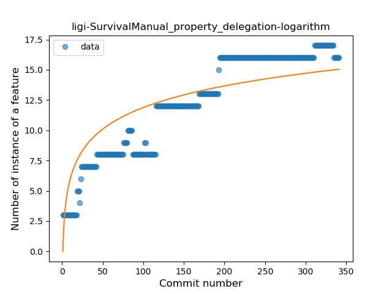
