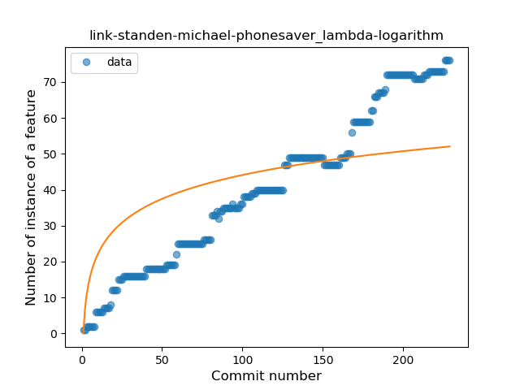
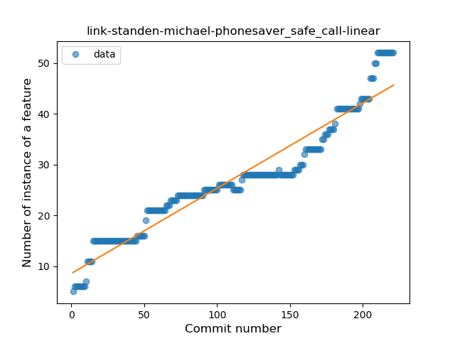
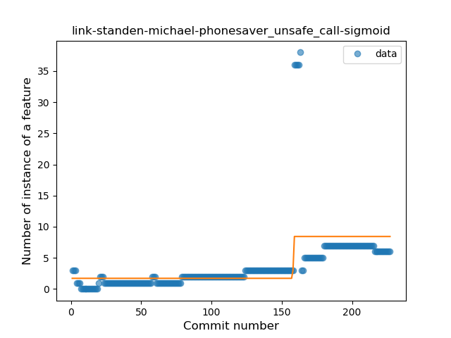
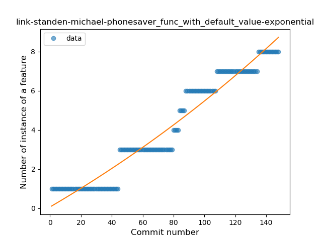
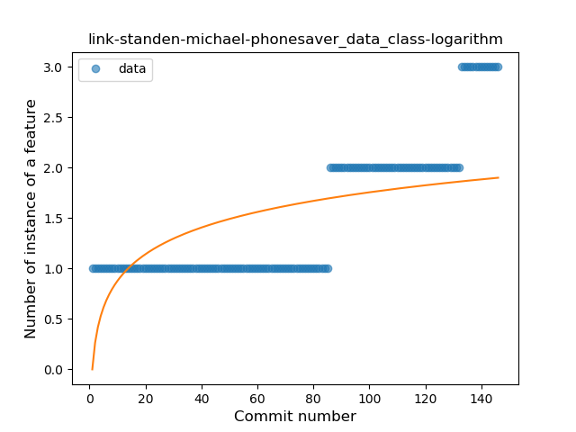

## link-standen-michael-phonesaver
----
#### Metrics provided by Detekt
* Number of lines of code 2020
* Number of Kotlin files: 22
* Cyclomatic complexity: 300
* Cyclomatic complexity by thousands of lines: 305 

----
**11** features analyzed

*	<a href="#type_inference">Type Inference</a> 
*	<a href="#lambda">Lambda</a> 
*	<a href="#safe_call">Safe Call</a> 
*	<a href="#when_expr">When expression</a> 
*	<a href="#unsafe_call">Unsafe Call</a> 
*	<a href="#companion_object">Companion Object</a> 
*	<a href="#string_template">String Template</a> 
*	<a href="#func_with_default_value">Function with Default Value</a> 
*	<a href="#singleton">Singleton</a> 
*	<a href="#smart_cast">Smart Cast</a> 
*	<a href="#data_class">Data Class</a> 

### <a name="type_inference">Type Inference</a>
----
#### Functions
* **Constant Rise - Linear:** 
    * **R_Squared:** 0.96136533
* **Sudden Rise - Exponential:** 
    * **R_Squared:** 0.9634301
* **Sudden Rise Plateau - Logarithm:** 
    * **R_Squared:** 0.61951876
* **Plateau Gradual Rise - Sigmoid:** 
    * **R_Squared:** 0.49948582

**Plots** :chart_with_upwards_trend:
-----

### <a name="lambda">Lambda</a>
----
#### Functions
* **Constant Rise - Linear:** 
    * **R_Squared:** 0.98111674
* **Sudden Rise Plateau - Logarithm:** 
    * **R_Squared:** 0.55997267

**Plots** :chart_with_upwards_trend:
-----

### <a name="safe_call">Safe Call</a>
----
#### Functions
* **Sudden Rise - Exponential:** 
    * **R_Squared:** 0.94055067
* **Constant Rise - Linear:** 
    * **R_Squared:** 0.92173765
* **Sudden Rise Plateau - Logarithm:** 
    * **R_Squared:** 0.62641827

**Plots** :chart_with_upwards_trend:
-----

### <a name="when_expr">When expression</a>
----
#### Functions
* **Plateau Gradual Rise - Sigmoid:** 
    * **R_Squared:** 0.98587494
* **Sudden Rise - Exponential:** 
    * **R_Squared:** 0.82315183
* **Constant Rise - Linear:** 
    * **R_Squared:** 0.80274005
* **Sudden Rise Plateau - Logarithm:** 
    * **R_Squared:** 0.35665475

**Plots** :chart_with_upwards_trend:
-----

### <a name="unsafe_call">Unsafe Call</a>
----
#### Functions
* **Plateau Gradual Rise - Sigmoid:** 
    * **R_Squared:** 0.32913614
* **Constant Rise - Linear:** 
    * **R_Squared:** 0.22264338
* **Sudden Rise - Exponential:** 
    * **R_Squared:** 0.22355507
* **Sudden Rise Plateau - Logarithm:** 
    * **R_Squared:** 0.09155848

**Plots** :chart_with_upwards_trend:
-----

### <a name="companion_object">Companion Object</a>
----
#### Functions
* **Plateau Gradual Rise - Sigmoid:** 
    * **R_Squared:** 0.88337354
* **Sudden Rise - Exponential:** 
    * **R_Squared:** 0.69282337
* **Constant Rise - Linear:** 
    * **R_Squared:** 0.5480199
* **Sudden Rise Plateau - Logarithm:** 
    * **R_Squared:** 0.31136823

**Plots** :chart_with_upwards_trend:
-----

### <a name="string_template">String Template</a>
----
#### Functions
* **Sudden Rise - Exponential:** 
    * **R_Squared:** 0.96596154
* **Plateau Gradual Rise - Sigmoid:** 
    * **R_Squared:** 0.97042494
* **Constant Rise - Linear:** 
    * **R_Squared:** 0.94559465
* **Sudden Rise Plateau - Logarithm:** 
    * **R_Squared:** 0.39232442

**Plots** :chart_with_upwards_trend:
-----

### <a name="func_with_default_value">Function with Default Value</a>
----
#### Functions
* **Plateau Gradual Rise - Sigmoid:** 
    * **R_Squared:** 0.96580856
* **Constant Rise - Linear:** 
    * **R_Squared:** 0.94042609
* **Sudden Rise - Exponential:** 
    * **R_Squared:** 0.94434147
* **Sudden Rise Plateau - Logarithm:** 
    * **R_Squared:** 0.47427698

**Plots** :chart_with_upwards_trend:
-----

### <a name="singleton">Singleton</a>
----
#### Functions
* **Sudden Rise - Exponential:** 
    * **R_Squared:** 0.88819616
* **Constant Rise - Linear:** 
    * **R_Squared:** 0.22354549
* **Sudden Rise Plateau - Logarithm:** 
    * **R_Squared:** 0.11672679
* **Plateau Sudden Rise - Binary Sigmoid:** 
    * **R_Squared:** 0.03591327

**Plots** :chart_with_upwards_trend:
-----

### <a name="smart_cast">Smart Cast</a>
----
#### Functions
* **Sudden Rise - Exponential:** 
    * **R_Squared:** 0.74229638
* **Constant Rise - Linear:** 
    * **R_Squared:** 0.21642188
* **Plateau Sudden Decline - Binary Sigmoid:** 
    * **R_Squared:** 0.08706053
* **Sudden Rise Plateau - Logarithm:** 
    * **R_Squared:** 0.01536818

**Plots** :chart_with_upwards_trend:
-----

### <a name="data_class">Data Class</a>
----
#### Functions
* **Sudden Rise - Exponential:** 
    * **R_Squared:** 0.86607394
* **Plateau Gradual Rise - Sigmoid:** 
    * **R_Squared:** 0.86863026
* **Constant Rise - Linear:** 
    * **R_Squared:** 0.7395867
* **Sudden Rise Plateau - Logarithm:** 
    * **R_Squared:** 0.39261527

**Plots** :chart_with_upwards_trend:
-----

