## loloof64-BasicChessEndGamesTrainer
----
#### Metrics provided by Detekt
* Number of lines of code 6391
* Number of Kotlin files: 36
* Cyclomatic complexity: 1068
* Cyclomatic complexity by thousands of lines: 271 

----
**17** features analyzed

*	<a href="#type_inference">Type Inference</a> 
*	<a href="#lambda">Lambda</a> 
*	<a href="#safe_call">Safe Call</a> 
*	<a href="#when_expr">When expression</a> 
*	<a href="#companion_object">Companion Object</a> 
*	<a href="#unsafe_call">Unsafe Call</a> 
*	<a href="#string_template">String Template</a> 
*	<a href="#func_with_default_value">Function with Default Value</a> 
*	<a href="#singleton">Singleton</a> 
*	<a href="#smart_cast">Smart Cast</a> 
*	<a href="#range_expr">Range Expression</a> 
*	<a href="#func_call_with_named_arg">Function call with Named Argument</a> 
*	<a href="#data_class">Data Class</a> 
*	<a href="#extension_function">Extension Function</a> 
*	<a href="#property_delegation">Property Delegation</a> 
*	<a href="#destructuring_declaration">Destructuring Declaration</a> 
*	<a href="#overloaded_op">Overloaded Operator</a> 

### <a name="type_inference">Type Inference</a>
----
#### Functions
* **Sudden Rise - Exponential:** 
    * **R_Squared:** 0.91306767
* **Constant Rise - Linear:** 
    * **R_Squared:** 0.85901457
* **Sudden Rise Plateau - Logarithm:** 
    * **R_Squared:** 0.52605793

**Plots** :chart_with_upwards_trend:
-----

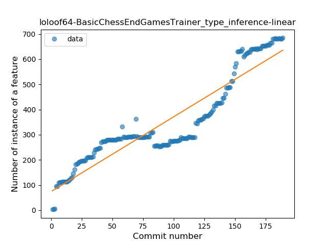
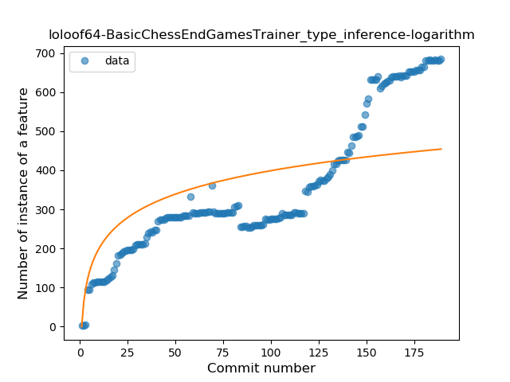
### <a name="lambda">Lambda</a>
----
#### Functions
* **Constant Rise - Linear:** 
    * **R_Squared:** 0.97520037
* **Sudden Rise - Exponential:** 
    * **R_Squared:** 0.98487843
* **Plateau Sudden Rise - Binary Sigmoid:** 
    * **R_Squared:** 0.51184653
* **Sudden Rise Plateau - Logarithm:** 
    * **R_Squared:** 0.48774078

**Plots** :chart_with_upwards_trend:
-----

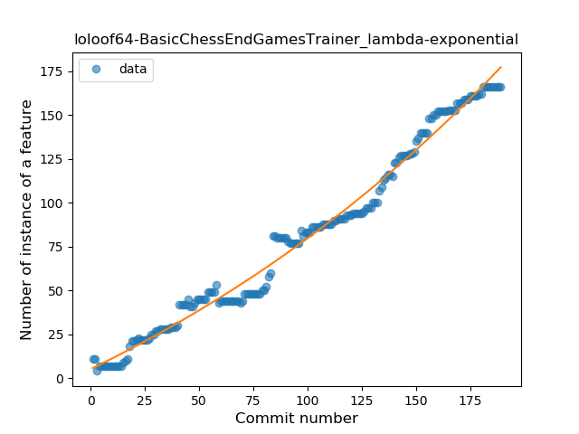
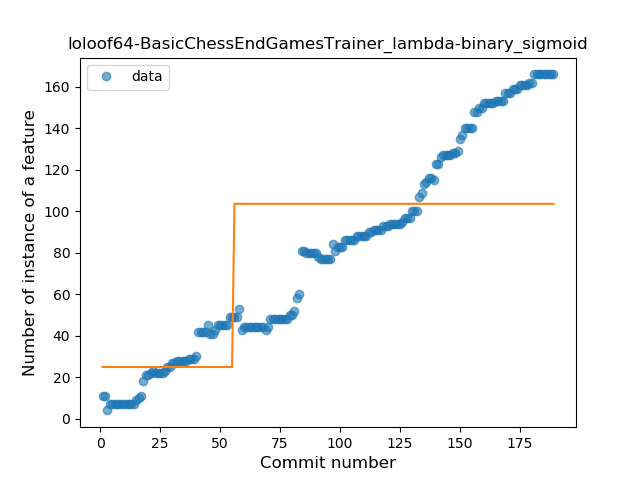
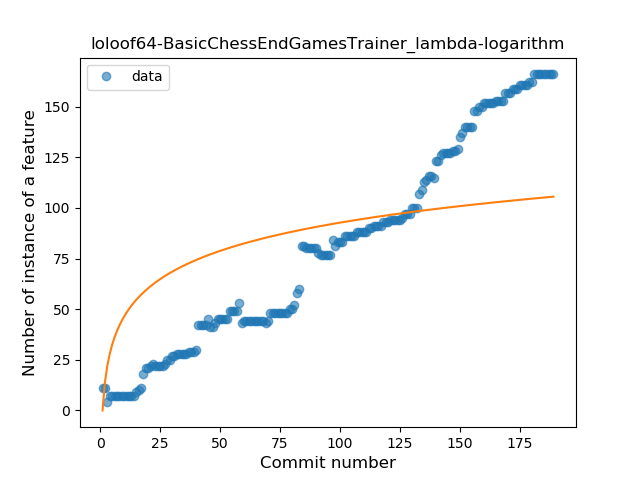
### <a name="safe_call">Safe Call</a>
----
#### Functions
* **Sudden Rise - Exponential:** 
    * **R_Squared:** 0.91749516
* **Constant Rise - Linear:** 
    * **R_Squared:** 0.90188025
* **Plateau Sudden Rise - Binary Sigmoid:** 
    * **R_Squared:** 0.58146305
* **Sudden Rise Plateau - Logarithm:** 
    * **R_Squared:** 0.40805288

**Plots** :chart_with_upwards_trend:
-----

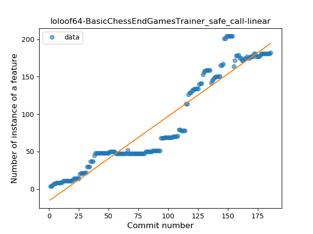
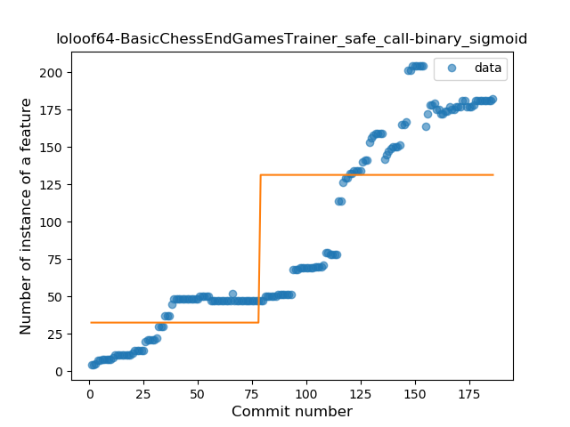
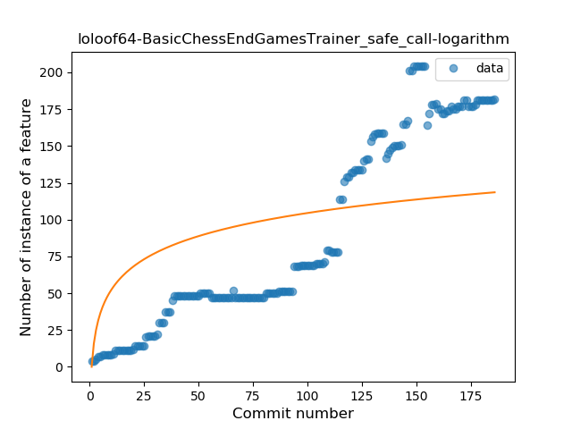
### <a name="when_expr">When expression</a>
----
#### Functions
* **Sudden Rise - Exponential:** 
    * **R_Squared:** 0.89830127
* **Constant Rise - Linear:** 
    * **R_Squared:** 0.84906281
* **Sudden Rise Plateau - Logarithm:** 
    * **R_Squared:** 0.50420712
* **Plateau Sudden Rise - Binary Sigmoid:** 
    * **R_Squared:** 0.32115146

**Plots** :chart_with_upwards_trend:
-----

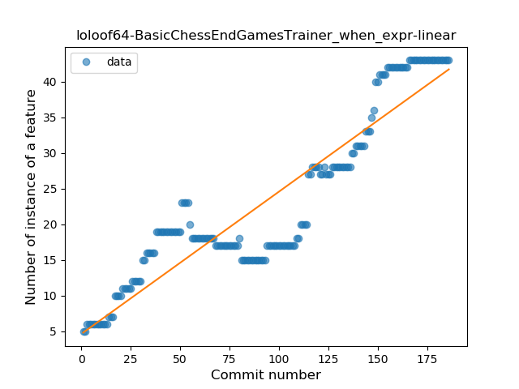
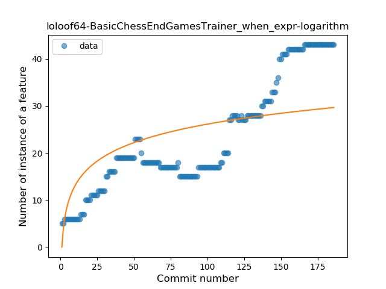
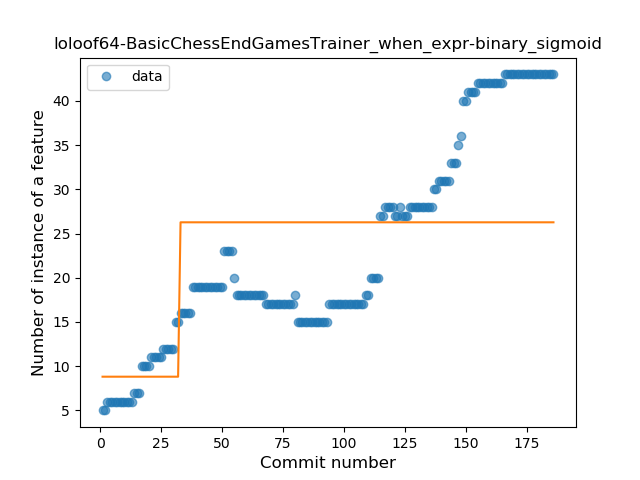
### <a name="companion_object">Companion Object</a>
----
#### Functions
* **Plateau Gradual Rise - Sigmoid:** 
    * **R_Squared:** 0.93523305
* **Sudden Rise - Exponential:** 
    * **R_Squared:** 0.88804438
* **Constant Rise - Linear:** 
    * **R_Squared:** 0.8724157
* **Sudden Rise Plateau - Logarithm:** 
    * **R_Squared:** 0.45237172

**Plots** :chart_with_upwards_trend:
-----

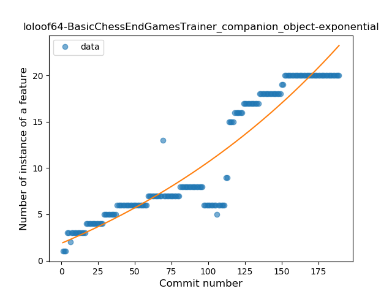
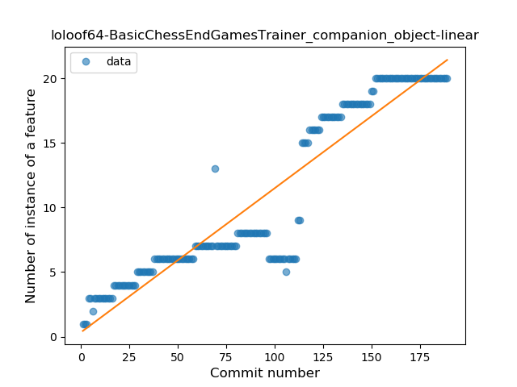
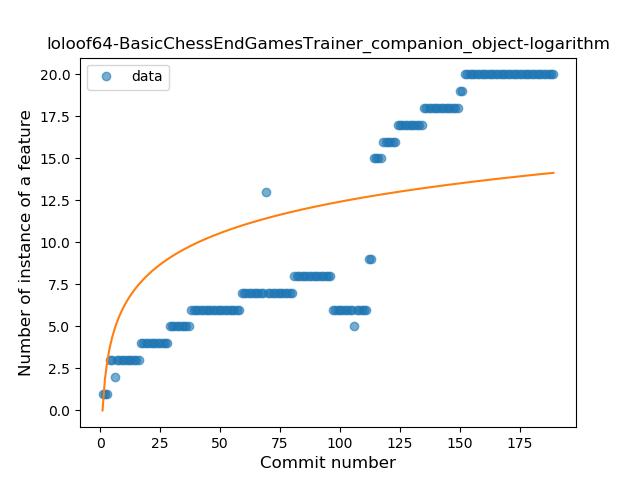
### <a name="unsafe_call">Unsafe Call</a>
----
#### Functions
* **Sudden Rise - Exponential:** 
    * **R_Squared:** 0.92604757
* **Constant Rise - Linear:** 
    * **R_Squared:** 0.77138806
* **Sudden Rise Plateau - Logarithm:** 
    * **R_Squared:** 0.31839833

**Plots** :chart_with_upwards_trend:
-----

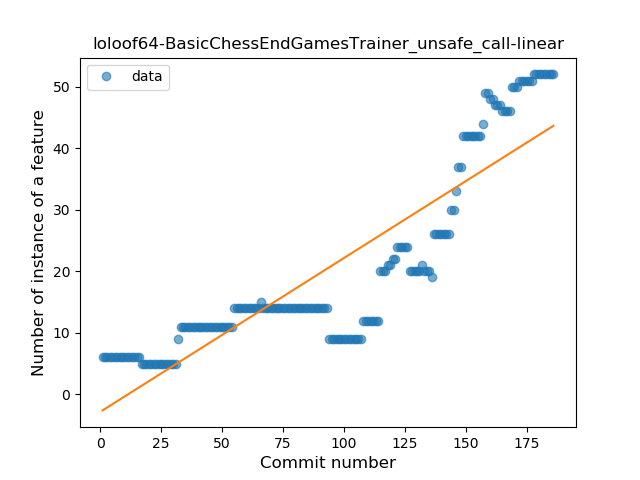
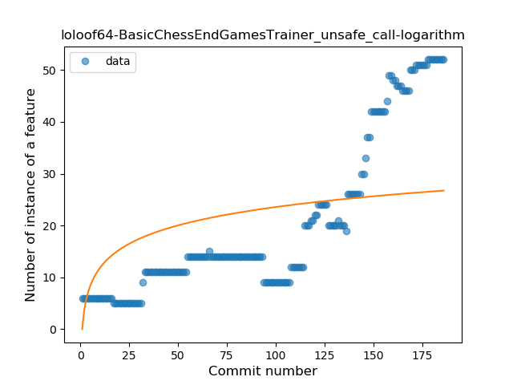
### <a name="string_template">String Template</a>
----
#### Functions
* **Sudden Rise - Exponential:** 
    * **R_Squared:** 0.8220661
* **Constant Rise - Linear:** 
    * **R_Squared:** 0.65984491
* **Sudden Rise Plateau - Logarithm:** 
    * **R_Squared:** 0.36843729
* **Plateau Gradual Rise - Sigmoid:** 
    * **R_Squared:** 0.13807201

**Plots** :chart_with_upwards_trend:
-----

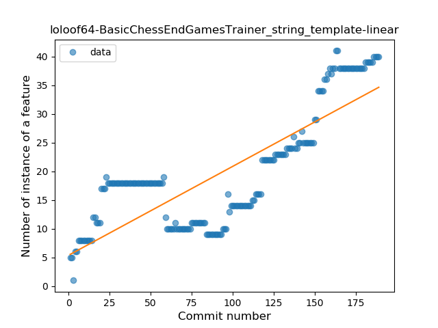
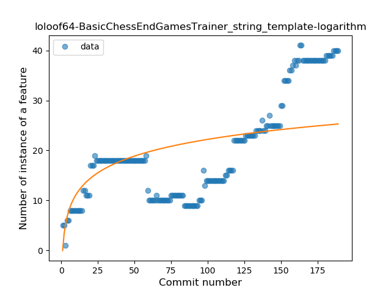
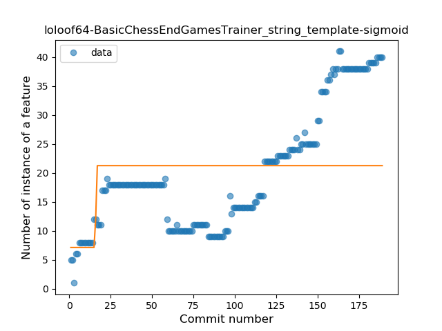
### <a name="func_with_default_value">Function with Default Value</a>
----
#### Functions
* **Plateau Gradual Rise - Sigmoid:** 
    * **R_Squared:** 0.98233567
* **Sudden Rise - Exponential:** 
    * **R_Squared:** 0.82138951
* **Constant Rise - Linear:** 
    * **R_Squared:** 0.58268466
* **Sudden Rise Plateau - Logarithm:** 
    * **R_Squared:** 0.20565784

**Plots** :chart_with_upwards_trend:
-----

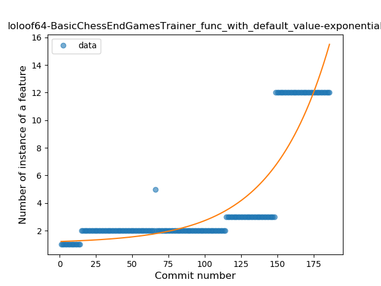
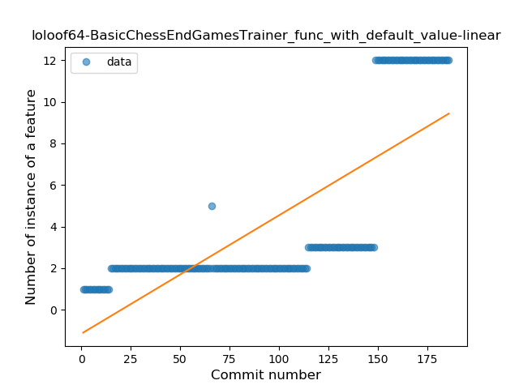
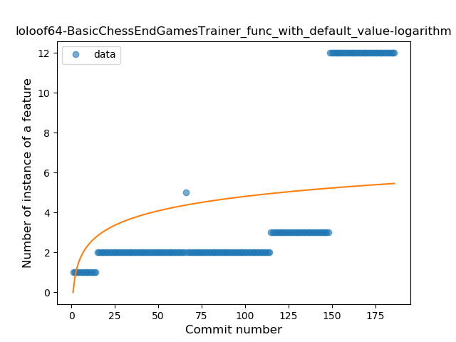
### <a name="singleton">Singleton</a>
----
#### Functions
* **Plateau Gradual Rise - Sigmoid:** 
    * **R_Squared:** 0.97762514
* **Constant Rise - Linear:** 
    * **R_Squared:** 0.92904745
* **Sudden Rise Plateau - Logarithm:** 
    * **R_Squared:** 0.42330942

**Plots** :chart_with_upwards_trend:
-----

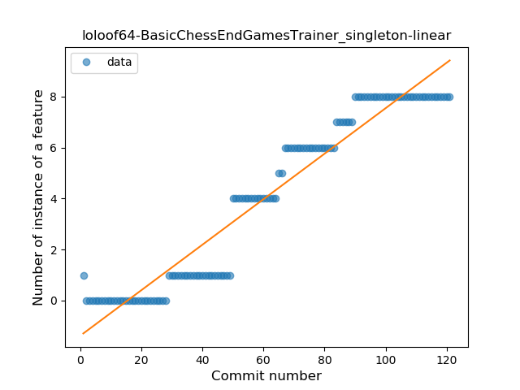
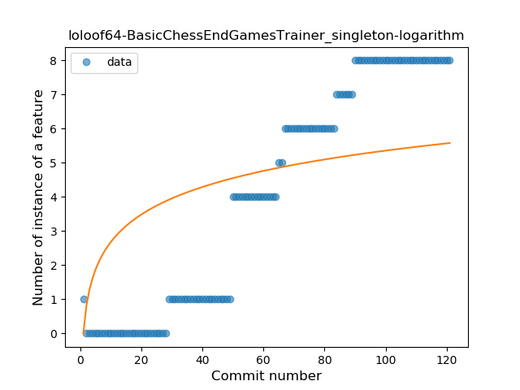
### <a name="smart_cast">Smart Cast</a>
----
#### Functions
* **Plateau Gradual Rise - Sigmoid:** 
    * **R_Squared:** 0.95785662
* **Sudden Rise - Exponential:** 
    * **R_Squared:** 0.84158318
* **Constant Rise - Linear:** 
    * **R_Squared:** 0.81485685
* **Sudden Rise Plateau - Logarithm:** 
    * **R_Squared:** 0.37356133

**Plots** :chart_with_upwards_trend:
-----

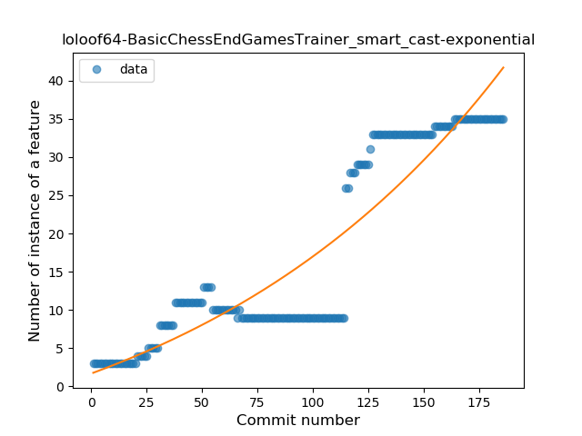
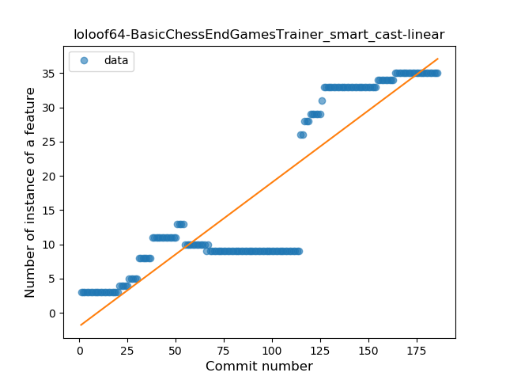
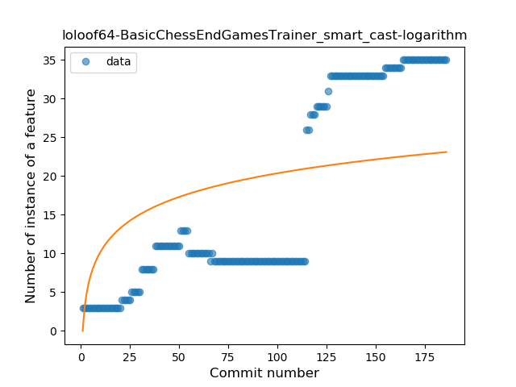
### <a name="range_expr">Range Expression</a>
----
#### Functions
* **Constant Rise - Linear:** 
    * **R_Squared:** 0.91295815
* **Sudden Rise Plateau - Logarithm:** 
    * **R_Squared:** 0.72412732
* **Plateau Sudden Rise - Binary Sigmoid:** 
    * **R_Squared:** 0.34422569

**Plots** :chart_with_upwards_trend:
-----

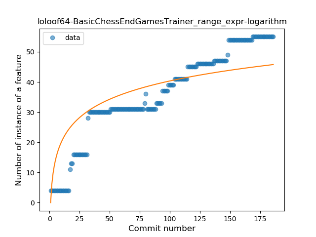
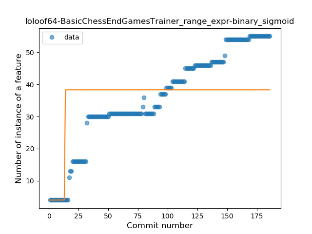
### <a name="func_call_with_named_arg">Function call with Named Argument</a>
----
#### Functions
* **Sudden Rise - Exponential:** 
    * **R_Squared:** 0.91477499
* **Constant Rise - Linear:** 
    * **R_Squared:** 0.76997484
* **Plateau Sudden Rise - Binary Sigmoid:** 
    * **R_Squared:** 0.33229675
* **Sudden Rise Plateau - Logarithm:** 
    * **R_Squared:** 0.29581808

**Plots** :chart_with_upwards_trend:
-----

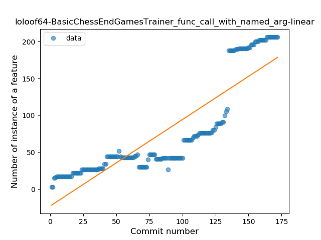
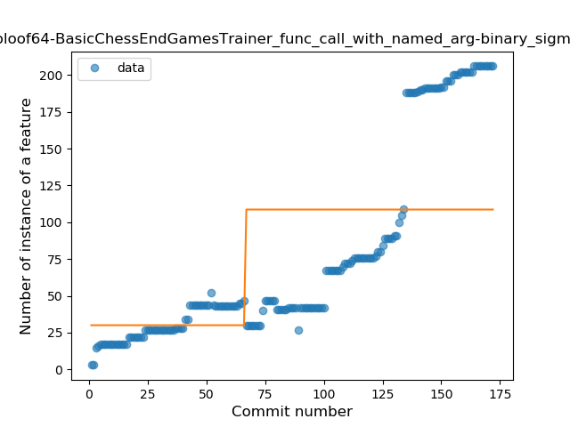
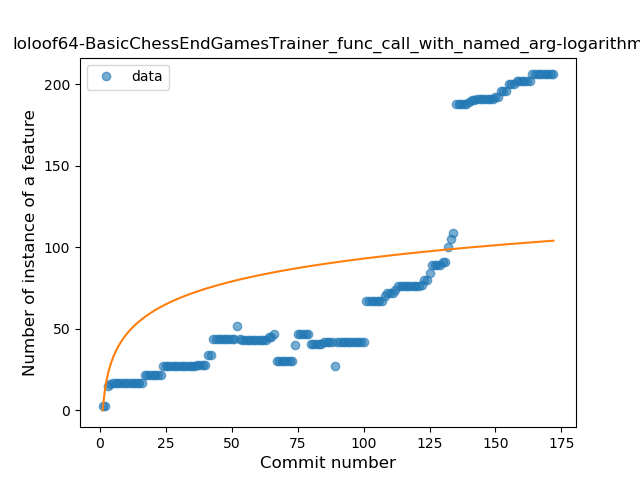
### <a name="data_class">Data Class</a>
----
#### Functions
* **Plateau Gradual Rise - Sigmoid:** 
    * **R_Squared:** 0.96990864
* **Sudden Rise - Exponential:** 
    * **R_Squared:** 0.90099945
* **Constant Rise - Linear:** 
    * **R_Squared:** 0.85155085
* **Sudden Rise Plateau - Logarithm:** 
    * **R_Squared:** 0.33751511

**Plots** :chart_with_upwards_trend:
-----

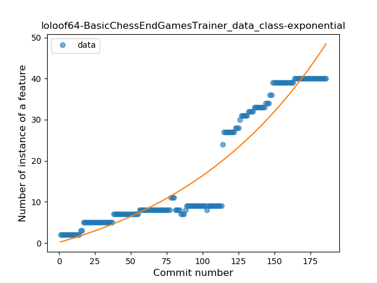
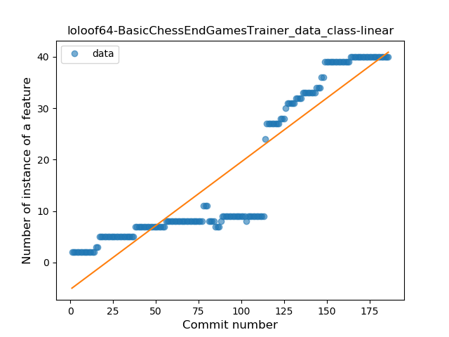
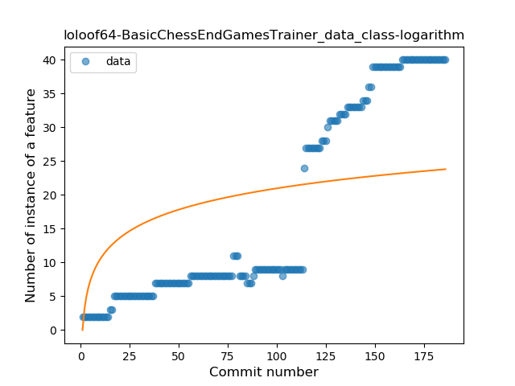
### <a name="extension_function">Extension Function</a>
----
#### Functions
* **Sudden Rise - Exponential:** 
    * **R_Squared:** 0.92253969
* **Constant Rise - Linear:** 
    * **R_Squared:** 0.81912448
* **Sudden Rise Plateau - Logarithm:** 
    * **R_Squared:** 0.41845498
* **Plateau Sudden Rise - Binary Sigmoid:** 
    * **R_Squared:** 0.23646658

**Plots** :chart_with_upwards_trend:
-----

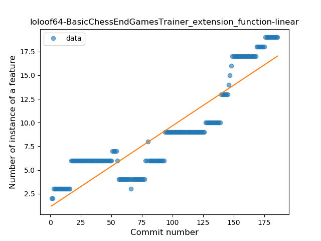
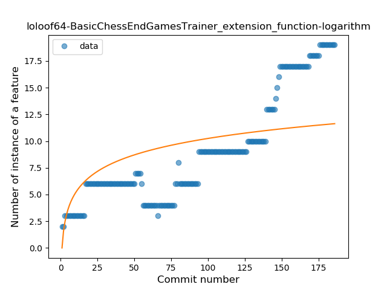
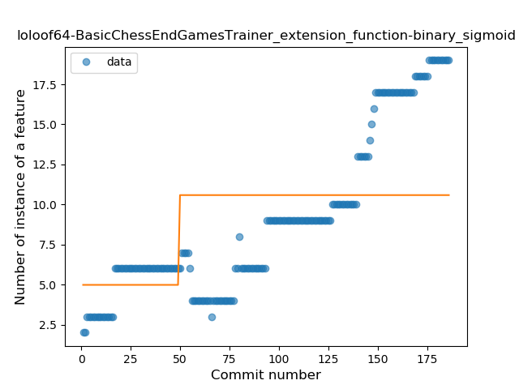
### <a name="property_delegation">Property Delegation</a>
----
#### Functions
* **Sudden Rise - Exponential:** 
    * **R_Squared:** 0.14297037
* **Constant Rise - Linear:** 
    * **R_Squared:** 0.07544883
* **Sudden Rise Plateau - Logarithm:** 
    * **R_Squared:** 0.00063624

**Plots** :chart_with_upwards_trend:
-----

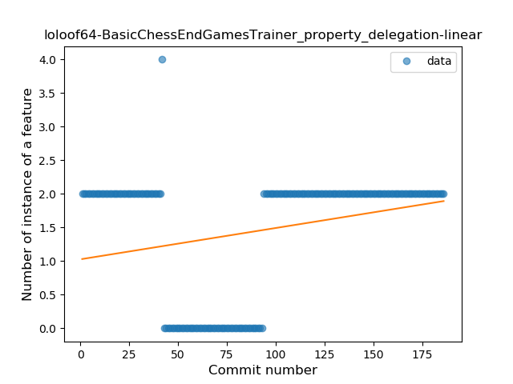

### <a name="destructuring_declaration">Destructuring Declaration</a>
----
#### Functions
* **Constant Decline - Linear:** 
    * **R_Squared:** 0.05678594
* **Sudden Rise Plateau - Logarithm:** 
    * **R_Squared:** -0.0

**Plots** :chart_with_upwards_trend:
-----

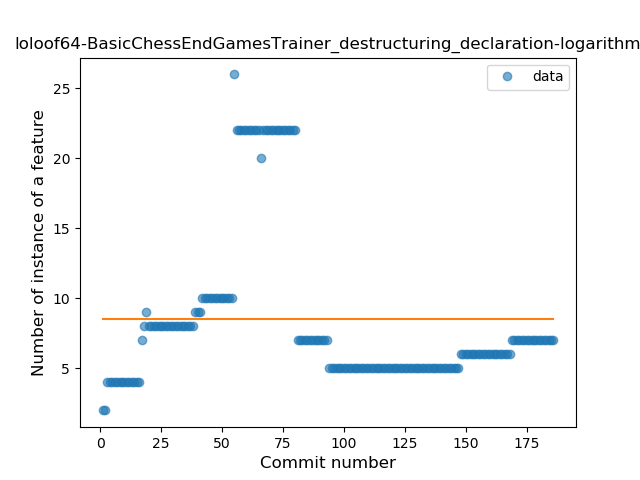
### <a name="overloaded_op">Overloaded Operator</a>
----
#### Functions
* **Sudden Rise Plateau - Logarithm:** 
    * **R_Squared:** 0.83914147
* **Constant Rise - Linear:** 
    * **R_Squared:** 0.53689739

**Plots** :chart_with_upwards_trend:
-----

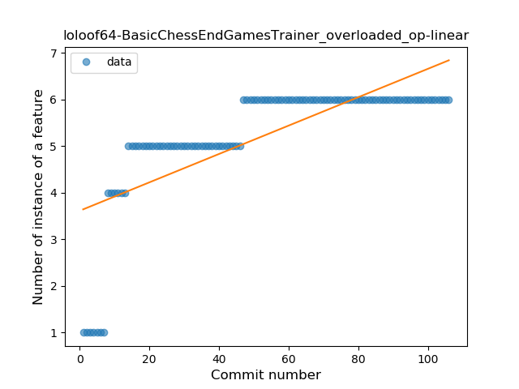
