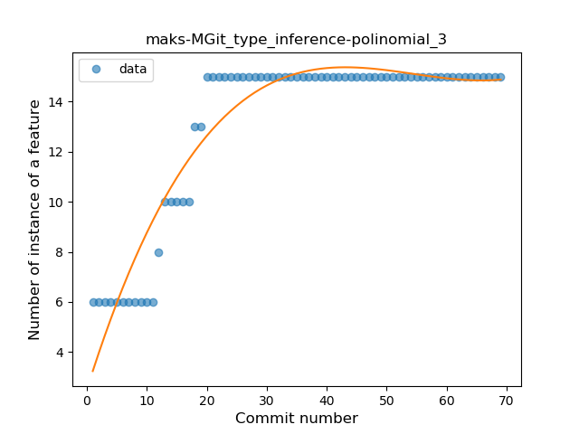
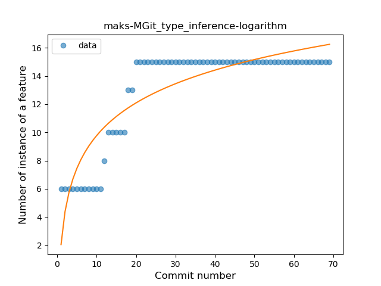
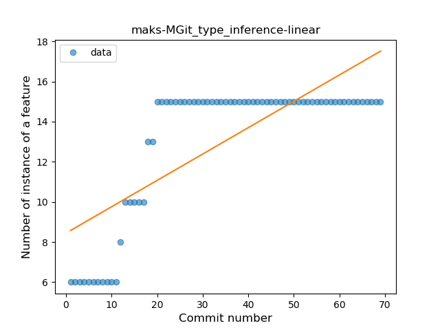
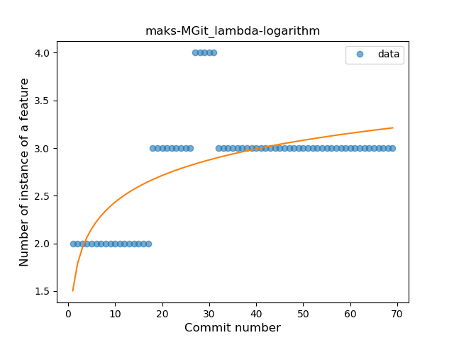
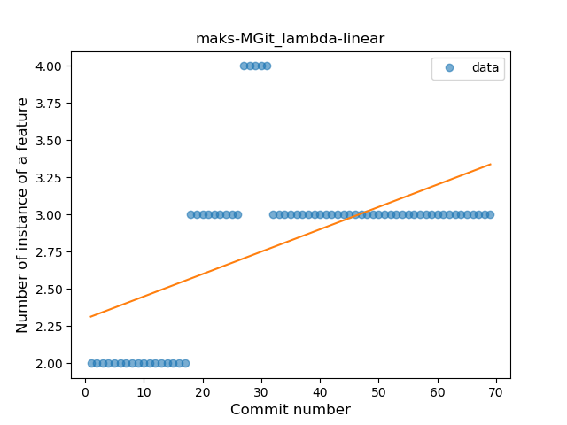
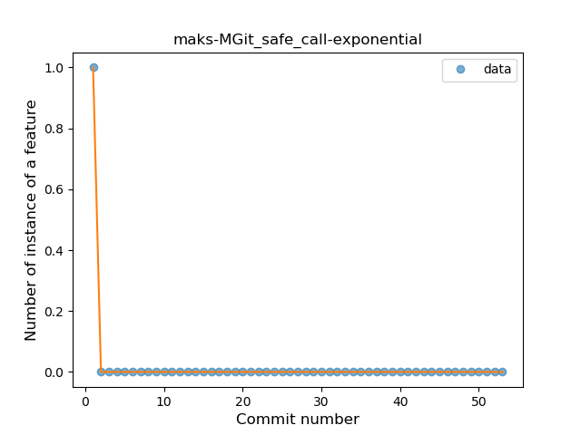
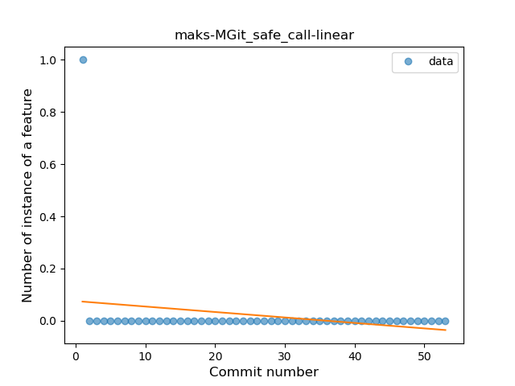
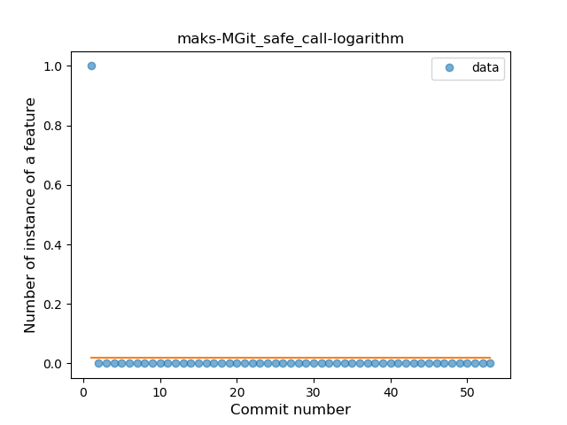

## maks-MGit
----
#### Metrics provided by Detekt
* Number of lines of code 231
* Number of Kotlin files: 8
* Cyclomatic complexity: 31
* Cyclomatic complexity by thousands of lines: 274 

----
**3** features analyzed

*	<a href="#type_inference">Type Inference</a> 
*	<a href="#lambda">Lambda</a> 
*	<a href="#safe_call">Safe Call</a> 

### <a name="type_inference">Type Inference</a>
----
#### Functions
* **Plateau Gradual Rise - Sigmoid:** 
    * **R_Squared:** 0.98386939
* **Instability - Polinomial 3:** )
    * **R_Squared:** 0.90669884
* **Sudden Rise Plateau - Logarithm:** 
    * **R_Squared:** 0.78074276
* **Constant Rise - Linear:** 
    * **R_Squared:** 0.58474838

**Plots** :chart_with_upwards_trend:
-----

### <a name="lambda">Lambda</a>
----
#### Functions
* **Plateau Sudden Rise - Binary Sigmoid:** 
    * **R_Squared:** 0.77352518
* **Sudden Rise Plateau - Logarithm:** 
    * **R_Squared:** 0.45903441
* **Constant Rise - Linear:** 
    * **R_Squared:** 0.31144545

**Plots** :chart_with_upwards_trend:
-----

### <a name="safe_call">Safe Call</a>
----
#### Functions
* **Sudden Decline - Exponential:** 
    * **R_Squared:** 1.0
* **Constant Decline - Linear:** 
    * **R_Squared:** 0.05555556
* **Sudden Rise Plateau - Logarithm:** 
    * **R_Squared:** -0.0

**Plots** :chart_with_upwards_trend:
-----

