## mastizada-focus-android
----
#### Metrics provided by Detekt
* Number of lines of code 3857
* Number of Kotlin files: 42
* Cyclomatic complexity: 482
* Cyclomatic complexity by thousands of lines: 256 

----
**14** features analyzed

*	<a href="#type_inference">Type Inference</a> 
*	<a href="#lambda">Lambda</a> 
*	<a href="#safe_call">Safe Call</a> 
*	<a href="#when_expr">When expression</a> 
*	<a href="#companion_object">Companion Object</a> 
*	<a href="#unsafe_call">Unsafe Call</a> 
*	<a href="#string_template">String Template</a> 
*	<a href="#func_with_default_value">Function with Default Value</a> 
*	<a href="#singleton">Singleton</a> 
*	<a href="#smart_cast">Smart Cast</a> 
*	<a href="#range_expr">Range Expression</a> 
*	<a href="#func_call_with_named_arg">Function call with Named Argument</a> 
*	<a href="#extension_function">Extension Function</a> 
*	<a href="#destructuring_declaration">Destructuring Declaration</a> 

### <a name="type_inference">Type Inference</a>
----
#### Functions
* **Sudden Rise - Exponential:** 
    * **R_Squared:** 0.90902239
* **Constant Rise - Linear:** 
    * **R_Squared:** 0.866224
* **Plateau Sudden Rise - Binary Sigmoid:** 
    * **R_Squared:** 0.45907354
* **Sudden Rise Plateau - Logarithm:** 
    * **R_Squared:** 0.34150604

**Plots** :chart_with_upwards_trend:
-----

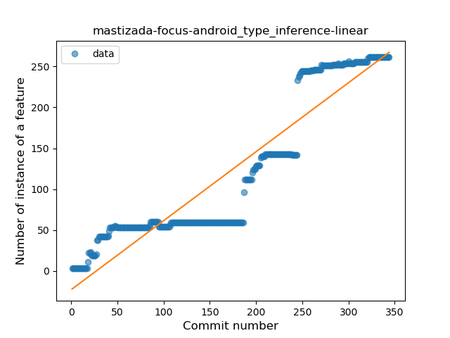
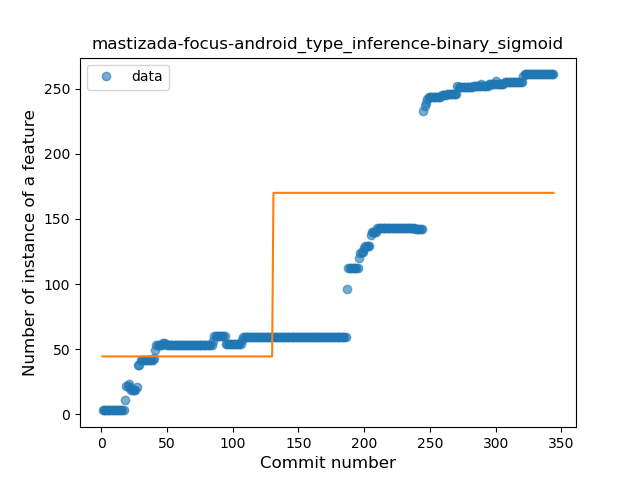
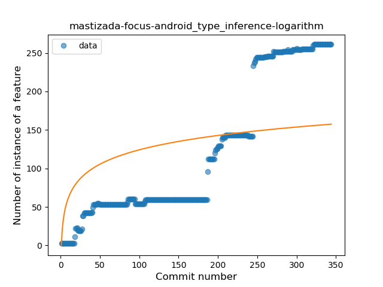
### <a name="lambda">Lambda</a>
----
#### Functions
* **Sudden Rise - Exponential:** 
    * **R_Squared:** 0.86590591
* **Constant Rise - Linear:** 
    * **R_Squared:** 0.85073448
* **Sudden Rise Plateau - Logarithm:** 
    * **R_Squared:** 0.28655907
* **Plateau Sudden Rise - Binary Sigmoid:** 
    * **R_Squared:** 0.1288761

**Plots** :chart_with_upwards_trend:
-----

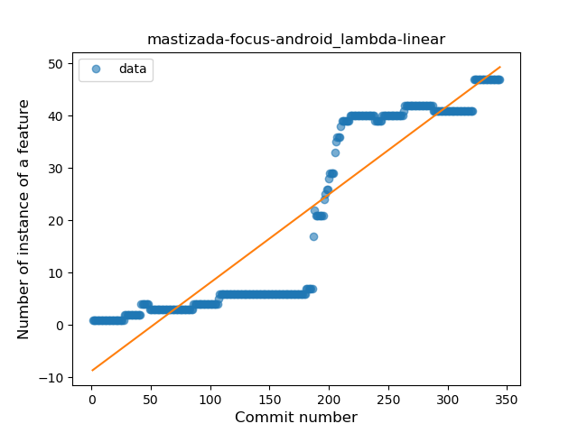
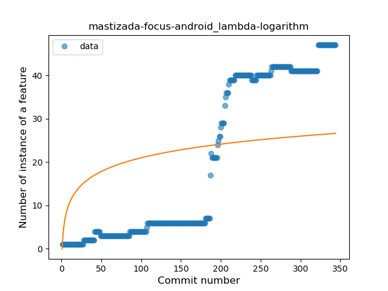
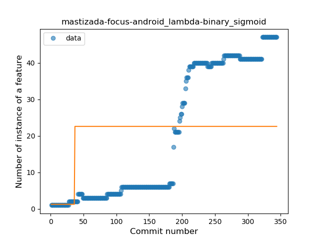
### <a name="safe_call">Safe Call</a>
----
#### Functions
* **Constant Rise - Linear:** 
    * **R_Squared:** 0.83571638
* **Sudden Rise - Exponential:** 
    * **R_Squared:** 0.84300082
* **Sudden Rise Plateau - Logarithm:** 
    * **R_Squared:** 0.28357885
* **Plateau Sudden Rise - Binary Sigmoid:** 
    * **R_Squared:** 0.10088163

**Plots** :chart_with_upwards_trend:
-----

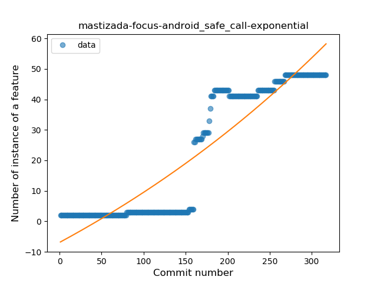
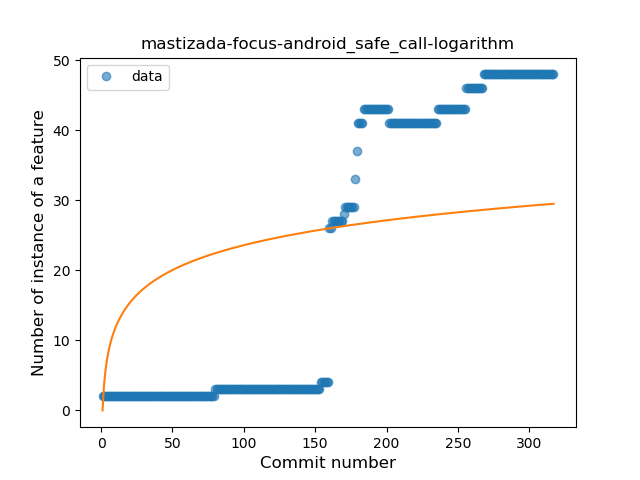
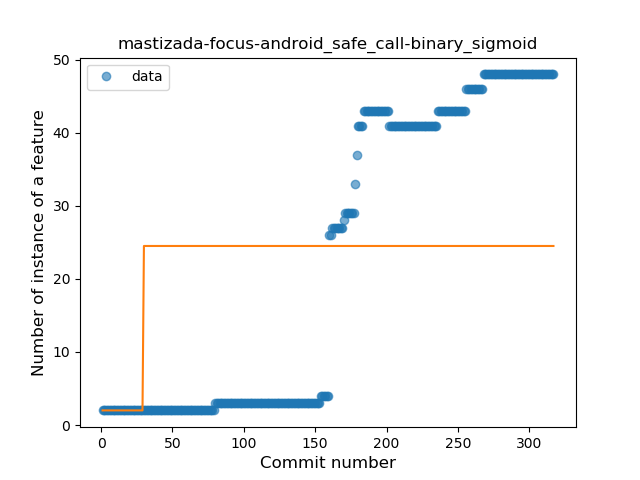
### <a name="when_expr">When expression</a>
----
#### Functions
* **Plateau Gradual Rise - Sigmoid:** 
    * **R_Squared:** 0.91271853
* **Constant Rise - Linear:** 
    * **R_Squared:** 0.87174209
* **Sudden Rise - Exponential:** 
    * **R_Squared:** 0.87844554
* **Sudden Rise Plateau - Logarithm:** 
    * **R_Squared:** 0.50701012

**Plots** :chart_with_upwards_trend:
-----

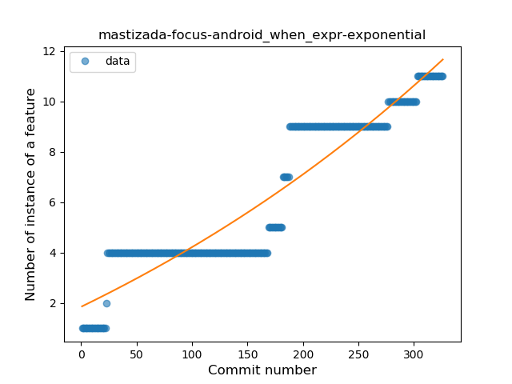

### <a name="companion_object">Companion Object</a>
----
#### Functions
* **Constant Rise - Linear:** 
    * **R_Squared:** 0.89757858
* **Sudden Rise Plateau - Logarithm:** 
    * **R_Squared:** 0.57451903
* **Plateau Gradual Rise - Sigmoid:** 
    * **R_Squared:** -0.0

**Plots** :chart_with_upwards_trend:
-----

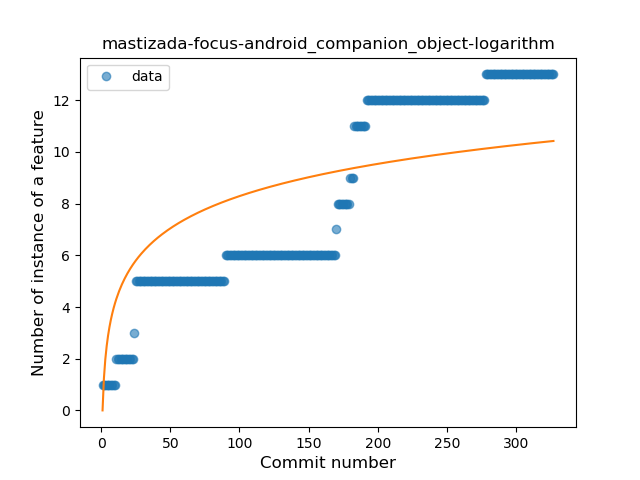
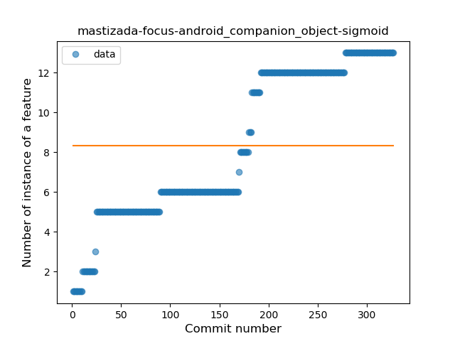
### <a name="unsafe_call">Unsafe Call</a>
----
#### Functions
* **Plateau Gradual Rise - Sigmoid:** 
    * **R_Squared:** 0.9895505
* **Constant Rise - Linear:** 
    * **R_Squared:** 0.79608028
* **Sudden Rise Plateau - Logarithm:** 
    * **R_Squared:** 0.38170822

**Plots** :chart_with_upwards_trend:
-----

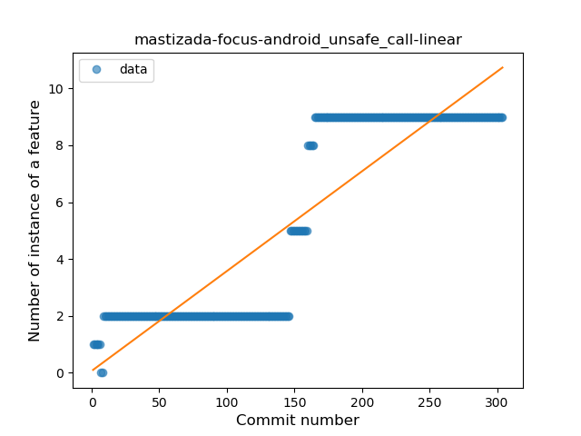
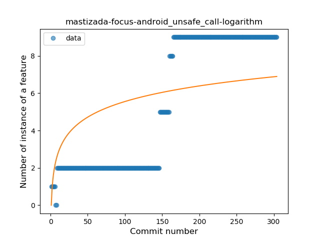
### <a name="string_template">String Template</a>
----
#### Functions
* **Sudden Rise Plateau - Logarithm:** 
    * **R_Squared:** 0.76788724
* **Constant Rise - Linear:** 
    * **R_Squared:** 0.72988784

**Plots** :chart_with_upwards_trend:
-----

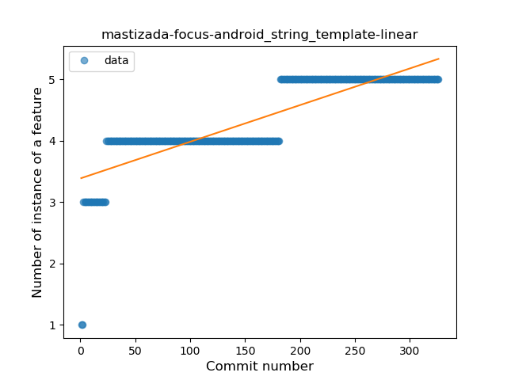
### <a name="func_with_default_value">Function with Default Value</a>
----
#### Functions
* **Plateau Gradual Rise - Sigmoid:** 
    * **R_Squared:** 0.92231321
* **Constant Rise - Linear:** 
    * **R_Squared:** 0.85508249
* **Sudden Rise Plateau - Logarithm:** 
    * **R_Squared:** 0.50020644

**Plots** :chart_with_upwards_trend:
-----

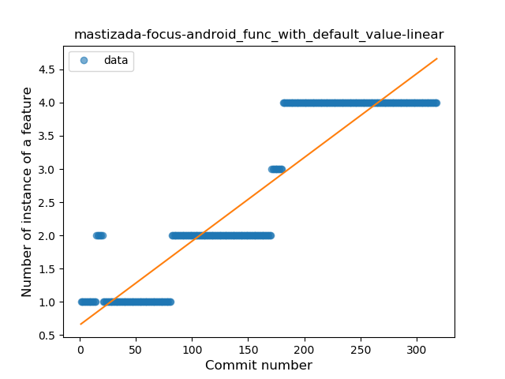
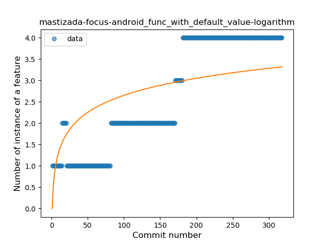
### <a name="singleton">Singleton</a>
----
#### Functions
* **Plateau Gradual Rise - Sigmoid:** 
    * **R_Squared:** 0.98979155
* **Sudden Rise - Exponential:** 
    * **R_Squared:** 0.81224362
* **Constant Rise - Linear:** 
    * **R_Squared:** 0.69336739
* **Sudden Rise Plateau - Logarithm:** 
    * **R_Squared:** 0.15664005

**Plots** :chart_with_upwards_trend:
-----

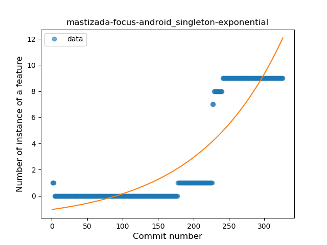
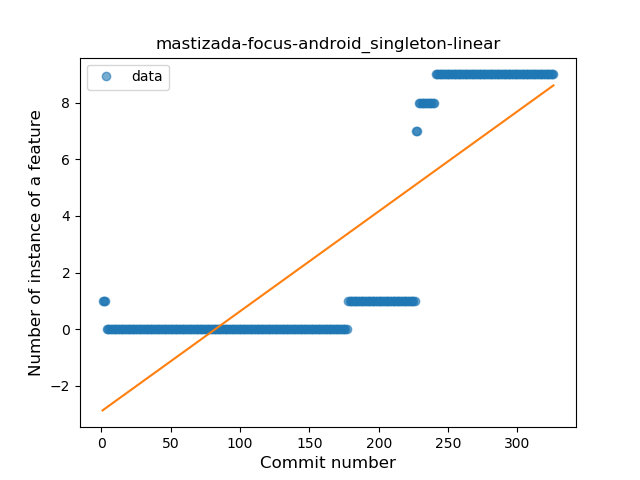
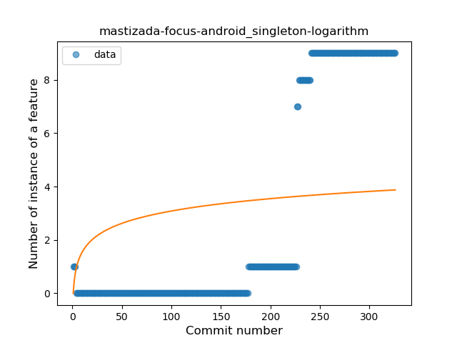
### <a name="smart_cast">Smart Cast</a>
----
#### Functions
* **Plateau Gradual Rise - Sigmoid:** 
    * **R_Squared:** 0.9793757
* **Constant Rise - Linear:** 
    * **R_Squared:** 0.80764938
* **Sudden Rise - Exponential:** 
    * **R_Squared:** 0.81316318
* **Sudden Rise Plateau - Logarithm:** 
    * **R_Squared:** 0.40212496

**Plots** :chart_with_upwards_trend:
-----

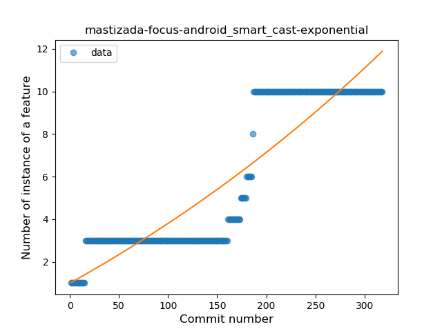
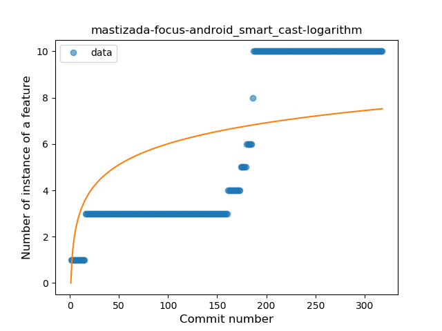
### <a name="range_expr">Range Expression</a>
----
#### Functions
* **Plateau Sudden Rise - Binary Sigmoid:** 
    * **R_Squared:** 1.0
* **Sudden Rise Plateau - Logarithm:** 
    * **R_Squared:** 0.33679597
* **Constant Rise - Linear:** 
    * **R_Squared:** 0.07687064

**Plots** :chart_with_upwards_trend:
-----

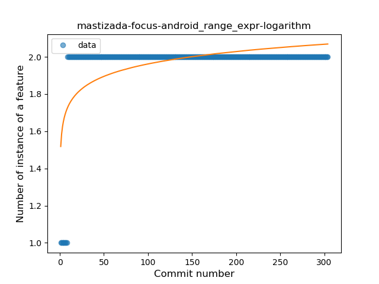
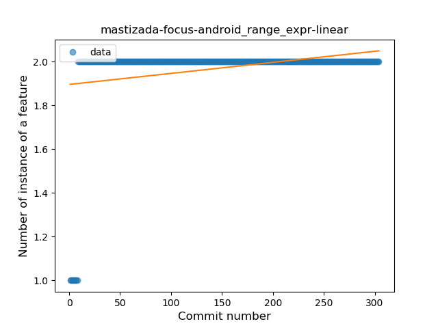
### <a name="func_call_with_named_arg">Function call with Named Argument</a>
----
#### Functions
* **Constant Rise - Linear:** 
    * **R_Squared:** 0.9163215
* **Sudden Rise - Exponential:** 
    * **R_Squared:** 0.91960375
* **Plateau Gradual Rise - Sigmoid:** 
    * **R_Squared:** 0.92054359
* **Sudden Rise Plateau - Logarithm:** 
    * **R_Squared:** 0.69976373

**Plots** :chart_with_upwards_trend:
-----

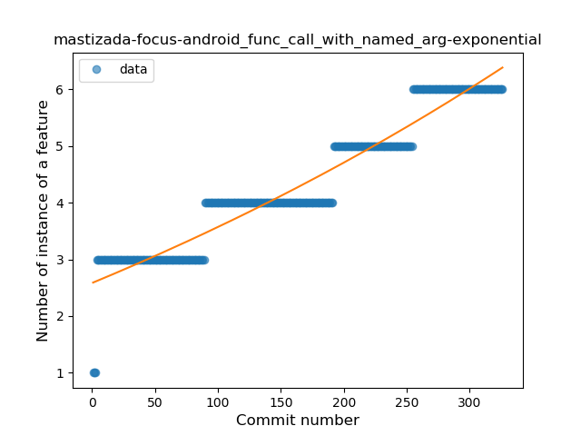
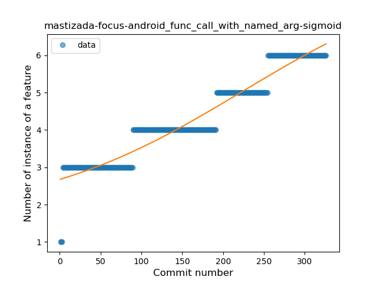
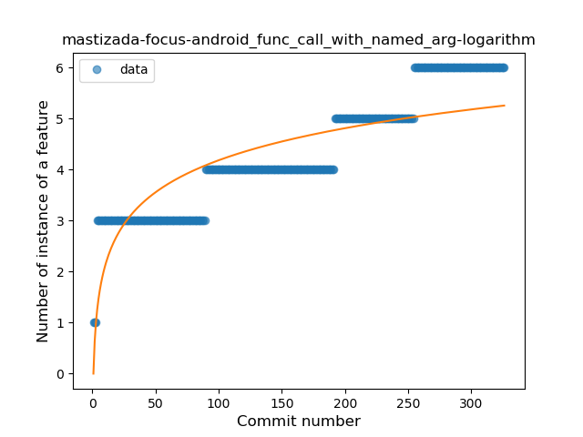
### <a name="extension_function">Extension Function</a>
----
#### Functions
* **Constant Rise - Linear:** 
    * **R_Squared:** 0.82359838
* **Sudden Rise Plateau - Logarithm:** 
    * **R_Squared:** 0.79549056

**Plots** :chart_with_upwards_trend:
-----

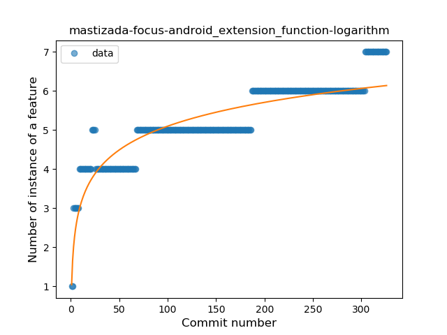
### <a name="destructuring_declaration">Destructuring Declaration</a>
----
#### Functions
* **Sudden Decline - Exponential:** 
    * **R_Squared:** 0.82544293
* **Constant Decline - Linear:** 
    * **R_Squared:** 0.02735356
* **Sudden Rise Plateau - Logarithm:** 
    * **R_Squared:** 0.0

**Plots** :chart_with_upwards_trend:
-----

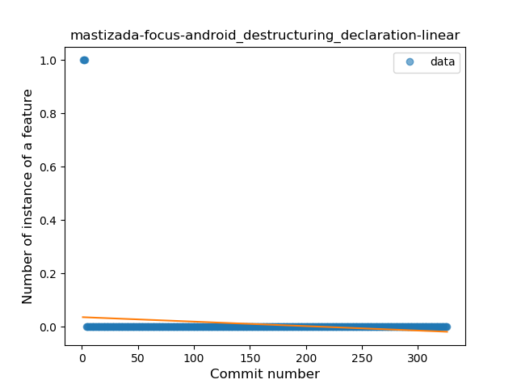
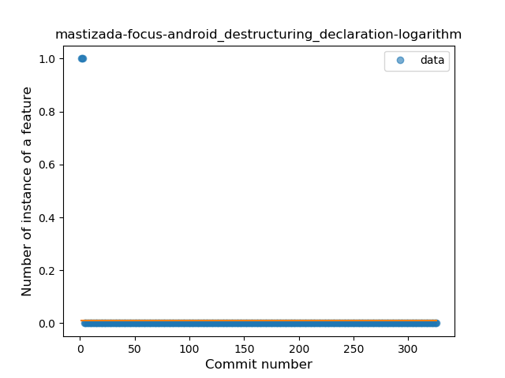
