## mbarta-scr-redesign
----
#### Metrics provided by Detekt
* Number of lines of code 1198
* Number of Kotlin files: 36
* Cyclomatic complexity: 108
* Cyclomatic complexity by thousands of lines: 217 

----
**8** features analyzed

*	<a href="#type_inference">Type Inference</a> 
*	<a href="#lambda">Lambda</a> 
*	<a href="#safe_call">Safe Call</a> 
*	<a href="#companion_object">Companion Object</a> 
*	<a href="#string_template">String Template</a> 
*	<a href="#func_with_default_value">Function with Default Value</a> 
*	<a href="#smart_cast">Smart Cast</a> 
*	<a href="#extension_function">Extension Function</a> 

### <a name="type_inference">Type Inference</a>
----
#### Functions
* **Instability - Polinomial 4:** 
    * **R_Squared:** 0.98749607
* **Constant Rise - Linear:** 
    * **R_Squared:** 0.92393333
* **Sudden Rise Plateau - Logarithm:** 
    * **R_Squared:** 0.78688636

**Plots** :chart_with_upwards_trend:
-----

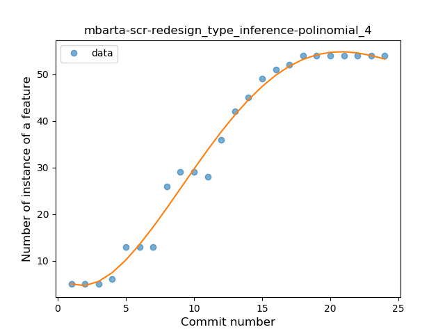
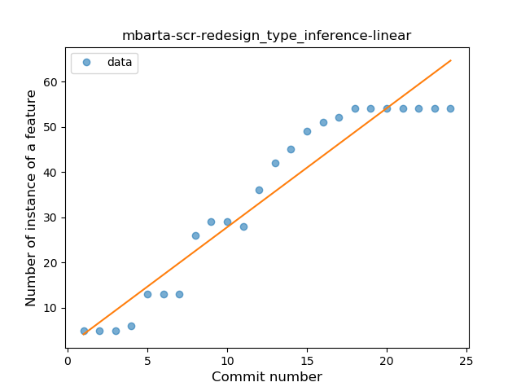
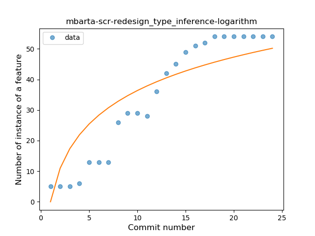
### <a name="lambda">Lambda</a>
----
#### Functions
* **Sudden Rise Plateau - Logarithm:** 
    * **R_Squared:** 0.92002637
* **Constant Rise - Linear:** 
    * **R_Squared:** 0.88345644

**Plots** :chart_with_upwards_trend:
-----

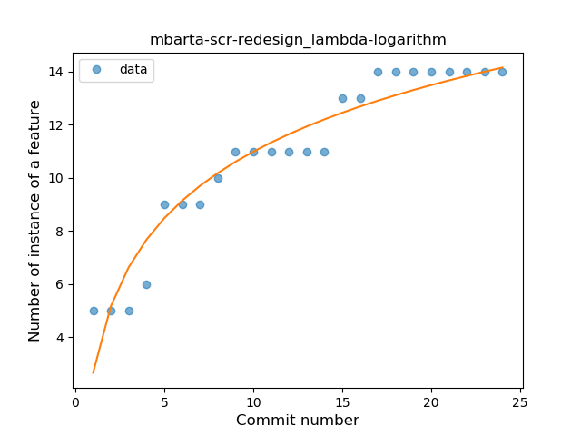
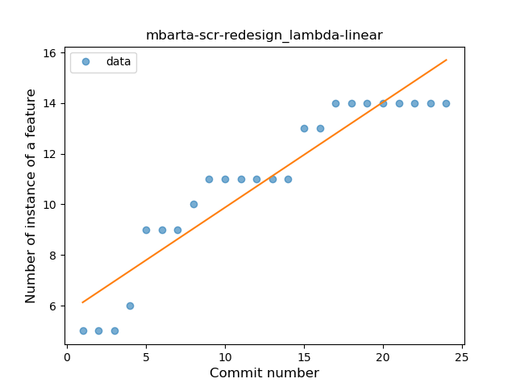
### <a name="safe_call">Safe Call</a>
----
#### Functions
* **Plateau Gradual Rise - Sigmoid:** 
    * **R_Squared:** 0.95665104
* **Instability - Polinomial 3:** )
    * **R_Squared:** 0.94497633
* **Constant Rise - Linear:** 
    * **R_Squared:** 0.89217612
* **Sudden Rise Plateau - Logarithm:** 
    * **R_Squared:** 0.73249988

**Plots** :chart_with_upwards_trend:
-----

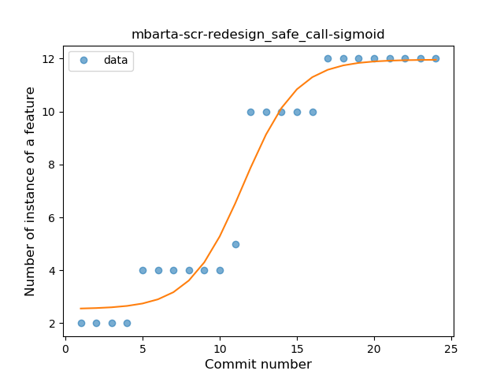
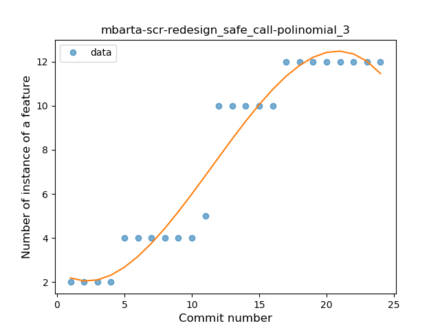
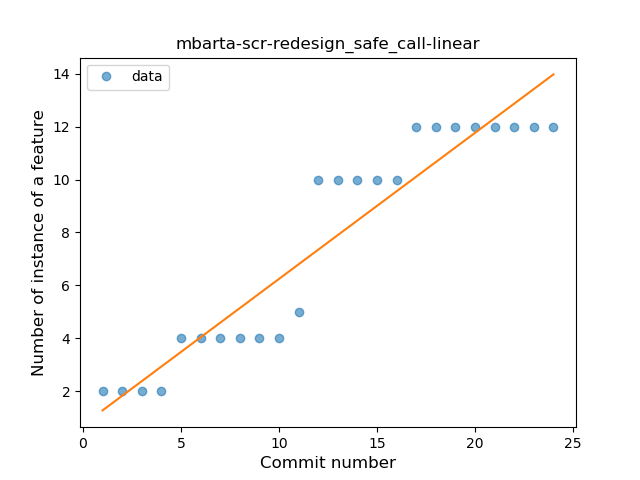
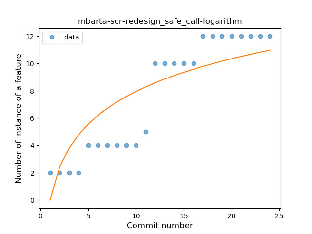
### <a name="companion_object">Companion Object</a>
----
#### Functions
* **Plateau Gradual Rise - Sigmoid:** 
    * **R_Squared:** 0.90769524
* **Sudden Rise Plateau - Logarithm:** 
    * **R_Squared:** 0.85076235
* **Constant Rise - Linear:** 
    * **R_Squared:** 0.79344236

**Plots** :chart_with_upwards_trend:
-----

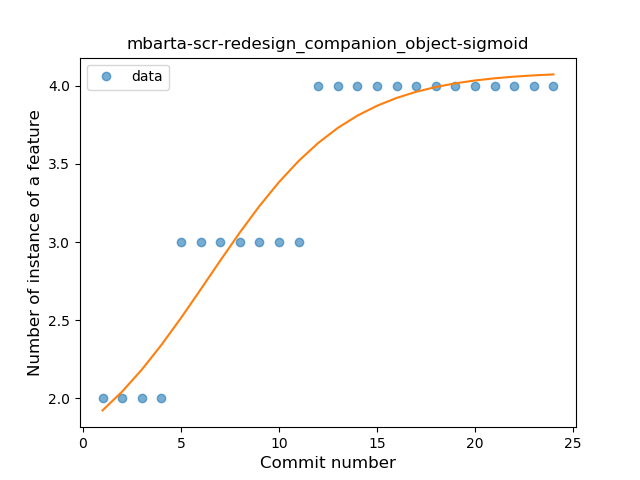
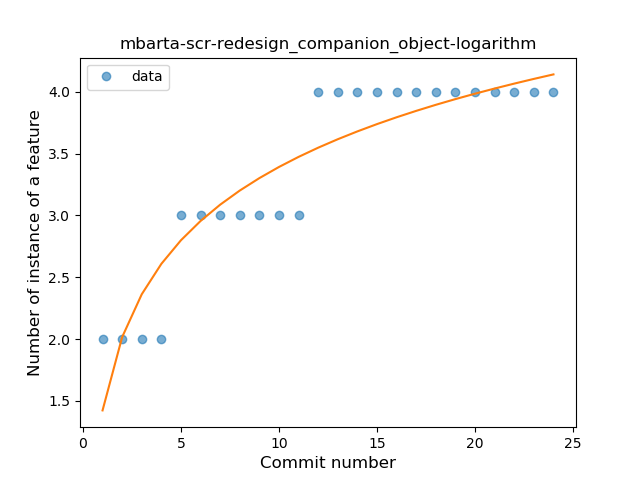
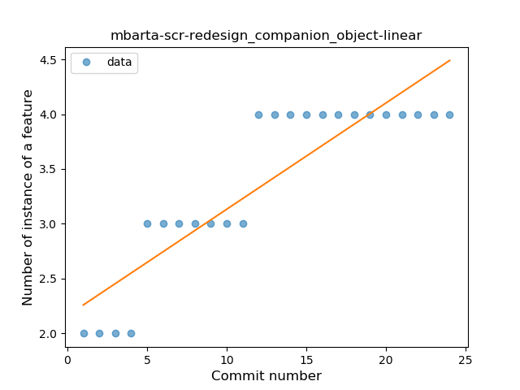
### <a name="string_template">String Template</a>
----
#### Functions
* **Instability - Polinomial 4:** 
    * **R_Squared:** 0.61451514
* **Plateau Sudden Rise - Binary Sigmoid:** 
    * **R_Squared:** 0.04409301
* **Constant Decline - Linear:** 
    * **R_Squared:** 0.03028965
* **Sudden Rise Plateau - Logarithm:** 
    * **R_Squared:** 0.00094147

**Plots** :chart_with_upwards_trend:
-----

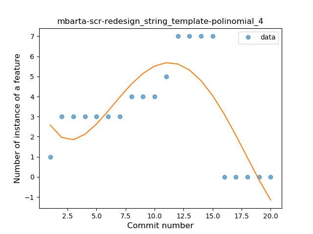
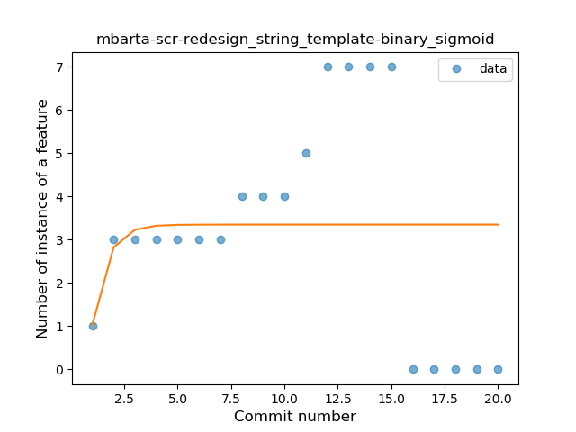
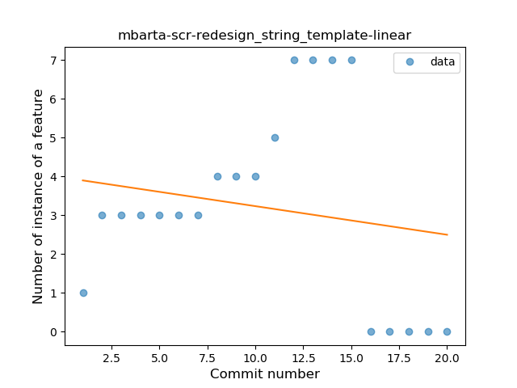
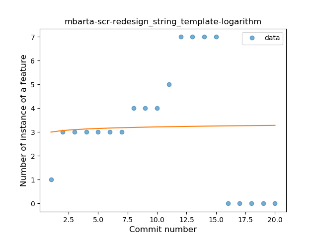
### <a name="func_with_default_value">Function with Default Value</a>
----
#### Functions
* **Plateau Sudden Rise - Binary Sigmoid:** 
    * **R_Squared:** 0.98512002
* **Instability - Polinomial 3:** )
    * **R_Squared:** 0.91459676
* **Instability - Polinomial 4:** 
    * **R_Squared:** 0.9228078
* **Constant Rise - Linear:** 
    * **R_Squared:** 0.80307999
* **Sudden Rise - Exponential:** 
    * **R_Squared:** 0.80925963
* **Sudden Rise Plateau - Logarithm:** 
    * **R_Squared:** 0.57802377

**Plots** :chart_with_upwards_trend:
-----

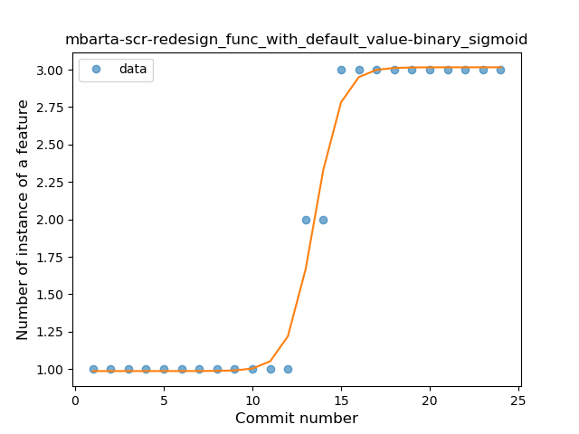
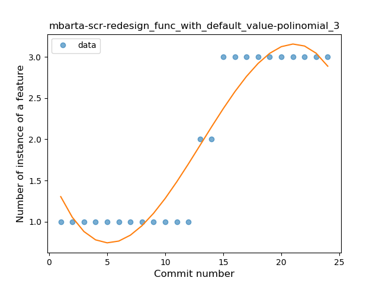
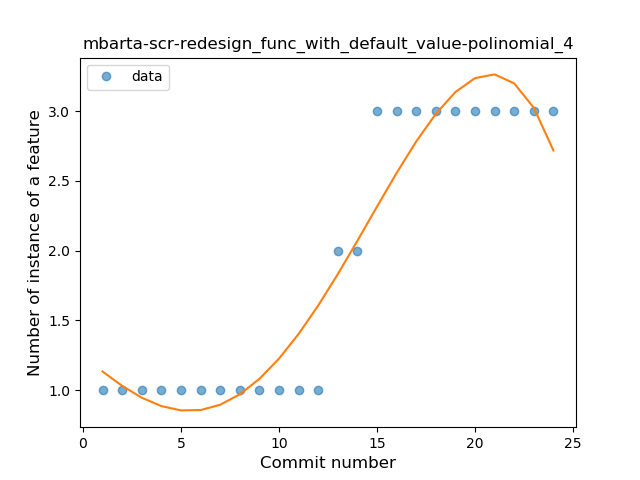
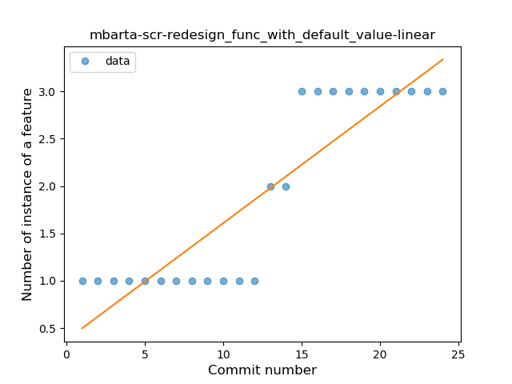
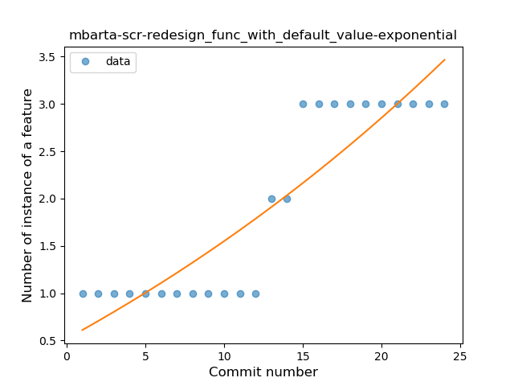
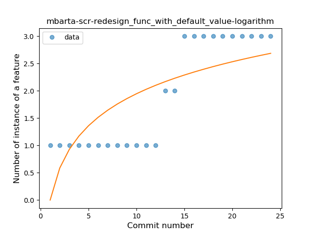
### <a name="smart_cast">Smart Cast</a>
----
#### Functions
* **Plateau Sudden Rise - Binary Sigmoid:** 
    * **R_Squared:** 1.0
* **Instability - Polinomial 4:** 
    * **R_Squared:** 0.88697706
* **Sudden Rise Plateau - Logarithm:** 
    * **R_Squared:** 0.69966753
* **Constant Rise - Linear:** 
    * **R_Squared:** 0.6875

**Plots** :chart_with_upwards_trend:
-----

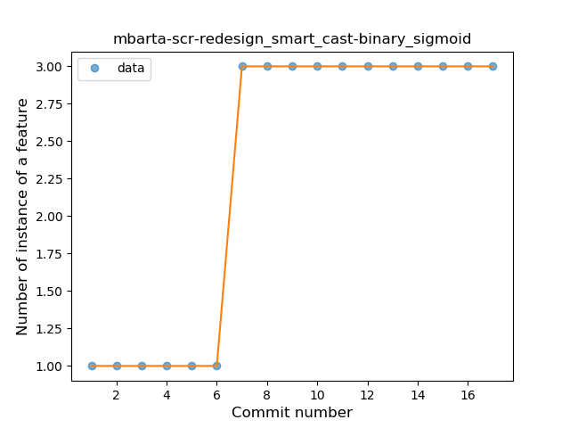
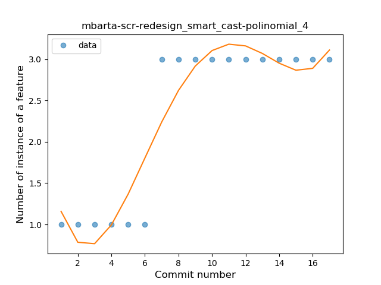
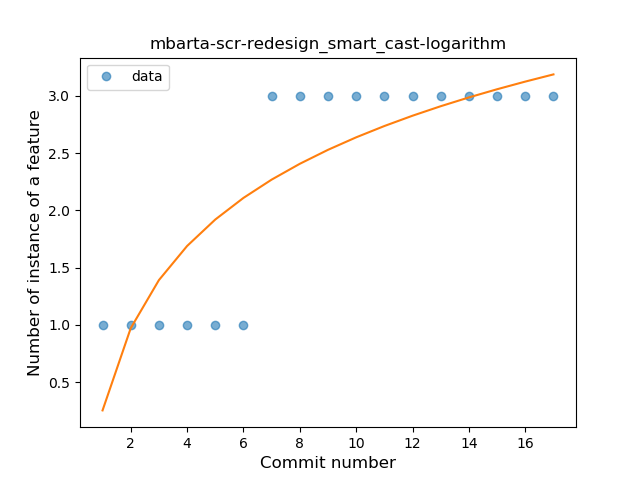
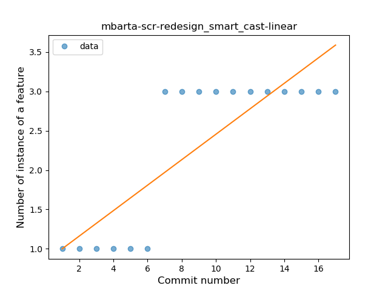
### <a name="extension_function">Extension Function</a>
----
#### Functions
* **Plateau Gradual Rise - Sigmoid:** 
    * **R_Squared:** 0.96506593
* **Constant Rise - Linear:** 
    * **R_Squared:** 0.90585416
* **Sudden Rise Plateau - Logarithm:** 
    * **R_Squared:** 0.82271794

**Plots** :chart_with_upwards_trend:
-----

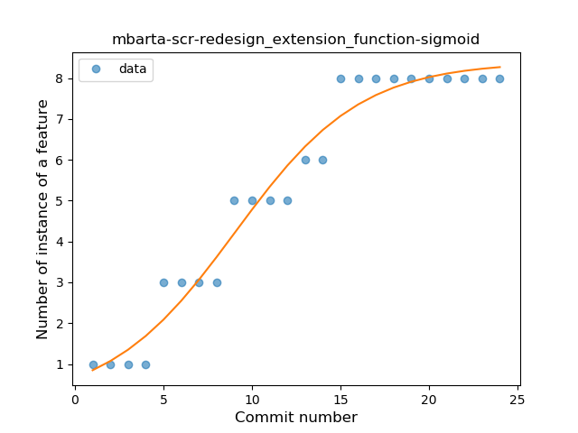
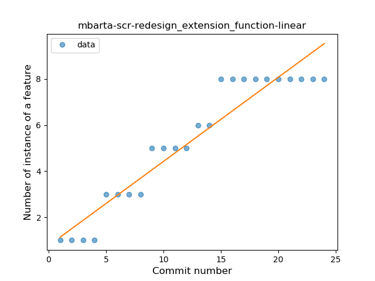
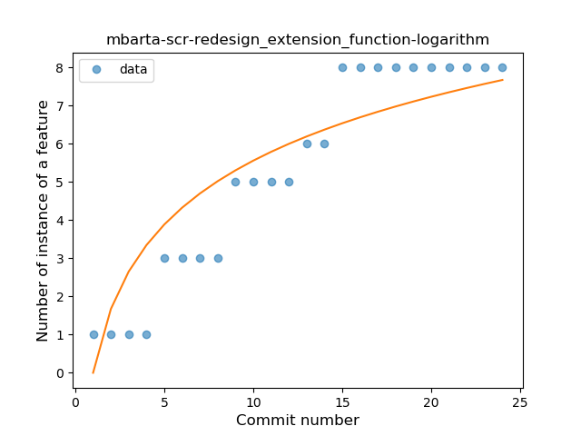
