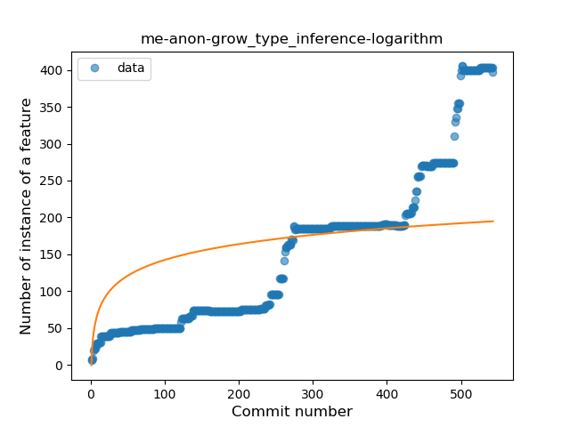
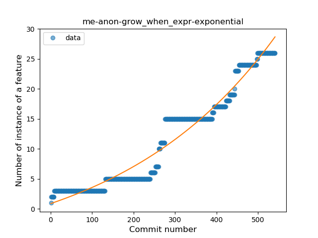
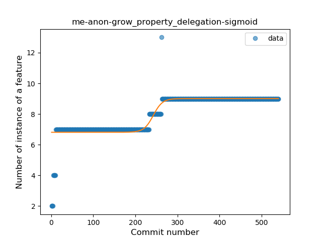
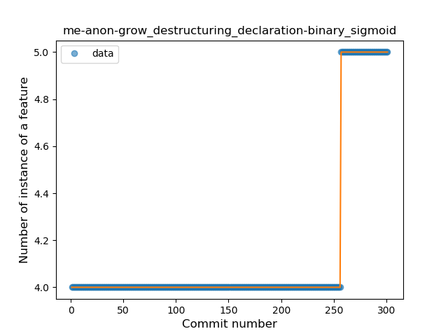

## me-anon-grow
----
#### Metrics provided by Detekt
* Number of lines of code 5584
* Number of Kotlin files: 46
* Cyclomatic complexity: 766
* Cyclomatic complexity by thousands of lines: 225 

----
**15** features analyzed

*	<a href="#type_inference">Type Inference</a> 
*	<a href="#lambda">Lambda</a> 
*	<a href="#safe_call">Safe Call</a> 
*	<a href="#when_expr">When expression</a> 
*	<a href="#unsafe_call">Unsafe Call</a> 
*	<a href="#companion_object">Companion Object</a> 
*	<a href="#string_template">String Template</a> 
*	<a href="#func_with_default_value">Function with Default Value</a> 
*	<a href="#singleton">Singleton</a> 
*	<a href="#range_expr">Range Expression</a> 
*	<a href="#smart_cast">Smart Cast</a> 
*	<a href="#func_call_with_named_arg">Function call with Named Argument</a> 
*	<a href="#extension_function">Extension Function</a> 
*	<a href="#property_delegation">Property Delegation</a> 
*	<a href="#destructuring_declaration">Destructuring Declaration</a> 

### <a name="type_inference">Type Inference</a>
----
#### Functions
* **Sudden Rise - Exponential:** 
    * **R_Squared:** 0.94416624
* **Constant Rise - Linear:** 
    * **R_Squared:** 0.87349684
* **Plateau Sudden Rise - Binary Sigmoid:** 
    * **R_Squared:** 0.41257848
* **Sudden Rise Plateau - Logarithm:** 
    * **R_Squared:** 0.32996015

**Plots** :chart_with_upwards_trend:
-----

### <a name="lambda">Lambda</a>
----
#### Functions
* **Sudden Rise - Exponential:** 
    * **R_Squared:** 0.95543372
* **Constant Rise - Linear:** 
    * **R_Squared:** 0.88867992
* **Sudden Rise Plateau - Logarithm:** 
    * **R_Squared:** 0.4198861
* **Plateau Sudden Rise - Binary Sigmoid:** 
    * **R_Squared:** 0.32816929

**Plots** :chart_with_upwards_trend:
-----

### <a name="safe_call">Safe Call</a>
----
#### Functions
* **Sudden Rise - Exponential:** 
    * **R_Squared:** 0.97461942
* **Constant Rise - Linear:** 
    * **R_Squared:** 0.93123974
* **Plateau Gradual Rise - Sigmoid:** 
    * **R_Squared:** 0.49485607
* **Sudden Rise Plateau - Logarithm:** 
    * **R_Squared:** 0.30303587

**Plots** :chart_with_upwards_trend:
-----

### <a name="when_expr">When expression</a>
----
#### Functions
* **Sudden Rise - Exponential:** 
    * **R_Squared:** 0.95234163
* **Constant Rise - Linear:** 
    * **R_Squared:** 0.91913359
* **Sudden Rise Plateau - Logarithm:** 
    * **R_Squared:** 0.33913342
* **Plateau Sudden Rise - Binary Sigmoid:** 
    * **R_Squared:** 0.01110799

**Plots** :chart_with_upwards_trend:
-----

### <a name="unsafe_call">Unsafe Call</a>
----
#### Functions
* **Sudden Rise - Exponential:** 
    * **R_Squared:** 0.95981637
* **Constant Rise - Linear:** 
    * **R_Squared:** 0.81946596
* **Sudden Rise Plateau - Logarithm:** 
    * **R_Squared:** 0.25973418
* **Plateau Gradual Rise - Sigmoid:** 
    * **R_Squared:** 0.06297782

**Plots** :chart_with_upwards_trend:
-----

### <a name="companion_object">Companion Object</a>
----
#### Functions
* **Plateau Gradual Rise - Sigmoid:** 
    * **R_Squared:** 0.95661204
* **Constant Rise - Linear:** 
    * **R_Squared:** 0.92547617
* **Sudden Rise - Exponential:** 
    * **R_Squared:** 0.92584313
* **Sudden Rise Plateau - Logarithm:** 
    * **R_Squared:** 0.51891019

**Plots** :chart_with_upwards_trend:
-----

### <a name="string_template">String Template</a>
----
#### Functions
* **Sudden Rise - Exponential:** 
    * **R_Squared:** 0.94425797
* **Constant Rise - Linear:** 
    * **R_Squared:** 0.90531635
* **Sudden Rise Plateau - Logarithm:** 
    * **R_Squared:** 0.44086946

**Plots** :chart_with_upwards_trend:
-----

### <a name="func_with_default_value">Function with Default Value</a>
----
#### Functions
* **Constant Rise - Linear:** 
    * **R_Squared:** 0.94012978
* **Sudden Rise - Exponential:** 
    * **R_Squared:** 0.94596486
* **Sudden Rise Plateau - Logarithm:** 
    * **R_Squared:** 0.42493819

**Plots** :chart_with_upwards_trend:
-----

### <a name="singleton">Singleton</a>
----
#### Functions
* **Plateau Gradual Rise - Sigmoid:** 
    * **R_Squared:** 0.90010974
* **Constant Rise - Linear:** 
    * **R_Squared:** 0.75528669
* **Sudden Rise Plateau - Logarithm:** 
    * **R_Squared:** 0.73206388

**Plots** :chart_with_upwards_trend:
-----

### <a name="range_expr">Range Expression</a>
----
#### Functions
* **Sudden Rise - Exponential:** 
    * **R_Squared:** 0.91140907
* **Constant Rise - Linear:** 
    * **R_Squared:** 0.83365222
* **Sudden Rise Plateau - Logarithm:** 
    * **R_Squared:** 0.38582595

**Plots** :chart_with_upwards_trend:
-----

### <a name="smart_cast">Smart Cast</a>
----
#### Functions
* **Sudden Rise - Exponential:** 
    * **R_Squared:** 0.9486212
* **Constant Rise - Linear:** 
    * **R_Squared:** 0.71812737
* **Sudden Rise Plateau - Logarithm:** 
    * **R_Squared:** 0.16550937

**Plots** :chart_with_upwards_trend:
-----

### <a name="func_call_with_named_arg">Function call with Named Argument</a>
----
#### Functions
* **Sudden Rise - Exponential:** 
    * **R_Squared:** 0.58687476
* **Sudden Rise Plateau - Logarithm:** 
    * **R_Squared:** 0.56557469
* **Constant Rise - Linear:** 
    * **R_Squared:** 0.53663398
* **Plateau Gradual Rise - Sigmoid:** 
    * **R_Squared:** 0.45978259

**Plots** :chart_with_upwards_trend:
-----

### <a name="extension_function">Extension Function</a>
----
#### Functions
* **Sudden Rise - Exponential:** 
    * **R_Squared:** 0.88093972
* **Constant Rise - Linear:** 
    * **R_Squared:** 0.82025483
* **Sudden Rise Plateau - Logarithm:** 
    * **R_Squared:** 0.27368924

**Plots** :chart_with_upwards_trend:
-----

### <a name="property_delegation">Property Delegation</a>
----
#### Functions
* **Plateau Gradual Rise - Sigmoid:** 
    * **R_Squared:** 0.77632752
* **Sudden Rise Plateau - Logarithm:** 
    * **R_Squared:** 0.72147813
* **Constant Rise - Linear:** 
    * **R_Squared:** 0.67334082

**Plots** :chart_with_upwards_trend:
-----

### <a name="destructuring_declaration">Destructuring Declaration</a>
----
#### Functions
* **Plateau Sudden Rise - Binary Sigmoid:** 
    * **R_Squared:** 1.0
* **Sudden Rise - Exponential:** 
    * **R_Squared:** 0.78768062
* **Constant Rise - Linear:** 
    * **R_Squared:** 0.38145695
* **Sudden Rise Plateau - Logarithm:** 
    * **R_Squared:** 0.15680583

**Plots** :chart_with_upwards_trend:
-----

