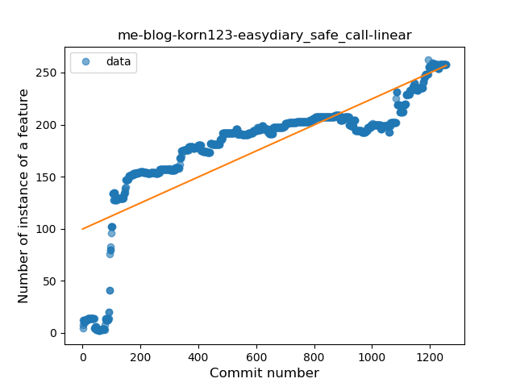
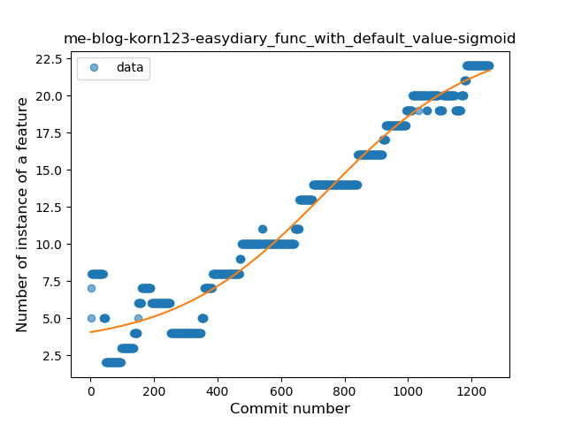
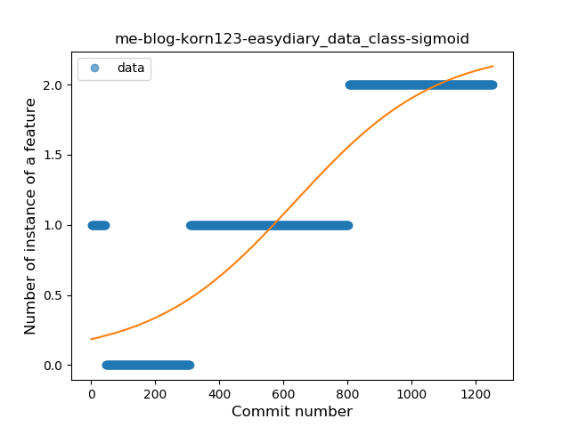
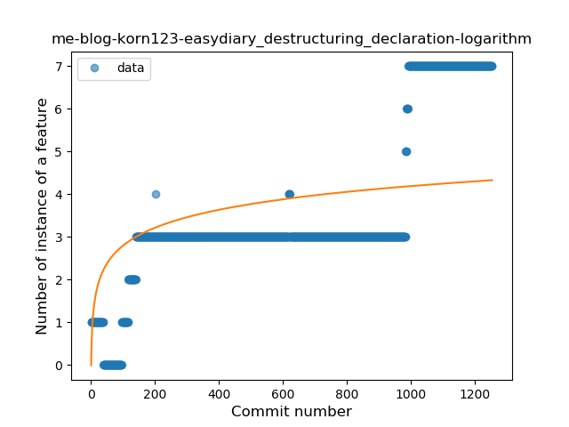

## me-blog-korn123-easydiary
----
#### Metrics provided by Detekt
* Number of lines of code 14906
* Number of Kotlin files: 95
* Cyclomatic complexity: 2244
* Cyclomatic complexity by thousands of lines: 281 

----
**16** features analyzed

*	<a href="#type_inference">Type Inference</a> 
*	<a href="#lambda">Lambda</a> 
*	<a href="#safe_call">Safe Call</a> 
*	<a href="#when_expr">When expression</a> 
*	<a href="#unsafe_call">Unsafe Call</a> 
*	<a href="#companion_object">Companion Object</a> 
*	<a href="#string_template">String Template</a> 
*	<a href="#func_with_default_value">Function with Default Value</a> 
*	<a href="#singleton">Singleton</a> 
*	<a href="#range_expr">Range Expression</a> 
*	<a href="#smart_cast">Smart Cast</a> 
*	<a href="#data_class">Data Class</a> 
*	<a href="#func_call_with_named_arg">Function call with Named Argument</a> 
*	<a href="#extension_function">Extension Function</a> 
*	<a href="#property_delegation">Property Delegation</a> 
*	<a href="#destructuring_declaration">Destructuring Declaration</a> 

### <a name="type_inference">Type Inference</a>
----
#### Functions
* **Sudden Rise - Exponential:** 
    * **R_Squared:** 0.9421046
* **Constant Rise - Linear:** 
    * **R_Squared:** 0.92736646
* **Sudden Rise Plateau - Logarithm:** 
    * **R_Squared:** 0.47447244
* **Plateau Sudden Rise - Binary Sigmoid:** 
    * **R_Squared:** 0.16330707

**Plots** :chart_with_upwards_trend:
-----

### <a name="lambda">Lambda</a>
----
#### Functions
* **Constant Rise - Linear:** 
    * **R_Squared:** 0.93227416
* **Plateau Sudden Rise - Binary Sigmoid:** 
    * **R_Squared:** 0.66784917
* **Sudden Rise Plateau - Logarithm:** 
    * **R_Squared:** 0.57322819

**Plots** :chart_with_upwards_trend:
-----

### <a name="safe_call">Safe Call</a>
----
#### Functions
* **Sudden Rise Plateau - Logarithm:** 
    * **R_Squared:** 0.69160047
* **Constant Rise - Linear:** 
    * **R_Squared:** 0.65486656
* **Plateau Sudden Rise - Binary Sigmoid:** 
    * **R_Squared:** 0.61590766

**Plots** :chart_with_upwards_trend:
-----

### <a name="when_expr">When expression</a>
----
#### Functions
* **Constant Rise - Linear:** 
    * **R_Squared:** 0.96363801
* **Sudden Rise Plateau - Logarithm:** 
    * **R_Squared:** 0.50208027
* **Plateau Sudden Rise - Binary Sigmoid:** 
    * **R_Squared:** 0.20741043

**Plots** :chart_with_upwards_trend:
-----

### <a name="unsafe_call">Unsafe Call</a>
----
#### Functions
* **Sudden Rise - Exponential:** 
    * **R_Squared:** 0.93388342
* **Constant Rise - Linear:** 
    * **R_Squared:** 0.50804232
* **Sudden Rise Plateau - Logarithm:** 
    * **R_Squared:** 0.10750864

**Plots** :chart_with_upwards_trend:
-----

### <a name="companion_object">Companion Object</a>
----
#### Functions
* **Plateau Gradual Rise - Sigmoid:** 
    * **R_Squared:** 0.92594636
* **Constant Rise - Linear:** 
    * **R_Squared:** 0.750464
* **Sudden Rise Plateau - Logarithm:** 
    * **R_Squared:** 0.60340434

**Plots** :chart_with_upwards_trend:
-----

### <a name="string_template">String Template</a>
----
#### Functions
* **Constant Rise - Linear:** 
    * **R_Squared:** 0.90325296
* **Plateau Sudden Rise - Binary Sigmoid:** 
    * **R_Squared:** 0.72099418
* **Sudden Rise Plateau - Logarithm:** 
    * **R_Squared:** 0.39068108

**Plots** :chart_with_upwards_trend:
-----

### <a name="func_with_default_value">Function with Default Value</a>
----
#### Functions
* **Plateau Gradual Rise - Sigmoid:** 
    * **R_Squared:** 0.95474991
* **Sudden Rise - Exponential:** 
    * **R_Squared:** 0.94298286
* **Constant Rise - Linear:** 
    * **R_Squared:** 0.9329574
* **Sudden Rise Plateau - Logarithm:** 
    * **R_Squared:** 0.38591763

**Plots** :chart_with_upwards_trend:
-----

### <a name="singleton">Singleton</a>
----
#### Functions
* **Plateau Sudden Decline - Binary Sigmoid:** 
    * **R_Squared:** 0.87466737
* **Sudden Decline - Exponential:** 
    * **R_Squared:** 0.69273431
* **Constant Decline - Linear:** 
    * **R_Squared:** 0.14465673
* **Sudden Rise Plateau - Logarithm:** 
    * **R_Squared:** -0.0

**Plots** :chart_with_upwards_trend:
-----

### <a name="range_expr">Range Expression</a>
----
#### Functions
* **Constant Rise - Linear:** 
    * **R_Squared:** 0.78736924
* **Sudden Rise Plateau - Logarithm:** 
    * **R_Squared:** 0.59300919
* **Plateau Sudden Rise - Binary Sigmoid:** 
    * **R_Squared:** 0.00420597

**Plots** :chart_with_upwards_trend:
-----

### <a name="smart_cast">Smart Cast</a>
----
#### Functions
* **Sudden Rise - Exponential:** 
    * **R_Squared:** 0.22782676
* **Constant Rise - Linear:** 
    * **R_Squared:** 0.18769867
* **Sudden Rise Plateau - Logarithm:** 
    * **R_Squared:** 0.11568899

**Plots** :chart_with_upwards_trend:
-----

### <a name="data_class">Data Class</a>
----
#### Functions
* **Plateau Gradual Rise - Sigmoid:** 
    * **R_Squared:** 0.81580217
* **Constant Rise - Linear:** 
    * **R_Squared:** 0.79623962
* **Sudden Rise - Exponential:** 
    * **R_Squared:** 0.79628397
* **Sudden Rise Plateau - Logarithm:** 
    * **R_Squared:** 0.29174536

**Plots** :chart_with_upwards_trend:
-----

### <a name="func_call_with_named_arg">Function call with Named Argument</a>
----
#### Functions
* **Sudden Rise - Exponential:** 
    * **R_Squared:** 0.24399982
* **Constant Rise - Linear:** 
    * **R_Squared:** 0.07426847
* **Sudden Rise Plateau - Logarithm:** 
    * **R_Squared:** 0.02745405

**Plots** :chart_with_upwards_trend:
-----

### <a name="extension_function">Extension Function</a>
----
#### Functions
* **Constant Rise - Linear:** 
    * **R_Squared:** 0.79769691
* **Sudden Rise - Exponential:** 
    * **R_Squared:** 0.80733275
* **Sudden Rise Plateau - Logarithm:** 
    * **R_Squared:** 0.421182

**Plots** :chart_with_upwards_trend:
-----

### <a name="property_delegation">Property Delegation</a>
----
#### Functions
* **Plateau Sudden Rise - Binary Sigmoid:** 
    * **R_Squared:** 1.0
* **Sudden Rise Plateau - Logarithm:** 
    * **R_Squared:** 0.54353225
* **Constant Rise - Linear:** 
    * **R_Squared:** 0.20647288

**Plots** :chart_with_upwards_trend:
-----

### <a name="destructuring_declaration">Destructuring Declaration</a>
----
#### Functions
* **Plateau Gradual Rise - Sigmoid:** 
    * **R_Squared:** 0.84989844
* **Sudden Rise - Exponential:** 
    * **R_Squared:** 0.74943362
* **Constant Rise - Linear:** 
    * **R_Squared:** 0.65972725
* **Sudden Rise Plateau - Logarithm:** 
    * **R_Squared:** 0.331656

**Plots** :chart_with_upwards_trend:
-----

