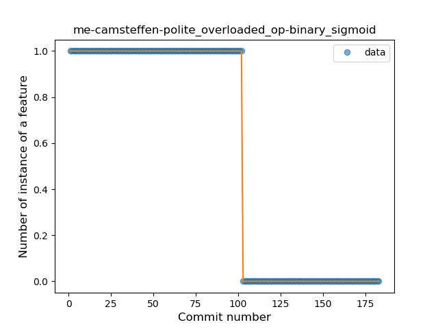

## me-camsteffen-polite
----
#### Metrics provided by Detekt
* Number of lines of code 6589
* Number of Kotlin files: 90
* Cyclomatic complexity: 667
* Cyclomatic complexity by thousands of lines: 175 

----
**19** features analyzed

*	<a href="#type_inference">Type Inference</a> 
*	<a href="#lambda">Lambda</a> 
*	<a href="#safe_call">Safe Call</a> 
*	<a href="#when_expr">When expression</a> 
*	<a href="#unsafe_call">Unsafe Call</a> 
*	<a href="#companion_object">Companion Object</a> 
*	<a href="#string_template">String Template</a> 
*	<a href="#func_with_default_value">Function with Default Value</a> 
*	<a href="#singleton">Singleton</a> 
*	<a href="#range_expr">Range Expression</a> 
*	<a href="#smart_cast">Smart Cast</a> 
*	<a href="#data_class">Data Class</a> 
*	<a href="#func_call_with_named_arg">Function call with Named Argument</a> 
*	<a href="#extension_function">Extension Function</a> 
*	<a href="#destructuring_declaration">Destructuring Declaration</a> 
*	<a href="#inline_func">Inline Function</a> 
*	<a href="#overloaded_op">Overloaded Operator</a> 
*	<a href="#sealed_class">Sealed Class</a> 
*	<a href="#type_alias">Type Alias</a> 

### <a name="type_inference">Type Inference</a>
----
#### Functions
* **Sudden Rise - Exponential:** 
    * **R_Squared:** 0.37869323
* **Constant Rise - Linear:** 
    * **R_Squared:** 0.28177429
* **Sudden Rise Plateau - Logarithm:** 
    * **R_Squared:** 0.10710459

**Plots** :chart_with_upwards_trend:
-----

### <a name="lambda">Lambda</a>
----
#### Functions
* **Instability - Polinomial 3:** )
    * **R_Squared:** 0.95323031
* **Constant Rise - Linear:** 
    * **R_Squared:** 0.87566275
* **Sudden Rise Plateau - Logarithm:** 
    * **R_Squared:** 0.60524037

**Plots** :chart_with_upwards_trend:
-----

### <a name="safe_call">Safe Call</a>
----
#### Functions
* **Plateau Sudden Decline - Binary Sigmoid:** 
    * **R_Squared:** 0.85354955
* **Sudden Decline - Exponential:** 
    * **R_Squared:** 0.4696792
* **Constant Decline - Linear:** 
    * **R_Squared:** 0.45300759
* **Sudden Rise Plateau - Logarithm:** 
    * **R_Squared:** -0.0

**Plots** :chart_with_upwards_trend:
-----

### <a name="when_expr">When expression</a>
----
#### Functions
* **Sudden Rise - Exponential:** 
    * **R_Squared:** 0.89341716
* **Constant Rise - Linear:** 
    * **R_Squared:** 0.7613898
* **Sudden Rise Plateau - Logarithm:** 
    * **R_Squared:** 0.41976609

**Plots** :chart_with_upwards_trend:
-----

### <a name="unsafe_call">Unsafe Call</a>
----
#### Functions
* **Sudden Rise Plateau - Logarithm:** 
    * **R_Squared:** 0.27660026
* **Constant Rise - Linear:** 
    * **R_Squared:** 0.25461217

**Plots** :chart_with_upwards_trend:
-----

### <a name="companion_object">Companion Object</a>
----
#### Functions
* **Constant Rise - Linear:** 
    * **R_Squared:** 0.01102336
* **Sudden Rise - Exponential:** 
    * **R_Squared:** 0.01196889
* **Sudden Rise Plateau - Logarithm:** 
    * **R_Squared:** 0.0

**Plots** :chart_with_upwards_trend:
-----

### <a name="string_template">String Template</a>
----
#### Functions
* **Instability - Polinomial 3:** )
    * **R_Squared:** 0.86352161
* **Plateau Sudden Decline - Binary Sigmoid:** 
    * **R_Squared:** 0.79004938
* **Constant Decline - Linear:** 
    * **R_Squared:** 0.72040275
* **Sudden Rise - Exponential:** 
    * **R_Squared:** -0.0
* **Sudden Rise Plateau - Logarithm:** 
    * **R_Squared:** -0.0

**Plots** :chart_with_upwards_trend:
-----

### <a name="func_with_default_value">Function with Default Value</a>
----
#### Functions
* **Sudden Rise - Exponential:** 
    * **R_Squared:** 0.53164772
* **Constant Rise - Linear:** 
    * **R_Squared:** 0.51322494
* **Sudden Rise Plateau - Logarithm:** 
    * **R_Squared:** 0.34498709
* **Plateau Sudden Rise - Binary Sigmoid:** 
    * **R_Squared:** 0.29096989

**Plots** :chart_with_upwards_trend:
-----

### <a name="singleton">Singleton</a>
----
#### Functions
* **Sudden Rise - Exponential:** 
    * **R_Squared:** 0.68040032
* **Constant Rise - Linear:** 
    * **R_Squared:** 0.669981
* **Sudden Rise Plateau - Logarithm:** 
    * **R_Squared:** 0.44253659
* **Plateau Sudden Rise - Binary Sigmoid:** 
    * **R_Squared:** 0.32710533

**Plots** :chart_with_upwards_trend:
-----

### <a name="range_expr">Range Expression</a>
----
#### Functions
* **Plateau Gradual Decline - Sigmoid:** 
    * **R_Squared:** 0.94764597
* **Constant Decline - Linear:** 
    * **R_Squared:** 0.8795518
* **Sudden Decline - Exponential:** 
    * **R_Squared:** 0.88225068
* **Sudden Rise Plateau - Logarithm:** 
    * **R_Squared:** -0.0

**Plots** :chart_with_upwards_trend:
-----

### <a name="smart_cast">Smart Cast</a>
----
#### Functions
* **Plateau Sudden Decline - Binary Sigmoid:** 
    * **R_Squared:** 0.94814689
* **Constant Decline - Linear:** 
    * **R_Squared:** 0.63160595
* **Sudden Decline - Exponential:** 
    * **R_Squared:** 0.63168745
* **Sudden Rise Plateau - Logarithm:** 
    * **R_Squared:** -0.0

**Plots** :chart_with_upwards_trend:
-----

### <a name="data_class">Data Class</a>
----
#### Functions
* **Sudden Rise - Exponential:** 
    * **R_Squared:** 0.86649964
* **Constant Rise - Linear:** 
    * **R_Squared:** 0.85297105
* **Sudden Rise Plateau - Logarithm:** 
    * **R_Squared:** 0.35868702

**Plots** :chart_with_upwards_trend:
-----

### <a name="func_call_with_named_arg">Function call with Named Argument</a>
----
#### Functions
* **Instability - Polinomial 3:** )
    * **R_Squared:** 0.94418617
* **Constant Rise - Linear:** 
    * **R_Squared:** 0.85654868
* **Plateau Sudden Rise - Binary Sigmoid:** 
    * **R_Squared:** 0.47294718
* **Sudden Rise Plateau - Logarithm:** 
    * **R_Squared:** 0.35393742

**Plots** :chart_with_upwards_trend:
-----

### <a name="extension_function">Extension Function</a>
----
#### Functions
* **Plateau Gradual Rise - Sigmoid:** 
    * **R_Squared:** 0.9534691
* **Constant Rise - Linear:** 
    * **R_Squared:** 0.78475703
* **Sudden Rise Plateau - Logarithm:** 
    * **R_Squared:** 0.63870169

**Plots** :chart_with_upwards_trend:
-----

### <a name="destructuring_declaration">Destructuring Declaration</a>
----
#### Functions
* **Plateau Gradual Rise - Sigmoid:** 
    * **R_Squared:** 0.76917198
* **Sudden Rise - Exponential:** 
    * **R_Squared:** 0.45227599
* **Constant Rise - Linear:** 
    * **R_Squared:** 0.33622231
* **Sudden Rise Plateau - Logarithm:** 
    * **R_Squared:** 0.11523121

**Plots** :chart_with_upwards_trend:
-----

### <a name="inline_func">Inline Function</a>
----
#### Functions
* **Plateau Sudden Rise - Binary Sigmoid:** 
    * **R_Squared:** 1.0
* **Sudden Rise Plateau - Logarithm:** 
    * **R_Squared:** 0.65449637
* **Constant Rise - Linear:** 
    * **R_Squared:** 0.63798009

**Plots** :chart_with_upwards_trend:
-----

### <a name="overloaded_op">Overloaded Operator</a>
----
#### Functions
* **Plateau Sudden Decline - Binary Sigmoid:** 
    * **R_Squared:** 1.0
* **Constant Decline - Linear:** 
    * **R_Squared:** 0.74014572
* **Sudden Rise Plateau - Logarithm:** 
    * **R_Squared:** -0.0

**Plots** :chart_with_upwards_trend:
-----

### <a name="sealed_class">Sealed Class</a>
----
#### Functions
* **Plateau Sudden Rise - Binary Sigmoid:** 
    * **R_Squared:** 1.0
* **Sudden Rise Plateau - Logarithm:** 
    * **R_Squared:** 0.6706161
* **Constant Rise - Linear:** 
    * **R_Squared:** 0.44631148

**Plots** :chart_with_upwards_trend:
-----

### <a name="type_alias">Type Alias</a>
----
#### Functions
* **Plateau Sudden Rise - Binary Sigmoid:** 
    * **R_Squared:** 1.0
* **Sudden Rise Plateau - Logarithm:** 
    * **R_Squared:** 0.53189572
* **Constant Rise - Linear:** 
    * **R_Squared:** 0.20754717

**Plots** :chart_with_upwards_trend:
-----

