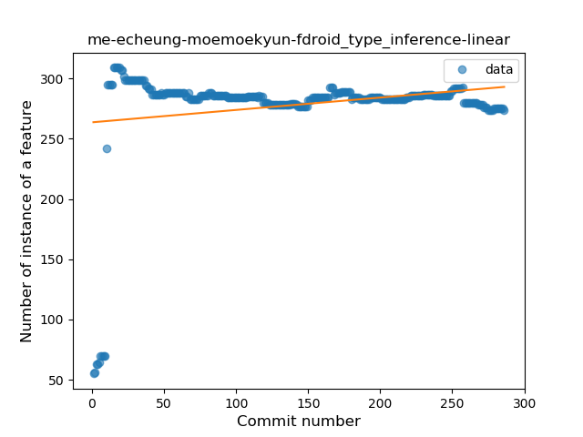
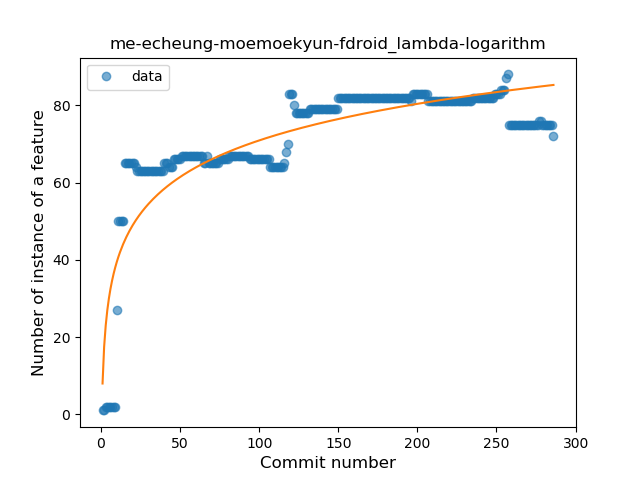
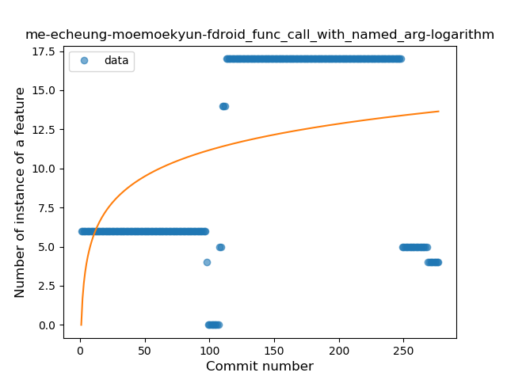

## me-echeung-moemoekyun-fdroid
----
#### Metrics provided by Detekt
* Number of lines of code 5222
* Number of Kotlin files: 68
* Cyclomatic complexity: 659
* Cyclomatic complexity by thousands of lines: 258 

----
**15** features analyzed

*	<a href="#type_inference">Type Inference</a> 
*	<a href="#lambda">Lambda</a> 
*	<a href="#safe_call">Safe Call</a> 
*	<a href="#when_expr">When expression</a> 
*	<a href="#unsafe_call">Unsafe Call</a> 
*	<a href="#companion_object">Companion Object</a> 
*	<a href="#string_template">String Template</a> 
*	<a href="#func_with_default_value">Function with Default Value</a> 
*	<a href="#singleton">Singleton</a> 
*	<a href="#range_expr">Range Expression</a> 
*	<a href="#smart_cast">Smart Cast</a> 
*	<a href="#data_class">Data Class</a> 
*	<a href="#func_call_with_named_arg">Function call with Named Argument</a> 
*	<a href="#extension_function">Extension Function</a> 
*	<a href="#inline_func">Inline Function</a> 

### <a name="type_inference">Type Inference</a>
----
#### Functions
* **Sudden Rise Plateau - Logarithm:** 
    * **R_Squared:** 0.27221323
* **Constant Rise - Linear:** 
    * **R_Squared:** 0.04682141
* **Plateau Sudden Rise - Binary Sigmoid:** 
    * **R_Squared:** 0.00032877

**Plots** :chart_with_upwards_trend:
-----

### <a name="lambda">Lambda</a>
----
#### Functions
* **Sudden Rise Plateau - Logarithm:** 
    * **R_Squared:** 0.75066812
* **Constant Rise - Linear:** 
    * **R_Squared:** 0.42694988
* **Plateau Sudden Rise - Binary Sigmoid:** 
    * **R_Squared:** 0.37643461

**Plots** :chart_with_upwards_trend:
-----

### <a name="safe_call">Safe Call</a>
----
#### Functions
* **Sudden Rise Plateau - Logarithm:** 
    * **R_Squared:** 0.66138396
* **Constant Rise - Linear:** 
    * **R_Squared:** 0.60888829
* **Plateau Gradual Rise - Sigmoid:** 
    * **R_Squared:** 0.57768465

**Plots** :chart_with_upwards_trend:
-----

### <a name="when_expr">When expression</a>
----
#### Functions
* **Constant Rise - Linear:** 
    * **R_Squared:** 0.35200374
* **Sudden Rise - Exponential:** 
    * **R_Squared:** 0.35476334
* **Sudden Rise Plateau - Logarithm:** 
    * **R_Squared:** 0.28780879

**Plots** :chart_with_upwards_trend:
-----

### <a name="unsafe_call">Unsafe Call</a>
----
#### Functions
* **Constant Decline - Linear:** 
    * **R_Squared:** 0.11796321
* **Plateau Sudden Decline - Binary Sigmoid:** 
    * **R_Squared:** 0.03190085
* **Sudden Decline - Exponential:** 
    * **R_Squared:** 0.0
* **Sudden Rise Plateau - Logarithm:** 
    * **R_Squared:** -0.0

**Plots** :chart_with_upwards_trend:
-----

### <a name="companion_object">Companion Object</a>
----
#### Functions
* **Plateau Sudden Rise - Binary Sigmoid:** 
    * **R_Squared:** 0.72407706
* **Sudden Rise Plateau - Logarithm:** 
    * **R_Squared:** 0.31578087
* **Constant Rise - Linear:** 
    * **R_Squared:** 0.08280395

**Plots** :chart_with_upwards_trend:
-----

### <a name="string_template">String Template</a>
----
#### Functions
* **Sudden Rise Plateau - Logarithm:** 
    * **R_Squared:** 0.72672833
* **Constant Rise - Linear:** 
    * **R_Squared:** 0.45202812

**Plots** :chart_with_upwards_trend:
-----

### <a name="func_with_default_value">Function with Default Value</a>
----
#### Functions
* **Plateau Gradual Rise - Sigmoid:** 
    * **R_Squared:** 0.8603485
* **Sudden Rise Plateau - Logarithm:** 
    * **R_Squared:** 0.70431037
* **Constant Rise - Linear:** 
    * **R_Squared:** 0.63888586

**Plots** :chart_with_upwards_trend:
-----

### <a name="singleton">Singleton</a>
----
#### Functions
* **Plateau Sudden Rise - Binary Sigmoid:** 
    * **R_Squared:** 0.27823373
* **Sudden Rise - Exponential:** 
    * **R_Squared:** 0.02547267
* **Constant Rise - Linear:** 
    * **R_Squared:** 0.00476053
* **Sudden Rise Plateau - Logarithm:** 
    * **R_Squared:** 0.00382295

**Plots** :chart_with_upwards_trend:
-----

### <a name="range_expr">Range Expression</a>
----
#### Functions
* **Plateau Gradual Decline - Sigmoid:** 
    * **R_Squared:** 0.9686859
* **Constant Decline - Linear:** 
    * **R_Squared:** 0.73985587
* **Sudden Decline - Exponential:** 
    * **R_Squared:** 0.74704418
* **Sudden Rise Plateau - Logarithm:** 
    * **R_Squared:** -0.0

**Plots** :chart_with_upwards_trend:
-----

### <a name="smart_cast">Smart Cast</a>
----
#### Functions
* **Sudden Rise - Exponential:** 
    * **R_Squared:** 0.52350737
* **Constant Rise - Linear:** 
    * **R_Squared:** 0.37489278
* **Sudden Rise Plateau - Logarithm:** 
    * **R_Squared:** 0.205088
* **Plateau Sudden Rise - Binary Sigmoid:** 
    * **R_Squared:** 0.0495684

**Plots** :chart_with_upwards_trend:
-----

### <a name="data_class">Data Class</a>
----
#### Functions
* **Plateau Sudden Rise - Binary Sigmoid:** 
    * **R_Squared:** 0.62804228
* **Sudden Rise Plateau - Logarithm:** 
    * **R_Squared:** 0.26755745
* **Constant Rise - Linear:** 
    * **R_Squared:** 0.18724408

**Plots** :chart_with_upwards_trend:
-----

### <a name="func_call_with_named_arg">Function call with Named Argument</a>
----
#### Functions
* **Sudden Rise Plateau - Logarithm:** 
    * **R_Squared:** 0.22611197
* **Constant Rise - Linear:** 
    * **R_Squared:** 0.20026417
* **Plateau Sudden Rise - Binary Sigmoid:** 
    * **R_Squared:** 0.0341271

**Plots** :chart_with_upwards_trend:
-----

### <a name="extension_function">Extension Function</a>
----
#### Functions
* **Sudden Rise - Exponential:** 
    * **R_Squared:** 0.87746151
* **Constant Rise - Linear:** 
    * **R_Squared:** 0.56033376
* **Sudden Rise Plateau - Logarithm:** 
    * **R_Squared:** 0.24823011

**Plots** :chart_with_upwards_trend:
-----

### <a name="inline_func">Inline Function</a>
----
#### Functions
* **Plateau Sudden Decline - Binary Sigmoid:** 
    * **R_Squared:** 0.76079386
* **Sudden Decline - Exponential:** 
    * **R_Squared:** 0.48157965
* **Constant Decline - Linear:** 
    * **R_Squared:** 0.16246957
* **Sudden Rise Plateau - Logarithm:** 
    * **R_Squared:** -0.0

**Plots** :chart_with_upwards_trend:
-----

