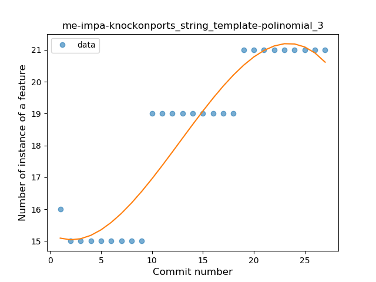
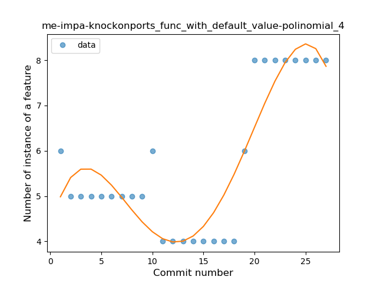
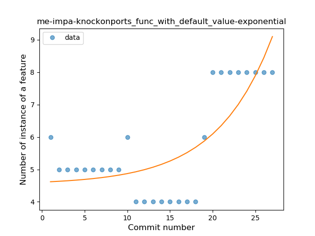
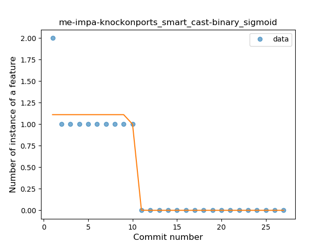
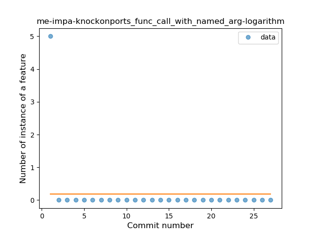

## me-impa-knockonports
----
#### Metrics provided by Detekt
* Number of lines of code 4408
* Number of Kotlin files: 44
* Cyclomatic complexity: 622
* Cyclomatic complexity by thousands of lines: 306 

----
**16** features analyzed

*	<a href="#type_inference">Type Inference</a> 
*	<a href="#lambda">Lambda</a> 
*	<a href="#safe_call">Safe Call</a> 
*	<a href="#when_expr">When expression</a> 
*	<a href="#unsafe_call">Unsafe Call</a> 
*	<a href="#companion_object">Companion Object</a> 
*	<a href="#string_template">String Template</a> 
*	<a href="#func_with_default_value">Function with Default Value</a> 
*	<a href="#singleton">Singleton</a> 
*	<a href="#range_expr">Range Expression</a> 
*	<a href="#smart_cast">Smart Cast</a> 
*	<a href="#data_class">Data Class</a> 
*	<a href="#func_call_with_named_arg">Function call with Named Argument</a> 
*	<a href="#extension_function">Extension Function</a> 
*	<a href="#property_delegation">Property Delegation</a> 
*	<a href="#inline_func">Inline Function</a> 

### <a name="type_inference">Type Inference</a>
----
#### Functions
* **Constant Rise - Linear:** 
    * **R_Squared:** 0.91454016
* **Sudden Rise Plateau - Logarithm:** 
    * **R_Squared:** 0.89614644

**Plots** :chart_with_upwards_trend:
-----

### <a name="lambda">Lambda</a>
----
#### Functions
* **Instability - Polinomial 4:** 
    * **R_Squared:** 0.89793567
* **Sudden Rise Plateau - Logarithm:** 
    * **R_Squared:** 0.76432787
* **Constant Rise - Linear:** 
    * **R_Squared:** 0.73219149

**Plots** :chart_with_upwards_trend:
-----

### <a name="safe_call">Safe Call</a>
----
#### Functions
* **Instability - Polinomial 4:** 
    * **R_Squared:** 0.633582
* **Instability - Polinomial 3:** )
    * **R_Squared:** 0.61467692
* **Sudden Rise Plateau - Logarithm:** 
    * **R_Squared:** 0.39169336
* **Constant Rise - Linear:** 
    * **R_Squared:** 0.27821987
* **Sudden Rise - Exponential:** 
    * **R_Squared:** 0.27440186

**Plots** :chart_with_upwards_trend:
-----

### <a name="when_expr">When expression</a>
----
#### Functions
* **Constant Rise - Linear:** 
    * **R_Squared:** 0.94996462
* **Sudden Rise - Exponential:** 
    * **R_Squared:** 0.95790452
* **Sudden Rise Plateau - Logarithm:** 
    * **R_Squared:** 0.73454943
* **Plateau Sudden Rise - Binary Sigmoid:** 
    * **R_Squared:** 0.14414414

**Plots** :chart_with_upwards_trend:
-----

### <a name="unsafe_call">Unsafe Call</a>
----
#### Functions
* **Instability - Polinomial 4:** 
    * **R_Squared:** 0.94125562
* **Constant Rise - Linear:** 
    * **R_Squared:** 0.82543906
* **Sudden Rise Plateau - Logarithm:** 
    * **R_Squared:** 0.78795479

**Plots** :chart_with_upwards_trend:
-----

### <a name="companion_object">Companion Object</a>
----
#### Functions
* **Instability - Polinomial 4:** 
    * **R_Squared:** 0.90683679
* **Constant Rise - Linear:** 
    * **R_Squared:** 0.70900222
* **Sudden Rise Plateau - Logarithm:** 
    * **R_Squared:** 0.66281432

**Plots** :chart_with_upwards_trend:
-----

### <a name="string_template">String Template</a>
----
#### Functions
* **Instability - Polinomial 3:** )
    * **R_Squared:** 0.88932826
* **Constant Rise - Linear:** 
    * **R_Squared:** 0.84158847
* **Sudden Rise Plateau - Logarithm:** 
    * **R_Squared:** 0.70132367

**Plots** :chart_with_upwards_trend:
-----

### <a name="func_with_default_value">Function with Default Value</a>
----
#### Functions
* **Instability - Polinomial 4:** 
    * **R_Squared:** 0.81113851
* **Sudden Rise - Exponential:** 
    * **R_Squared:** 0.60170728
* **Constant Rise - Linear:** 
    * **R_Squared:** 0.39406126
* **Sudden Rise Plateau - Logarithm:** 
    * **R_Squared:** 0.15693053

**Plots** :chart_with_upwards_trend:
-----

### <a name="singleton">Singleton</a>
----
#### Functions
* **Plateau Gradual Rise - Sigmoid:** 
    * **R_Squared:** 0.94561898
* **Sudden Rise Plateau - Logarithm:** 
    * **R_Squared:** 0.87486377
* **Constant Rise - Linear:** 
    * **R_Squared:** 0.84848485

**Plots** :chart_with_upwards_trend:
-----

### <a name="range_expr">Range Expression</a>
----
#### Functions
* **Instability - Polinomial 3:** )
    * **R_Squared:** 0.83593423
* **Plateau Sudden Rise - Binary Sigmoid:** 
    * **R_Squared:** 0.8054602
* **Sudden Rise Plateau - Logarithm:** 
    * **R_Squared:** 0.52575956
* **Constant Rise - Linear:** 
    * **R_Squared:** 0.47340817

**Plots** :chart_with_upwards_trend:
-----

### <a name="smart_cast">Smart Cast</a>
----
#### Functions
* **Plateau Sudden Decline - Binary Sigmoid:** 
    * **R_Squared:** 0.89565241
* **Sudden Decline - Exponential:** 
    * **R_Squared:** 0.80974372
* **Constant Decline - Linear:** 
    * **R_Squared:** 0.68829431
* **Sudden Rise Plateau - Logarithm:** 
    * **R_Squared:** -0.0

**Plots** :chart_with_upwards_trend:
-----

### <a name="data_class">Data Class</a>
----
#### Functions
* **Instability - Polinomial 4:** 
    * **R_Squared:** 0.80769228
* **Sudden Rise Plateau - Logarithm:** 
    * **R_Squared:** 0.05960647
* **Constant Rise - Linear:** 
    * **R_Squared:** 0.00242405

**Plots** :chart_with_upwards_trend:
-----

### <a name="func_call_with_named_arg">Function call with Named Argument</a>
----
#### Functions
* **Instability - Polinomial 4:** 
    * **R_Squared:** 0.59796599
* **Instability - Polinomial 3:** )
    * **R_Squared:** 0.43349754
* **Constant Decline - Linear:** 
    * **R_Squared:** 0.10714286
* **Sudden Rise Plateau - Logarithm:** 
    * **R_Squared:** -0.0

**Plots** :chart_with_upwards_trend:
-----

### <a name="extension_function">Extension Function</a>
----
#### Functions
* **Instability - Polinomial 4:** 
    * **R_Squared:** 0.84698653
* **Instability - Polinomial 3:** )
    * **R_Squared:** 0.66470746
* **Sudden Rise - Exponential:** 
    * **R_Squared:** 0.441512
* **Constant Rise - Linear:** 
    * **R_Squared:** 0.13811568
* **Sudden Rise Plateau - Logarithm:** 
    * **R_Squared:** 0.08491101

**Plots** :chart_with_upwards_trend:
-----

### <a name="property_delegation">Property Delegation</a>
----
#### Functions
* **Instability - Polinomial 4:** 
    * **R_Squared:** 0.91845039
* **Sudden Rise Plateau - Logarithm:** 
    * **R_Squared:** 0.70431325
* **Constant Rise - Linear:** 
    * **R_Squared:** 0.64422263

**Plots** :chart_with_upwards_trend:
-----

### <a name="inline_func">Inline Function</a>
----
#### Functions
* **Plateau Sudden Decline - Binary Sigmoid:** 
    * **R_Squared:** 0.98328748
* **Instability - Polinomial 4:** 
    * **R_Squared:** 0.88436551
* **Instability - Polinomial 3:** )
    * **R_Squared:** 0.79419594
* **Sudden Decline - Exponential:** 
    * **R_Squared:** 0.70098131
* **Constant Decline - Linear:** 
    * **R_Squared:** 0.66392067
* **Sudden Rise Plateau - Logarithm:** 
    * **R_Squared:** -0.0

**Plots** :chart_with_upwards_trend:
-----

