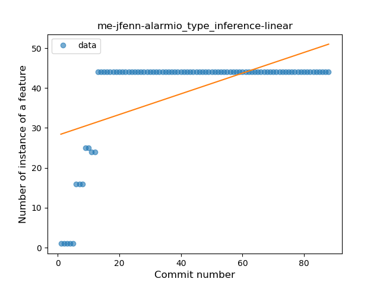
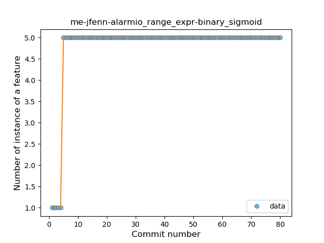

## me-jfenn-alarmio
----
#### Metrics provided by Detekt
* Number of lines of code 1860
* Number of Kotlin files: 20
* Cyclomatic complexity: 282
* Cyclomatic complexity by thousands of lines: 312 

----
**5** features analyzed

*	<a href="#type_inference">Type Inference</a> 
*	<a href="#lambda">Lambda</a> 
*	<a href="#safe_call">Safe Call</a> 
*	<a href="#unsafe_call">Unsafe Call</a> 
*	<a href="#range_expr">Range Expression</a> 

### <a name="type_inference">Type Inference</a>
----
#### Functions
* **Instability - Polinomial 3:** )
    * **R_Squared:** 0.86899147
* **Sudden Rise Plateau - Logarithm:** 
    * **R_Squared:** 0.70169244
* **Constant Rise - Linear:** 
    * **R_Squared:** 0.33182372
* **Plateau Sudden Rise - Binary Sigmoid:** 
    * **R_Squared:** 0.20279435

**Plots** :chart_with_upwards_trend:
-----

### <a name="lambda">Lambda</a>
----
#### Functions
* **Instability - Polinomial 3:** )
    * **R_Squared:** 0.69396533
* **Sudden Rise Plateau - Logarithm:** 
    * **R_Squared:** 0.57058431
* **Constant Rise - Linear:** 
    * **R_Squared:** 0.20575705

**Plots** :chart_with_upwards_trend:
-----

### <a name="safe_call">Safe Call</a>
----
#### Functions
* **Instability - Polinomial 3:** )
    * **R_Squared:** 0.65684164
* **Sudden Rise Plateau - Logarithm:** 
    * **R_Squared:** 0.54313225
* **Constant Rise - Linear:** 
    * **R_Squared:** 0.18751464
* **Plateau Sudden Rise - Binary Sigmoid:** 
    * **R_Squared:** 0.05694939

**Plots** :chart_with_upwards_trend:
-----

### <a name="unsafe_call">Unsafe Call</a>
----
#### Functions
* **Sudden Decline - Exponential:** 
    * **R_Squared:** 0.84057822
* **Constant Decline - Linear:** 
    * **R_Squared:** 0.12373947
* **Sudden Rise Plateau - Logarithm:** 
    * **R_Squared:** -0.0

**Plots** :chart_with_upwards_trend:
-----

### <a name="range_expr">Range Expression</a>
----
#### Functions
* **Plateau Sudden Rise - Binary Sigmoid:** 
    * **R_Squared:** 1.0
* **Sudden Rise Plateau - Logarithm:** 
    * **R_Squared:** 0.43714855
* **Constant Rise - Linear:** 
    * **R_Squared:** 0.14252227

**Plots** :chart_with_upwards_trend:
-----

