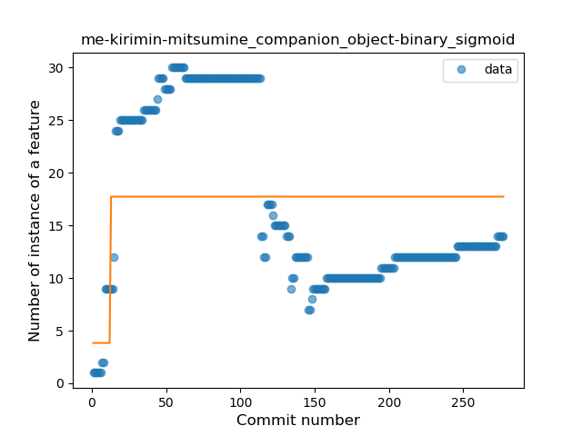
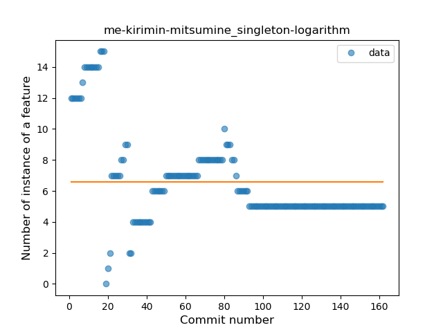

## me-kirimin-mitsumine
----
#### Metrics provided by Detekt
* Number of lines of code 4683
* Number of Kotlin files: 96
* Cyclomatic complexity: 592
* Cyclomatic complexity by thousands of lines: 240 

----
**14** features analyzed

*	<a href="#type_inference">Type Inference</a> 
*	<a href="#lambda">Lambda</a> 
*	<a href="#safe_call">Safe Call</a> 
*	<a href="#when_expr">When expression</a> 
*	<a href="#unsafe_call">Unsafe Call</a> 
*	<a href="#companion_object">Companion Object</a> 
*	<a href="#string_template">String Template</a> 
*	<a href="#func_with_default_value">Function with Default Value</a> 
*	<a href="#singleton">Singleton</a> 
*	<a href="#range_expr">Range Expression</a> 
*	<a href="#smart_cast">Smart Cast</a> 
*	<a href="#data_class">Data Class</a> 
*	<a href="#func_call_with_named_arg">Function call with Named Argument</a> 
*	<a href="#extension_function">Extension Function</a> 

### <a name="type_inference">Type Inference</a>
----
#### Functions
* **Instability - Polinomial 3:** )
    * **R_Squared:** 0.42808594
* **Sudden Rise Plateau - Logarithm:** 
    * **R_Squared:** 0.11703713
* **Sudden Rise - Exponential:** 
    * **R_Squared:** 0.02543188
* **Plateau Sudden Rise - Binary Sigmoid:** 
    * **R_Squared:** 0.02829315
* **Constant Rise - Linear:** 
    * **R_Squared:** 0.0098112

**Plots** :chart_with_upwards_trend:
-----

### <a name="lambda">Lambda</a>
----
#### Functions
* **Constant Decline - Linear:** 
    * **R_Squared:** 0.00626561
* **Sudden Decline - Exponential:** 
    * **R_Squared:** 0.00719669
* **Sudden Rise Plateau - Logarithm:** 
    * **R_Squared:** 0.01533576

**Plots** :chart_with_upwards_trend:
-----

### <a name="safe_call">Safe Call</a>
----
#### Functions
* **Plateau Gradual Rise - Sigmoid:** 
    * **R_Squared:** 0.80296988
* **Constant Rise - Linear:** 
    * **R_Squared:** 0.35588709
* **Sudden Rise Plateau - Logarithm:** 
    * **R_Squared:** 0.31559733

**Plots** :chart_with_upwards_trend:
-----

### <a name="when_expr">When expression</a>
----
#### Functions
* **Plateau Gradual Rise - Sigmoid:** 
    * **R_Squared:** 0.90823766
* **Constant Rise - Linear:** 
    * **R_Squared:** 0.86789646
* **Sudden Rise - Exponential:** 
    * **R_Squared:** 0.87042656
* **Sudden Rise Plateau - Logarithm:** 
    * **R_Squared:** 0.46757351

**Plots** :chart_with_upwards_trend:
-----

### <a name="unsafe_call">Unsafe Call</a>
----
#### Functions
* **Constant Decline - Linear:** 
    * **R_Squared:** 0.09179516
* **Plateau Sudden Rise - Binary Sigmoid:** 
    * **R_Squared:** 0.04181991
* **Sudden Decline - Exponential:** 
    * **R_Squared:** 0.0
* **Sudden Rise Plateau - Logarithm:** 
    * **R_Squared:** 0.0

**Plots** :chart_with_upwards_trend:
-----

### <a name="companion_object">Companion Object</a>
----
#### Functions
* **Constant Decline - Linear:** 
    * **R_Squared:** 0.28220529
* **Plateau Sudden Rise - Binary Sigmoid:** 
    * **R_Squared:** 0.11395209
* **Sudden Decline - Exponential:** 
    * **R_Squared:** -0.0
* **Sudden Rise Plateau - Logarithm:** 
    * **R_Squared:** -0.0

**Plots** :chart_with_upwards_trend:
-----

### <a name="string_template">String Template</a>
----
#### Functions
* **Plateau Gradual Rise - Sigmoid:** 
    * **R_Squared:** 0.90194863
* **Constant Rise - Linear:** 
    * **R_Squared:** 0.78185356
* **Sudden Rise Plateau - Logarithm:** 
    * **R_Squared:** 0.69153346

**Plots** :chart_with_upwards_trend:
-----

### <a name="func_with_default_value">Function with Default Value</a>
----
#### Functions
* **Constant Rise - Linear:** 
    * **R_Squared:** 0.86079395
* **Sudden Rise Plateau - Logarithm:** 
    * **R_Squared:** 0.49385403

**Plots** :chart_with_upwards_trend:
-----

### <a name="singleton">Singleton</a>
----
#### Functions
* **Sudden Decline - Exponential:** 
    * **R_Squared:** 0.4693307
* **Constant Decline - Linear:** 
    * **R_Squared:** 0.30430283
* **Sudden Rise Plateau - Logarithm:** 
    * **R_Squared:** -0.0

**Plots** :chart_with_upwards_trend:
-----

### <a name="range_expr">Range Expression</a>
----
#### Functions
* **Constant Decline - Linear:** 
    * **R_Squared:** 0.2623018
* **Sudden Rise Plateau - Logarithm:** 
    * **R_Squared:** 0.0

**Plots** :chart_with_upwards_trend:
-----

### <a name="smart_cast">Smart Cast</a>
----
#### Functions
* **Plateau Gradual Rise - Sigmoid:** 
    * **R_Squared:** 0.97017328
* **Sudden Rise - Exponential:** 
    * **R_Squared:** 0.8113206
* **Constant Rise - Linear:** 
    * **R_Squared:** 0.69218984
* **Sudden Rise Plateau - Logarithm:** 
    * **R_Squared:** 0.22288334

**Plots** :chart_with_upwards_trend:
-----

### <a name="data_class">Data Class</a>
----
#### Functions
* **Plateau Gradual Rise - Sigmoid:** 
    * **R_Squared:** 0.93848789
* **Instability - Polinomial 3:** )
    * **R_Squared:** 0.78378723
* **Sudden Rise Plateau - Logarithm:** 
    * **R_Squared:** 0.63682227
* **Constant Rise - Linear:** 
    * **R_Squared:** 0.26412569

**Plots** :chart_with_upwards_trend:
-----

### <a name="func_call_with_named_arg">Function call with Named Argument</a>
----
#### Functions
* **Sudden Rise - Exponential:** 
    * **R_Squared:** 0.77422338
* **Constant Rise - Linear:** 
    * **R_Squared:** 0.75700553
* **Sudden Rise Plateau - Logarithm:** 
    * **R_Squared:** 0.40119085
* **Plateau Gradual Rise - Sigmoid:** 
    * **R_Squared:** 0.05875685

**Plots** :chart_with_upwards_trend:
-----

### <a name="extension_function">Extension Function</a>
----
#### Functions
* **Sudden Decline - Exponential:** 
    * **R_Squared:** 0.71433064
* **Constant Decline - Linear:** 
    * **R_Squared:** 0.45542922
* **Sudden Rise Plateau - Logarithm:** 
    * **R_Squared:** -0.0

**Plots** :chart_with_upwards_trend:
-----

