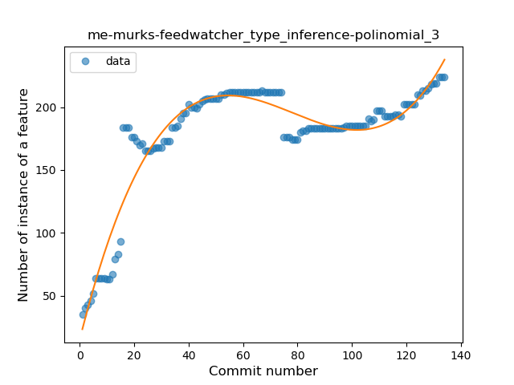
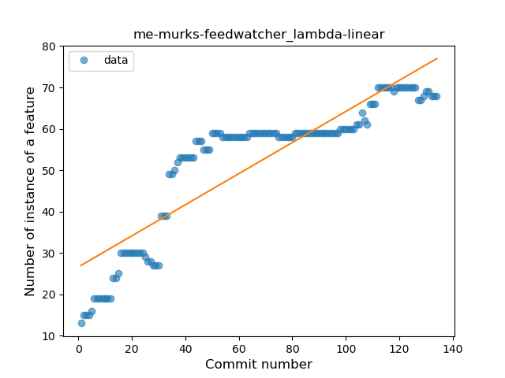
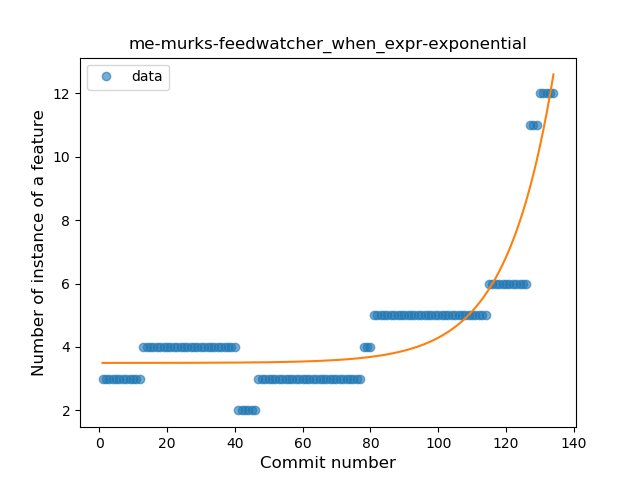
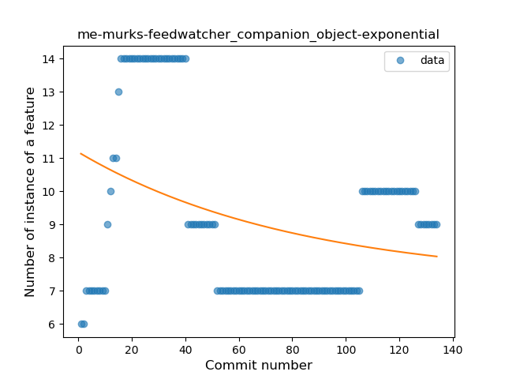
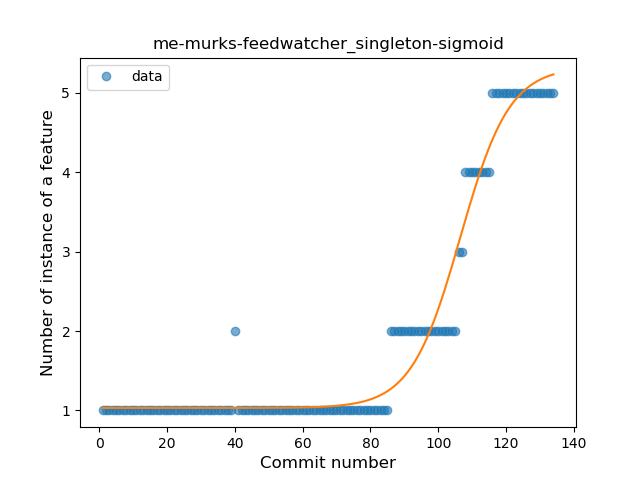
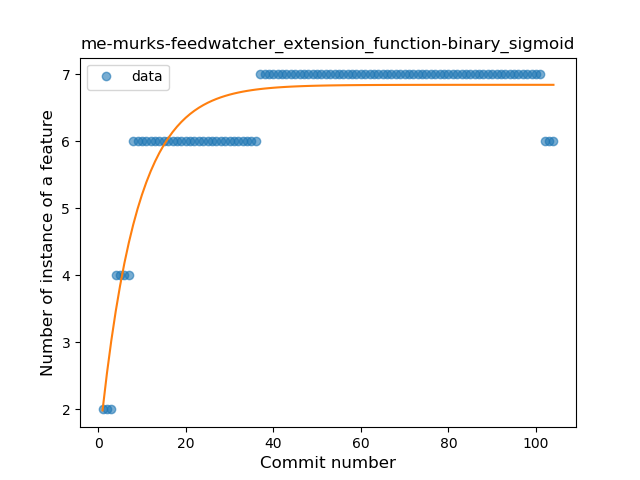

## me-murks-feedwatcher
----
#### Metrics provided by Detekt
* Number of lines of code 4116
* Number of Kotlin files: 59
* Cyclomatic complexity: 484
* Cyclomatic complexity by thousands of lines: 207 

----
**12** features analyzed

*	<a href="#type_inference">Type Inference</a> 
*	<a href="#lambda">Lambda</a> 
*	<a href="#safe_call">Safe Call</a> 
*	<a href="#when_expr">When expression</a> 
*	<a href="#unsafe_call">Unsafe Call</a> 
*	<a href="#companion_object">Companion Object</a> 
*	<a href="#string_template">String Template</a> 
*	<a href="#func_with_default_value">Function with Default Value</a> 
*	<a href="#singleton">Singleton</a> 
*	<a href="#smart_cast">Smart Cast</a> 
*	<a href="#data_class">Data Class</a> 
*	<a href="#extension_function">Extension Function</a> 

### <a name="type_inference">Type Inference</a>
----
#### Functions
* **Instability - Polinomial 3:** )
    * **R_Squared:** 0.90506984
* **Sudden Rise Plateau - Logarithm:** 
    * **R_Squared:** 0.6968051
* **Constant Rise - Linear:** 
    * **R_Squared:** 0.37635707

**Plots** :chart_with_upwards_trend:
-----

### <a name="lambda">Lambda</a>
----
#### Functions
* **Sudden Rise Plateau - Logarithm:** 
    * **R_Squared:** 0.84867158
* **Constant Rise - Linear:** 
    * **R_Squared:** 0.7903026

**Plots** :chart_with_upwards_trend:
-----

### <a name="safe_call">Safe Call</a>
----
#### Functions
* **Constant Rise - Linear:** 
    * **R_Squared:** 0.86181458
* **Sudden Rise Plateau - Logarithm:** 
    * **R_Squared:** 0.84000026

**Plots** :chart_with_upwards_trend:
-----

### <a name="when_expr">When expression</a>
----
#### Functions
* **Sudden Rise - Exponential:** 
    * **R_Squared:** 0.83792193
* **Constant Rise - Linear:** 
    * **R_Squared:** 0.45811797
* **Sudden Rise Plateau - Logarithm:** 
    * **R_Squared:** 0.22251818

**Plots** :chart_with_upwards_trend:
-----

### <a name="unsafe_call">Unsafe Call</a>
----
#### Functions
* **Sudden Rise - Exponential:** 
    * **R_Squared:** 0.82102437
* **Constant Rise - Linear:** 
    * **R_Squared:** 0.78711408
* **Sudden Rise Plateau - Logarithm:** 
    * **R_Squared:** 0.58396296
* **Plateau Gradual Rise - Sigmoid:** 
    * **R_Squared:** 0.40655708

**Plots** :chart_with_upwards_trend:
-----

### <a name="companion_object">Companion Object</a>
----
#### Functions
* **Sudden Decline - Exponential:** 
    * **R_Squared:** 0.11215914
* **Constant Decline - Linear:** 
    * **R_Squared:** 0.09510928
* **Plateau Sudden Rise - Binary Sigmoid:** 
    * **R_Squared:** 0.06621312
* **Sudden Rise Plateau - Logarithm:** 
    * **R_Squared:** -0.0

**Plots** :chart_with_upwards_trend:
-----

### <a name="string_template">String Template</a>
----
#### Functions
* **Instability - Polinomial 3:** )
    * **R_Squared:** 0.72419554
* **Sudden Rise Plateau - Logarithm:** 
    * **R_Squared:** 0.34985716
* **Constant Rise - Linear:** 
    * **R_Squared:** 0.13209941

**Plots** :chart_with_upwards_trend:
-----

### <a name="func_with_default_value">Function with Default Value</a>
----
#### Functions
* **Plateau Gradual Rise - Sigmoid:** 
    * **R_Squared:** 0.62871756
* **Sudden Rise Plateau - Logarithm:** 
    * **R_Squared:** 0.5513991
* **Constant Rise - Linear:** 
    * **R_Squared:** 0.30188724

**Plots** :chart_with_upwards_trend:
-----

### <a name="singleton">Singleton</a>
----
#### Functions
* **Plateau Gradual Rise - Sigmoid:** 
    * **R_Squared:** 0.96884547
* **Sudden Rise - Exponential:** 
    * **R_Squared:** 0.90787443
* **Constant Rise - Linear:** 
    * **R_Squared:** 0.64658321
* **Sudden Rise Plateau - Logarithm:** 
    * **R_Squared:** 0.25664631

**Plots** :chart_with_upwards_trend:
-----

### <a name="smart_cast">Smart Cast</a>
----
#### Functions
* **Sudden Rise - Exponential:** 
    * **R_Squared:** 0.59281172
* **Constant Rise - Linear:** 
    * **R_Squared:** 0.0572344
* **Plateau Sudden Rise - Binary Sigmoid:** 
    * **R_Squared:** 0.01800425
* **Sudden Rise Plateau - Logarithm:** 
    * **R_Squared:** 0.00728064

**Plots** :chart_with_upwards_trend:
-----

### <a name="data_class">Data Class</a>
----
#### Functions
* **Constant Decline - Linear:** 
    * **R_Squared:** 0.30715731
* **Plateau Sudden Rise - Binary Sigmoid:** 
    * **R_Squared:** 0.1026364
* **Sudden Rise Plateau - Logarithm:** 
    * **R_Squared:** -0.0

**Plots** :chart_with_upwards_trend:
-----

### <a name="extension_function">Extension Function</a>
----
#### Functions
* **Plateau Sudden Rise - Binary Sigmoid:** 
    * **R_Squared:** 0.8471271
* **Sudden Rise Plateau - Logarithm:** 
    * **R_Squared:** 0.76886991
* **Constant Rise - Linear:** 
    * **R_Squared:** 0.41115461

**Plots** :chart_with_upwards_trend:
-----

