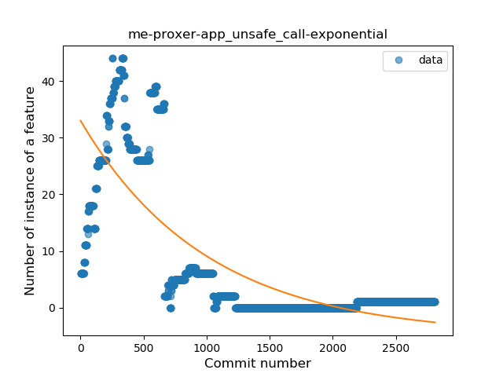
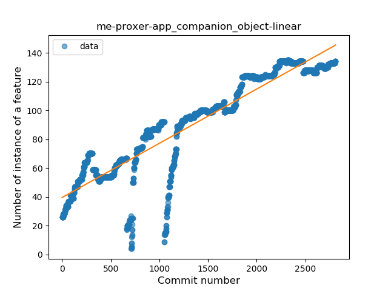
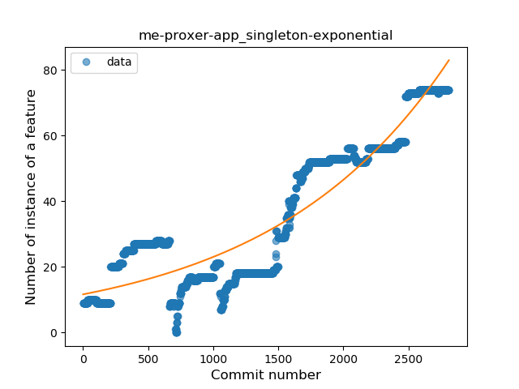
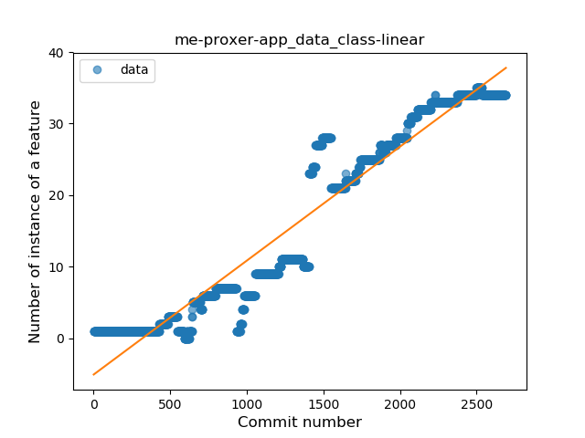
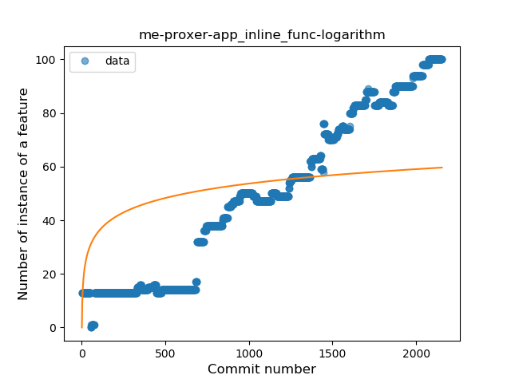

## me-proxer-app
----
#### Metrics provided by Detekt
* Number of lines of code 35156
* Number of Kotlin files: 386
* Cyclomatic complexity: 4650
* Cyclomatic complexity by thousands of lines: 267 

----
**20** features analyzed

*	<a href="#type_inference">Type Inference</a> 
*	<a href="#lambda">Lambda</a> 
*	<a href="#safe_call">Safe Call</a> 
*	<a href="#when_expr">When expression</a> 
*	<a href="#unsafe_call">Unsafe Call</a> 
*	<a href="#companion_object">Companion Object</a> 
*	<a href="#string_template">String Template</a> 
*	<a href="#func_with_default_value">Function with Default Value</a> 
*	<a href="#singleton">Singleton</a> 
*	<a href="#range_expr">Range Expression</a> 
*	<a href="#smart_cast">Smart Cast</a> 
*	<a href="#data_class">Data Class</a> 
*	<a href="#func_call_with_named_arg">Function call with Named Argument</a> 
*	<a href="#extension_function">Extension Function</a> 
*	<a href="#property_delegation">Property Delegation</a> 
*	<a href="#destructuring_declaration">Destructuring Declaration</a> 
*	<a href="#inline_func">Inline Function</a> 
*	<a href="#overloaded_op">Overloaded Operator</a> 
*	<a href="#sealed_class">Sealed Class</a> 
*	<a href="#type_alias">Type Alias</a> 

### <a name="type_inference">Type Inference</a>
----
#### Functions
* **Sudden Rise - Exponential:** 
    * **R_Squared:** 0.9466898
* **Constant Rise - Linear:** 
    * **R_Squared:** 0.90902963
* **Sudden Rise Plateau - Logarithm:** 
    * **R_Squared:** 0.33498922

**Plots** :chart_with_upwards_trend:
-----

### <a name="lambda">Lambda</a>
----
#### Functions
* **Constant Rise - Linear:** 
    * **R_Squared:** 0.96363552
* **Sudden Rise - Exponential:** 
    * **R_Squared:** 0.96683711
* **Sudden Rise Plateau - Logarithm:** 
    * **R_Squared:** 0.35221209
* **Plateau Gradual Rise - Sigmoid:** 
    * **R_Squared:** 0.21848466

**Plots** :chart_with_upwards_trend:
-----

### <a name="safe_call">Safe Call</a>
----
#### Functions
* **Plateau Gradual Rise - Sigmoid:** 
    * **R_Squared:** 0.97230181
* **Sudden Rise - Exponential:** 
    * **R_Squared:** 0.95883551
* **Constant Rise - Linear:** 
    * **R_Squared:** 0.94602001
* **Sudden Rise Plateau - Logarithm:** 
    * **R_Squared:** 0.32180461

**Plots** :chart_with_upwards_trend:
-----

### <a name="when_expr">When expression</a>
----
#### Functions
* **Constant Rise - Linear:** 
    * **R_Squared:** 0.95378945
* **Sudden Rise Plateau - Logarithm:** 
    * **R_Squared:** 0.42725404
* **Plateau Sudden Rise - Binary Sigmoid:** 
    * **R_Squared:** 0.34633837

**Plots** :chart_with_upwards_trend:
-----

### <a name="unsafe_call">Unsafe Call</a>
----
#### Functions
* **Sudden Decline - Exponential:** 
    * **R_Squared:** 0.59733317
* **Constant Decline - Linear:** 
    * **R_Squared:** 0.49478981
* **Sudden Rise Plateau - Logarithm:** 
    * **R_Squared:** -0.0
* **Plateau Gradual Rise - Sigmoid:** 
    * **R_Squared:** 0.00013116

**Plots** :chart_with_upwards_trend:
-----

### <a name="companion_object">Companion Object</a>
----
#### Functions
* **Constant Rise - Linear:** 
    * **R_Squared:** 0.84450885
* **Sudden Rise Plateau - Logarithm:** 
    * **R_Squared:** 0.49445682
* **Plateau Sudden Rise - Binary Sigmoid:** 
    * **R_Squared:** 0.05096415

**Plots** :chart_with_upwards_trend:
-----

### <a name="string_template">String Template</a>
----
#### Functions
* **Constant Rise - Linear:** 
    * **R_Squared:** 0.69442421
* **Sudden Rise Plateau - Logarithm:** 
    * **R_Squared:** 0.45419502

**Plots** :chart_with_upwards_trend:
-----

### <a name="func_with_default_value">Function with Default Value</a>
----
#### Functions
* **Sudden Rise - Exponential:** 
    * **R_Squared:** 0.89998262
* **Constant Rise - Linear:** 
    * **R_Squared:** 0.88571748
* **Sudden Rise Plateau - Logarithm:** 
    * **R_Squared:** 0.45576185
* **Plateau Sudden Rise - Binary Sigmoid:** 
    * **R_Squared:** 0.04455889

**Plots** :chart_with_upwards_trend:
-----

### <a name="singleton">Singleton</a>
----
#### Functions
* **Sudden Rise - Exponential:** 
    * **R_Squared:** 0.86138479
* **Constant Rise - Linear:** 
    * **R_Squared:** 0.7961466
* **Sudden Rise Plateau - Logarithm:** 
    * **R_Squared:** 0.27747141

**Plots** :chart_with_upwards_trend:
-----

### <a name="range_expr">Range Expression</a>
----
#### Functions
* **Sudden Rise - Exponential:** 
    * **R_Squared:** 0.66218251
* **Constant Rise - Linear:** 
    * **R_Squared:** 0.45509408
* **Sudden Rise Plateau - Logarithm:** 
    * **R_Squared:** 0.15503121

**Plots** :chart_with_upwards_trend:
-----

### <a name="smart_cast">Smart Cast</a>
----
#### Functions
* **Constant Rise - Linear:** 
    * **R_Squared:** 0.73229277
* **Sudden Rise Plateau - Logarithm:** 
    * **R_Squared:** 0.41608207
* **Plateau Sudden Rise - Binary Sigmoid:** 
    * **R_Squared:** 0.24838454

**Plots** :chart_with_upwards_trend:
-----

### <a name="data_class">Data Class</a>
----
#### Functions
* **Plateau Gradual Rise - Sigmoid:** 
    * **R_Squared:** 0.96389123
* **Constant Rise - Linear:** 
    * **R_Squared:** 0.92713041
* **Sudden Rise - Exponential:** 
    * **R_Squared:** 0.93096293
* **Sudden Rise Plateau - Logarithm:** 
    * **R_Squared:** 0.25931138

**Plots** :chart_with_upwards_trend:
-----

### <a name="func_call_with_named_arg">Function call with Named Argument</a>
----
#### Functions
* **Sudden Rise - Exponential:** 
    * **R_Squared:** 0.9435392
* **Constant Rise - Linear:** 
    * **R_Squared:** 0.78129576
* **Sudden Rise Plateau - Logarithm:** 
    * **R_Squared:** 0.20988483

**Plots** :chart_with_upwards_trend:
-----

### <a name="extension_function">Extension Function</a>
----
#### Functions
* **Constant Rise - Linear:** 
    * **R_Squared:** 0.9664094
* **Sudden Rise - Exponential:** 
    * **R_Squared:** 0.97554091
* **Plateau Sudden Rise - Binary Sigmoid:** 
    * **R_Squared:** 0.42374726
* **Sudden Rise Plateau - Logarithm:** 
    * **R_Squared:** 0.36424285

**Plots** :chart_with_upwards_trend:
-----

### <a name="property_delegation">Property Delegation</a>
----
#### Functions
* **Constant Rise - Linear:** 
    * **R_Squared:** 0.93963536
* **Sudden Rise - Exponential:** 
    * **R_Squared:** 0.94332782
* **Sudden Rise Plateau - Logarithm:** 
    * **R_Squared:** 0.38885065
* **Plateau Sudden Rise - Binary Sigmoid:** 
    * **R_Squared:** 0.13885102

**Plots** :chart_with_upwards_trend:
-----

### <a name="destructuring_declaration">Destructuring Declaration</a>
----
#### Functions
* **Sudden Rise - Exponential:** 
    * **R_Squared:** 0.93244129
* **Constant Rise - Linear:** 
    * **R_Squared:** 0.90348518
* **Sudden Rise Plateau - Logarithm:** 
    * **R_Squared:** 0.22447207
* **Plateau Sudden Rise - Binary Sigmoid:** 
    * **R_Squared:** 0.01242771

**Plots** :chart_with_upwards_trend:
-----

### <a name="inline_func">Inline Function</a>
----
#### Functions
* **Constant Rise - Linear:** 
    * **R_Squared:** 0.96196902
* **Sudden Rise - Exponential:** 
    * **R_Squared:** 0.96705633
* **Sudden Rise Plateau - Logarithm:** 
    * **R_Squared:** 0.33882599

**Plots** :chart_with_upwards_trend:
-----

### <a name="overloaded_op">Overloaded Operator</a>
----
#### Functions
* **Sudden Rise - Exponential:** 
    * **R_Squared:** 0.22055571
* **Constant Rise - Linear:** 
    * **R_Squared:** 0.02361593
* **Sudden Rise Plateau - Logarithm:** 
    * **R_Squared:** -0.0

**Plots** :chart_with_upwards_trend:
-----

### <a name="sealed_class">Sealed Class</a>
----
#### Functions
* **Sudden Decline - Exponential:** 
    * **R_Squared:** 0.1254801
* **Constant Decline - Linear:** 
    * **R_Squared:** 0.00310948
* **Sudden Rise Plateau - Logarithm:** 
    * **R_Squared:** -0.0

**Plots** :chart_with_upwards_trend:
-----

### <a name="type_alias">Type Alias</a>
----
#### Functions
* **Plateau Sudden Rise - Binary Sigmoid:** 
    * **R_Squared:** 0.59829984
* **Sudden Rise Plateau - Logarithm:** 
    * **R_Squared:** 0.26226662
* **Constant Rise - Linear:** 
    * **R_Squared:** 0.1164124

**Plots** :chart_with_upwards_trend:
-----

