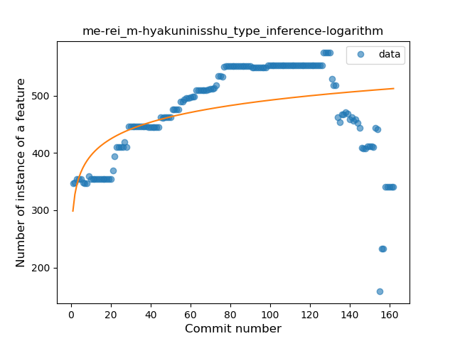
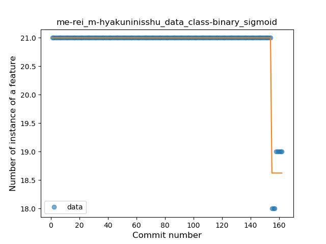
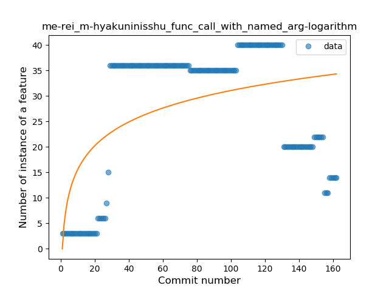
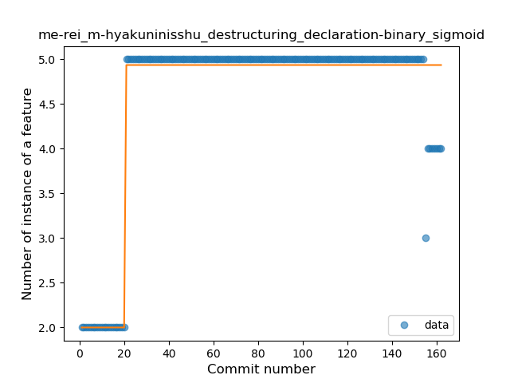

## me-rei_m-hyakuninisshu
----
#### Metrics provided by Detekt
* Number of lines of code 14644
* Number of Kotlin files: 230
* Cyclomatic complexity: 1098
* Cyclomatic complexity by thousands of lines: 184 

----
**18** features analyzed

*	<a href="#type_inference">Type Inference</a> 
*	<a href="#lambda">Lambda</a> 
*	<a href="#safe_call">Safe Call</a> 
*	<a href="#when_expr">When expression</a> 
*	<a href="#unsafe_call">Unsafe Call</a> 
*	<a href="#companion_object">Companion Object</a> 
*	<a href="#string_template">String Template</a> 
*	<a href="#func_with_default_value">Function with Default Value</a> 
*	<a href="#singleton">Singleton</a> 
*	<a href="#range_expr">Range Expression</a> 
*	<a href="#smart_cast">Smart Cast</a> 
*	<a href="#data_class">Data Class</a> 
*	<a href="#func_call_with_named_arg">Function call with Named Argument</a> 
*	<a href="#extension_function">Extension Function</a> 
*	<a href="#property_delegation">Property Delegation</a> 
*	<a href="#destructuring_declaration">Destructuring Declaration</a> 
*	<a href="#overloaded_op">Overloaded Operator</a> 
*	<a href="#coroutine">Coroutine</a> 

### <a name="type_inference">Type Inference</a>
----
#### Functions
* **Sudden Rise Plateau - Logarithm:** 
    * **R_Squared:** 0.23957912
* **Constant Rise - Linear:** 
    * **R_Squared:** 0.07188323

**Plots** :chart_with_upwards_trend:
-----

### <a name="lambda">Lambda</a>
----
#### Functions
* **Constant Decline - Linear:** 
    * **R_Squared:** 0.18366427
* **Sudden Decline - Exponential:** 
    * **R_Squared:** 0.0
* **Sudden Rise Plateau - Logarithm:** 
    * **R_Squared:** -0.0

**Plots** :chart_with_upwards_trend:
-----

### <a name="safe_call">Safe Call</a>
----
#### Functions
* **Constant Decline - Linear:** 
    * **R_Squared:** 0.04989035
* **Sudden Decline - Exponential:** 
    * **R_Squared:** 0.0
* **Sudden Rise Plateau - Logarithm:** 
    * **R_Squared:** 0.00855047

**Plots** :chart_with_upwards_trend:
-----

### <a name="when_expr">When expression</a>
----
#### Functions
* **Plateau Sudden Rise - Binary Sigmoid:** 
    * **R_Squared:** 0.23915982
* **Sudden Rise Plateau - Logarithm:** 
    * **R_Squared:** 0.04957561
* **Constant Decline - Linear:** 
    * **R_Squared:** 0.00060177
* **Sudden Decline - Exponential:** 
    * **R_Squared:** 0.00058788

**Plots** :chart_with_upwards_trend:
-----

### <a name="unsafe_call">Unsafe Call</a>
----
#### Functions
* **Sudden Rise Plateau - Logarithm:** 
    * **R_Squared:** 0.11033048
* **Constant Rise - Linear:** 
    * **R_Squared:** 0.00388591

**Plots** :chart_with_upwards_trend:
-----

### <a name="companion_object">Companion Object</a>
----
#### Functions
* **Instability - Polinomial 3:** )
    * **R_Squared:** 0.80175685
* **Constant Rise - Linear:** 
    * **R_Squared:** 0.37580543
* **Sudden Rise Plateau - Logarithm:** 
    * **R_Squared:** 0.37373825

**Plots** :chart_with_upwards_trend:
-----

### <a name="string_template">String Template</a>
----
#### Functions
* **Plateau Gradual Rise - Sigmoid:** 
    * **R_Squared:** 0.65026534
* **Sudden Rise Plateau - Logarithm:** 
    * **R_Squared:** 0.60310083
* **Constant Rise - Linear:** 
    * **R_Squared:** 0.44423312

**Plots** :chart_with_upwards_trend:
-----

### <a name="func_with_default_value">Function with Default Value</a>
----
#### Functions
* **Sudden Rise Plateau - Logarithm:** 
    * **R_Squared:** 0.71495938
* **Plateau Gradual Rise - Sigmoid:** 
    * **R_Squared:** 0.62040719
* **Constant Rise - Linear:** 
    * **R_Squared:** 0.38270448

**Plots** :chart_with_upwards_trend:
-----

### <a name="singleton">Singleton</a>
----
#### Functions
* **Sudden Decline - Exponential:** 
    * **R_Squared:** 0.82301228
* **Constant Decline - Linear:** 
    * **R_Squared:** 0.80822755
* **Sudden Rise Plateau - Logarithm:** 
    * **R_Squared:** 0.0

**Plots** :chart_with_upwards_trend:
-----

### <a name="range_expr">Range Expression</a>
----
#### Functions
* **Plateau Gradual Rise - Sigmoid:** 
    * **R_Squared:** 0.22623807
* **Constant Decline - Linear:** 
    * **R_Squared:** 0.02791003
* **Sudden Rise Plateau - Logarithm:** 
    * **R_Squared:** 0.0259421

**Plots** :chart_with_upwards_trend:
-----

### <a name="smart_cast">Smart Cast</a>
----
#### Functions
* **Sudden Rise Plateau - Logarithm:** 
    * **R_Squared:** 0.07755599
* **Constant Decline - Linear:** 
    * **R_Squared:** 0.00255442
* **Sudden Decline - Exponential:** 
    * **R_Squared:** 0.00026694

**Plots** :chart_with_upwards_trend:
-----

### <a name="data_class">Data Class</a>
----
#### Functions
* **Plateau Sudden Decline - Binary Sigmoid:** 
    * **R_Squared:** 0.95812078
* **Constant Decline - Linear:** 
    * **R_Squared:** 0.13355941
* **Sudden Rise Plateau - Logarithm:** 
    * **R_Squared:** -0.0

**Plots** :chart_with_upwards_trend:
-----

### <a name="func_call_with_named_arg">Function call with Named Argument</a>
----
#### Functions
* **Plateau Sudden Rise - Binary Sigmoid:** 
    * **R_Squared:** 0.60431608
* **Sudden Rise Plateau - Logarithm:** 
    * **R_Squared:** 0.29795734
* **Constant Rise - Linear:** 
    * **R_Squared:** 0.07409146

**Plots** :chart_with_upwards_trend:
-----

### <a name="extension_function">Extension Function</a>
----
#### Functions
* **Sudden Rise Plateau - Logarithm:** 
    * **R_Squared:** 0.03038534
* **Constant Rise - Linear:** 
    * **R_Squared:** 0.00244793

**Plots** :chart_with_upwards_trend:
-----

### <a name="property_delegation">Property Delegation</a>
----
#### Functions
* **Sudden Rise Plateau - Logarithm:** 
    * **R_Squared:** 0.0985156
* **Constant Rise - Linear:** 
    * **R_Squared:** 0.01673475

**Plots** :chart_with_upwards_trend:
-----

### <a name="destructuring_declaration">Destructuring Declaration</a>
----
#### Functions
* **Plateau Sudden Rise - Binary Sigmoid:** 
    * **R_Squared:** 0.93546497
* **Sudden Rise Plateau - Logarithm:** 
    * **R_Squared:** 0.52687149
* **Constant Rise - Linear:** 
    * **R_Squared:** 0.22265867

**Plots** :chart_with_upwards_trend:
-----

### <a name="overloaded_op">Overloaded Operator</a>
----
#### Functions
* **Constant Decline - Linear:** 
    * **R_Squared:** 0.02814017
* **Sudden Rise Plateau - Logarithm:** 
    * **R_Squared:** -0.0

**Plots** :chart_with_upwards_trend:
-----

### <a name="coroutine">Coroutine</a>
----
#### Functions
* **Instability - Polinomial 3:** )
    * **R_Squared:** 0.20156177
* **Constant Rise - Linear:** 
    * **R_Squared:** 0.01070925
* **Sudden Rise - Exponential:** 
    * **R_Squared:** 0.01967647
* **Sudden Rise Plateau - Logarithm:** 
    * **R_Squared:** 0.00168063

**Plots** :chart_with_upwards_trend:
-----

