## me-siketyan-silicagel
----
#### Metrics provided by Detekt
* Number of lines of code 0
* Number of Kotlin files: 0
* Cyclomatic complexity: 0
* Cyclomatic complexity by thousands of lines: 0 

----
**7** features analyzed

*	<a href="#type_inference">Type Inference</a> 
*	<a href="#lambda">Lambda</a> 
*	<a href="#safe_call">Safe Call</a> 
*	<a href="#string_template">String Template</a> 
*	<a href="#func_with_default_value">Function with Default Value</a> 
*	<a href="#extension_function">Extension Function</a> 
*	<a href="#inline_func">Inline Function</a> 

### <a name="type_inference">Type Inference</a>
----
#### Functions
* **Instability - Polinomial 4:** 
    * **R_Squared:** 0.84210526
* **Sudden Decline - Exponential:** 
    * **R_Squared:** 0.78063387
* **Constant Decline - Linear:** 
    * **R_Squared:** 0.54166667
* **Sudden Rise Plateau - Logarithm:** 
    * **R_Squared:** -0.0

**Plots** :chart_with_upwards_trend:
-----

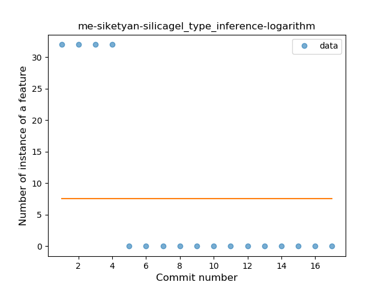
### <a name="lambda">Lambda</a>
----
#### Functions
* **Instability - Polinomial 4:** 
    * **R_Squared:** 0.84210526
* **Sudden Decline - Exponential:** 
    * **R_Squared:** 0.78063387
* **Constant Decline - Linear:** 
    * **R_Squared:** 0.54166667
* **Sudden Rise Plateau - Logarithm:** 
    * **R_Squared:** -0.0

**Plots** :chart_with_upwards_trend:
-----

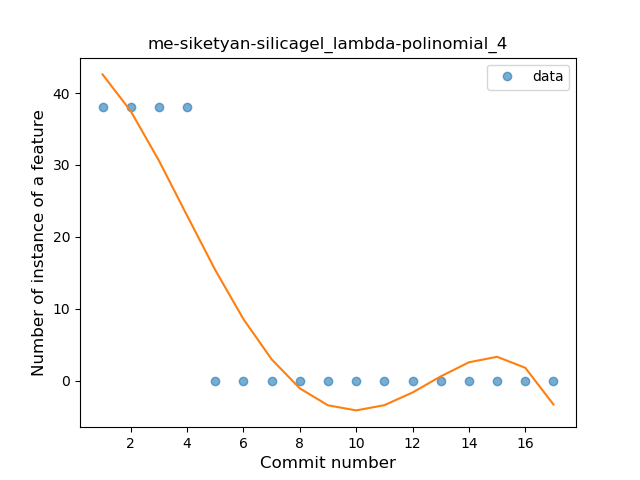
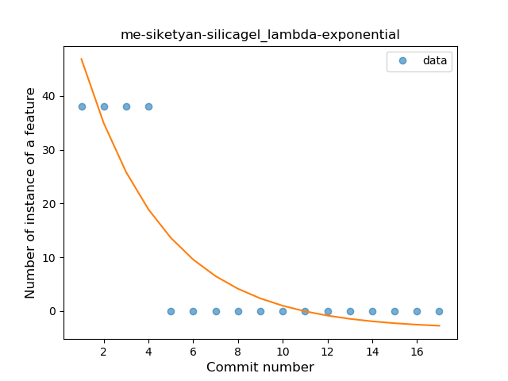
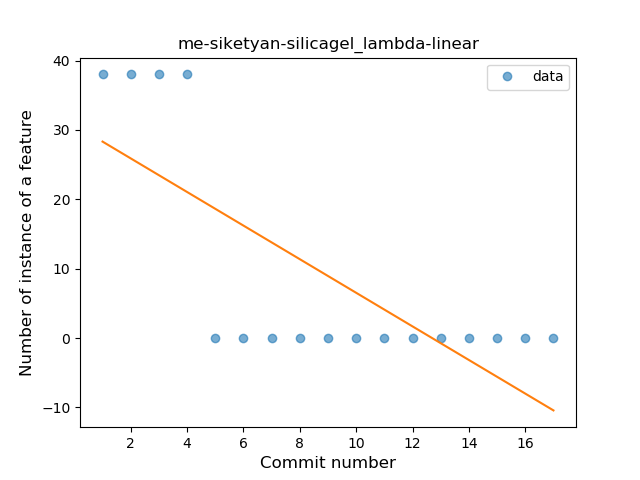
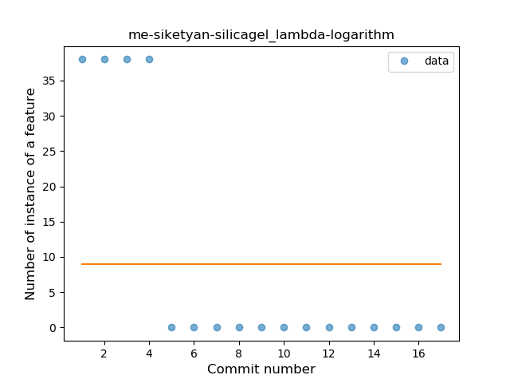
### <a name="safe_call">Safe Call</a>
----
#### Functions
* **Instability - Polinomial 4:** 
    * **R_Squared:** 0.84210526
* **Sudden Decline - Exponential:** 
    * **R_Squared:** 0.78063387
* **Constant Decline - Linear:** 
    * **R_Squared:** 0.54166667
* **Sudden Rise Plateau - Logarithm:** 
    * **R_Squared:** 0.0

**Plots** :chart_with_upwards_trend:
-----

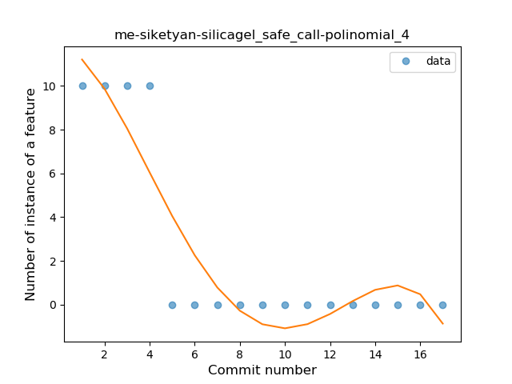

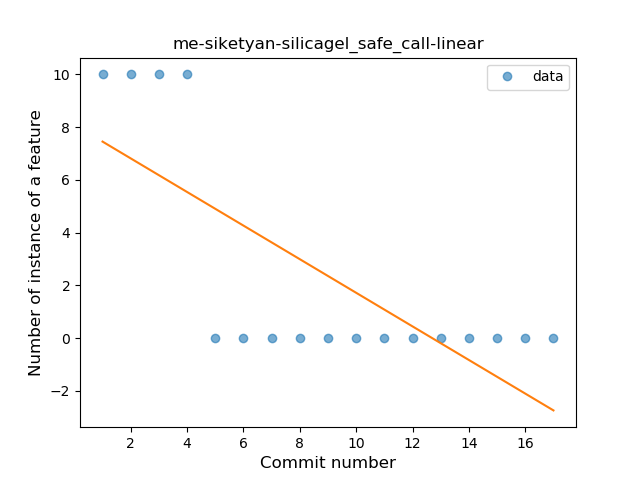
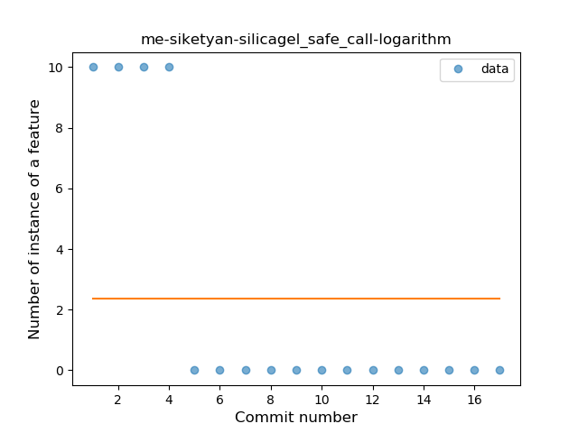
### <a name="string_template">String Template</a>
----
#### Functions
* **Instability - Polinomial 4:** 
    * **R_Squared:** 0.84210526
* **Sudden Decline - Exponential:** 
    * **R_Squared:** 0.78063387
* **Constant Decline - Linear:** 
    * **R_Squared:** 0.54166667
* **Sudden Rise Plateau - Logarithm:** 
    * **R_Squared:** -0.0

**Plots** :chart_with_upwards_trend:
-----

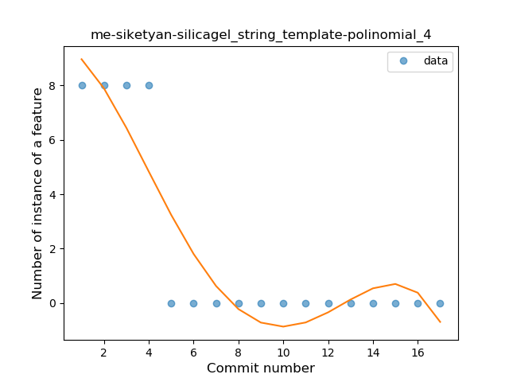

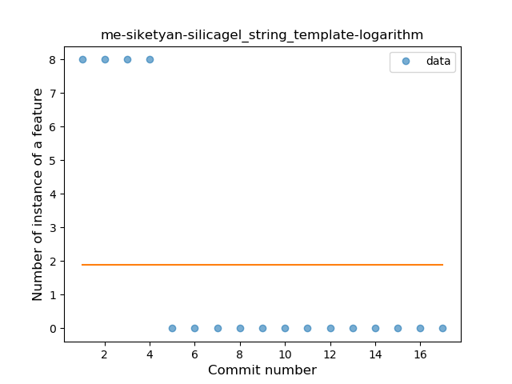
### <a name="func_with_default_value">Function with Default Value</a>
----
#### Functions
* **Instability - Polinomial 4:** 
    * **R_Squared:** 0.84210526
* **Sudden Decline - Exponential:** 
    * **R_Squared:** 0.78063387
* **Constant Decline - Linear:** 
    * **R_Squared:** 0.54166667
* **Sudden Rise Plateau - Logarithm:** 
    * **R_Squared:** -0.0

**Plots** :chart_with_upwards_trend:
-----

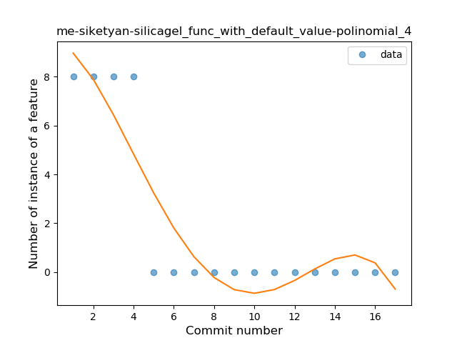
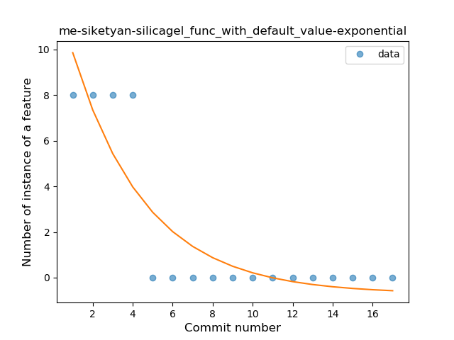
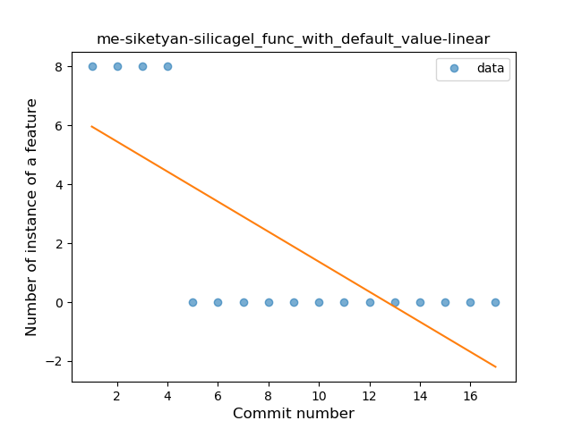
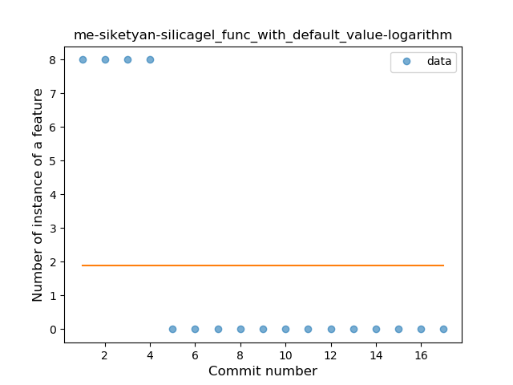
### <a name="extension_function">Extension Function</a>
----
#### Functions
* **Instability - Polinomial 4:** 
    * **R_Squared:** 0.84210526
* **Sudden Decline - Exponential:** 
    * **R_Squared:** 0.78063387
* **Constant Decline - Linear:** 
    * **R_Squared:** 0.54166667
* **Sudden Rise Plateau - Logarithm:** 
    * **R_Squared:** -0.0

**Plots** :chart_with_upwards_trend:
-----

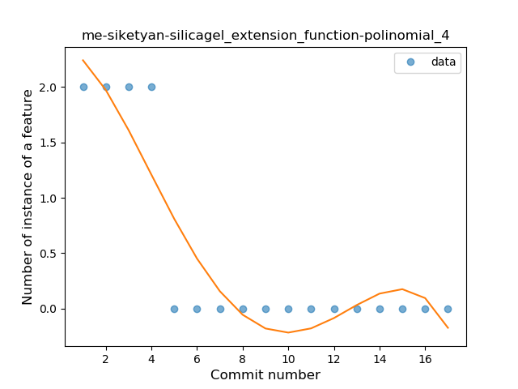
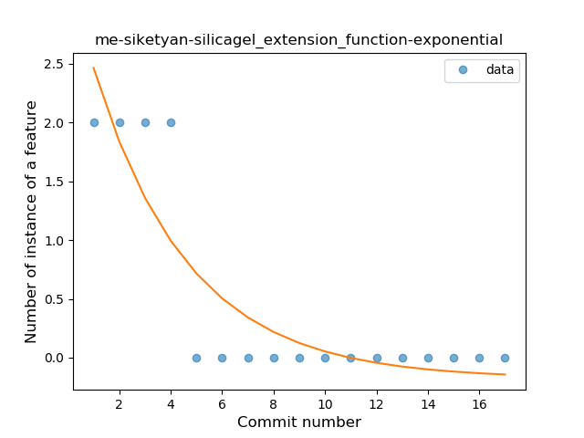
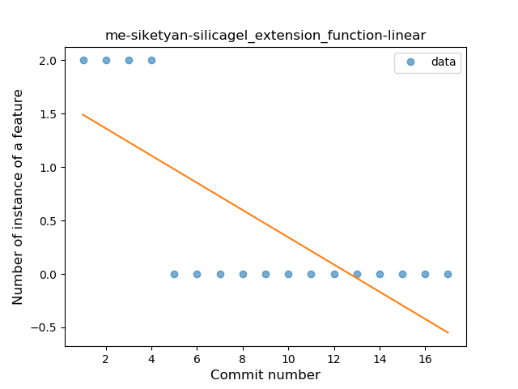
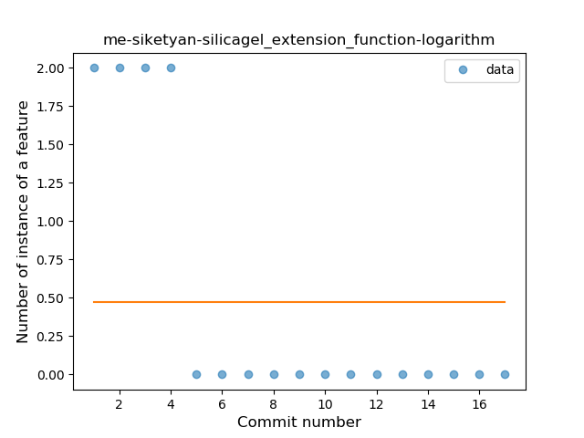
### <a name="inline_func">Inline Function</a>
----
#### Functions
* **Instability - Polinomial 4:** 
    * **R_Squared:** 0.84210526
* **Sudden Decline - Exponential:** 
    * **R_Squared:** 0.78063387
* **Constant Decline - Linear:** 
    * **R_Squared:** 0.54166667
* **Sudden Rise Plateau - Logarithm:** 
    * **R_Squared:** -0.0

**Plots** :chart_with_upwards_trend:
-----

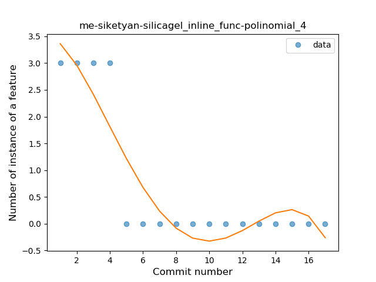

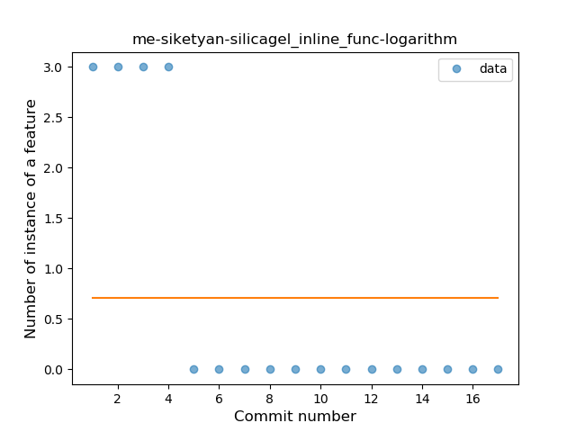
