## michaelkourlas-voipms-sms-client
----
#### Metrics provided by Detekt
* Number of lines of code 11890
* Number of Kotlin files: 59
* Cyclomatic complexity: 1344
* Cyclomatic complexity by thousands of lines: 225 

----
**12** features analyzed

*	<a href="#type_inference">Type Inference</a> 
*	<a href="#lambda">Lambda</a> 
*	<a href="#safe_call">Safe Call</a> 
*	<a href="#when_expr">When expression</a> 
*	<a href="#companion_object">Companion Object</a> 
*	<a href="#unsafe_call">Unsafe Call</a> 
*	<a href="#string_template">String Template</a> 
*	<a href="#func_with_default_value">Function with Default Value</a> 
*	<a href="#smart_cast">Smart Cast</a> 
*	<a href="#range_expr">Range Expression</a> 
*	<a href="#func_call_with_named_arg">Function call with Named Argument</a> 
*	<a href="#destructuring_declaration">Destructuring Declaration</a> 

### <a name="type_inference">Type Inference</a>
----
#### Functions
* **Sudden Rise Plateau - Logarithm:** 
    * **R_Squared:** 0.66256053
* **Constant Rise - Linear:** 
    * **R_Squared:** 0.43818804
* **Plateau Sudden Rise - Binary Sigmoid:** 
    * **R_Squared:** 0.37333491

**Plots** :chart_with_upwards_trend:
-----

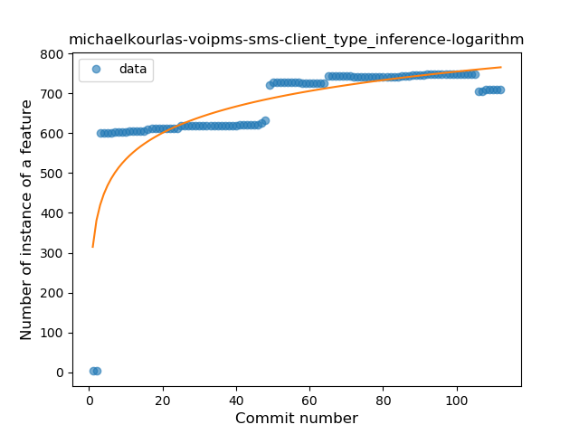
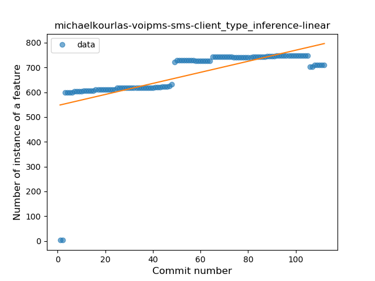
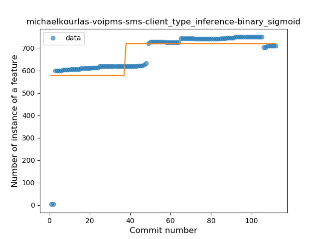
### <a name="lambda">Lambda</a>
----
#### Functions
* **Instability - Polinomial 3:** )
    * **R_Squared:** 0.41927989
* **Sudden Decline - Exponential:** 
    * **R_Squared:** 0.04176458
* **Constant Decline - Linear:** 
    * **R_Squared:** 0.01090212
* **Sudden Rise Plateau - Logarithm:** 
    * **R_Squared:** -0.0

**Plots** :chart_with_upwards_trend:
-----

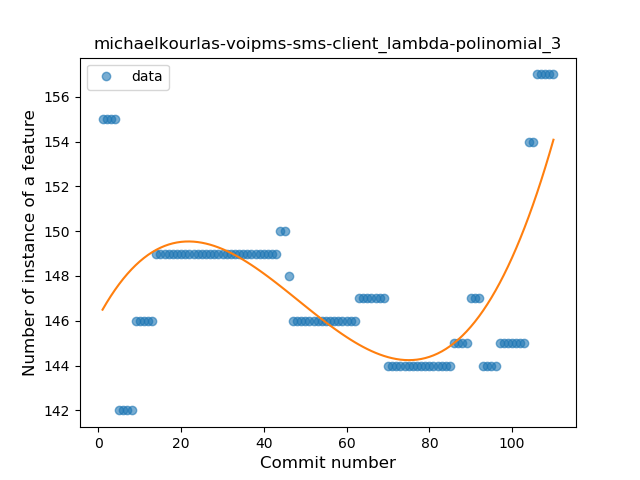

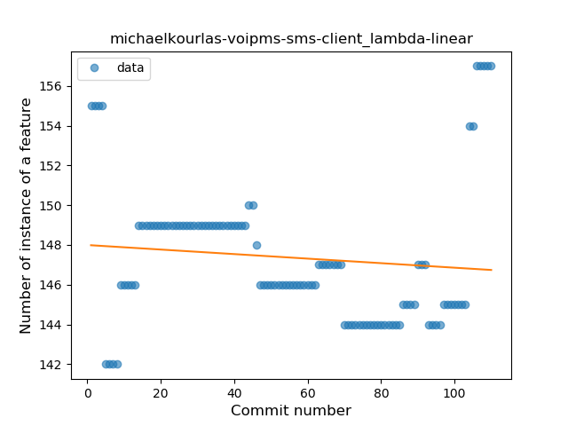
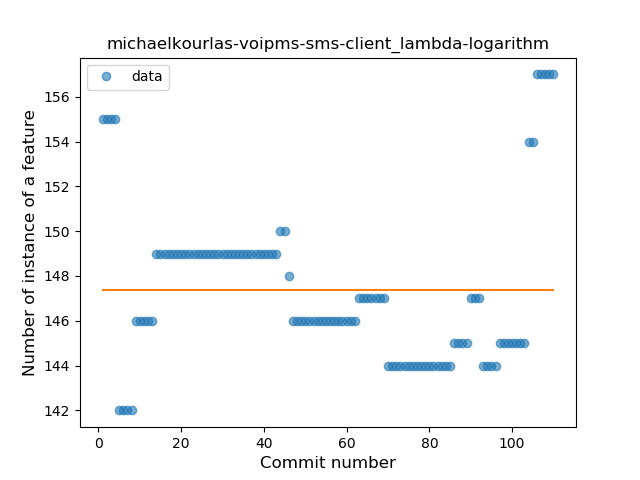
### <a name="safe_call">Safe Call</a>
----
#### Functions
* **Sudden Rise Plateau - Logarithm:** 
    * **R_Squared:** 0.84165726
* **Constant Rise - Linear:** 
    * **R_Squared:** 0.67561769

**Plots** :chart_with_upwards_trend:
-----

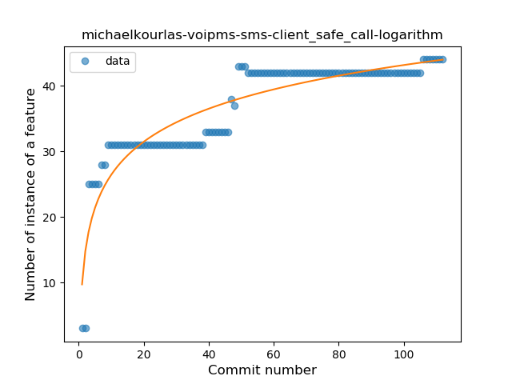
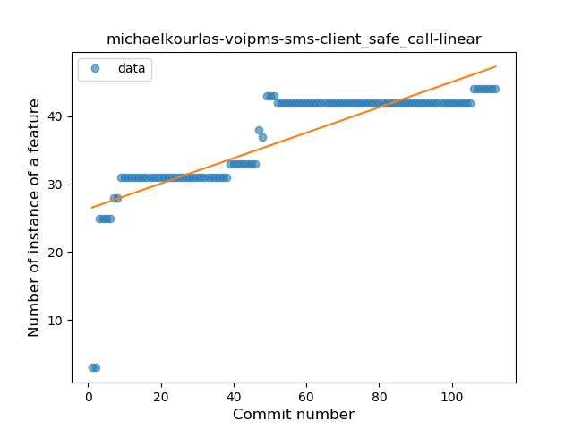
### <a name="when_expr">When expression</a>
----
#### Functions
* **Constant Rise - Linear:** 
    * **R_Squared:** 0.75771938
* **Sudden Rise Plateau - Logarithm:** 
    * **R_Squared:** 0.64550352

**Plots** :chart_with_upwards_trend:
-----

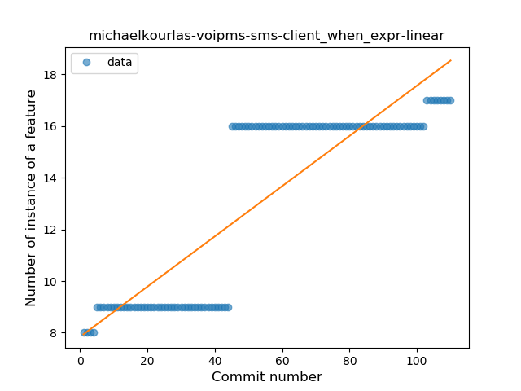
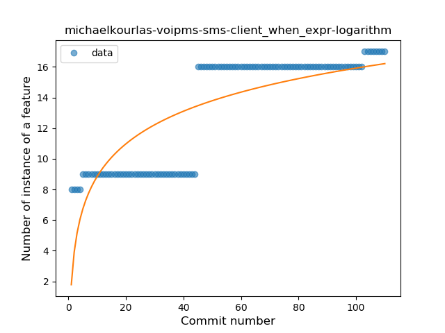
### <a name="companion_object">Companion Object</a>
----
#### Functions
* **Constant Rise - Linear:** 
    * **R_Squared:** 0.85891158
* **Sudden Rise Plateau - Logarithm:** 
    * **R_Squared:** 0.72431655

**Plots** :chart_with_upwards_trend:
-----

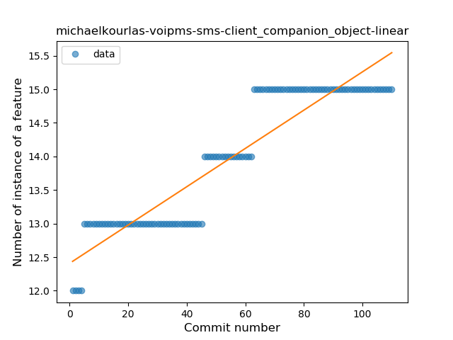
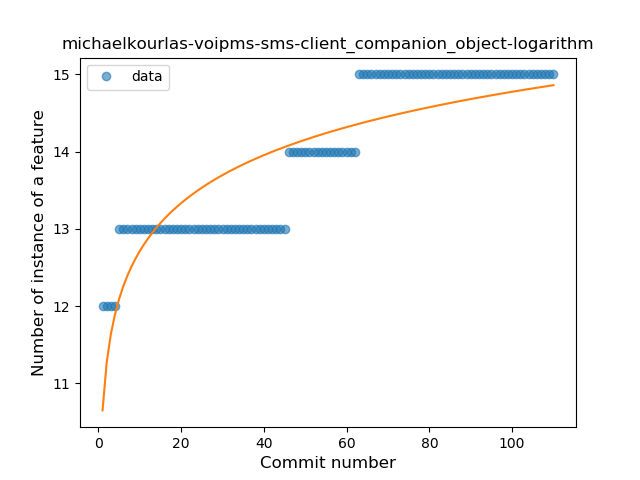
### <a name="unsafe_call">Unsafe Call</a>
----
#### Functions
* **Instability - Polinomial 3:** )
    * **R_Squared:** 0.89342134
* **Constant Rise - Linear:** 
    * **R_Squared:** 0.78075039
* **Sudden Rise Plateau - Logarithm:** 
    * **R_Squared:** 0.59917318

**Plots** :chart_with_upwards_trend:
-----

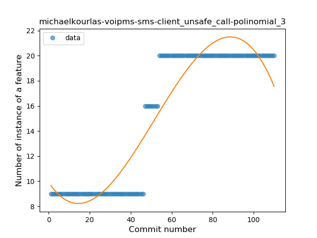
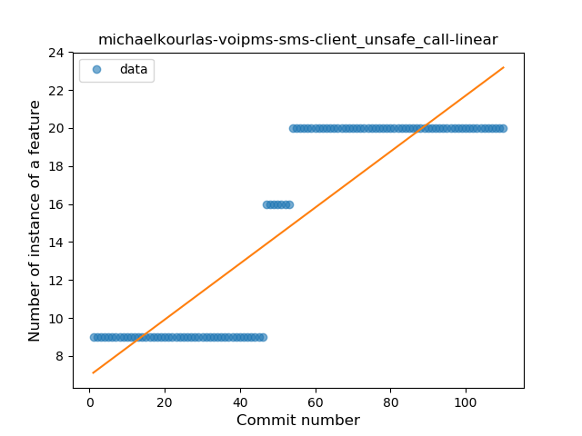
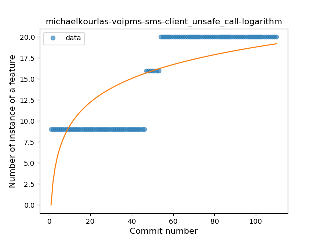
### <a name="string_template">String Template</a>
----
#### Functions
* **Instability - Polinomial 3:** )
    * **R_Squared:** 0.91247803
* **Constant Rise - Linear:** 
    * **R_Squared:** 0.81454199
* **Sudden Rise Plateau - Logarithm:** 
    * **R_Squared:** 0.56817159

**Plots** :chart_with_upwards_trend:
-----

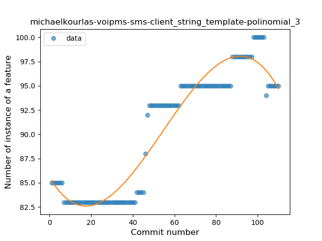
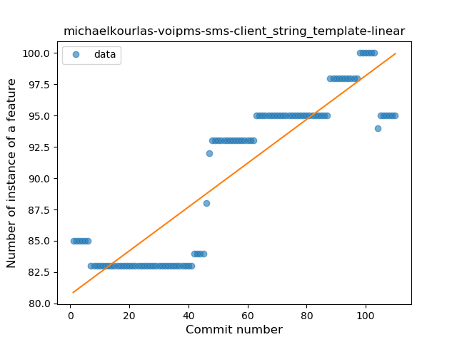
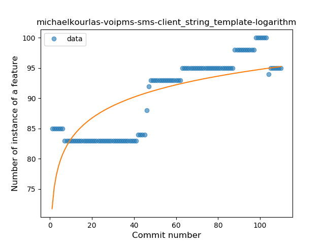
### <a name="func_with_default_value">Function with Default Value</a>
----
#### Functions
* **Constant Rise - Linear:** 
    * **R_Squared:** 0.82592436
* **Sudden Rise Plateau - Logarithm:** 
    * **R_Squared:** 0.60390238

**Plots** :chart_with_upwards_trend:
-----

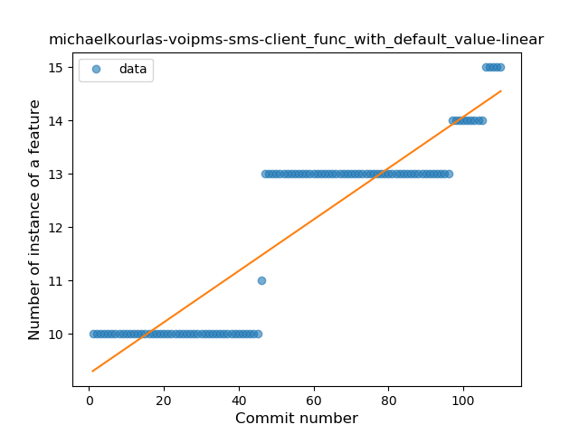
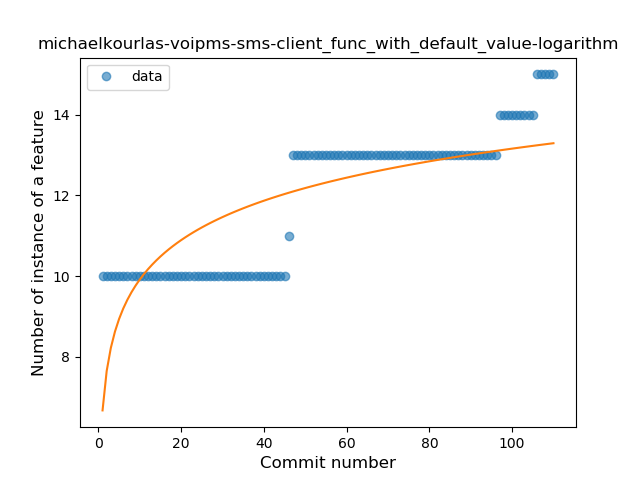
### <a name="smart_cast">Smart Cast</a>
----
#### Functions
* **Constant Decline - Linear:** 
    * **R_Squared:** 0.66640394
* **Sudden Rise - Exponential:** 
    * **R_Squared:** -0.0
* **Sudden Rise Plateau - Logarithm:** 
    * **R_Squared:** -0.0

**Plots** :chart_with_upwards_trend:
-----

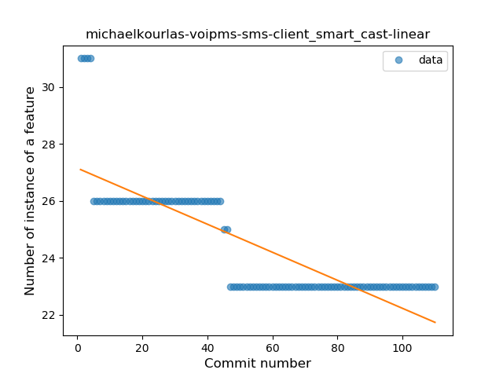

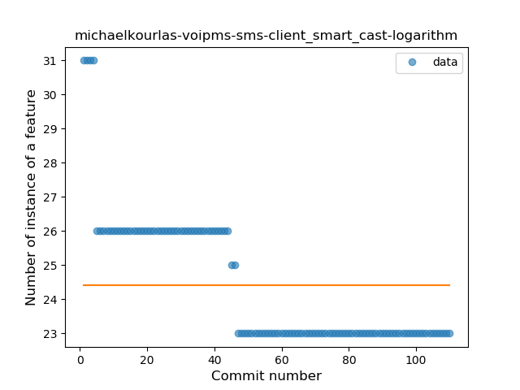
### <a name="range_expr">Range Expression</a>
----
#### Functions
* **Constant Rise - Linear:** 
    * **R_Squared:** 0.67318727
* **Sudden Rise Plateau - Logarithm:** 
    * **R_Squared:** 0.56723769

**Plots** :chart_with_upwards_trend:
-----

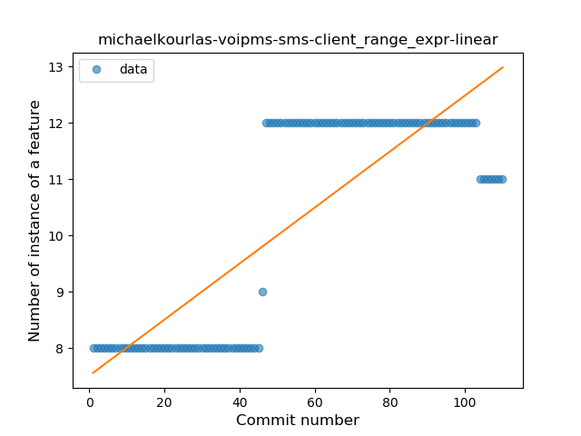
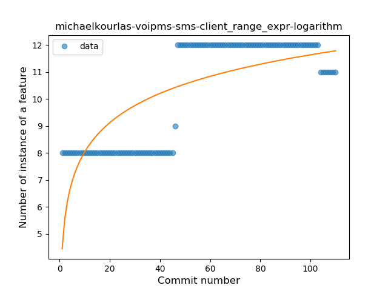
### <a name="func_call_with_named_arg">Function call with Named Argument</a>
----
#### Functions
* **Instability - Polinomial 3:** )
    * **R_Squared:** 0.72748912
* **Sudden Rise - Exponential:** 
    * **R_Squared:** 0.60892906
* **Constant Rise - Linear:** 
    * **R_Squared:** 0.0660882
* **Sudden Rise Plateau - Logarithm:** 
    * **R_Squared:** 0.01219227

**Plots** :chart_with_upwards_trend:
-----

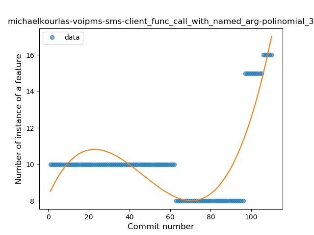
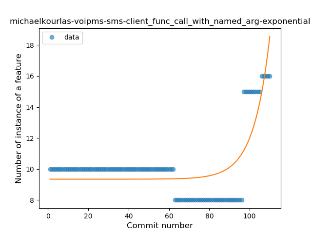
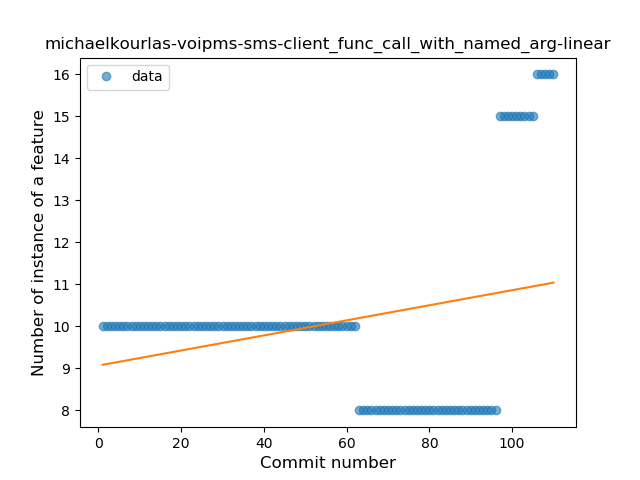
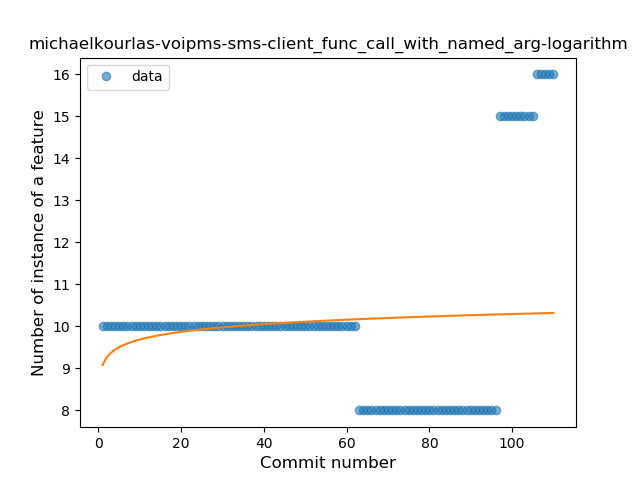
### <a name="destructuring_declaration">Destructuring Declaration</a>
----
#### Functions
* **Plateau Sudden Decline - Binary Sigmoid:** 
    * **R_Squared:** 1.0
* **Constant Decline - Linear:** 
    * **R_Squared:** 0.17877511
* **Sudden Rise Plateau - Logarithm:** 
    * **R_Squared:** -0.0

**Plots** :chart_with_upwards_trend:
-----

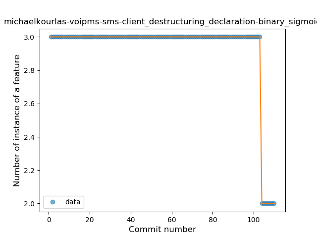
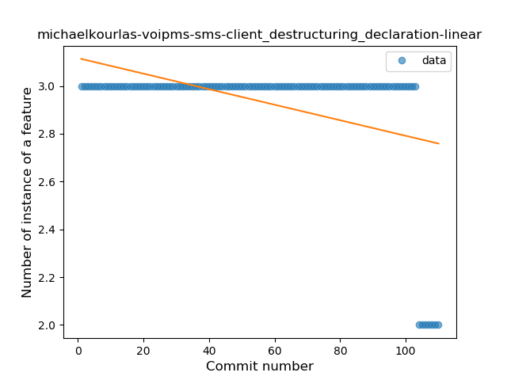
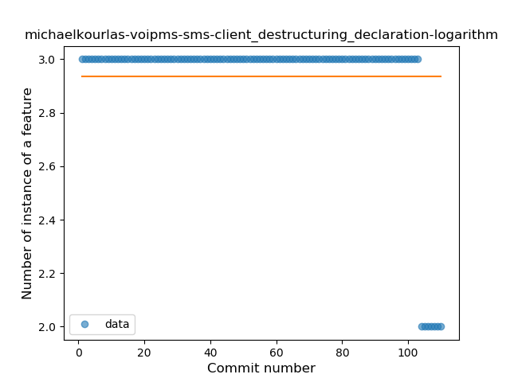
