## milosmns-Timecrypt
----
#### Metrics provided by Detekt
* Number of lines of code 1950
* Number of Kotlin files: 24
* Cyclomatic complexity: 223
* Cyclomatic complexity by thousands of lines: 240 

----
**12** features analyzed

*	<a href="#type_inference">Type Inference</a> 
*	<a href="#lambda">Lambda</a> 
*	<a href="#safe_call">Safe Call</a> 
*	<a href="#when_expr">When expression</a> 
*	<a href="#companion_object">Companion Object</a> 
*	<a href="#unsafe_call">Unsafe Call</a> 
*	<a href="#string_template">String Template</a> 
*	<a href="#func_with_default_value">Function with Default Value</a> 
*	<a href="#singleton">Singleton</a> 
*	<a href="#func_call_with_named_arg">Function call with Named Argument</a> 
*	<a href="#extension_function">Extension Function</a> 
*	<a href="#destructuring_declaration">Destructuring Declaration</a> 

### <a name="type_inference">Type Inference</a>
----
#### Functions
* **Constant Rise - Linear:** 
    * **R_Squared:** 0.88429264
* **Sudden Rise Plateau - Logarithm:** 
    * **R_Squared:** 0.85596596

**Plots** :chart_with_upwards_trend:
-----

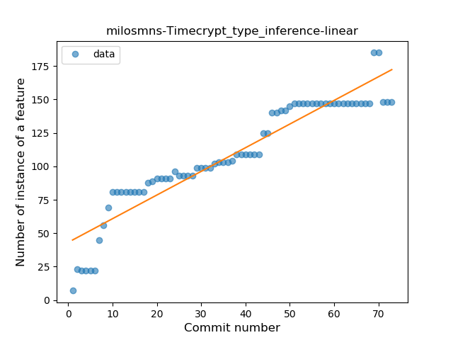
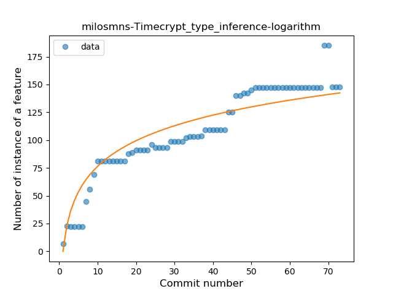
### <a name="lambda">Lambda</a>
----
#### Functions
* **Constant Rise - Linear:** 
    * **R_Squared:** 0.87863688
* **Sudden Rise - Exponential:** 
    * **R_Squared:** 0.88619861
* **Sudden Rise Plateau - Logarithm:** 
    * **R_Squared:** 0.55891127
* **Plateau Gradual Rise - Sigmoid:** 
    * **R_Squared:** 0.15834809

**Plots** :chart_with_upwards_trend:
-----

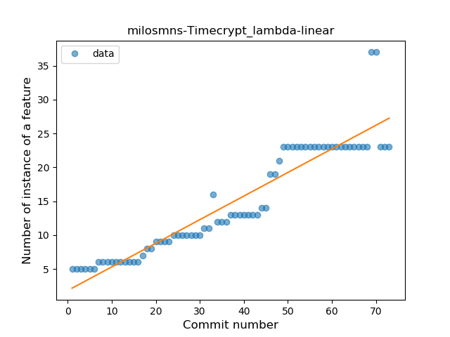
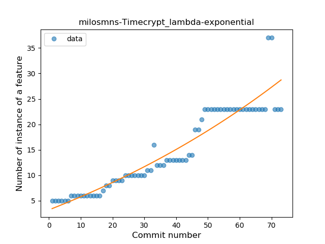
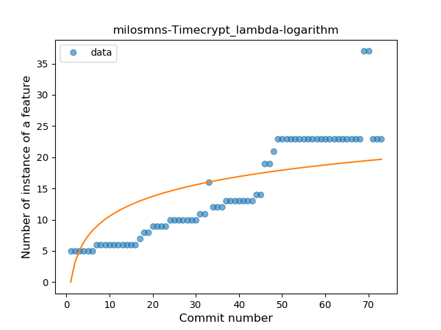
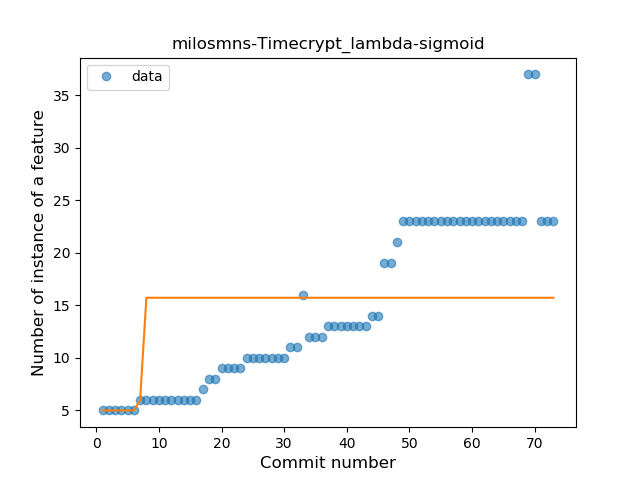
### <a name="safe_call">Safe Call</a>
----
#### Functions
* **Sudden Rise - Exponential:** 
    * **R_Squared:** 0.82223793
* **Constant Rise - Linear:** 
    * **R_Squared:** 0.66841948
* **Sudden Rise Plateau - Logarithm:** 
    * **R_Squared:** 0.33961328
* **Plateau Gradual Rise - Sigmoid:** 
    * **R_Squared:** 0.24841167

**Plots** :chart_with_upwards_trend:
-----

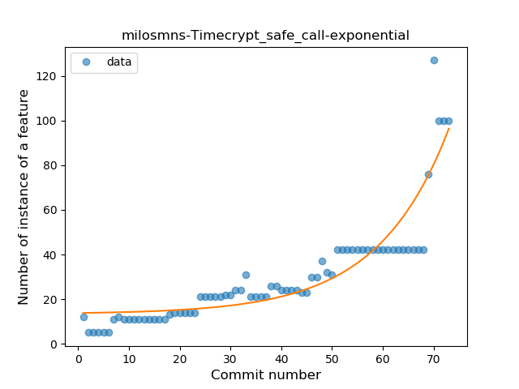
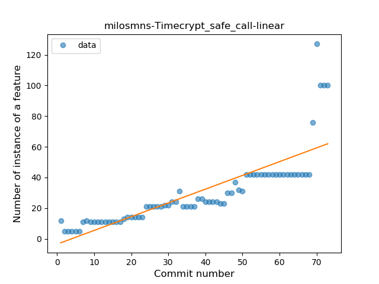
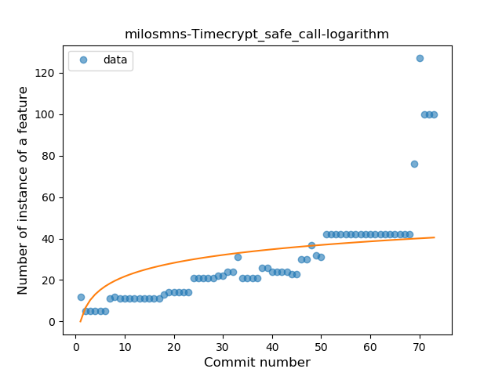
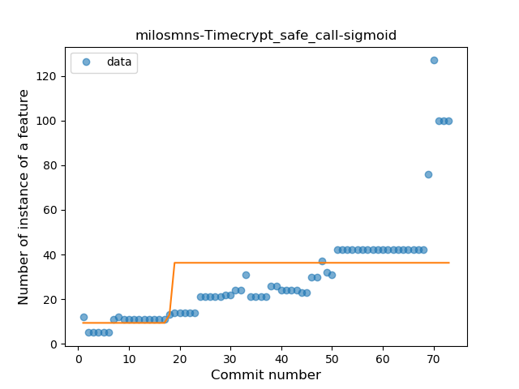
### <a name="when_expr">When expression</a>
----
#### Functions
* **Plateau Gradual Rise - Sigmoid:** 
    * **R_Squared:** 0.92408336
* **Instability - Polinomial 3:** )
    * **R_Squared:** 0.8706898
* **Constant Rise - Linear:** 
    * **R_Squared:** 0.83431796
* **Sudden Rise Plateau - Logarithm:** 
    * **R_Squared:** 0.62983708

**Plots** :chart_with_upwards_trend:
-----

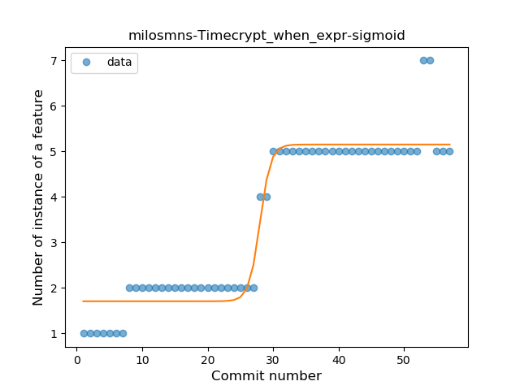
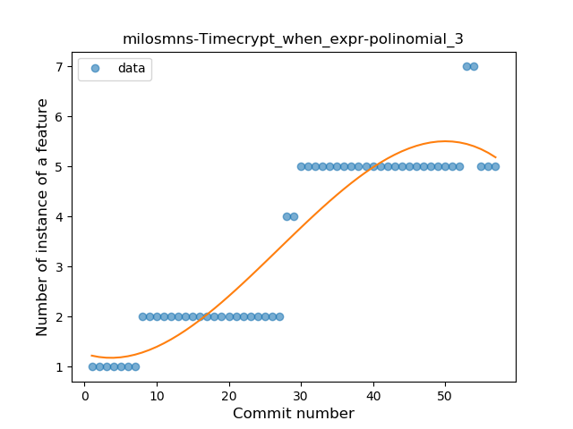
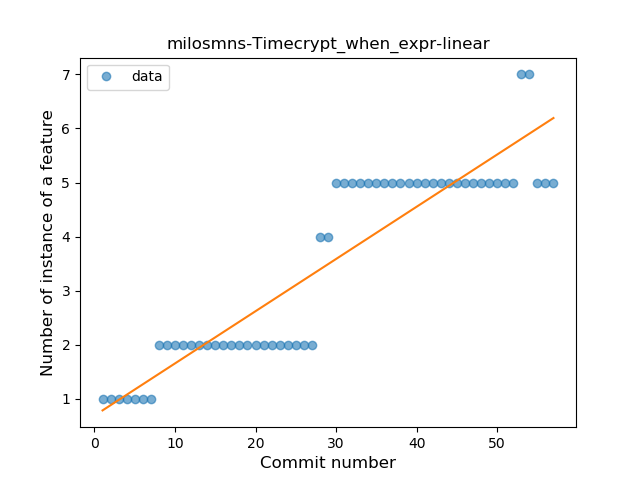
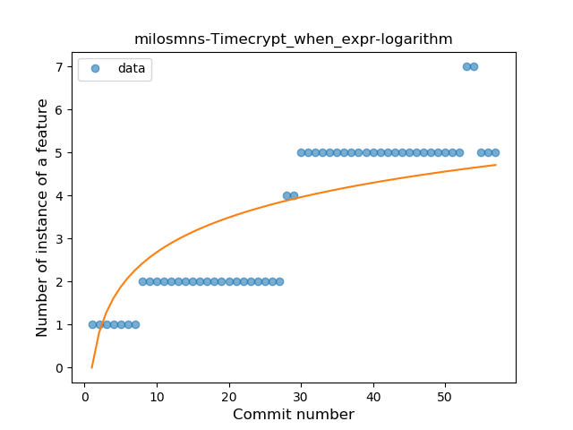
### <a name="companion_object">Companion Object</a>
----
#### Functions
* **Plateau Gradual Rise - Sigmoid:** 
    * **R_Squared:** 0.90072083
* **Constant Rise - Linear:** 
    * **R_Squared:** 0.88681963
* **Sudden Rise Plateau - Logarithm:** 
    * **R_Squared:** 0.63025589

**Plots** :chart_with_upwards_trend:
-----

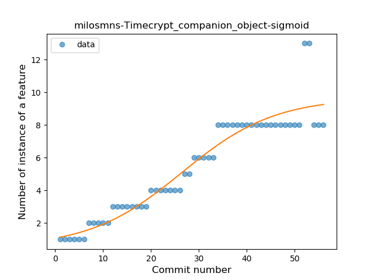
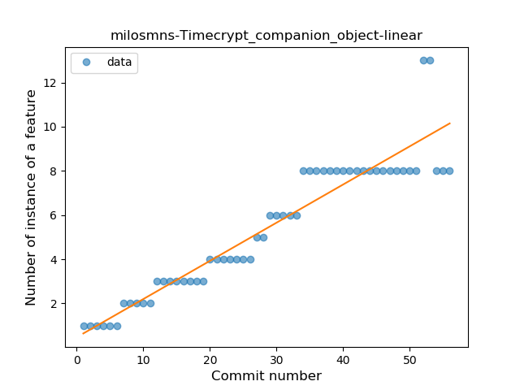
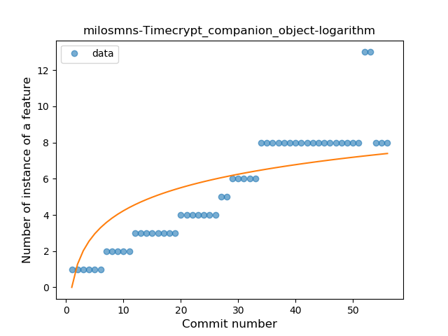
### <a name="unsafe_call">Unsafe Call</a>
----
#### Functions
* **Constant Rise - Linear:** 
    * **R_Squared:** 0.77132806
* **Plateau Gradual Rise - Sigmoid:** 
    * **R_Squared:** 0.7813223
* **Sudden Rise Plateau - Logarithm:** 
    * **R_Squared:** 0.55414228

**Plots** :chart_with_upwards_trend:
-----

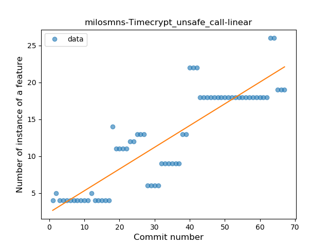
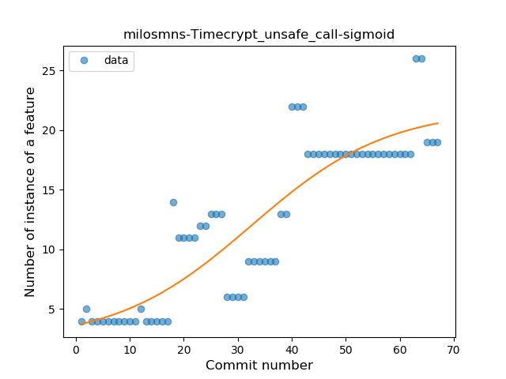
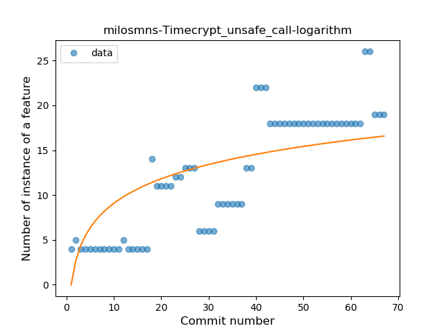
### <a name="string_template">String Template</a>
----
#### Functions
* **Sudden Rise Plateau - Logarithm:** 
    * **R_Squared:** 0.88742549
* **Constant Rise - Linear:** 
    * **R_Squared:** 0.81075422

**Plots** :chart_with_upwards_trend:
-----

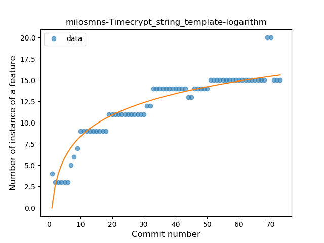
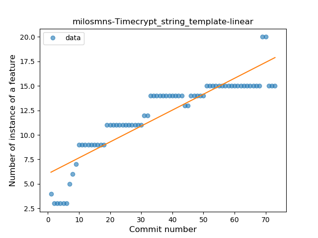
### <a name="func_with_default_value">Function with Default Value</a>
----
#### Functions
* **Constant Rise - Linear:** 
    * **R_Squared:** 0.7845357
* **Sudden Rise - Exponential:** 
    * **R_Squared:** 0.78603995
* **Sudden Rise Plateau - Logarithm:** 
    * **R_Squared:** 0.60079818

**Plots** :chart_with_upwards_trend:
-----

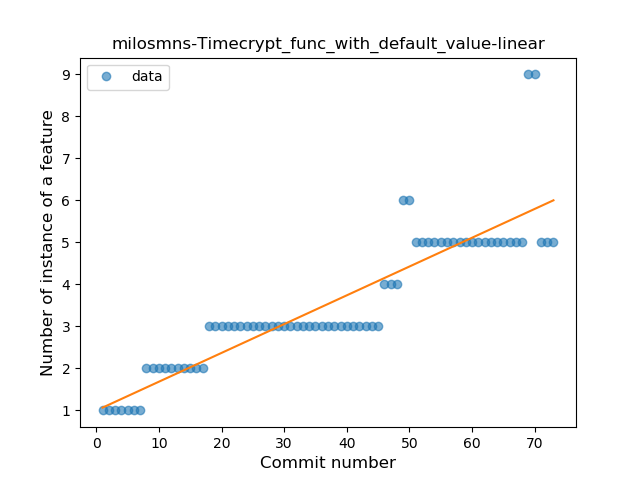
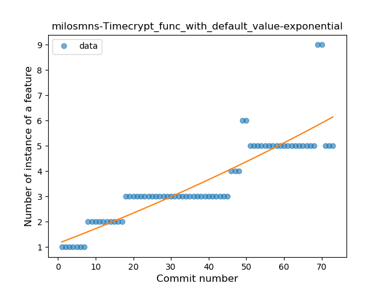
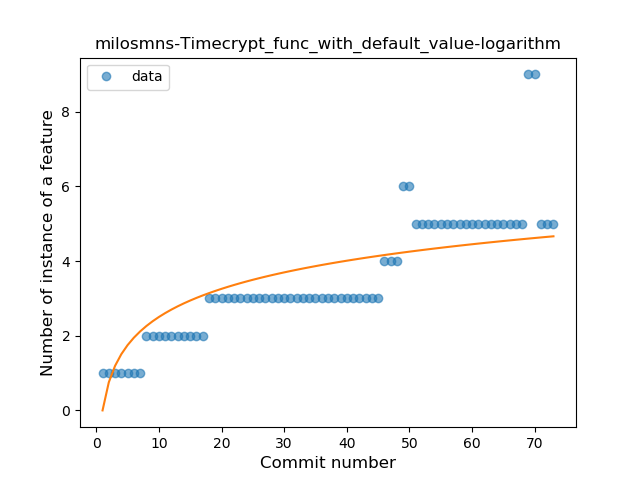
### <a name="singleton">Singleton</a>
----
#### Functions
* **Sudden Rise - Exponential:** 
    * **R_Squared:** 0.16407257
* **Constant Rise - Linear:** 
    * **R_Squared:** 0.06701243
* **Sudden Rise Plateau - Logarithm:** 
    * **R_Squared:** 0.02835359

**Plots** :chart_with_upwards_trend:
-----

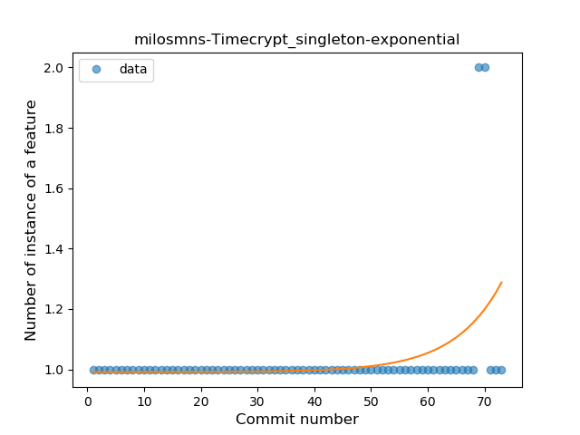
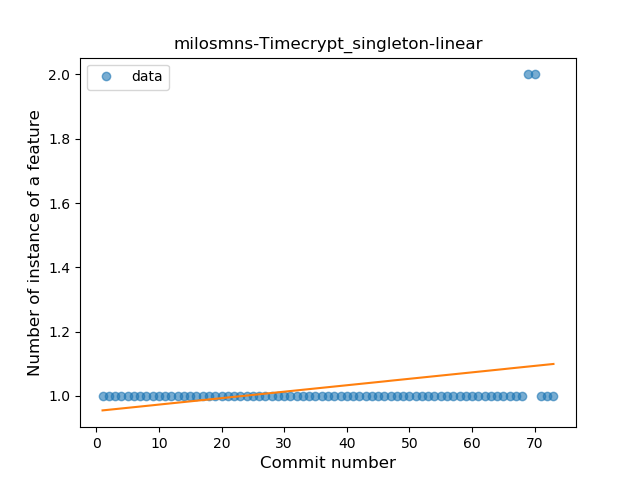
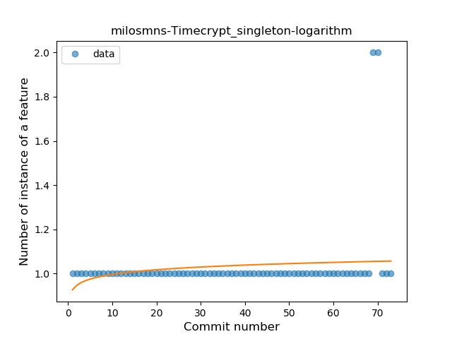
### <a name="func_call_with_named_arg">Function call with Named Argument</a>
----
#### Functions
* **Sudden Decline - Exponential:** 
    * **R_Squared:** 1.0
* **Instability - Polinomial 3:** )
    * **R_Squared:** 0.45940171
* **Constant Decline - Linear:** 
    * **R_Squared:** 0.11538462
* **Sudden Rise Plateau - Logarithm:** 
    * **R_Squared:** -0.0

**Plots** :chart_with_upwards_trend:
-----

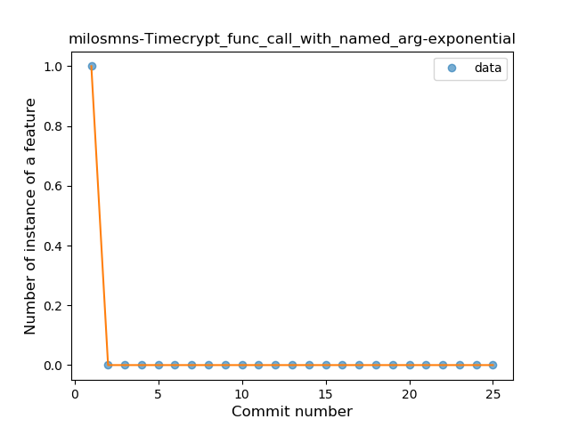
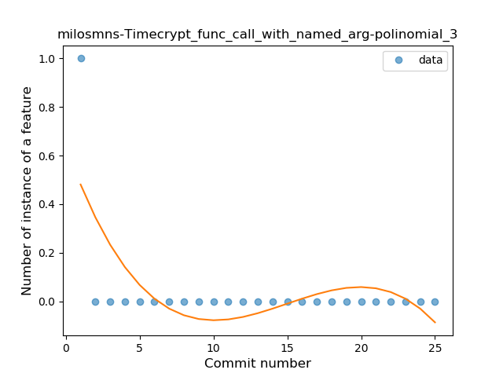
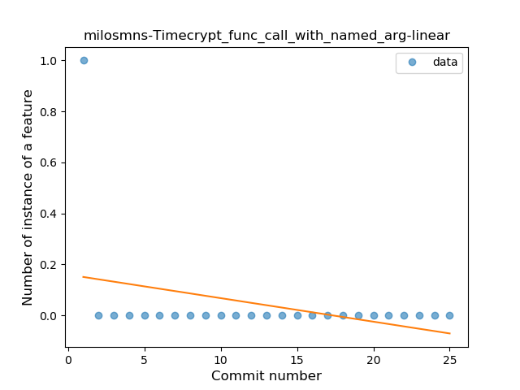
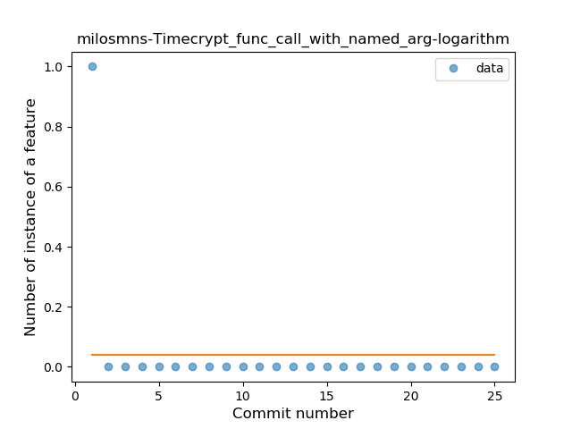
### <a name="extension_function">Extension Function</a>
----
#### Functions
* **Instability - Polinomial 3:** )
    * **R_Squared:** 0.1999552
* **Sudden Rise - Exponential:** 
    * **R_Squared:** 0.14576497
* **Constant Rise - Linear:** 
    * **R_Squared:** 0.05790691
* **Sudden Rise Plateau - Logarithm:** 
    * **R_Squared:** 0.04433472

**Plots** :chart_with_upwards_trend:
-----

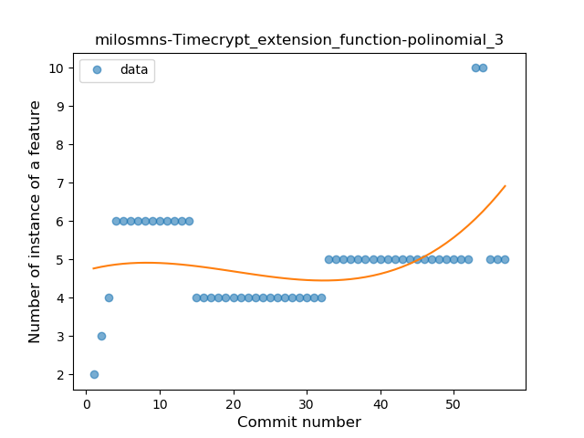
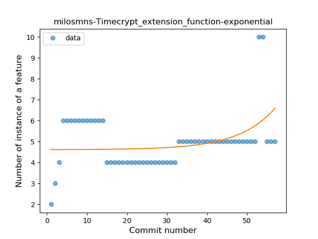
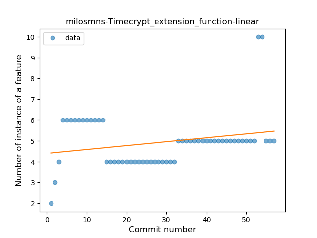
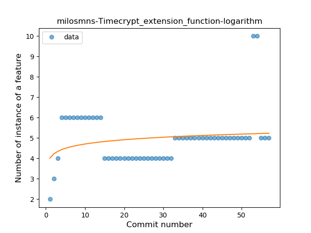
### <a name="destructuring_declaration">Destructuring Declaration</a>
----
#### Functions
* **Plateau Sudden Rise - Binary Sigmoid:** 
    * **R_Squared:** 1.0
* **Instability - Polinomial 3:** )
    * **R_Squared:** 0.85698364
* **Constant Rise - Linear:** 
    * **R_Squared:** 0.74703557
* **Sudden Rise Plateau - Logarithm:** 
    * **R_Squared:** 0.57747558

**Plots** :chart_with_upwards_trend:
-----

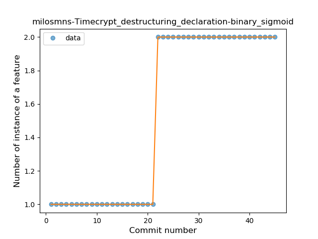
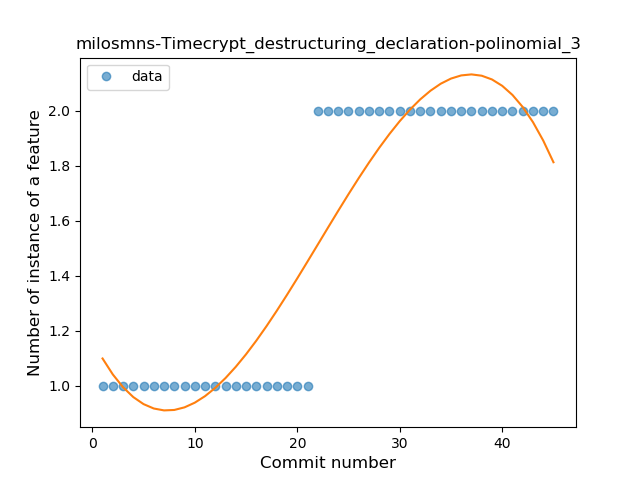
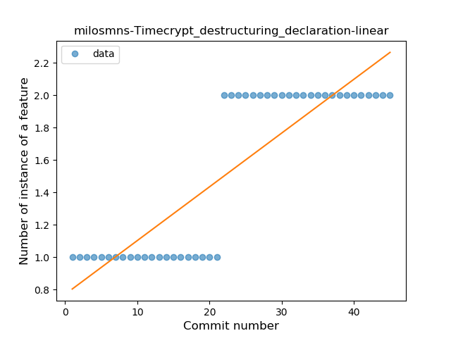
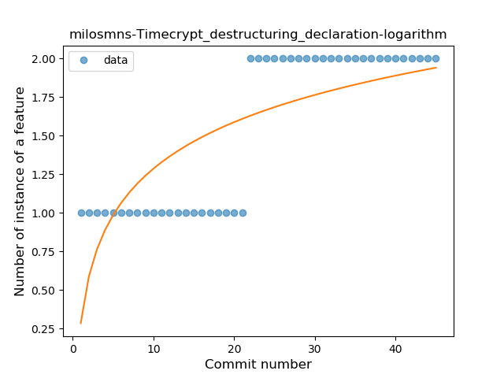
