## mjdenham-and-bible
----
#### Metrics provided by Detekt
* Number of lines of code 4623
* Number of Kotlin files: 27
* Cyclomatic complexity: 630
* Cyclomatic complexity by thousands of lines: 230 

----
**15** features analyzed

*	<a href="#type_inference">Type Inference</a> 
*	<a href="#lambda">Lambda</a> 
*	<a href="#safe_call">Safe Call</a> 
*	<a href="#when_expr">When expression</a> 
*	<a href="#companion_object">Companion Object</a> 
*	<a href="#unsafe_call">Unsafe Call</a> 
*	<a href="#string_template">String Template</a> 
*	<a href="#func_with_default_value">Function with Default Value</a> 
*	<a href="#singleton">Singleton</a> 
*	<a href="#smart_cast">Smart Cast</a> 
*	<a href="#range_expr">Range Expression</a> 
*	<a href="#func_call_with_named_arg">Function call with Named Argument</a> 
*	<a href="#data_class">Data Class</a> 
*	<a href="#property_delegation">Property Delegation</a> 
*	<a href="#destructuring_declaration">Destructuring Declaration</a> 

### <a name="type_inference">Type Inference</a>
----
#### Functions
* **Constant Rise - Linear:** 
    * **R_Squared:** 0.95282245
* **Plateau Sudden Rise - Binary Sigmoid:** 
    * **R_Squared:** 0.62155962
* **Sudden Rise Plateau - Logarithm:** 
    * **R_Squared:** 0.35767417

**Plots** :chart_with_upwards_trend:
-----

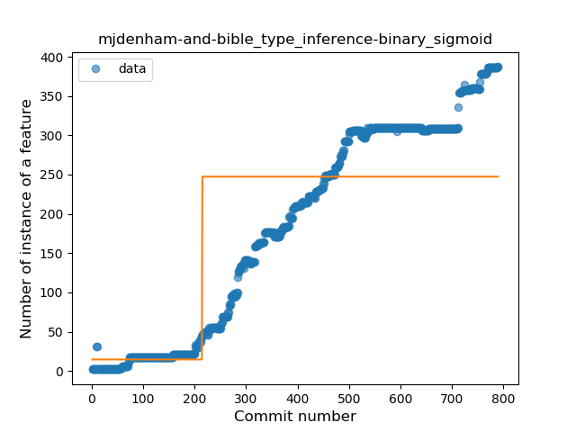
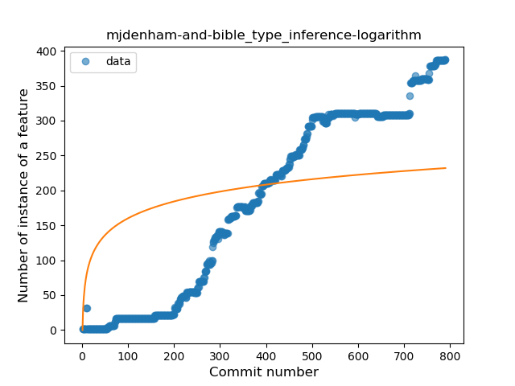
### <a name="lambda">Lambda</a>
----
#### Functions
* **Constant Rise - Linear:** 
    * **R_Squared:** 0.97817688
* **Sudden Rise - Exponential:** 
    * **R_Squared:** 0.97999777
* **Sudden Rise Plateau - Logarithm:** 
    * **R_Squared:** 0.43331801
* **Plateau Sudden Rise - Binary Sigmoid:** 
    * **R_Squared:** 0.07624135

**Plots** :chart_with_upwards_trend:
-----

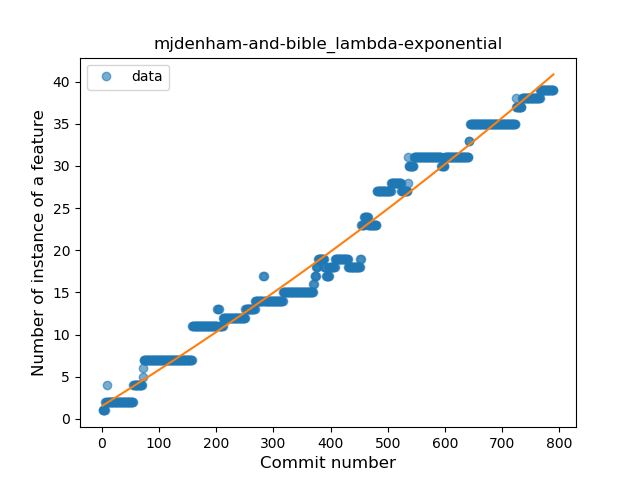
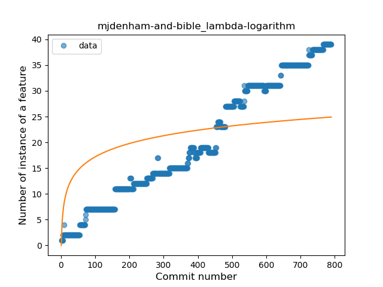

### <a name="safe_call">Safe Call</a>
----
#### Functions
* **Plateau Gradual Rise - Sigmoid:** 
    * **R_Squared:** 0.95482236
* **Constant Rise - Linear:** 
    * **R_Squared:** 0.86692668
* **Sudden Rise Plateau - Logarithm:** 
    * **R_Squared:** 0.4550756

**Plots** :chart_with_upwards_trend:
-----

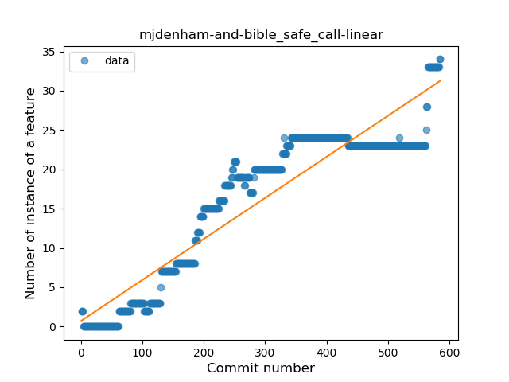
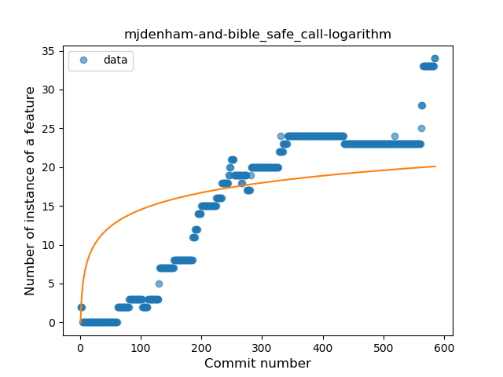
### <a name="when_expr">When expression</a>
----
#### Functions
* **Plateau Gradual Rise - Sigmoid:** 
    * **R_Squared:** 0.97454371
* **Constant Rise - Linear:** 
    * **R_Squared:** 0.83796674
* **Sudden Rise Plateau - Logarithm:** 
    * **R_Squared:** 0.35768224

**Plots** :chart_with_upwards_trend:
-----

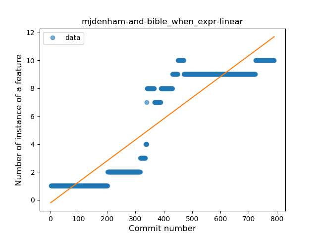
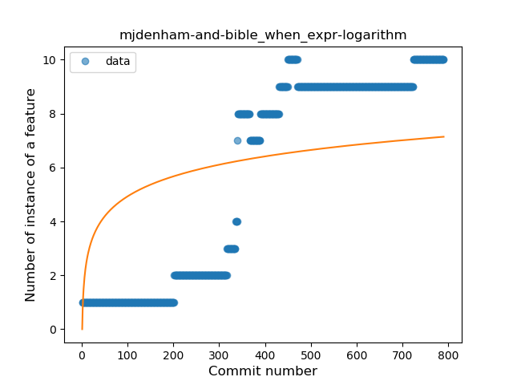
### <a name="companion_object">Companion Object</a>
----
#### Functions
* **Plateau Gradual Rise - Sigmoid:** 
    * **R_Squared:** 0.99122309
* **Constant Rise - Linear:** 
    * **R_Squared:** 0.92792464
* **Sudden Rise Plateau - Logarithm:** 
    * **R_Squared:** 0.4078709

**Plots** :chart_with_upwards_trend:
-----

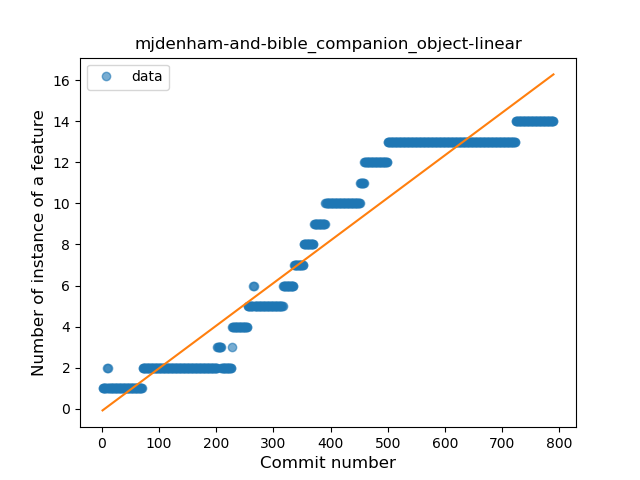
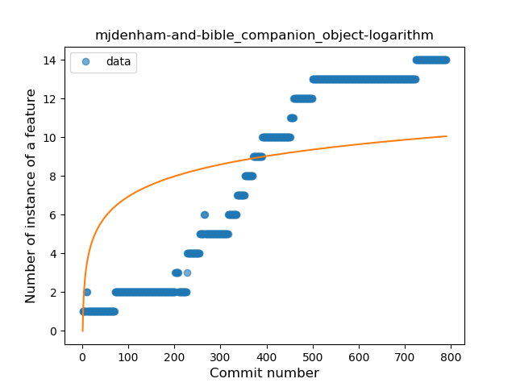
### <a name="unsafe_call">Unsafe Call</a>
----
#### Functions
* **Constant Rise - Linear:** 
    * **R_Squared:** 0.80084217
* **Sudden Rise - Exponential:** 
    * **R_Squared:** 0.80295023
* **Sudden Rise Plateau - Logarithm:** 
    * **R_Squared:** 0.24218843

**Plots** :chart_with_upwards_trend:
-----

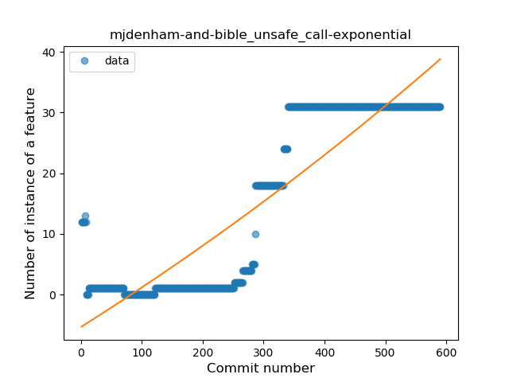
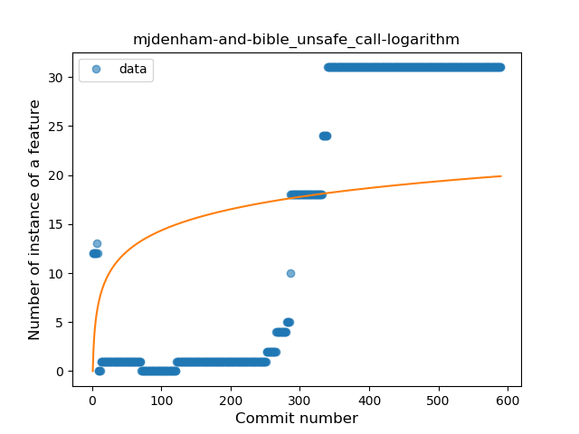
### <a name="string_template">String Template</a>
----
#### Functions
* **Constant Rise - Linear:** 
    * **R_Squared:** 0.87234601
* **Sudden Rise Plateau - Logarithm:** 
    * **R_Squared:** 0.68093388

**Plots** :chart_with_upwards_trend:
-----

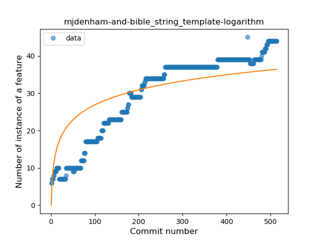
### <a name="func_with_default_value">Function with Default Value</a>
----
#### Functions
* **Plateau Gradual Rise - Sigmoid:** 
    * **R_Squared:** 0.97312827
* **Constant Rise - Linear:** 
    * **R_Squared:** 0.82292636
* **Sudden Rise Plateau - Logarithm:** 
    * **R_Squared:** 0.63206729

**Plots** :chart_with_upwards_trend:
-----

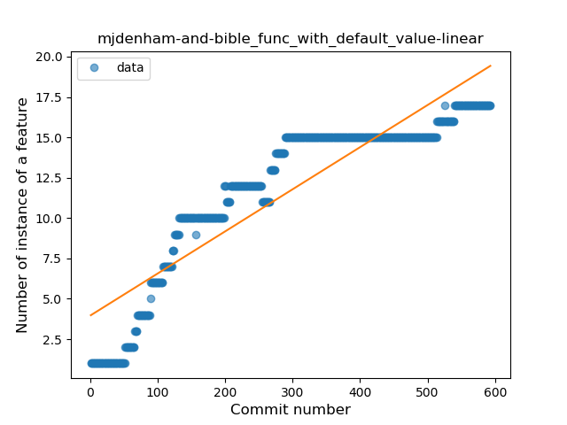
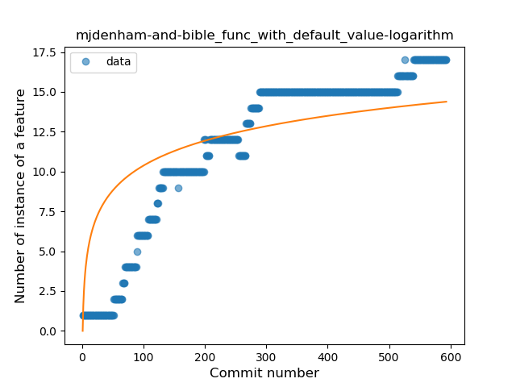
### <a name="singleton">Singleton</a>
----
#### Functions
* **Plateau Sudden Decline - Binary Sigmoid:** 
    * **R_Squared:** 1.0
* **Sudden Decline - Exponential:** 
    * **R_Squared:** 0.80923428
* **Constant Decline - Linear:** 
    * **R_Squared:** 0.10302198
* **Sudden Rise Plateau - Logarithm:** 
    * **R_Squared:** -0.0

**Plots** :chart_with_upwards_trend:
-----

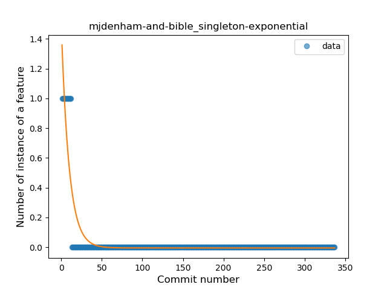
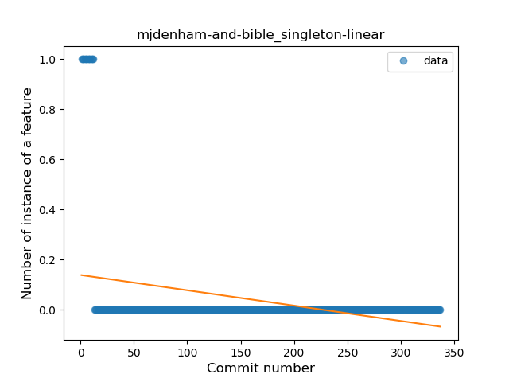
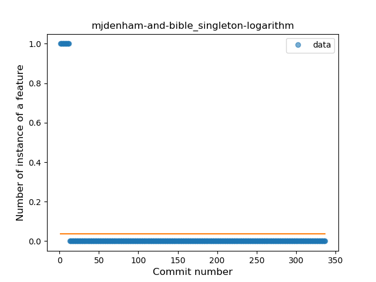
### <a name="smart_cast">Smart Cast</a>
----
#### Functions
* **Plateau Gradual Rise - Sigmoid:** 
    * **R_Squared:** 0.94514933
* **Constant Rise - Linear:** 
    * **R_Squared:** 0.86072448
* **Sudden Rise Plateau - Logarithm:** 
    * **R_Squared:** 0.39351117

**Plots** :chart_with_upwards_trend:
-----

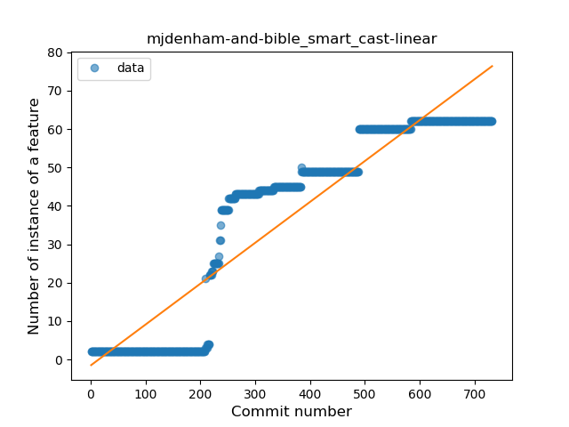
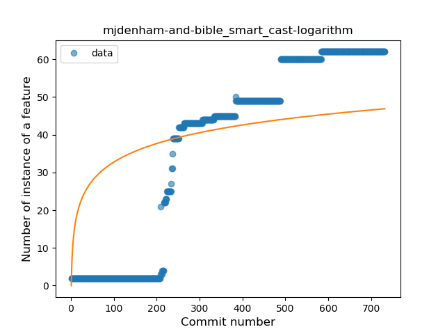
### <a name="range_expr">Range Expression</a>
----
#### Functions
* **Plateau Gradual Rise - Sigmoid:** 
    * **R_Squared:** 0.88169772
* **Constant Rise - Linear:** 
    * **R_Squared:** 0.60134037
* **Sudden Rise Plateau - Logarithm:** 
    * **R_Squared:** 0.36070891

**Plots** :chart_with_upwards_trend:
-----

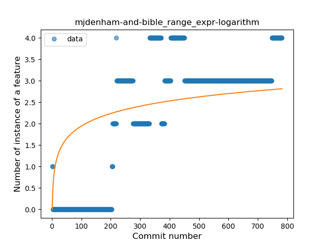
### <a name="func_call_with_named_arg">Function call with Named Argument</a>
----
#### Functions
* **Sudden Rise Plateau - Logarithm:** 
    * **R_Squared:** 0.80530262
* **Constant Rise - Linear:** 
    * **R_Squared:** 0.72732143
* **Plateau Gradual Rise - Sigmoid:** 
    * **R_Squared:** 0.35838286

**Plots** :chart_with_upwards_trend:
-----

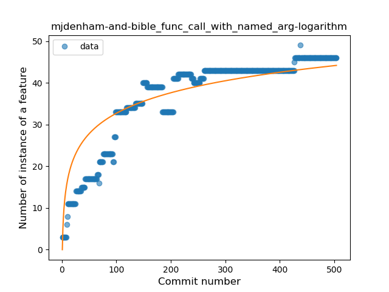
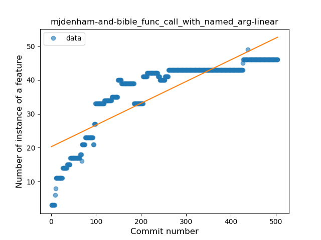
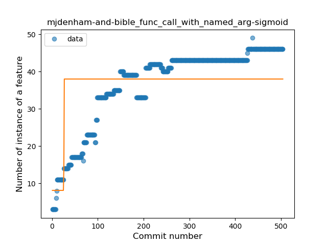
### <a name="data_class">Data Class</a>
----
#### Functions
* **Constant Rise - Linear:** 
    * **R_Squared:** 0.82660609
* **Sudden Rise Plateau - Logarithm:** 
    * **R_Squared:** 0.53008178

**Plots** :chart_with_upwards_trend:
-----

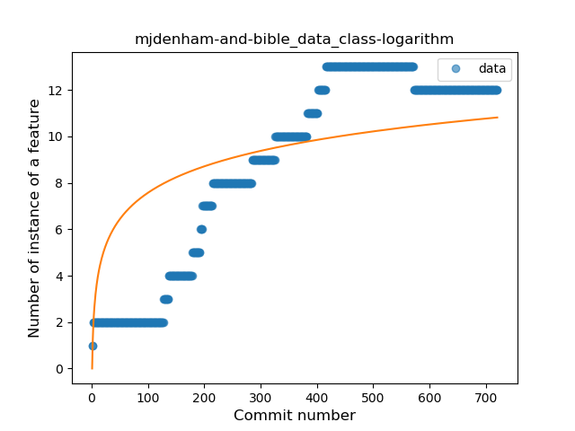
### <a name="property_delegation">Property Delegation</a>
----
#### Functions
* **Plateau Gradual Rise - Sigmoid:** 
    * **R_Squared:** 0.89108586
* **Sudden Rise Plateau - Logarithm:** 
    * **R_Squared:** 0.69167371
* **Constant Rise - Linear:** 
    * **R_Squared:** 0.40395531

**Plots** :chart_with_upwards_trend:
-----

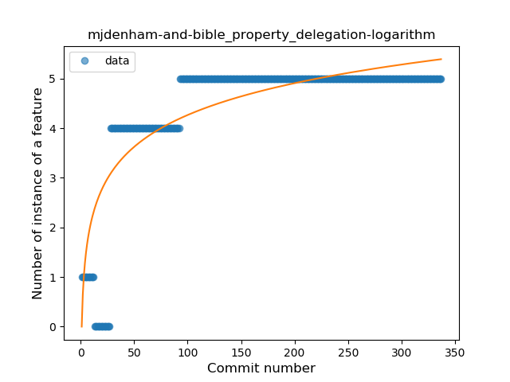
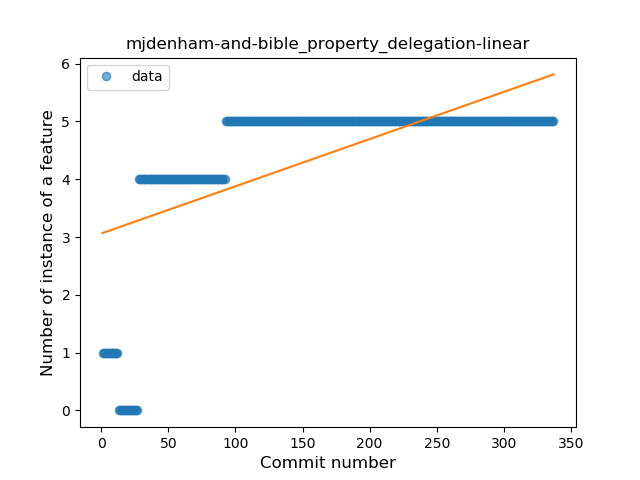
### <a name="destructuring_declaration">Destructuring Declaration</a>
----
#### Functions
* **Plateau Sudden Rise - Binary Sigmoid:** 
    * **R_Squared:** 0.29257265
* **Sudden Rise Plateau - Logarithm:** 
    * **R_Squared:** 0.07015157
* **Constant Rise - Linear:** 
    * **R_Squared:** 0.01581872

**Plots** :chart_with_upwards_trend:
-----

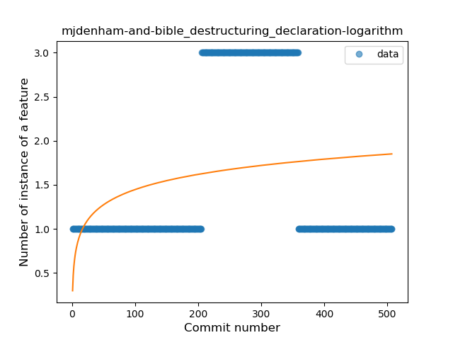
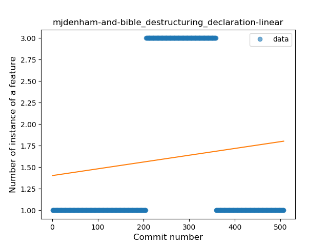
