## mkg20001-aruba-networks-login
----
#### Metrics provided by Detekt
* Number of lines of code 689
* Number of Kotlin files: 8
* Cyclomatic complexity: 98
* Cyclomatic complexity by thousands of lines: 274 

----
**7** features analyzed

*	<a href="#type_inference">Type Inference</a> 
*	<a href="#lambda">Lambda</a> 
*	<a href="#safe_call">Safe Call</a> 
*	<a href="#companion_object">Companion Object</a> 
*	<a href="#unsafe_call">Unsafe Call</a> 
*	<a href="#string_template">String Template</a> 
*	<a href="#singleton">Singleton</a> 

### <a name="type_inference">Type Inference</a>
----
#### Functions
* **Plateau Gradual Rise - Sigmoid:** 
    * **R_Squared:** 0.92916366
* **Constant Rise - Linear:** 
    * **R_Squared:** 0.86897685
* **Sudden Rise Plateau - Logarithm:** 
    * **R_Squared:** 0.86362921

**Plots** :chart_with_upwards_trend:
-----

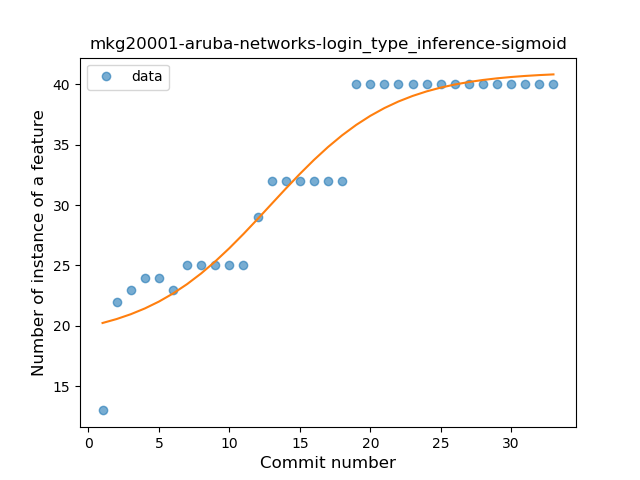
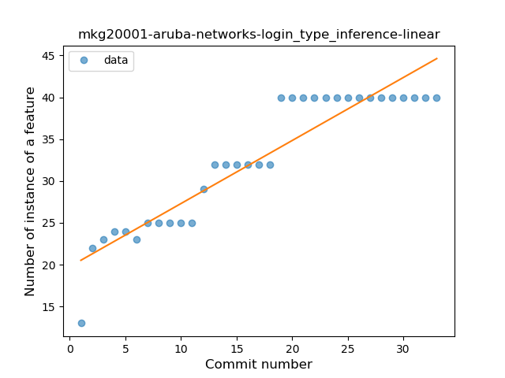
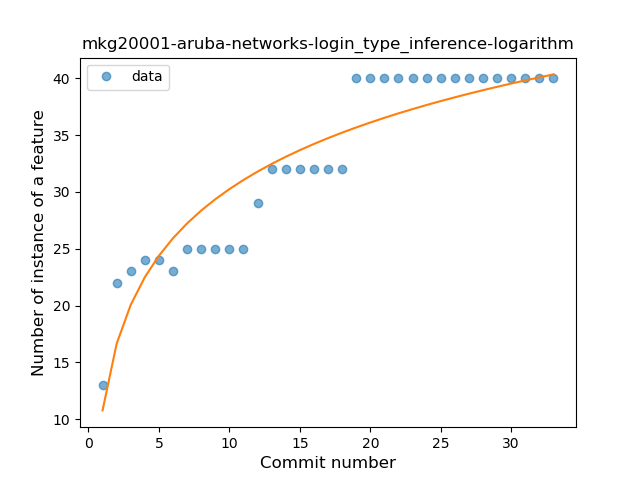
### <a name="lambda">Lambda</a>
----
#### Functions
* **Instability - Polinomial 3:** )
    * **R_Squared:** 0.8440351
* **Sudden Rise - Exponential:** 
    * **R_Squared:** 0.65112744
* **Constant Rise - Linear:** 
    * **R_Squared:** 0.62848953
* **Sudden Rise Plateau - Logarithm:** 
    * **R_Squared:** 0.34287153

**Plots** :chart_with_upwards_trend:
-----

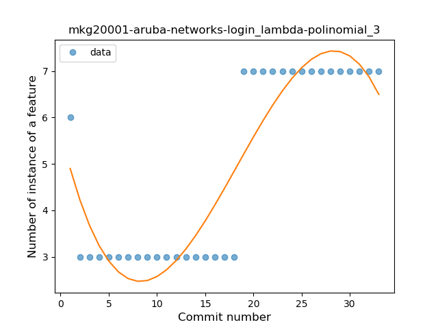
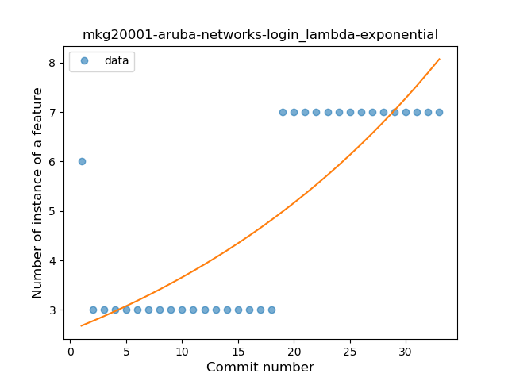
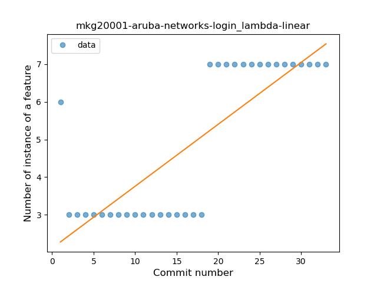
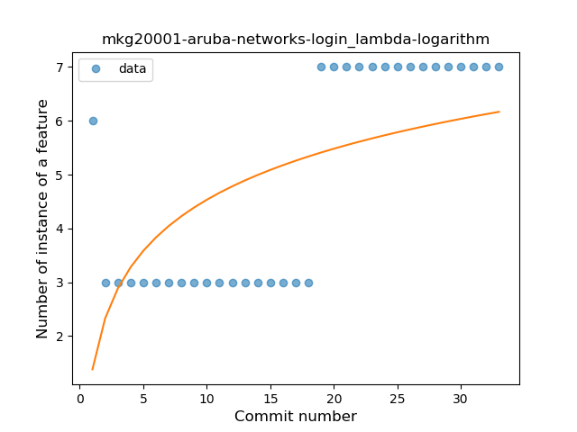
### <a name="safe_call">Safe Call</a>
----
#### Functions
* **Sudden Decline - Exponential:** 
    * **R_Squared:** 1.0
* **Instability - Polinomial 3:** )
    * **R_Squared:** 0.37044818
* **Constant Decline - Linear:** 
    * **R_Squared:** 0.08823529
* **Sudden Rise Plateau - Logarithm:** 
    * **R_Squared:** -0.0

**Plots** :chart_with_upwards_trend:
-----

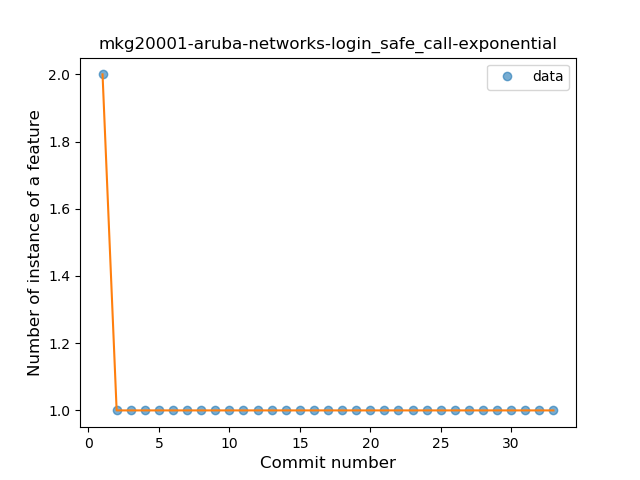
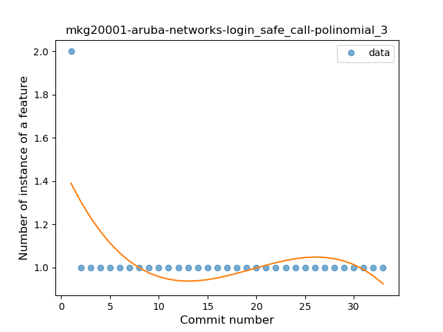
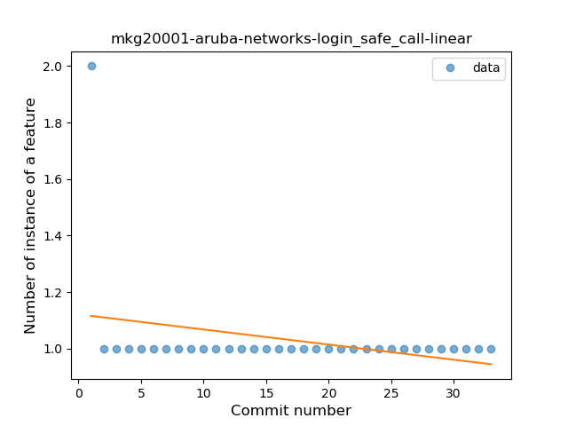
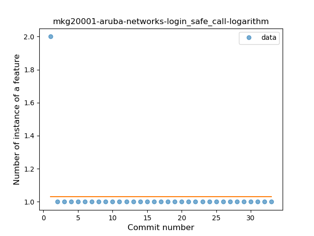
### <a name="companion_object">Companion Object</a>
----
#### Functions
* **Plateau Gradual Rise - Sigmoid:** 
    * **R_Squared:** 0.96161805
* **Constant Rise - Linear:** 
    * **R_Squared:** 0.86124542
* **Sudden Rise Plateau - Logarithm:** 
    * **R_Squared:** 0.8252855

**Plots** :chart_with_upwards_trend:
-----

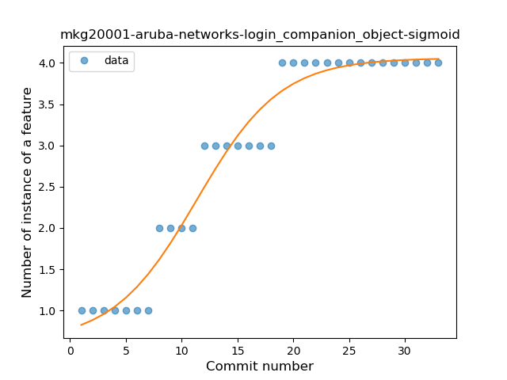
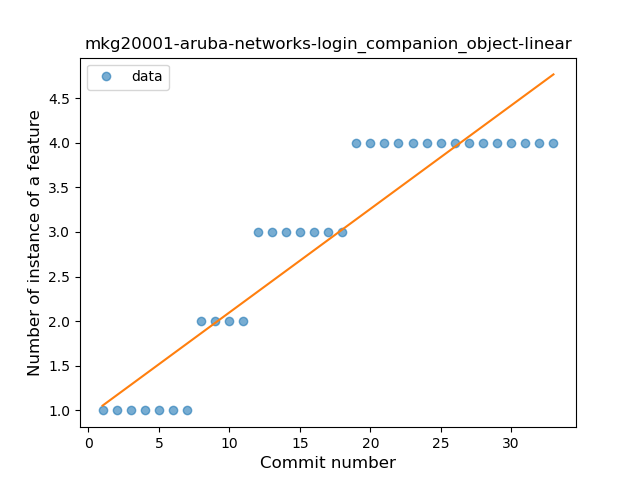
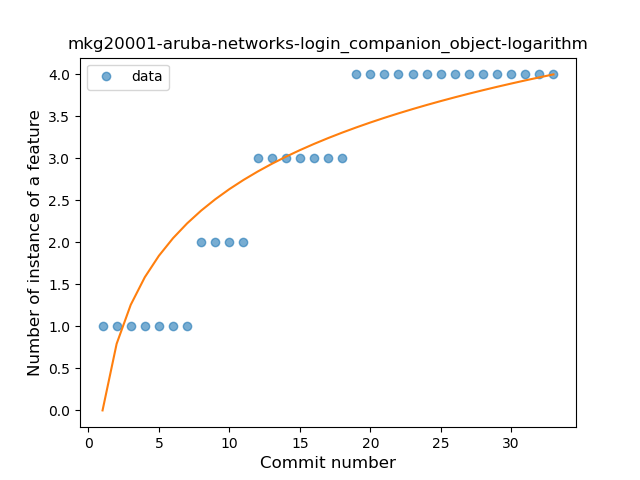
### <a name="unsafe_call">Unsafe Call</a>
----
#### Functions
* **Plateau Gradual Rise - Sigmoid:** 
    * **R_Squared:** 0.96513537
* **Sudden Rise Plateau - Logarithm:** 
    * **R_Squared:** 0.89210787
* **Constant Rise - Linear:** 
    * **R_Squared:** 0.83749316

**Plots** :chart_with_upwards_trend:
-----

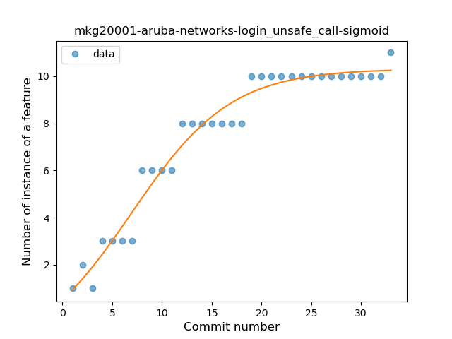
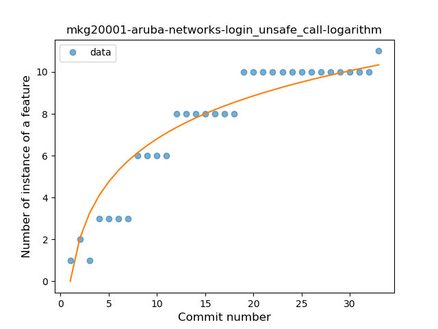
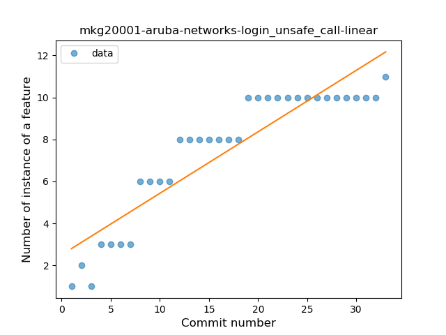
### <a name="string_template">String Template</a>
----
#### Functions
* **Instability - Polinomial 4:** 
    * **R_Squared:** 0.80315737
* **Sudden Rise - Exponential:** 
    * **R_Squared:** 0.56790797
* **Constant Rise - Linear:** 
    * **R_Squared:** 0.55009538
* **Sudden Rise Plateau - Logarithm:** 
    * **R_Squared:** 0.33295827

**Plots** :chart_with_upwards_trend:
-----

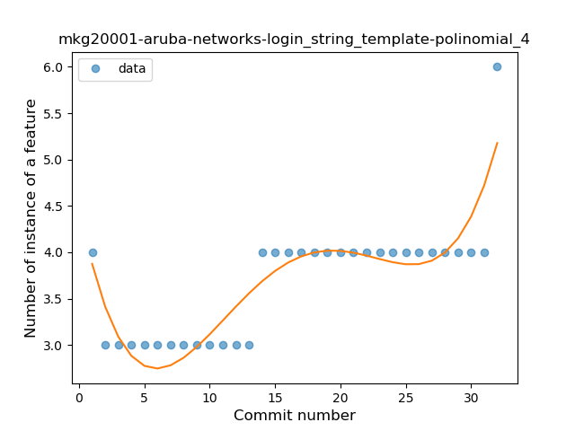
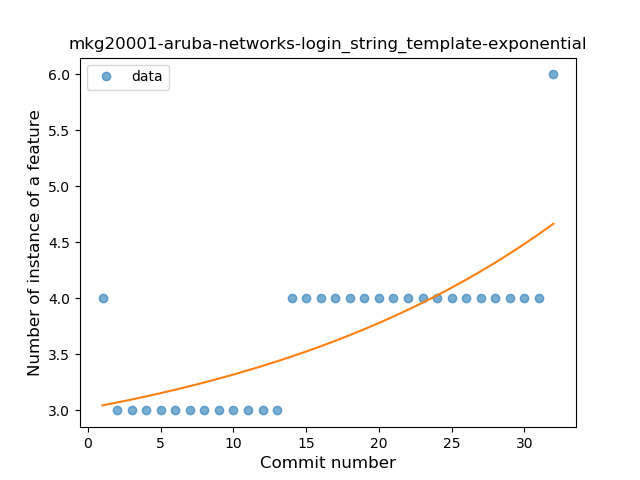
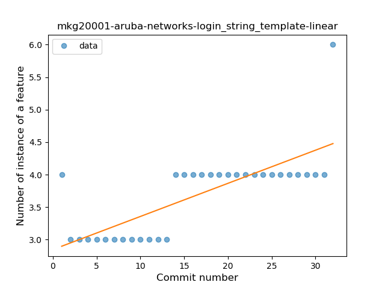
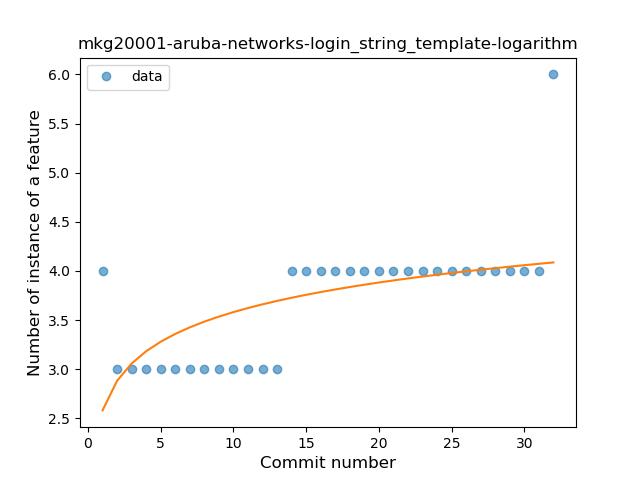
### <a name="singleton">Singleton</a>
----
#### Functions
* **Plateau Sudden Rise - Binary Sigmoid:** 
    * **R_Squared:** 1.0
* **Constant Rise - Linear:** 
    * **R_Squared:** 0.69485294
* **Sudden Rise Plateau - Logarithm:** 
    * **R_Squared:** 0.66492345

**Plots** :chart_with_upwards_trend:
-----

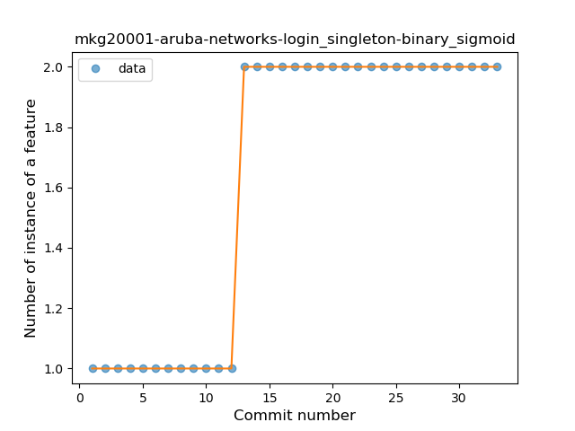
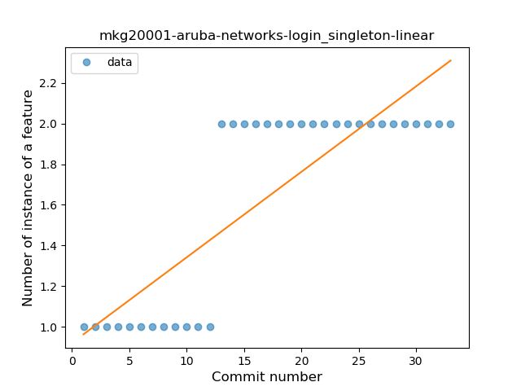
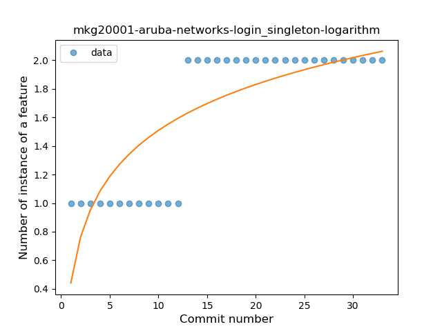
