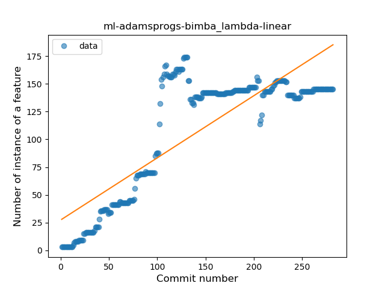
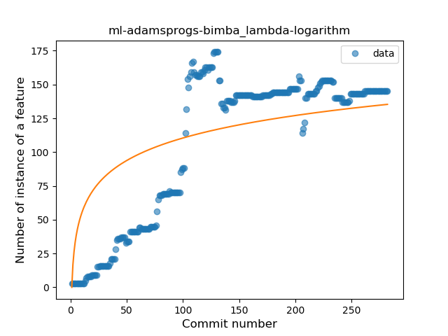
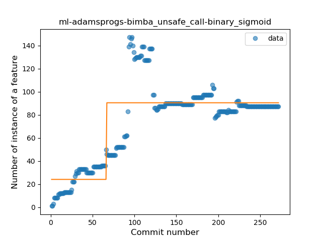
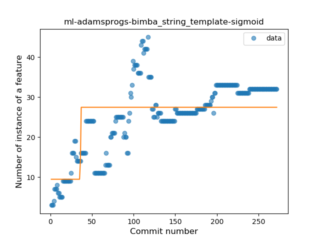
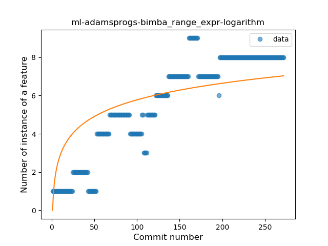
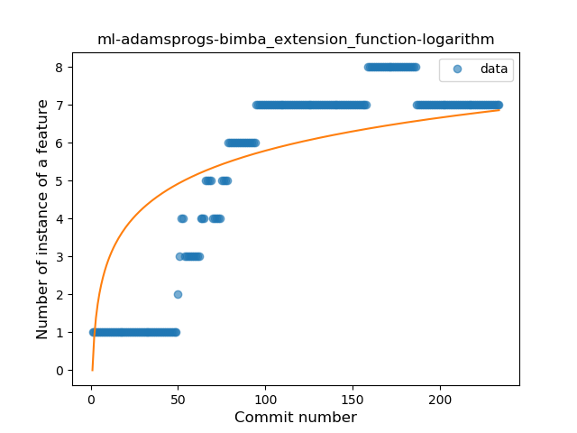

## ml-adamsprogs-bimba
----
#### Metrics provided by Detekt
* Number of lines of code 4007
* Number of Kotlin files: 36
* Cyclomatic complexity: 709
* Cyclomatic complexity by thousands of lines: 289 

----
**16** features analyzed

*	<a href="#type_inference">Type Inference</a> 
*	<a href="#lambda">Lambda</a> 
*	<a href="#safe_call">Safe Call</a> 
*	<a href="#when_expr">When expression</a> 
*	<a href="#unsafe_call">Unsafe Call</a> 
*	<a href="#companion_object">Companion Object</a> 
*	<a href="#string_template">String Template</a> 
*	<a href="#func_with_default_value">Function with Default Value</a> 
*	<a href="#range_expr">Range Expression</a> 
*	<a href="#smart_cast">Smart Cast</a> 
*	<a href="#data_class">Data Class</a> 
*	<a href="#func_call_with_named_arg">Function call with Named Argument</a> 
*	<a href="#extension_function">Extension Function</a> 
*	<a href="#destructuring_declaration">Destructuring Declaration</a> 
*	<a href="#overloaded_op">Overloaded Operator</a> 
*	<a href="#coroutine">Coroutine</a> 

### <a name="type_inference">Type Inference</a>
----
#### Functions
* **Sudden Rise Plateau - Logarithm:** 
    * **R_Squared:** 0.70042991
* **Constant Rise - Linear:** 
    * **R_Squared:** 0.6807204
* **Plateau Sudden Rise - Binary Sigmoid:** 
    * **R_Squared:** 0.0141465

**Plots** :chart_with_upwards_trend:
-----

### <a name="lambda">Lambda</a>
----
#### Functions
* **Plateau Sudden Rise - Binary Sigmoid:** 
    * **R_Squared:** 0.72817247
* **Constant Rise - Linear:** 
    * **R_Squared:** 0.6851126
* **Sudden Rise Plateau - Logarithm:** 
    * **R_Squared:** 0.54134365

**Plots** :chart_with_upwards_trend:
-----

### <a name="safe_call">Safe Call</a>
----
#### Functions
* **Plateau Sudden Rise - Binary Sigmoid:** 
    * **R_Squared:** 0.24790931
* **Constant Decline - Linear:** 
    * **R_Squared:** 0.03803557
* **Sudden Rise Plateau - Logarithm:** 
    * **R_Squared:** 0.03078553
* **Sudden Decline - Exponential:** 
    * **R_Squared:** -0.0

**Plots** :chart_with_upwards_trend:
-----

### <a name="when_expr">When expression</a>
----
#### Functions
* **Constant Rise - Linear:** 
    * **R_Squared:** 0.81777715
* **Sudden Rise Plateau - Logarithm:** 
    * **R_Squared:** 0.81395642

**Plots** :chart_with_upwards_trend:
-----

### <a name="unsafe_call">Unsafe Call</a>
----
#### Functions
* **Plateau Sudden Rise - Binary Sigmoid:** 
    * **R_Squared:** 0.66601627
* **Sudden Rise Plateau - Logarithm:** 
    * **R_Squared:** 0.46859876
* **Constant Rise - Linear:** 
    * **R_Squared:** 0.38325425

**Plots** :chart_with_upwards_trend:
-----

### <a name="companion_object">Companion Object</a>
----
#### Functions
* **Constant Rise - Linear:** 
    * **R_Squared:** 0.62438076
* **Sudden Rise Plateau - Logarithm:** 
    * **R_Squared:** 0.60639776
* **Plateau Sudden Rise - Binary Sigmoid:** 
    * **R_Squared:** 0.27151426

**Plots** :chart_with_upwards_trend:
-----

### <a name="string_template">String Template</a>
----
#### Functions
* **Sudden Rise Plateau - Logarithm:** 
    * **R_Squared:** 0.5959493
* **Constant Rise - Linear:** 
    * **R_Squared:** 0.53332574
* **Plateau Gradual Rise - Sigmoid:** 
    * **R_Squared:** 0.44405238

**Plots** :chart_with_upwards_trend:
-----

### <a name="func_with_default_value">Function with Default Value</a>
----
#### Functions
* **Constant Rise - Linear:** 
    * **R_Squared:** 0.9283195
* **Sudden Rise - Exponential:** 
    * **R_Squared:** 0.93723137
* **Sudden Rise Plateau - Logarithm:** 
    * **R_Squared:** 0.51559337

**Plots** :chart_with_upwards_trend:
-----

### <a name="range_expr">Range Expression</a>
----
#### Functions
* **Plateau Gradual Rise - Sigmoid:** 
    * **R_Squared:** 0.91082763
* **Constant Rise - Linear:** 
    * **R_Squared:** 0.84000874
* **Sudden Rise Plateau - Logarithm:** 
    * **R_Squared:** 0.61372773

**Plots** :chart_with_upwards_trend:
-----

### <a name="smart_cast">Smart Cast</a>
----
#### Functions
* **Sudden Rise - Exponential:** 
    * **R_Squared:** 0.86040493
* **Constant Rise - Linear:** 
    * **R_Squared:** 0.84131986
* **Sudden Rise Plateau - Logarithm:** 
    * **R_Squared:** 0.62567177
* **Plateau Gradual Rise - Sigmoid:** 
    * **R_Squared:** 0.29769126

**Plots** :chart_with_upwards_trend:
-----

### <a name="data_class">Data Class</a>
----
#### Functions
* **Plateau Gradual Rise - Sigmoid:** 
    * **R_Squared:** 0.99001523
* **Constant Rise - Linear:** 
    * **R_Squared:** 0.65818136
* **Sudden Rise Plateau - Logarithm:** 
    * **R_Squared:** 0.45478015

**Plots** :chart_with_upwards_trend:
-----

### <a name="func_call_with_named_arg">Function call with Named Argument</a>
----
#### Functions
* **Constant Rise - Linear:** 
    * **R_Squared:** 0.15900048
* **Sudden Rise - Exponential:** 
    * **R_Squared:** 0.15979198
* **Sudden Rise Plateau - Logarithm:** 
    * **R_Squared:** 0.0492241

**Plots** :chart_with_upwards_trend:
-----

### <a name="extension_function">Extension Function</a>
----
#### Functions
* **Plateau Gradual Rise - Sigmoid:** 
    * **R_Squared:** 0.97144362
* **Constant Rise - Linear:** 
    * **R_Squared:** 0.72295522
* **Sudden Rise Plateau - Logarithm:** 
    * **R_Squared:** 0.59355062

**Plots** :chart_with_upwards_trend:
-----

### <a name="destructuring_declaration">Destructuring Declaration</a>
----
#### Functions
* **Plateau Gradual Rise - Sigmoid:** 
    * **R_Squared:** 0.88596792
* **Sudden Rise Plateau - Logarithm:** 
    * **R_Squared:** 0.61247342
* **Constant Rise - Linear:** 
    * **R_Squared:** 0.52090393

**Plots** :chart_with_upwards_trend:
-----

### <a name="overloaded_op">Overloaded Operator</a>
----
#### Functions
* **Plateau Gradual Rise - Sigmoid:** 
    * **R_Squared:** 0.96663481
* **Sudden Rise - Exponential:** 
    * **R_Squared:** 0.88218178
* **Constant Rise - Linear:** 
    * **R_Squared:** 0.86977841
* **Sudden Rise Plateau - Logarithm:** 
    * **R_Squared:** 0.53734677

**Plots** :chart_with_upwards_trend:
-----

### <a name="coroutine">Coroutine</a>
----
#### Functions
* **Plateau Gradual Rise - Sigmoid:** 
    * **R_Squared:** 0.97873874
* **Constant Rise - Linear:** 
    * **R_Squared:** 0.84685655
* **Sudden Rise - Exponential:** 
    * **R_Squared:** 0.84947388
* **Sudden Rise Plateau - Logarithm:** 
    * **R_Squared:** 0.34987689

**Plots** :chart_with_upwards_trend:
-----

