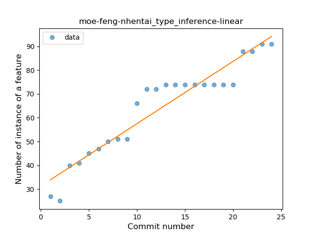
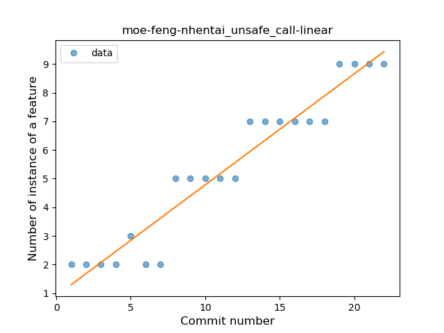
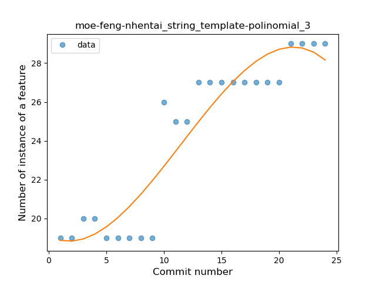
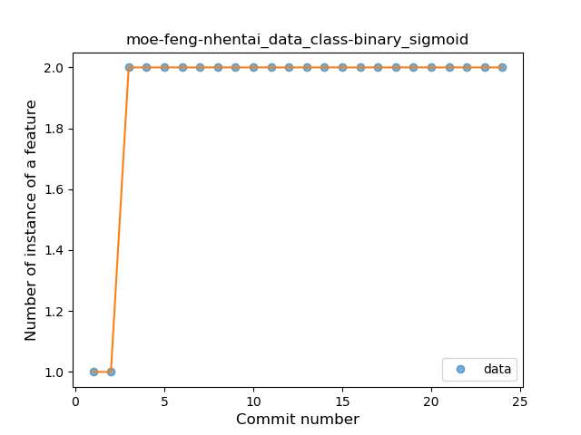
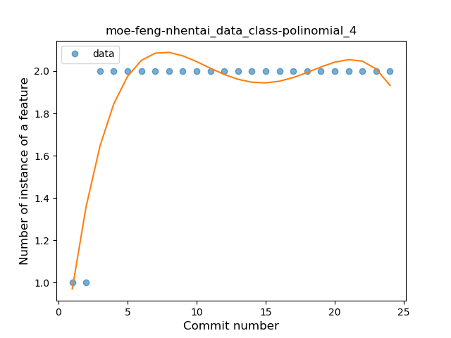
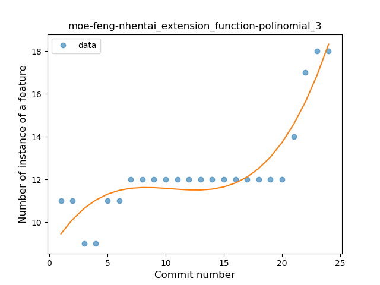
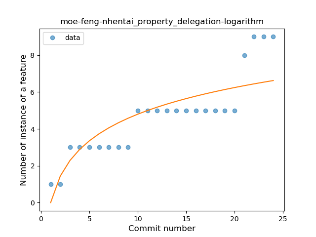

## moe-feng-nhentai
----
#### Metrics provided by Detekt
* Number of lines of code 2136
* Number of Kotlin files: 49
* Cyclomatic complexity: 297
* Cyclomatic complexity by thousands of lines: 298 

----
**18** features analyzed

*	<a href="#type_inference">Type Inference</a> 
*	<a href="#lambda">Lambda</a> 
*	<a href="#safe_call">Safe Call</a> 
*	<a href="#when_expr">When expression</a> 
*	<a href="#unsafe_call">Unsafe Call</a> 
*	<a href="#companion_object">Companion Object</a> 
*	<a href="#string_template">String Template</a> 
*	<a href="#func_with_default_value">Function with Default Value</a> 
*	<a href="#singleton">Singleton</a> 
*	<a href="#range_expr">Range Expression</a> 
*	<a href="#data_class">Data Class</a> 
*	<a href="#func_call_with_named_arg">Function call with Named Argument</a> 
*	<a href="#extension_function">Extension Function</a> 
*	<a href="#property_delegation">Property Delegation</a> 
*	<a href="#destructuring_declaration">Destructuring Declaration</a> 
*	<a href="#inline_func">Inline Function</a> 
*	<a href="#overloaded_op">Overloaded Operator</a> 
*	<a href="#coroutine">Coroutine</a> 

### <a name="type_inference">Type Inference</a>
----
#### Functions
* **Constant Rise - Linear:** 
    * **R_Squared:** 0.90788848
* **Sudden Rise Plateau - Logarithm:** 
    * **R_Squared:** 0.90292302

**Plots** :chart_with_upwards_trend:
-----

### <a name="lambda">Lambda</a>
----
#### Functions
* **Sudden Rise Plateau - Logarithm:** 
    * **R_Squared:** 0.95278781
* **Constant Rise - Linear:** 
    * **R_Squared:** 0.88825964

**Plots** :chart_with_upwards_trend:
-----

### <a name="safe_call">Safe Call</a>
----
#### Functions
* **Sudden Rise Plateau - Logarithm:** 
    * **R_Squared:** 0.91796526
* **Constant Rise - Linear:** 
    * **R_Squared:** 0.82908316

**Plots** :chart_with_upwards_trend:
-----

### <a name="when_expr">When expression</a>
----
#### Functions
* **Constant Rise - Linear:** 
    * **R_Squared:** 0.73178995
* **Sudden Rise Plateau - Logarithm:** 
    * **R_Squared:** 0.69715393

**Plots** :chart_with_upwards_trend:
-----

### <a name="unsafe_call">Unsafe Call</a>
----
#### Functions
* **Constant Rise - Linear:** 
    * **R_Squared:** 0.92851224
* **Plateau Gradual Rise - Sigmoid:** 
    * **R_Squared:** 0.93496732
* **Sudden Rise Plateau - Logarithm:** 
    * **R_Squared:** 0.75848372

**Plots** :chart_with_upwards_trend:
-----

### <a name="companion_object">Companion Object</a>
----
#### Functions
* **Instability - Polinomial 4:** 
    * **R_Squared:** 0.96048842
* **Constant Rise - Linear:** 
    * **R_Squared:** 0.87434183
* **Sudden Rise Plateau - Logarithm:** 
    * **R_Squared:** 0.82737149

**Plots** :chart_with_upwards_trend:
-----

### <a name="string_template">String Template</a>
----
#### Functions
* **Instability - Polinomial 3:** )
    * **R_Squared:** 0.8768191
* **Constant Rise - Linear:** 
    * **R_Squared:** 0.83856982
* **Sudden Rise Plateau - Logarithm:** 
    * **R_Squared:** 0.7117516

**Plots** :chart_with_upwards_trend:
-----

### <a name="func_with_default_value">Function with Default Value</a>
----
#### Functions
* **Plateau Gradual Rise - Sigmoid:** 
    * **R_Squared:** 0.96519491
* **Instability - Polinomial 4:** 
    * **R_Squared:** 0.94365309
* **Constant Rise - Linear:** 
    * **R_Squared:** 0.83568375
* **Sudden Rise Plateau - Logarithm:** 
    * **R_Squared:** 0.78802977

**Plots** :chart_with_upwards_trend:
-----

### <a name="singleton">Singleton</a>
----
#### Functions
* **Plateau Sudden Rise - Binary Sigmoid:** 
    * **R_Squared:** 0.73770492
* **Instability - Polinomial 4:** 
    * **R_Squared:** 0.72314172
* **Instability - Polinomial 3:** )
    * **R_Squared:** 0.61480211
* **Constant Rise - Linear:** 
    * **R_Squared:** 0.50431932
* **Sudden Rise Plateau - Logarithm:** 
    * **R_Squared:** 0.41083871

**Plots** :chart_with_upwards_trend:
-----

### <a name="range_expr">Range Expression</a>
----
#### Functions
* **Plateau Sudden Rise - Binary Sigmoid:** 
    * **R_Squared:** 1.0
* **Instability - Polinomial 4:** 
    * **R_Squared:** 0.87983793
* **Instability - Polinomial 3:** )
    * **R_Squared:** 0.83829663
* **Constant Rise - Linear:** 
    * **R_Squared:** 0.72180451
* **Sudden Rise Plateau - Logarithm:** 
    * **R_Squared:** 0.66510399

**Plots** :chart_with_upwards_trend:
-----

### <a name="data_class">Data Class</a>
----
#### Functions
* **Plateau Sudden Rise - Binary Sigmoid:** 
    * **R_Squared:** 1.0
* **Instability - Polinomial 4:** 
    * **R_Squared:** 0.82066146
* **Instability - Polinomial 3:** )
    * **R_Squared:** 0.70761799
* **Sudden Rise Plateau - Logarithm:** 
    * **R_Squared:** 0.51558944
* **Constant Rise - Linear:** 
    * **R_Squared:** 0.22956522

**Plots** :chart_with_upwards_trend:
-----

### <a name="func_call_with_named_arg">Function call with Named Argument</a>
----
#### Functions
* **Plateau Gradual Rise - Sigmoid:** 
    * **R_Squared:** 0.97357328
* **Instability - Polinomial 4:** 
    * **R_Squared:** 0.94248806
* **Instability - Polinomial 3:** )
    * **R_Squared:** 0.92735331
* **Constant Rise - Linear:** 
    * **R_Squared:** 0.8204585
* **Sudden Rise Plateau - Logarithm:** 
    * **R_Squared:** 0.70092157

**Plots** :chart_with_upwards_trend:
-----

### <a name="extension_function">Extension Function</a>
----
#### Functions
* **Instability - Polinomial 4:** 
    * **R_Squared:** 0.89340759
* **Sudden Rise - Exponential:** 
    * **R_Squared:** 0.82273502
* **Instability - Polinomial 3:** )
    * **R_Squared:** 0.83255594
* **Constant Rise - Linear:** 
    * **R_Squared:** 0.59666349
* **Sudden Rise Plateau - Logarithm:** 
    * **R_Squared:** 0.39368315

**Plots** :chart_with_upwards_trend:
-----

### <a name="property_delegation">Property Delegation</a>
----
#### Functions
* **Sudden Rise - Exponential:** 
    * **R_Squared:** 0.84724004
* **Constant Rise - Linear:** 
    * **R_Squared:** 0.82623698
* **Sudden Rise Plateau - Logarithm:** 
    * **R_Squared:** 0.69605721

**Plots** :chart_with_upwards_trend:
-----

### <a name="destructuring_declaration">Destructuring Declaration</a>
----
#### Functions
* **Sudden Decline - Exponential:** 
    * **R_Squared:** 1.0
* **Instability - Polinomial 4:** 
    * **R_Squared:** 0.64273504
* **Instability - Polinomial 3:** )
    * **R_Squared:** 0.47350427
* **Constant Decline - Linear:** 
    * **R_Squared:** 0.12
* **Sudden Rise Plateau - Logarithm:** 
    * **R_Squared:** 0.0

**Plots** :chart_with_upwards_trend:
-----

### <a name="inline_func">Inline Function</a>
----
#### Functions
* **Plateau Sudden Rise - Binary Sigmoid:** 
    * **R_Squared:** 1.0
* **Instability - Polinomial 4:** 
    * **R_Squared:** 0.82066146
* **Instability - Polinomial 3:** )
    * **R_Squared:** 0.70761799
* **Sudden Rise Plateau - Logarithm:** 
    * **R_Squared:** 0.51558944
* **Constant Rise - Linear:** 
    * **R_Squared:** 0.22956522

**Plots** :chart_with_upwards_trend:
-----

### <a name="overloaded_op">Overloaded Operator</a>
----
#### Functions
* **Plateau Sudden Rise - Binary Sigmoid:** 
    * **R_Squared:** 1.0
* **Instability - Polinomial 4:** 
    * **R_Squared:** 0.84338316
* **Sudden Rise - Exponential:** 
    * **R_Squared:** 0.82871715
* **Instability - Polinomial 3:** )
    * **R_Squared:** 0.76153823
* **Constant Rise - Linear:** 
    * **R_Squared:** 0.27067669
* **Sudden Rise Plateau - Logarithm:** 
    * **R_Squared:** 0.1289342

**Plots** :chart_with_upwards_trend:
-----

### <a name="coroutine">Coroutine</a>
----
#### Functions
* **Plateau Sudden Rise - Binary Sigmoid:** 
    * **R_Squared:** 0.73809524
* **Instability - Polinomial 4:** 
    * **R_Squared:** 0.74113701
* **Sudden Rise Plateau - Logarithm:** 
    * **R_Squared:** 0.55013649
* **Constant Rise - Linear:** 
    * **R_Squared:** 0.35776398

**Plots** :chart_with_upwards_trend:
-----

