## moko256-twitlatte
----
#### Metrics provided by Detekt
* Number of lines of code 7026
* Number of Kotlin files: 81
* Cyclomatic complexity: 760
* Cyclomatic complexity by thousands of lines: 236 

----
**16** features analyzed

*	<a href="#type_inference">Type Inference</a> 
*	<a href="#lambda">Lambda</a> 
*	<a href="#safe_call">Safe Call</a> 
*	<a href="#when_expr">When expression</a> 
*	<a href="#companion_object">Companion Object</a> 
*	<a href="#unsafe_call">Unsafe Call</a> 
*	<a href="#string_template">String Template</a> 
*	<a href="#func_with_default_value">Function with Default Value</a> 
*	<a href="#singleton">Singleton</a> 
*	<a href="#smart_cast">Smart Cast</a> 
*	<a href="#range_expr">Range Expression</a> 
*	<a href="#func_call_with_named_arg">Function call with Named Argument</a> 
*	<a href="#data_class">Data Class</a> 
*	<a href="#extension_function">Extension Function</a> 
*	<a href="#property_delegation">Property Delegation</a> 
*	<a href="#destructuring_declaration">Destructuring Declaration</a> 

### <a name="type_inference">Type Inference</a>
----
#### Functions
* **Sudden Rise - Exponential:** 
    * **R_Squared:** 0.95629165
* **Constant Rise - Linear:** 
    * **R_Squared:** 0.69749971
* **Plateau Sudden Rise - Binary Sigmoid:** 
    * **R_Squared:** 0.20594156
* **Sudden Rise Plateau - Logarithm:** 
    * **R_Squared:** 0.18674364

**Plots** :chart_with_upwards_trend:
-----

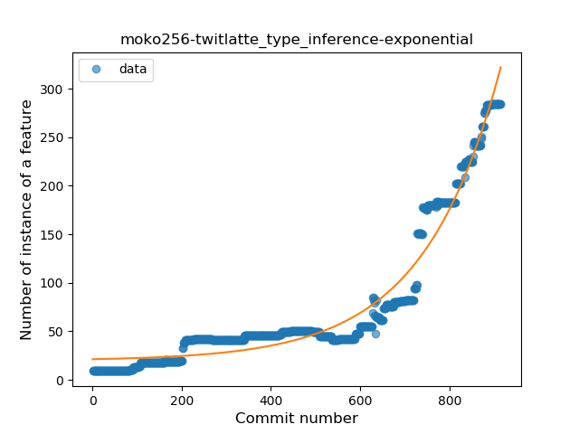
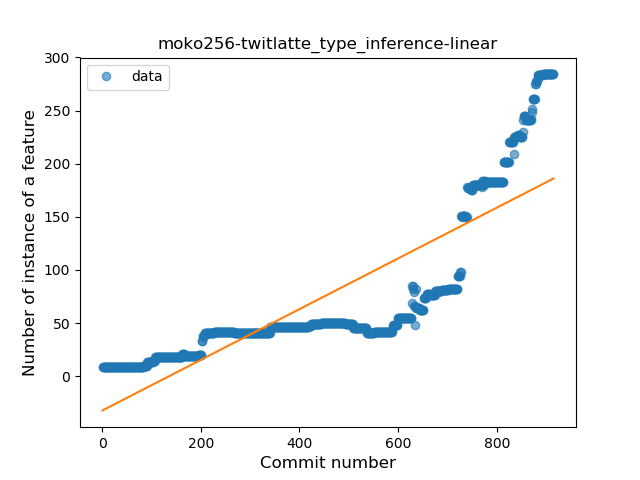
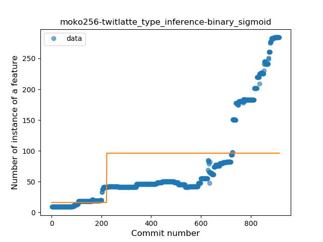
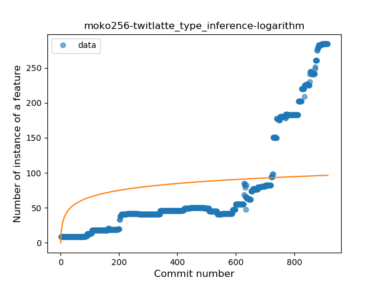
### <a name="lambda">Lambda</a>
----
#### Functions
* **Sudden Rise - Exponential:** 
    * **R_Squared:** 0.9692751
* **Constant Rise - Linear:** 
    * **R_Squared:** 0.56479602
* **Sudden Rise Plateau - Logarithm:** 
    * **R_Squared:** 0.12375695

**Plots** :chart_with_upwards_trend:
-----

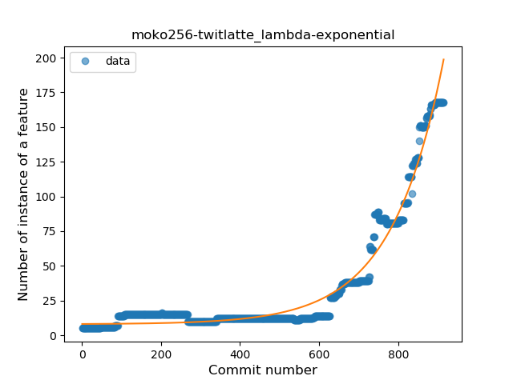
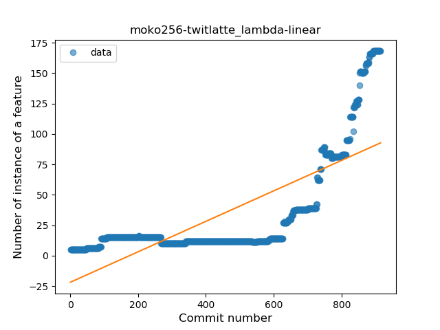
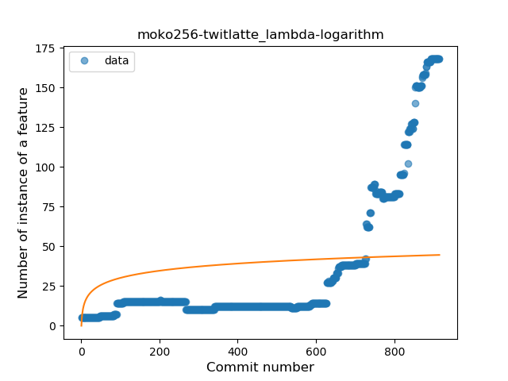
### <a name="safe_call">Safe Call</a>
----
#### Functions
* **Sudden Decline - Exponential:** 
    * **R_Squared:** 0.02294675
* **Constant Decline - Linear:** 
    * **R_Squared:** 0.00099191
* **Sudden Rise Plateau - Logarithm:** 
    * **R_Squared:** -0.0

**Plots** :chart_with_upwards_trend:
-----

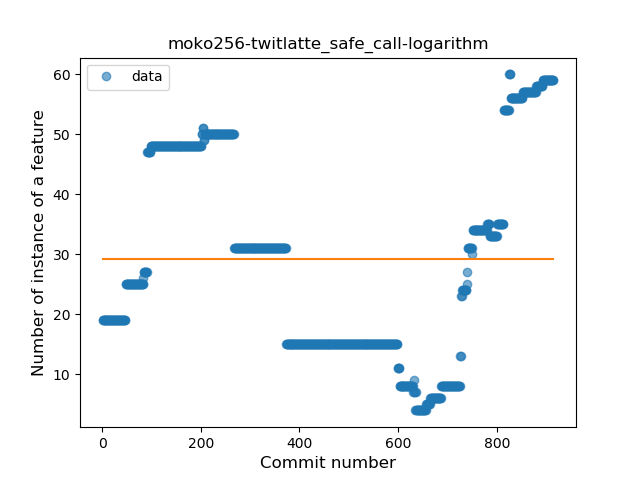
### <a name="when_expr">When expression</a>
----
#### Functions
* **Plateau Gradual Rise - Sigmoid:** 
    * **R_Squared:** 0.93227437
* **Sudden Rise - Exponential:** 
    * **R_Squared:** 0.89818195
* **Constant Rise - Linear:** 
    * **R_Squared:** 0.51665291
* **Sudden Rise Plateau - Logarithm:** 
    * **R_Squared:** 0.19352562

**Plots** :chart_with_upwards_trend:
-----

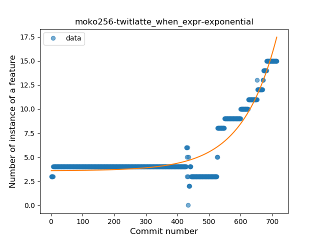
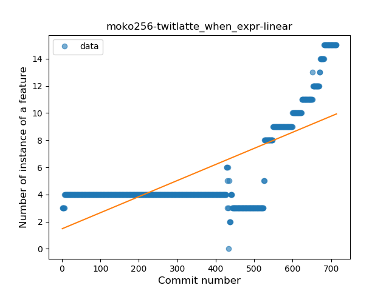
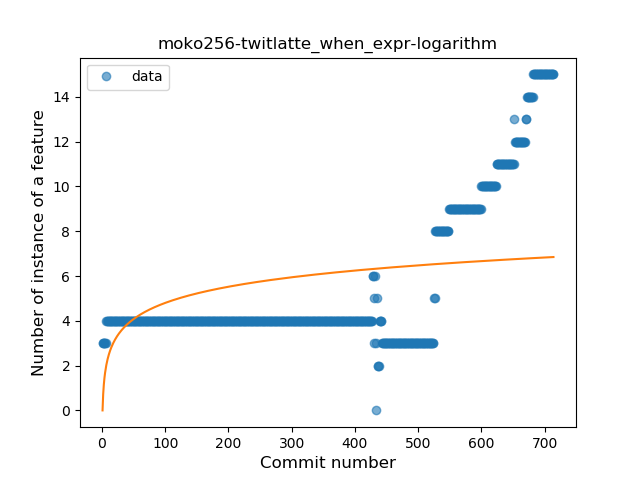
### <a name="companion_object">Companion Object</a>
----
#### Functions
* **Plateau Gradual Rise - Sigmoid:** 
    * **R_Squared:** 0.10807099
* **Constant Decline - Linear:** 
    * **R_Squared:** 0.0670038
* **Sudden Rise Plateau - Logarithm:** 
    * **R_Squared:** -0.0

**Plots** :chart_with_upwards_trend:
-----

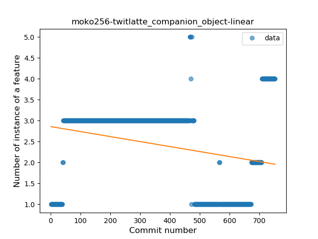
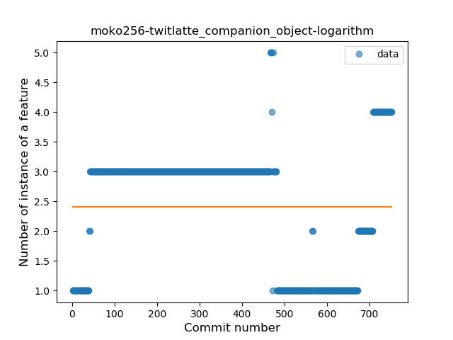
### <a name="unsafe_call">Unsafe Call</a>
----
#### Functions
* **Sudden Rise - Exponential:** 
    * **R_Squared:** 0.82082841
* **Constant Rise - Linear:** 
    * **R_Squared:** 0.23988662
* **Sudden Rise Plateau - Logarithm:** 
    * **R_Squared:** 0.08569192

**Plots** :chart_with_upwards_trend:
-----

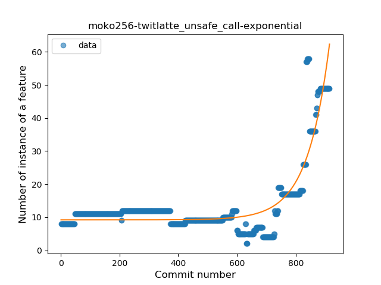
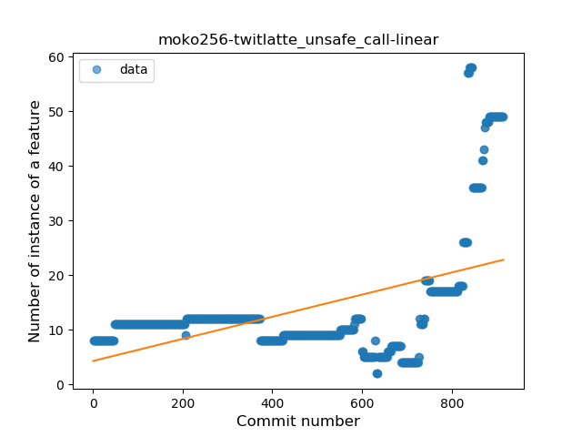
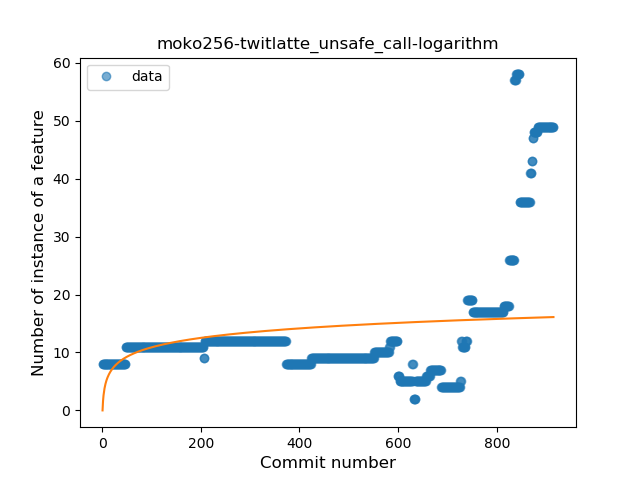
### <a name="string_template">String Template</a>
----
#### Functions
* **Sudden Rise - Exponential:** 
    * **R_Squared:** 0.83050997
* **Constant Rise - Linear:** 
    * **R_Squared:** 0.58946272
* **Sudden Rise Plateau - Logarithm:** 
    * **R_Squared:** 0.11712323

**Plots** :chart_with_upwards_trend:
-----

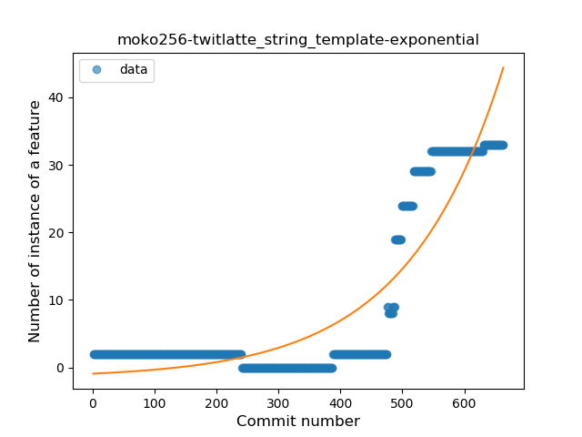
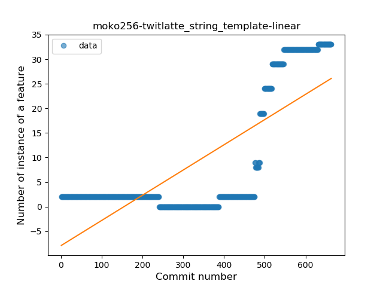
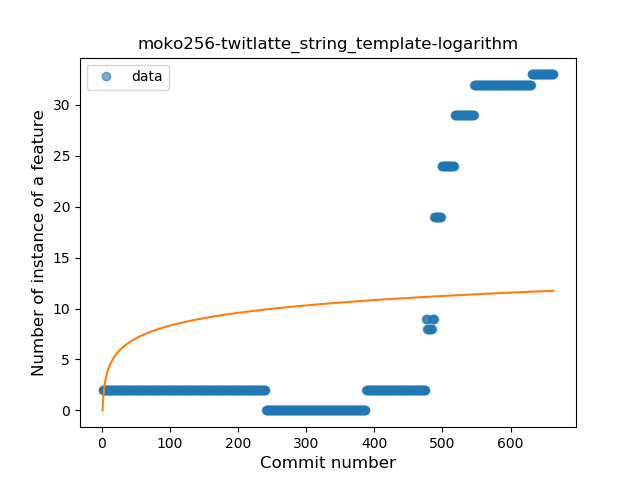
### <a name="func_with_default_value">Function with Default Value</a>
----
#### Functions
* **Plateau Gradual Rise - Sigmoid:** 
    * **R_Squared:** 0.93800783
* **Sudden Rise - Exponential:** 
    * **R_Squared:** 0.92404005
* **Constant Rise - Linear:** 
    * **R_Squared:** 0.76919699
* **Sudden Rise Plateau - Logarithm:** 
    * **R_Squared:** 0.20558502

**Plots** :chart_with_upwards_trend:
-----

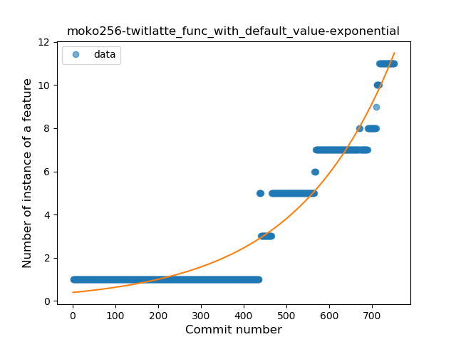
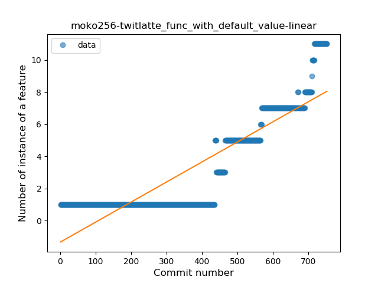
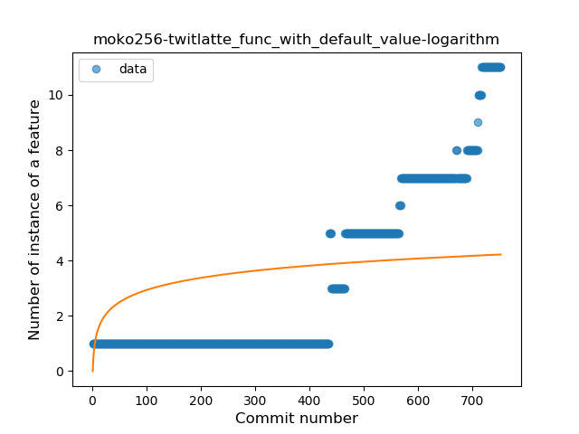
### <a name="singleton">Singleton</a>
----
#### Functions
* **Plateau Gradual Rise - Sigmoid:** 
    * **R_Squared:** 0.97536623
* **Constant Rise - Linear:** 
    * **R_Squared:** 0.74303596
* **Sudden Rise Plateau - Logarithm:** 
    * **R_Squared:** 0.5998434

**Plots** :chart_with_upwards_trend:
-----

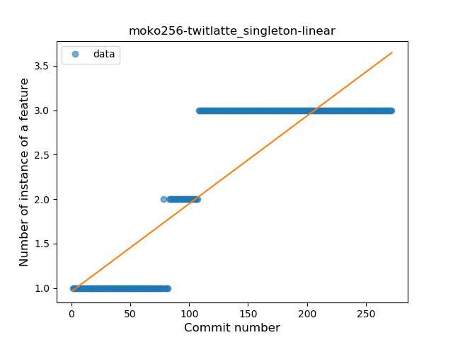
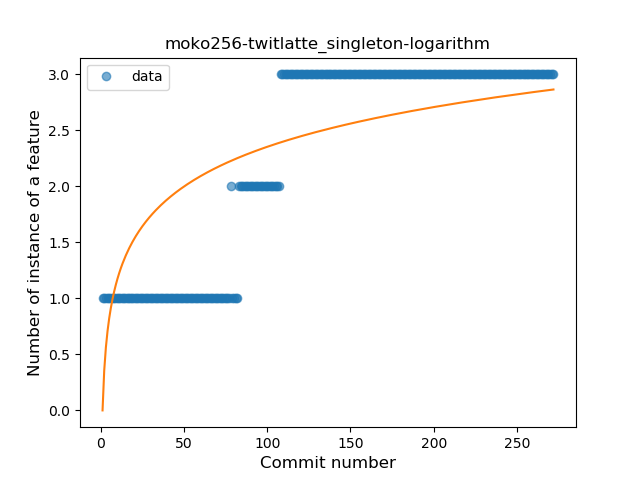
### <a name="smart_cast">Smart Cast</a>
----
#### Functions
* **Plateau Gradual Rise - Sigmoid:** 
    * **R_Squared:** 0.97355112
* **Sudden Rise - Exponential:** 
    * **R_Squared:** 0.94357243
* **Constant Rise - Linear:** 
    * **R_Squared:** 0.67663528
* **Sudden Rise Plateau - Logarithm:** 
    * **R_Squared:** 0.15716774

**Plots** :chart_with_upwards_trend:
-----

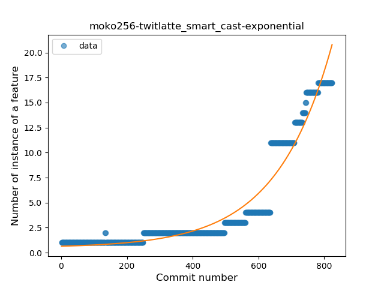
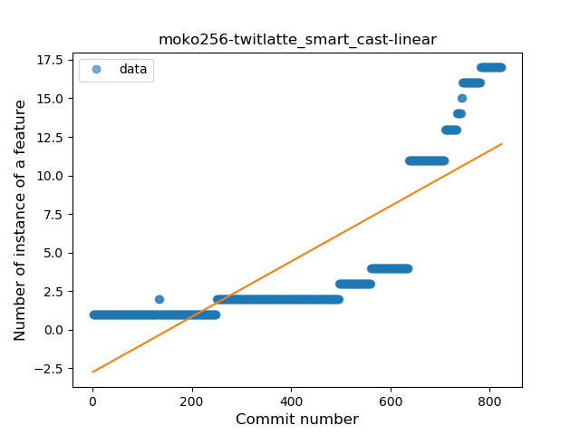
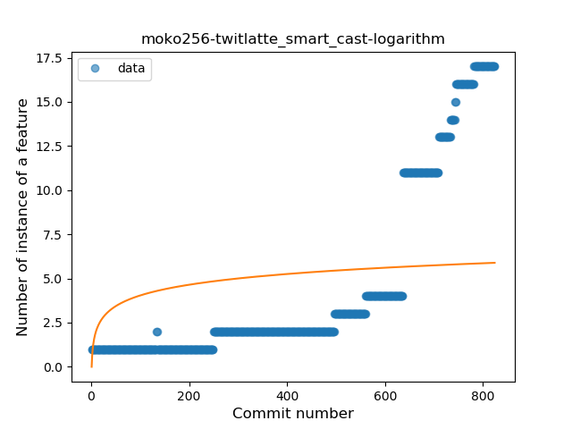
### <a name="range_expr">Range Expression</a>
----
#### Functions
* **Constant Decline - Linear:** 
    * **R_Squared:** 0.3361873
* **Sudden Rise Plateau - Logarithm:** 
    * **R_Squared:** -0.0

**Plots** :chart_with_upwards_trend:
-----

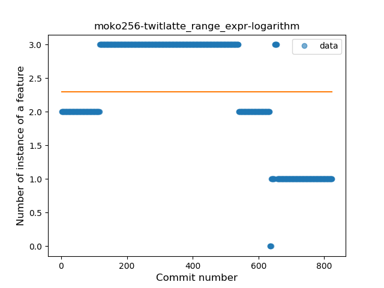
### <a name="func_call_with_named_arg">Function call with Named Argument</a>
----
#### Functions
* **Sudden Rise - Exponential:** 
    * **R_Squared:** 0.89413933
* **Constant Rise - Linear:** 
    * **R_Squared:** 0.67027187
* **Sudden Rise Plateau - Logarithm:** 
    * **R_Squared:** 0.13541707

**Plots** :chart_with_upwards_trend:
-----

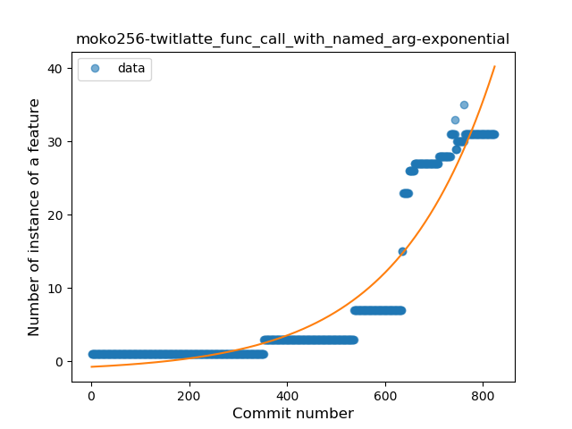
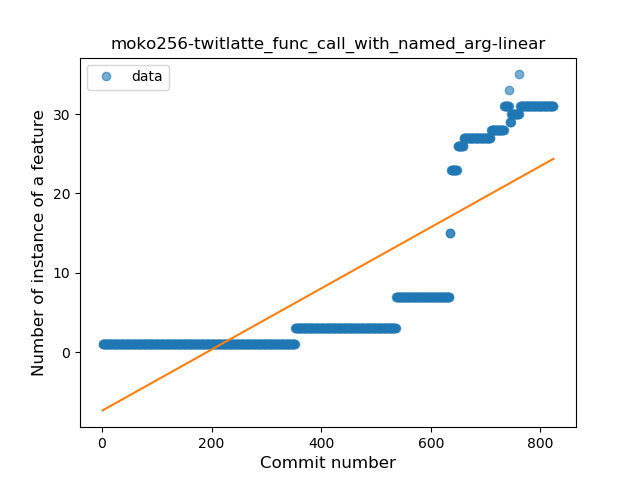
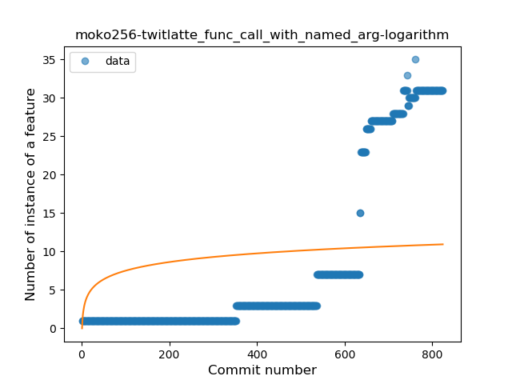
### <a name="data_class">Data Class</a>
----
#### Functions
* **Sudden Rise - Exponential:** 
    * **R_Squared:** 0.911988
* **Constant Rise - Linear:** 
    * **R_Squared:** 0.84866235
* **Sudden Rise Plateau - Logarithm:** 
    * **R_Squared:** 0.52925169

**Plots** :chart_with_upwards_trend:
-----

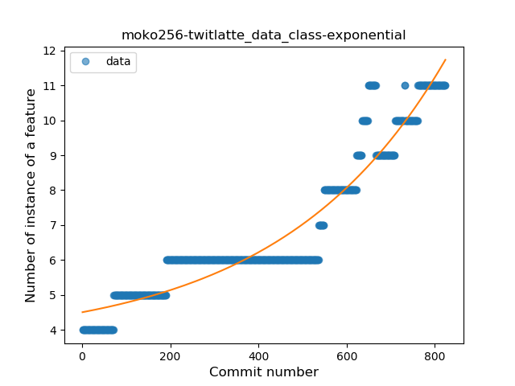
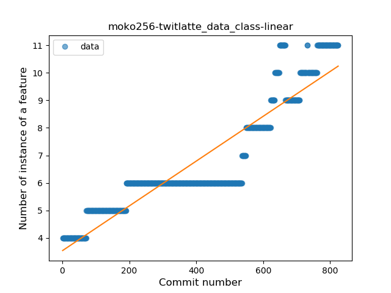

### <a name="extension_function">Extension Function</a>
----
#### Functions
* **Sudden Rise - Exponential:** 
    * **R_Squared:** 0.93235378
* **Constant Rise - Linear:** 
    * **R_Squared:** 0.89641277
* **Sudden Rise Plateau - Logarithm:** 
    * **R_Squared:** 0.29241423

**Plots** :chart_with_upwards_trend:
-----

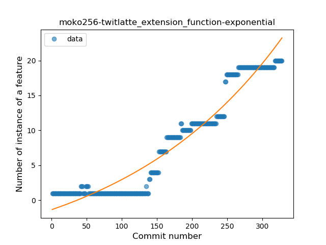
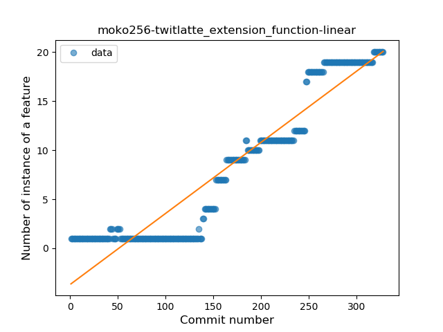
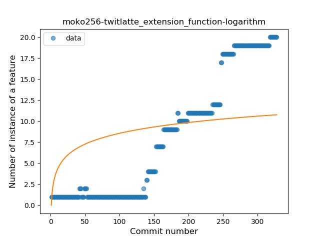
### <a name="property_delegation">Property Delegation</a>
----
#### Functions
* **Plateau Sudden Rise - Binary Sigmoid:** 
    * **R_Squared:** 1.0
* **Constant Rise - Linear:** 
    * **R_Squared:** 0.73584495
* **Sudden Rise Plateau - Logarithm:** 
    * **R_Squared:** 0.52485054

**Plots** :chart_with_upwards_trend:
-----

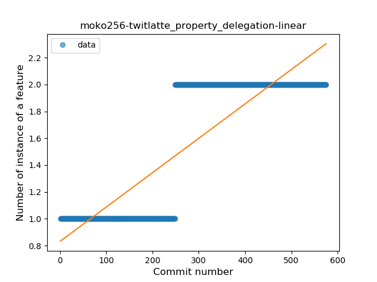
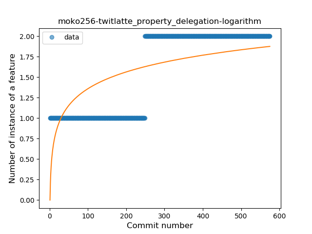
### <a name="destructuring_declaration">Destructuring Declaration</a>
----
#### Functions
* **Constant Rise - Linear:** 
    * **R_Squared:** 0.78122248
* **Sudden Rise Plateau - Logarithm:** 
    * **R_Squared:** 0.69277881

**Plots** :chart_with_upwards_trend:
-----

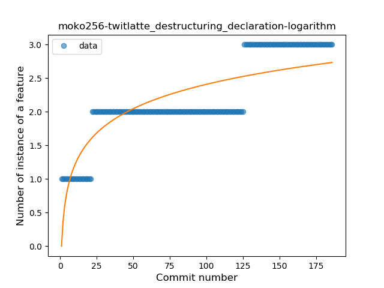
