## mozilla-mobile-focus-android
----
#### Metrics provided by Detekt
* Number of lines of code 15690
* Number of Kotlin files: 144
* Cyclomatic complexity: 2072
* Cyclomatic complexity by thousands of lines: 262 

----
**16** features analyzed

*	<a href="#type_inference">Type Inference</a> 
*	<a href="#lambda">Lambda</a> 
*	<a href="#safe_call">Safe Call</a> 
*	<a href="#when_expr">When expression</a> 
*	<a href="#companion_object">Companion Object</a> 
*	<a href="#unsafe_call">Unsafe Call</a> 
*	<a href="#string_template">String Template</a> 
*	<a href="#func_with_default_value">Function with Default Value</a> 
*	<a href="#singleton">Singleton</a> 
*	<a href="#smart_cast">Smart Cast</a> 
*	<a href="#range_expr">Range Expression</a> 
*	<a href="#func_call_with_named_arg">Function call with Named Argument</a> 
*	<a href="#data_class">Data Class</a> 
*	<a href="#extension_function">Extension Function</a> 
*	<a href="#property_delegation">Property Delegation</a> 
*	<a href="#destructuring_declaration">Destructuring Declaration</a> 

### <a name="type_inference">Type Inference</a>
----
#### Functions
* **Sudden Rise - Exponential:** 
    * **R_Squared:** 0.96396412
* **Constant Rise - Linear:** 
    * **R_Squared:** 0.93370947
* **Sudden Rise Plateau - Logarithm:** 
    * **R_Squared:** 0.325565
* **Plateau Sudden Rise - Binary Sigmoid:** 
    * **R_Squared:** 0.26371622

**Plots** :chart_with_upwards_trend:
-----

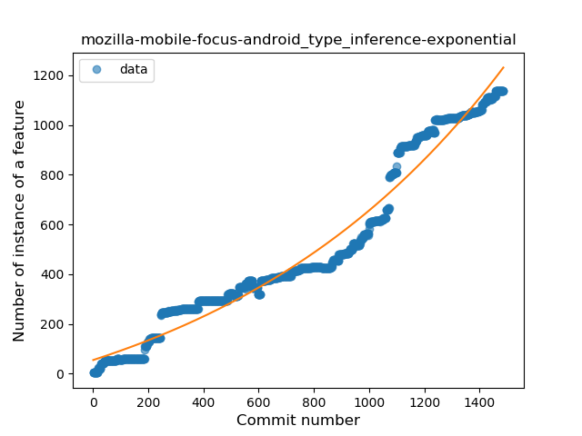
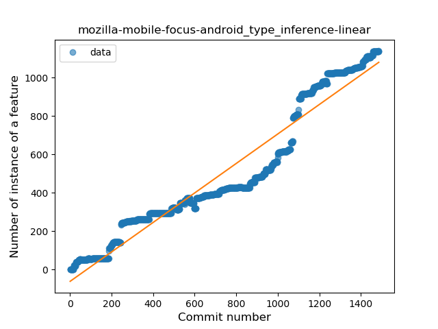
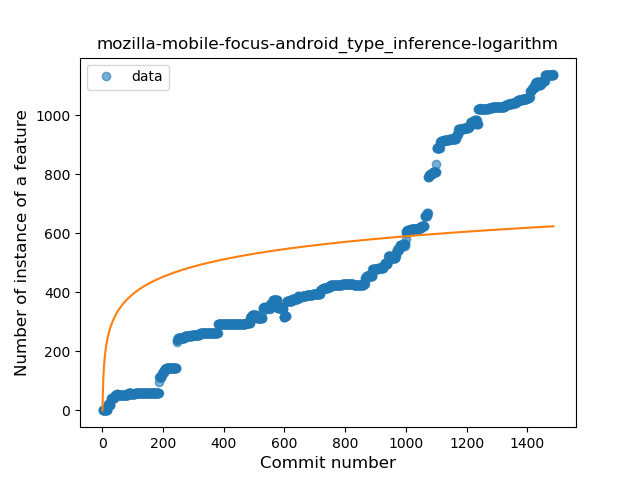
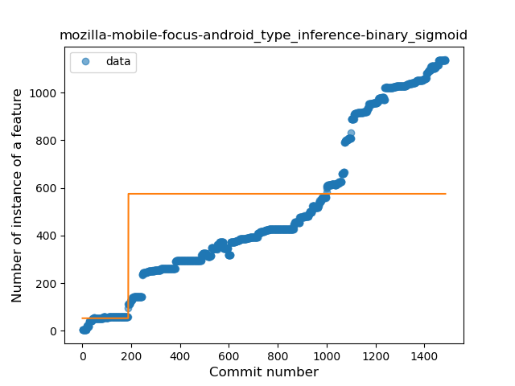
### <a name="lambda">Lambda</a>
----
#### Functions
* **Sudden Rise - Exponential:** 
    * **R_Squared:** 0.97882923
* **Constant Rise - Linear:** 
    * **R_Squared:** 0.94016005
* **Sudden Rise Plateau - Logarithm:** 
    * **R_Squared:** 0.30645928
* **Plateau Sudden Rise - Binary Sigmoid:** 
    * **R_Squared:** 0.154723

**Plots** :chart_with_upwards_trend:
-----

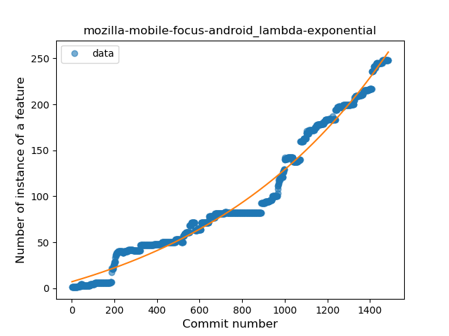
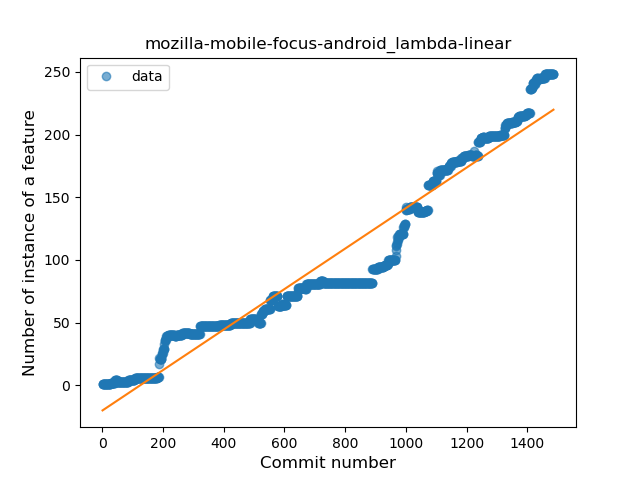
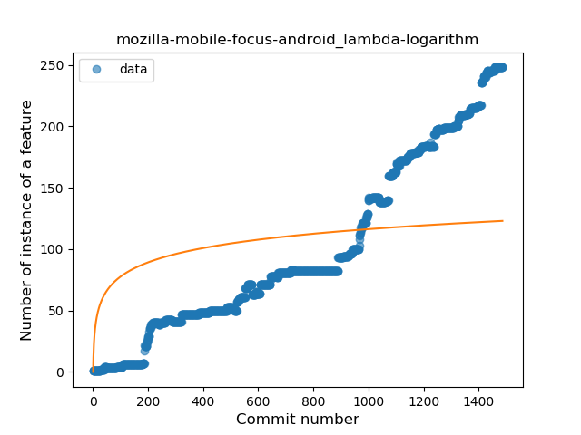
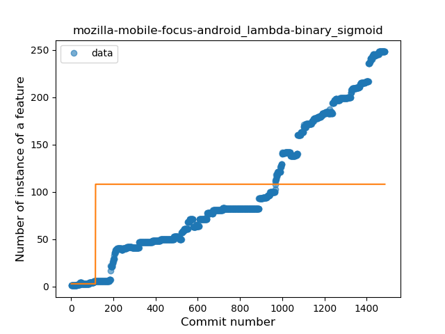
### <a name="safe_call">Safe Call</a>
----
#### Functions
* **Sudden Rise - Exponential:** 
    * **R_Squared:** 0.98221293
* **Constant Rise - Linear:** 
    * **R_Squared:** 0.97023164
* **Sudden Rise Plateau - Logarithm:** 
    * **R_Squared:** 0.32376229
* **Plateau Sudden Rise - Binary Sigmoid:** 
    * **R_Squared:** 0.2094723

**Plots** :chart_with_upwards_trend:
-----

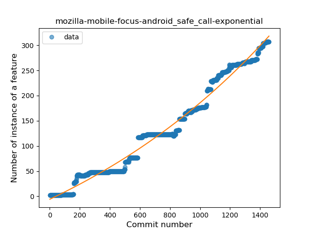
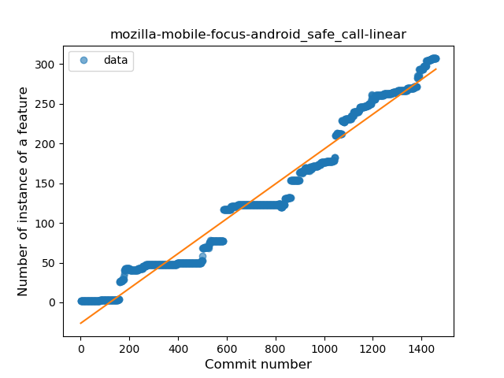
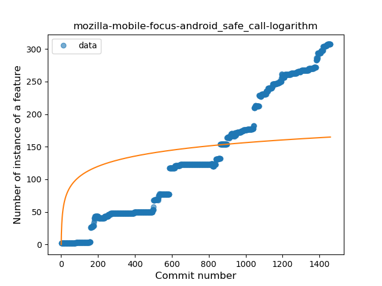
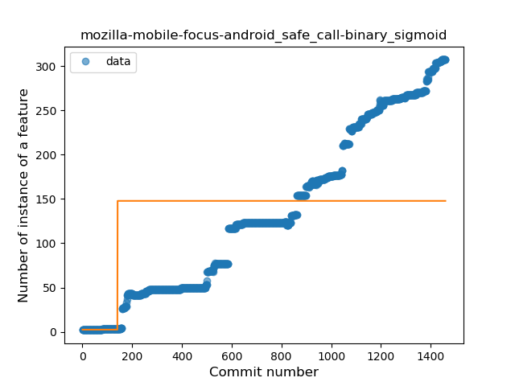
### <a name="when_expr">When expression</a>
----
#### Functions
* **Sudden Rise - Exponential:** 
    * **R_Squared:** 0.98394441
* **Constant Rise - Linear:** 
    * **R_Squared:** 0.95995586
* **Sudden Rise Plateau - Logarithm:** 
    * **R_Squared:** 0.34573796
* **Plateau Sudden Rise - Binary Sigmoid:** 
    * **R_Squared:** 0.05963967

**Plots** :chart_with_upwards_trend:
-----

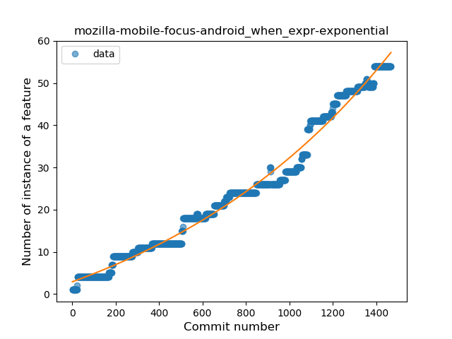
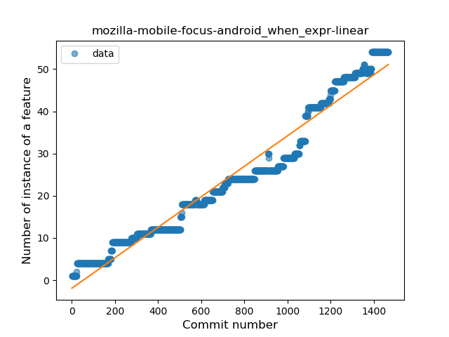

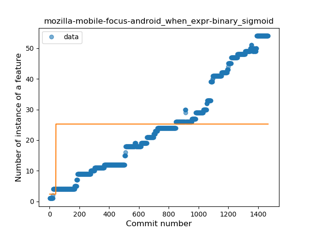
### <a name="companion_object">Companion Object</a>
----
#### Functions
* **Sudden Rise - Exponential:** 
    * **R_Squared:** 0.97847988
* **Constant Rise - Linear:** 
    * **R_Squared:** 0.94801506
* **Sudden Rise Plateau - Logarithm:** 
    * **R_Squared:** 0.34277213

**Plots** :chart_with_upwards_trend:
-----

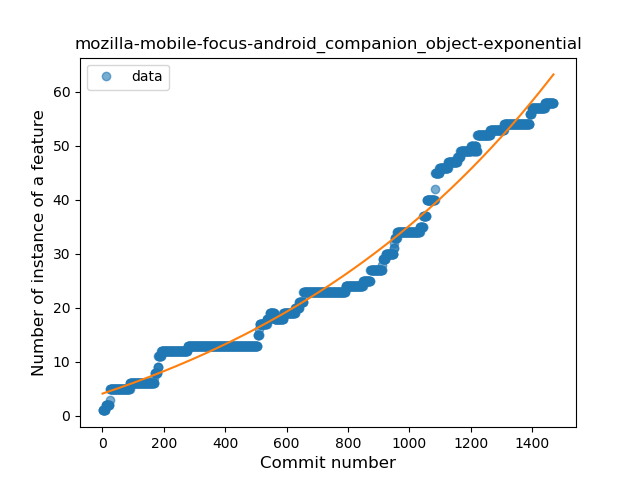
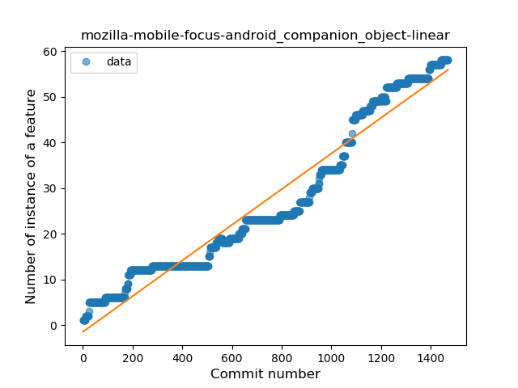
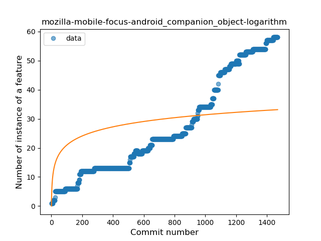
### <a name="unsafe_call">Unsafe Call</a>
----
#### Functions
* **Sudden Rise - Exponential:** 
    * **R_Squared:** 0.80928262
* **Constant Rise - Linear:** 
    * **R_Squared:** 0.72594377
* **Sudden Rise Plateau - Logarithm:** 
    * **R_Squared:** 0.14995134
* **Plateau Sudden Rise - Binary Sigmoid:** 
    * **R_Squared:** 0.05741334

**Plots** :chart_with_upwards_trend:
-----

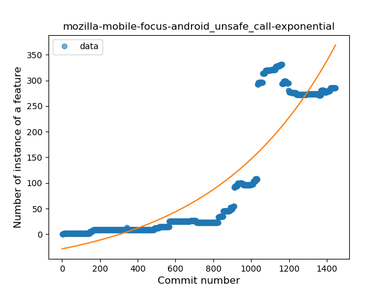
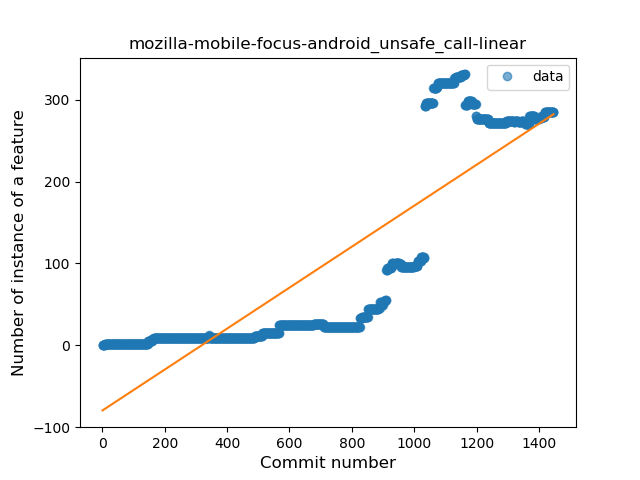
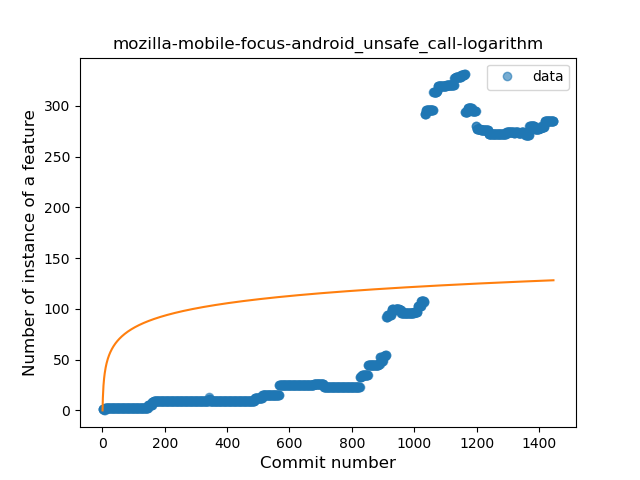
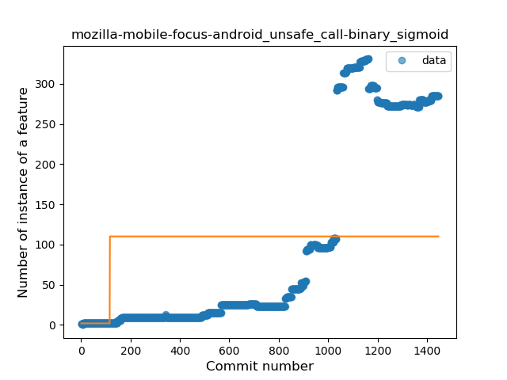
### <a name="string_template">String Template</a>
----
#### Functions
* **Plateau Gradual Rise - Sigmoid:** 
    * **R_Squared:** 0.98508329
* **Sudden Rise - Exponential:** 
    * **R_Squared:** 0.95488987
* **Constant Rise - Linear:** 
    * **R_Squared:** 0.81512187
* **Sudden Rise Plateau - Logarithm:** 
    * **R_Squared:** 0.24625159

**Plots** :chart_with_upwards_trend:
-----

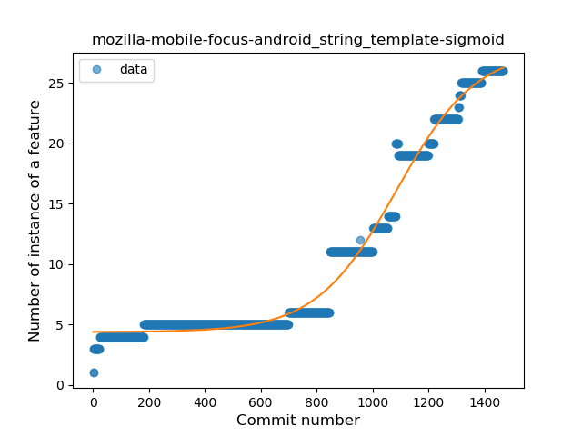
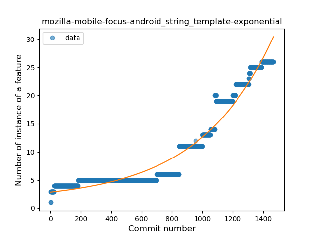

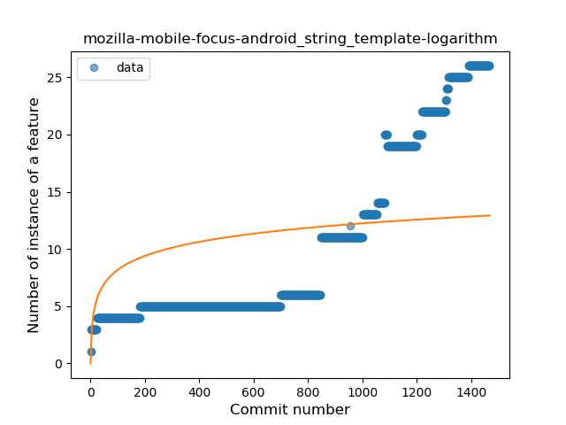
### <a name="func_with_default_value">Function with Default Value</a>
----
#### Functions
* **Sudden Rise - Exponential:** 
    * **R_Squared:** 0.91788814
* **Constant Rise - Linear:** 
    * **R_Squared:** 0.64037404
* **Sudden Rise Plateau - Logarithm:** 
    * **R_Squared:** 0.21919422

**Plots** :chart_with_upwards_trend:
-----

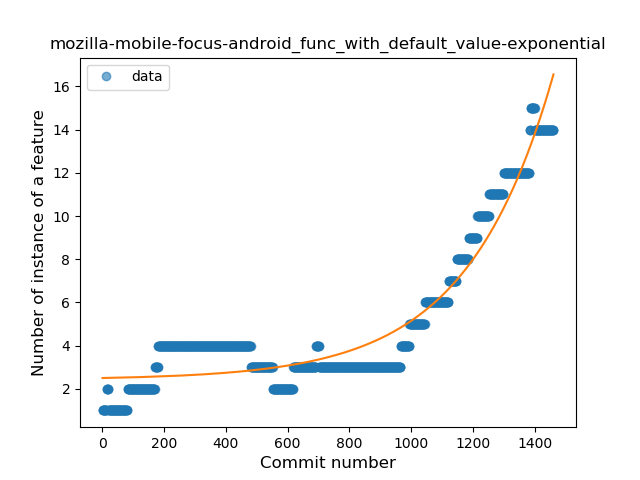
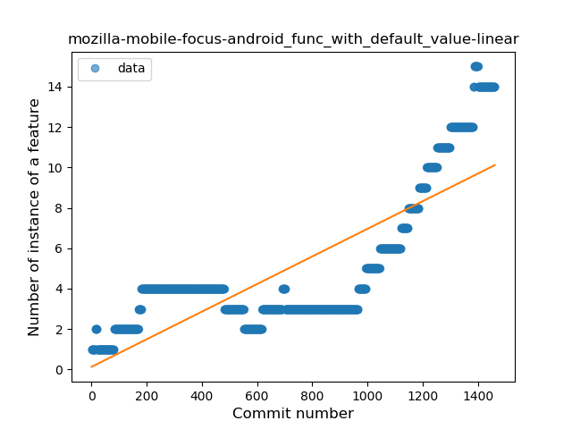
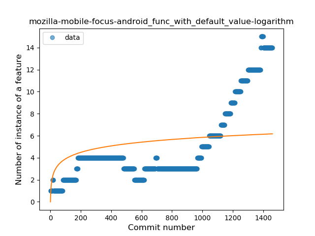
### <a name="singleton">Singleton</a>
----
#### Functions
* **Constant Rise - Linear:** 
    * **R_Squared:** 0.93908696
* **Sudden Rise Plateau - Logarithm:** 
    * **R_Squared:** 0.34886806
* **Plateau Sudden Rise - Binary Sigmoid:** 
    * **R_Squared:** 0.02459351

**Plots** :chart_with_upwards_trend:
-----

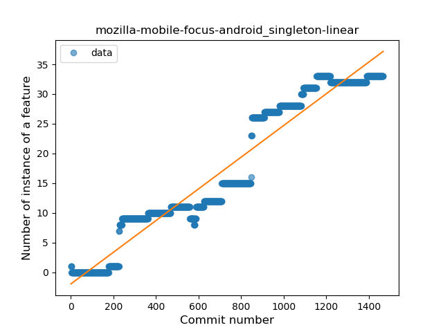
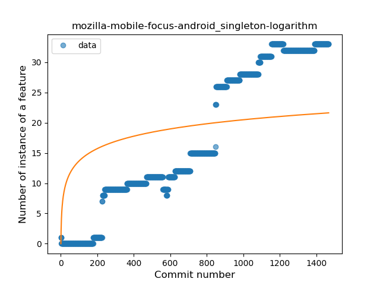
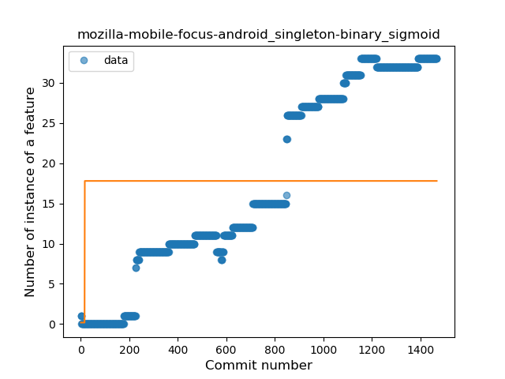
### <a name="smart_cast">Smart Cast</a>
----
#### Functions
* **Constant Rise - Linear:** 
    * **R_Squared:** 0.94269708
* **Sudden Rise - Exponential:** 
    * **R_Squared:** 0.94474074
* **Sudden Rise Plateau - Logarithm:** 
    * **R_Squared:** 0.4364296

**Plots** :chart_with_upwards_trend:
-----

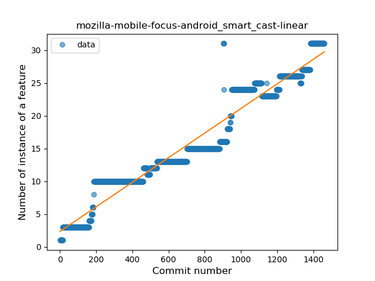
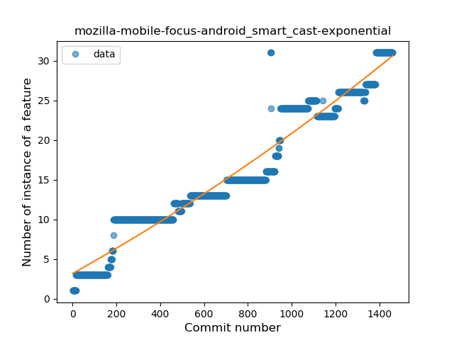
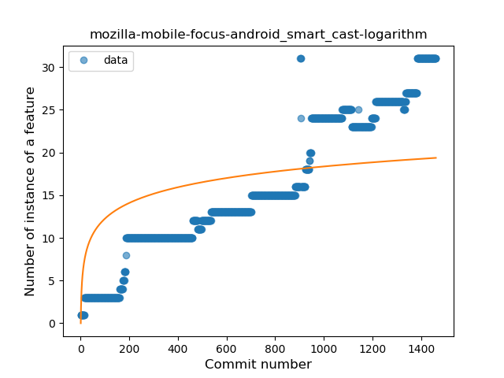
### <a name="range_expr">Range Expression</a>
----
#### Functions
* **Plateau Gradual Rise - Sigmoid:** 
    * **R_Squared:** 0.94304351
* **Sudden Rise - Exponential:** 
    * **R_Squared:** 0.85494826
* **Constant Rise - Linear:** 
    * **R_Squared:** 0.66715653
* **Sudden Rise Plateau - Logarithm:** 
    * **R_Squared:** 0.25405096

**Plots** :chart_with_upwards_trend:
-----

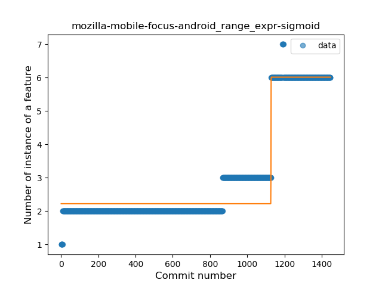
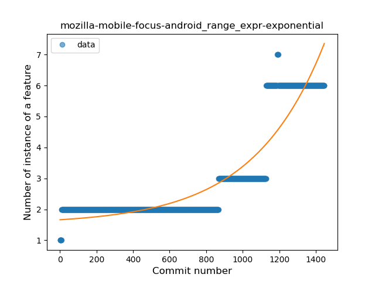
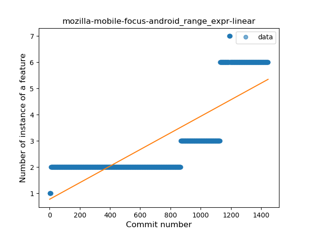
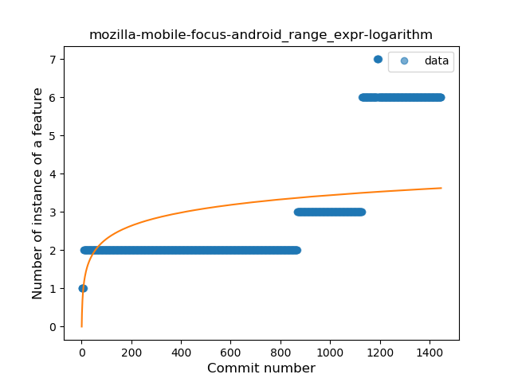
### <a name="func_call_with_named_arg">Function call with Named Argument</a>
----
#### Functions
* **Sudden Rise - Exponential:** 
    * **R_Squared:** 0.8436095
* **Constant Rise - Linear:** 
    * **R_Squared:** 0.48204526
* **Sudden Rise Plateau - Logarithm:** 
    * **R_Squared:** 0.10030677

**Plots** :chart_with_upwards_trend:
-----

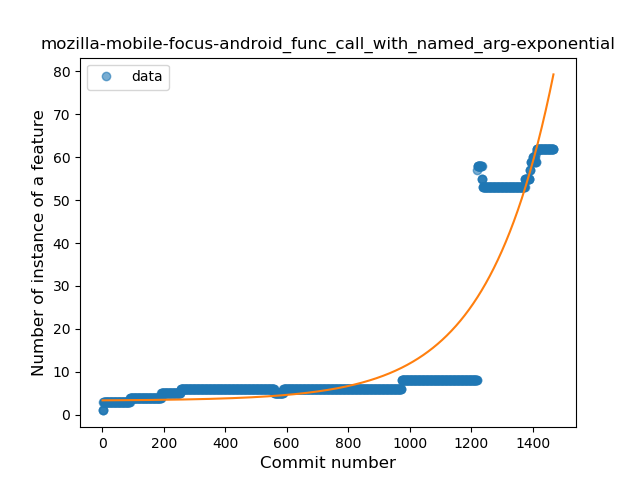
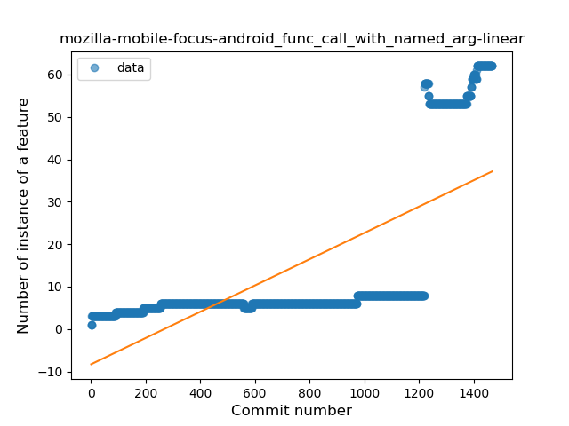
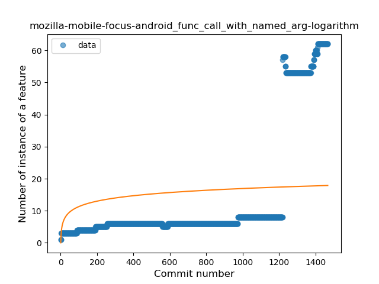
### <a name="data_class">Data Class</a>
----
#### Functions
* **Plateau Gradual Rise - Sigmoid:** 
    * **R_Squared:** 0.95462319
* **Constant Rise - Linear:** 
    * **R_Squared:** 0.84206062
* **Sudden Rise - Exponential:** 
    * **R_Squared:** 0.84231594
* **Sudden Rise Plateau - Logarithm:** 
    * **R_Squared:** 0.34459231

**Plots** :chart_with_upwards_trend:
-----

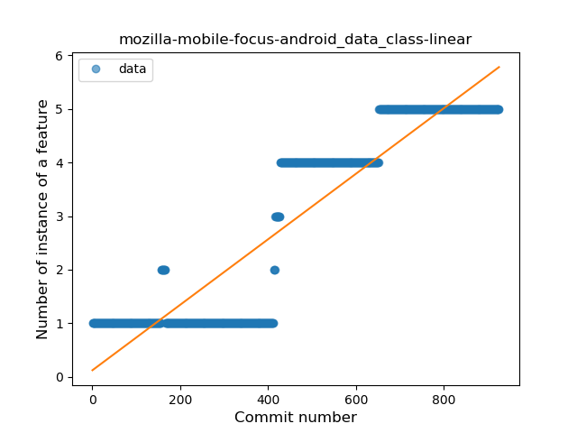
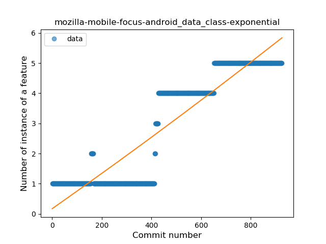
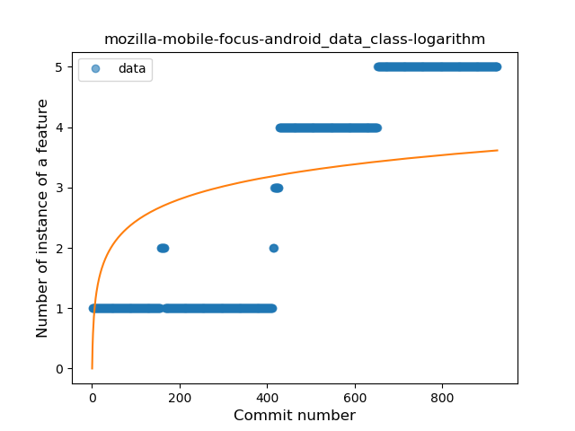
### <a name="extension_function">Extension Function</a>
----
#### Functions
* **Plateau Gradual Rise - Sigmoid:** 
    * **R_Squared:** 0.83783333
* **Sudden Rise - Exponential:** 
    * **R_Squared:** 0.82269319
* **Constant Rise - Linear:** 
    * **R_Squared:** 0.53937217
* **Sudden Rise Plateau - Logarithm:** 
    * **R_Squared:** 0.32352695

**Plots** :chart_with_upwards_trend:
-----

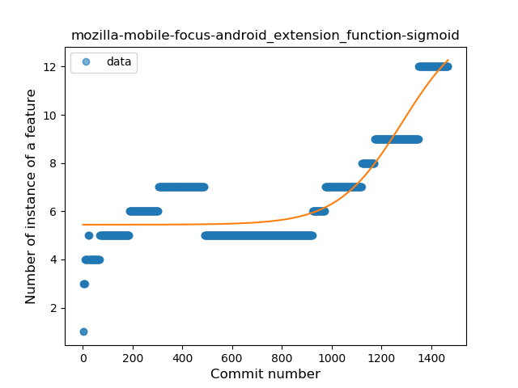
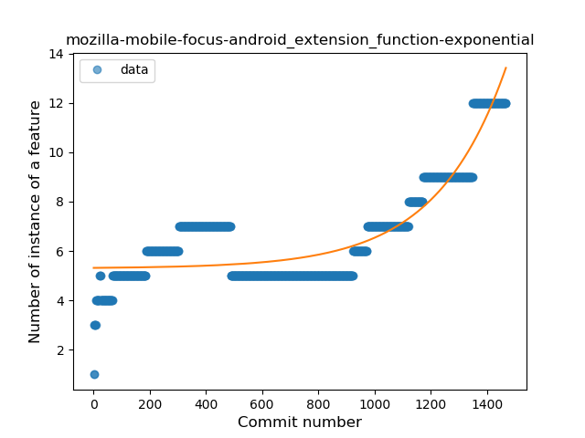
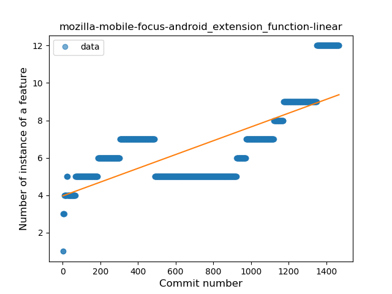
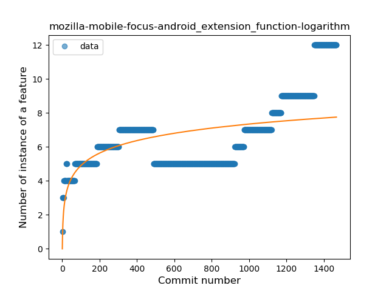
### <a name="property_delegation">Property Delegation</a>
----
#### Functions
* **Sudden Rise - Exponential:** 
    * **R_Squared:** 0.90817102
* **Constant Rise - Linear:** 
    * **R_Squared:** 0.80970037
* **Sudden Rise Plateau - Logarithm:** 
    * **R_Squared:** 0.2434098

**Plots** :chart_with_upwards_trend:
-----

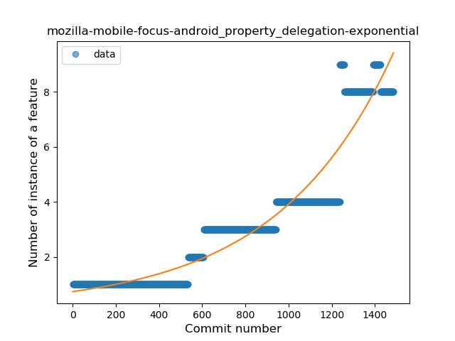
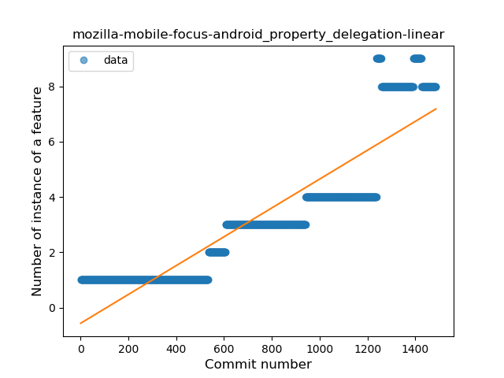
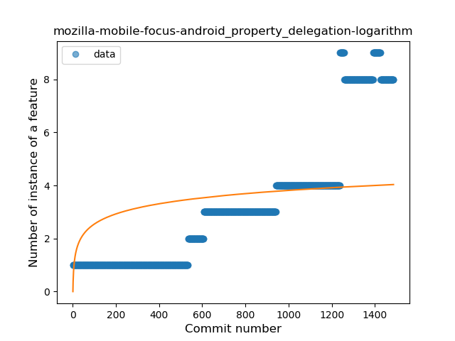
### <a name="destructuring_declaration">Destructuring Declaration</a>
----
#### Functions
* **Plateau Sudden Rise - Binary Sigmoid:** 
    * **R_Squared:** 0.99166742
* **Sudden Rise - Exponential:** 
    * **R_Squared:** 0.740729
* **Constant Rise - Linear:** 
    * **R_Squared:** 0.71912461
* **Sudden Rise Plateau - Logarithm:** 
    * **R_Squared:** 0.15579034

**Plots** :chart_with_upwards_trend:
-----

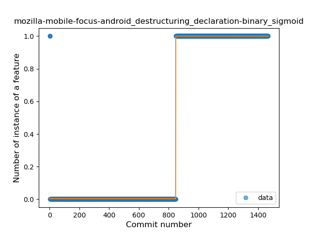

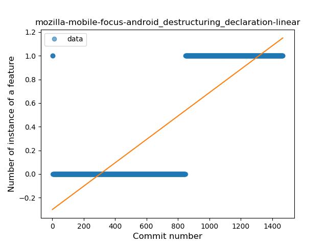
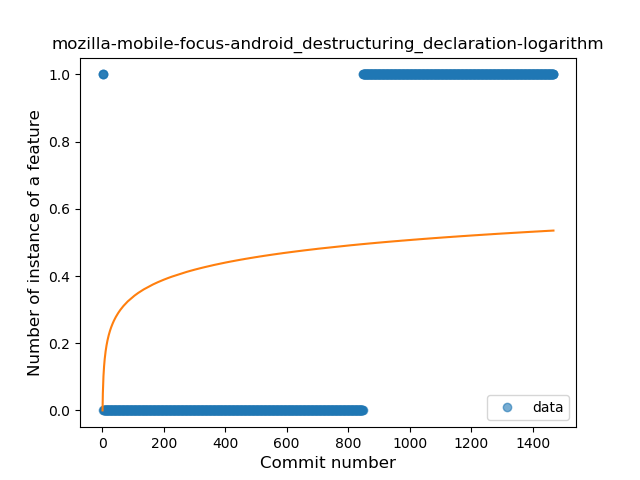
