## mpcjanssen-simpletask-android
----
#### Metrics provided by Detekt
* Number of lines of code 10806
* Number of Kotlin files: 66
* Cyclomatic complexity: 1681
* Cyclomatic complexity by thousands of lines: 267 

----
**18** features analyzed

*	<a href="#type_inference">Type Inference</a> 
*	<a href="#lambda">Lambda</a> 
*	<a href="#safe_call">Safe Call</a> 
*	<a href="#when_expr">When expression</a> 
*	<a href="#companion_object">Companion Object</a> 
*	<a href="#unsafe_call">Unsafe Call</a> 
*	<a href="#string_template">String Template</a> 
*	<a href="#func_with_default_value">Function with Default Value</a> 
*	<a href="#singleton">Singleton</a> 
*	<a href="#smart_cast">Smart Cast</a> 
*	<a href="#range_expr">Range Expression</a> 
*	<a href="#func_call_with_named_arg">Function call with Named Argument</a> 
*	<a href="#data_class">Data Class</a> 
*	<a href="#extension_function">Extension Function</a> 
*	<a href="#property_delegation">Property Delegation</a> 
*	<a href="#destructuring_declaration">Destructuring Declaration</a> 
*	<a href="#inline_func">Inline Function</a> 
*	<a href="#overloaded_op">Overloaded Operator</a> 

### <a name="type_inference">Type Inference</a>
----
#### Functions
* **Sudden Rise Plateau - Logarithm:** 
    * **R_Squared:** 0.6514978
* **Plateau Sudden Rise - Binary Sigmoid:** 
    * **R_Squared:** 0.62237812
* **Constant Rise - Linear:** 
    * **R_Squared:** 0.44423574

**Plots** :chart_with_upwards_trend:
-----

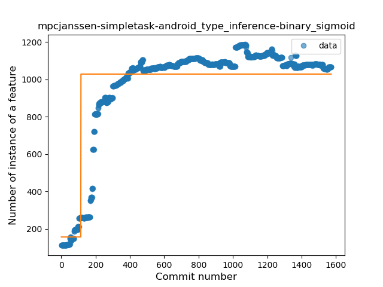
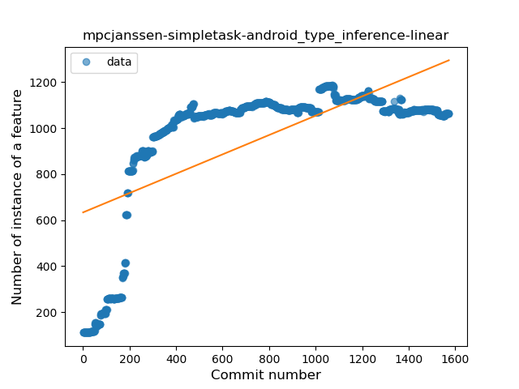
### <a name="lambda">Lambda</a>
----
#### Functions
* **Constant Rise - Linear:** 
    * **R_Squared:** 0.84567985
* **Sudden Rise Plateau - Logarithm:** 
    * **R_Squared:** 0.62032641
* **Plateau Sudden Rise - Binary Sigmoid:** 
    * **R_Squared:** 0.57023087

**Plots** :chart_with_upwards_trend:
-----

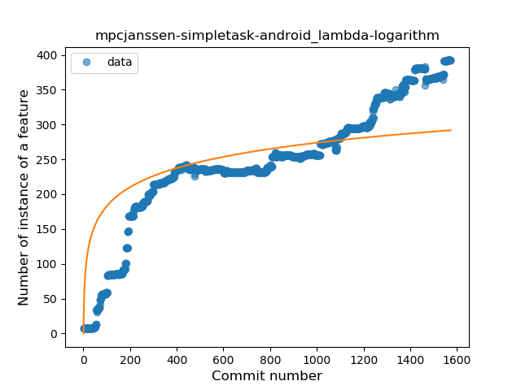
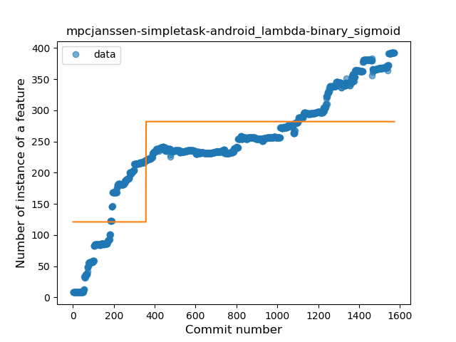
### <a name="safe_call">Safe Call</a>
----
#### Functions
* **Constant Rise - Linear:** 
    * **R_Squared:** 0.64222068
* **Sudden Rise Plateau - Logarithm:** 
    * **R_Squared:** 0.63792133
* **Plateau Sudden Rise - Binary Sigmoid:** 
    * **R_Squared:** 0.49676079

**Plots** :chart_with_upwards_trend:
-----

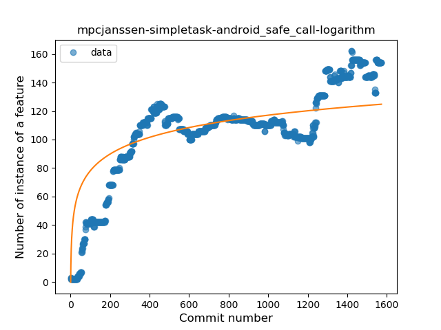
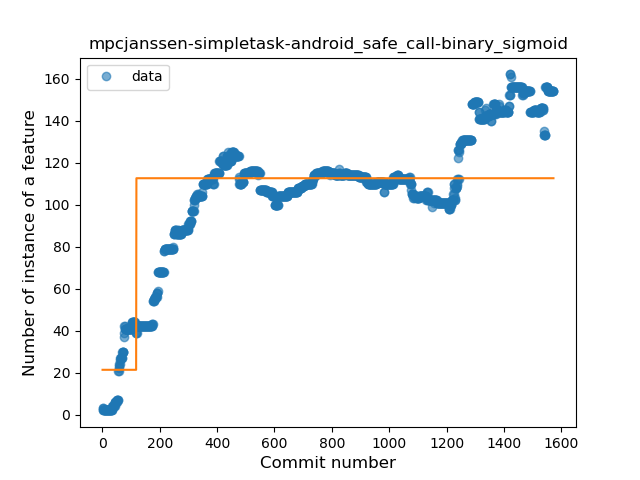
### <a name="when_expr">When expression</a>
----
#### Functions
* **Constant Rise - Linear:** 
    * **R_Squared:** 0.82566799
* **Sudden Rise Plateau - Logarithm:** 
    * **R_Squared:** 0.61529509

**Plots** :chart_with_upwards_trend:
-----

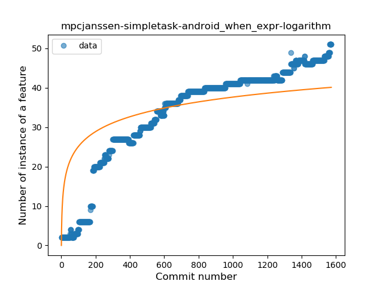
### <a name="companion_object">Companion Object</a>
----
#### Functions
* **Sudden Rise Plateau - Logarithm:** 
    * **R_Squared:** 0.6483442
* **Constant Rise - Linear:** 
    * **R_Squared:** 0.51688616
* **Plateau Sudden Rise - Binary Sigmoid:** 
    * **R_Squared:** 0.23618073

**Plots** :chart_with_upwards_trend:
-----

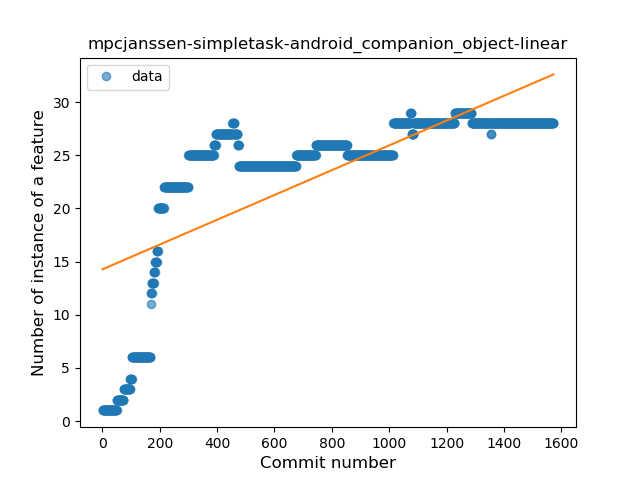
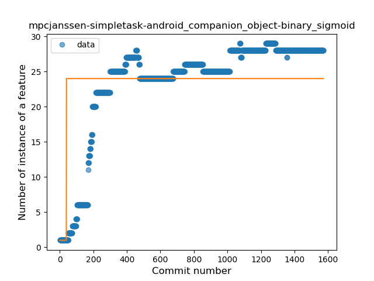
### <a name="unsafe_call">Unsafe Call</a>
----
#### Functions
* **Plateau Sudden Rise - Binary Sigmoid:** 
    * **R_Squared:** 0.29552882
* **Sudden Rise Plateau - Logarithm:** 
    * **R_Squared:** 0.07477733
* **Constant Decline - Linear:** 
    * **R_Squared:** 0.00963751
* **Sudden Decline - Exponential:** 
    * **R_Squared:** -0.0

**Plots** :chart_with_upwards_trend:
-----

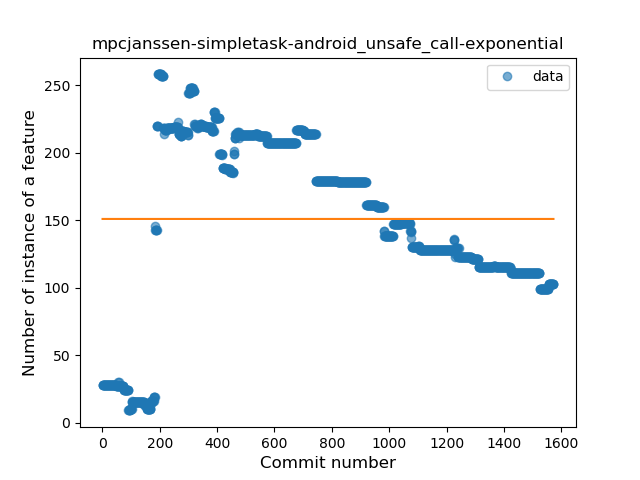
### <a name="string_template">String Template</a>
----
#### Functions
* **Constant Rise - Linear:** 
    * **R_Squared:** 0.91029085
* **Sudden Rise Plateau - Logarithm:** 
    * **R_Squared:** 0.52686282

**Plots** :chart_with_upwards_trend:
-----

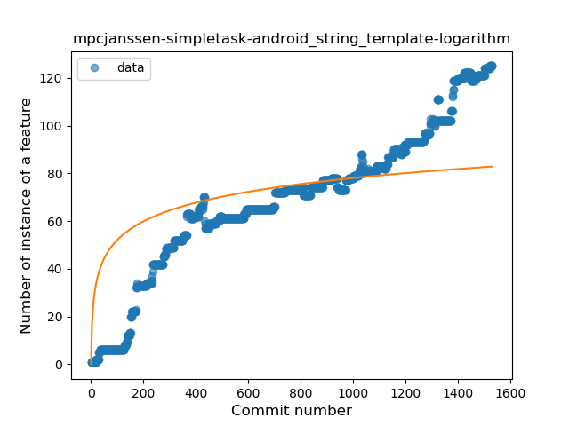
### <a name="func_with_default_value">Function with Default Value</a>
----
#### Functions
* **Sudden Rise Plateau - Logarithm:** 
    * **R_Squared:** 0.64494447
* **Constant Rise - Linear:** 
    * **R_Squared:** 0.54508519

**Plots** :chart_with_upwards_trend:
-----

### <a name="singleton">Singleton</a>
----
#### Functions
* **Constant Rise - Linear:** 
    * **R_Squared:** 0.85854991
* **Sudden Rise Plateau - Logarithm:** 
    * **R_Squared:** 0.49561156

**Plots** :chart_with_upwards_trend:
-----

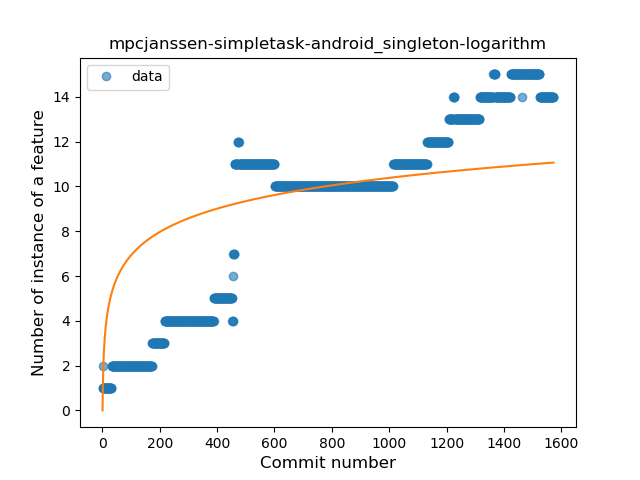
### <a name="smart_cast">Smart Cast</a>
----
#### Functions
* **Sudden Rise - Exponential:** 
    * **R_Squared:** 0.79483535
* **Constant Rise - Linear:** 
    * **R_Squared:** 0.56969792
* **Sudden Rise Plateau - Logarithm:** 
    * **R_Squared:** 0.2551495

**Plots** :chart_with_upwards_trend:
-----

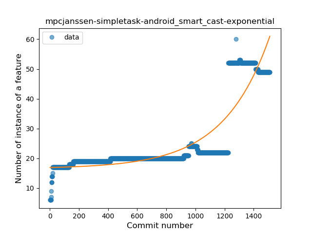
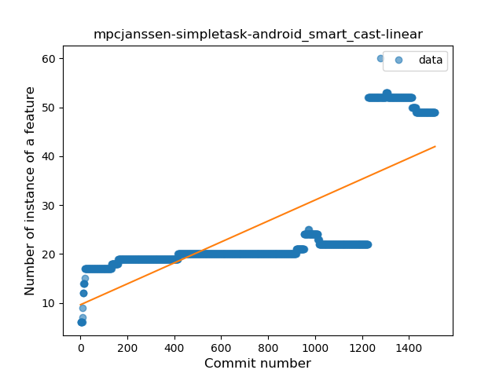
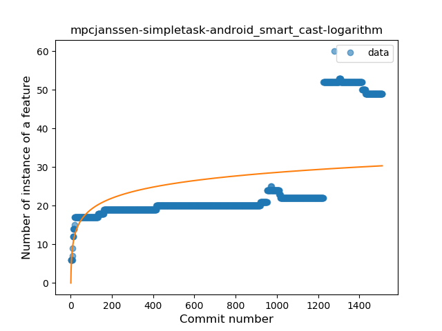
### <a name="range_expr">Range Expression</a>
----
#### Functions
* **Sudden Rise Plateau - Logarithm:** 
    * **R_Squared:** 0.36426457
* **Constant Rise - Linear:** 
    * **R_Squared:** 0.11195095

**Plots** :chart_with_upwards_trend:
-----

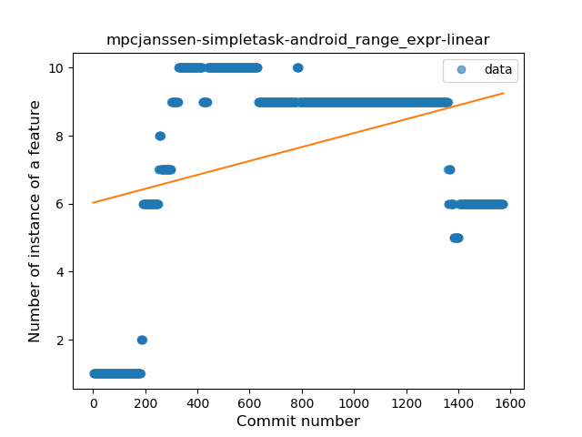
### <a name="func_call_with_named_arg">Function call with Named Argument</a>
----
#### Functions
* **Constant Rise - Linear:** 
    * **R_Squared:** 0.89468913
* **Sudden Rise Plateau - Logarithm:** 
    * **R_Squared:** 0.42171008

**Plots** :chart_with_upwards_trend:
-----

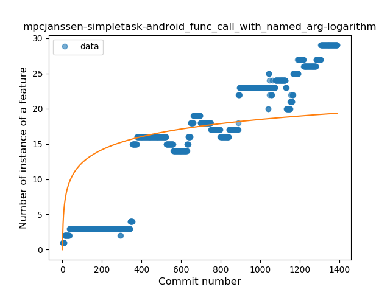
### <a name="data_class">Data Class</a>
----
#### Functions
* **Sudden Rise Plateau - Logarithm:** 
    * **R_Squared:** 0.7598753
* **Constant Rise - Linear:** 
    * **R_Squared:** 0.60303266
* **Plateau Sudden Rise - Binary Sigmoid:** 
    * **R_Squared:** 0.21012625

**Plots** :chart_with_upwards_trend:
-----

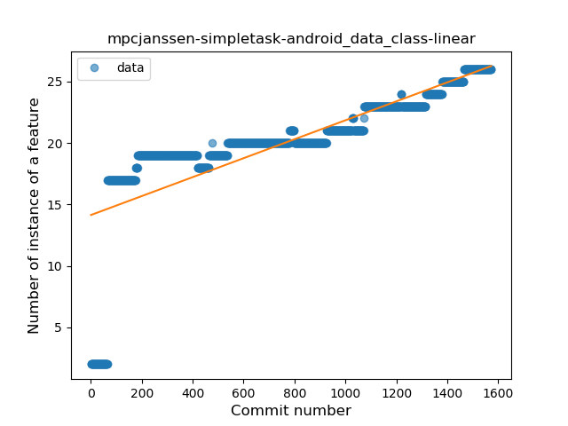
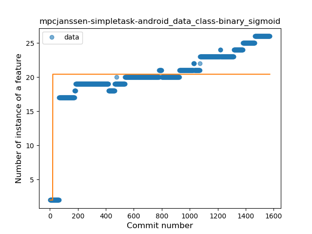
### <a name="extension_function">Extension Function</a>
----
#### Functions
* **Plateau Gradual Rise - Sigmoid:** 
    * **R_Squared:** 0.9731528
* **Sudden Rise Plateau - Logarithm:** 
    * **R_Squared:** 0.64133863
* **Constant Rise - Linear:** 
    * **R_Squared:** 0.45989612

**Plots** :chart_with_upwards_trend:
-----

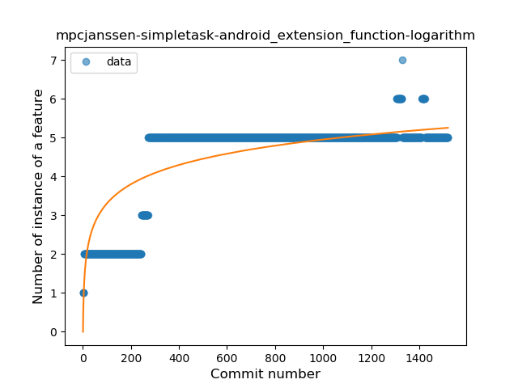
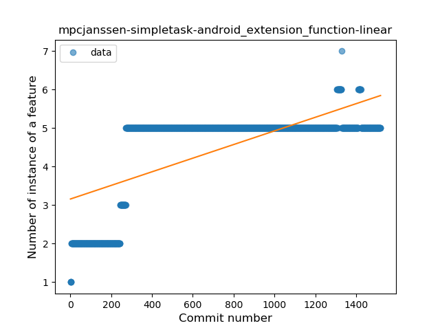
### <a name="property_delegation">Property Delegation</a>
----
#### Functions
* **Sudden Rise - Exponential:** 
    * **R_Squared:** 0.7849501
* **Constant Rise - Linear:** 
    * **R_Squared:** 0.75400503
* **Sudden Rise Plateau - Logarithm:** 
    * **R_Squared:** 0.16261163
* **Plateau Sudden Rise - Binary Sigmoid:** 
    * **R_Squared:** 0.00363917

**Plots** :chart_with_upwards_trend:
-----

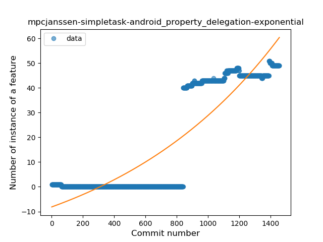

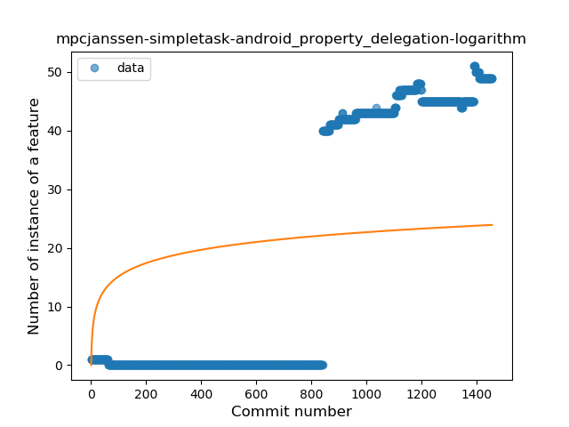
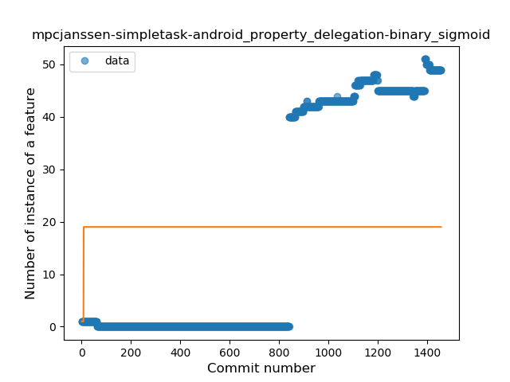
### <a name="destructuring_declaration">Destructuring Declaration</a>
----
#### Functions
* **Sudden Rise - Exponential:** 
    * **R_Squared:** 0.78975324
* **Constant Rise - Linear:** 
    * **R_Squared:** 0.54611085
* **Sudden Rise Plateau - Logarithm:** 
    * **R_Squared:** 0.11633075
* **Plateau Sudden Decline - Binary Sigmoid:** 
    * **R_Squared:** 0.04881151

**Plots** :chart_with_upwards_trend:
-----

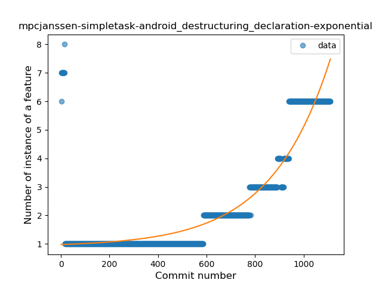
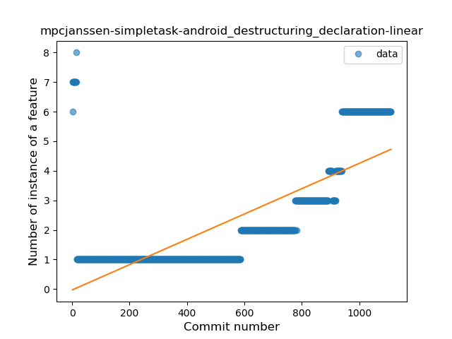
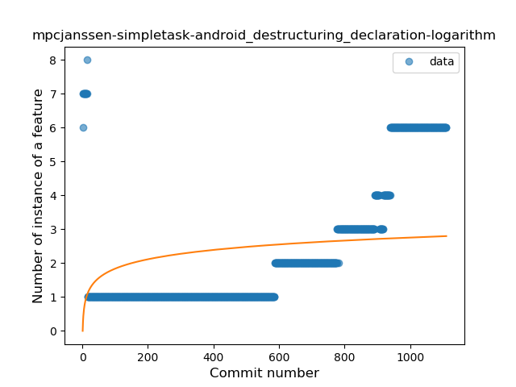
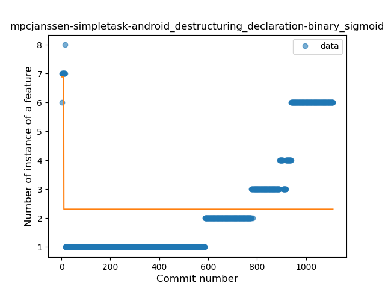
### <a name="inline_func">Inline Function</a>
----
#### Functions
* **Plateau Sudden Rise - Binary Sigmoid:** 
    * **R_Squared:** 1.0
* **Sudden Rise Plateau - Logarithm:** 
    * **R_Squared:** 0.16718392
* **Constant Rise - Linear:** 
    * **R_Squared:** 0.0215253

**Plots** :chart_with_upwards_trend:
-----

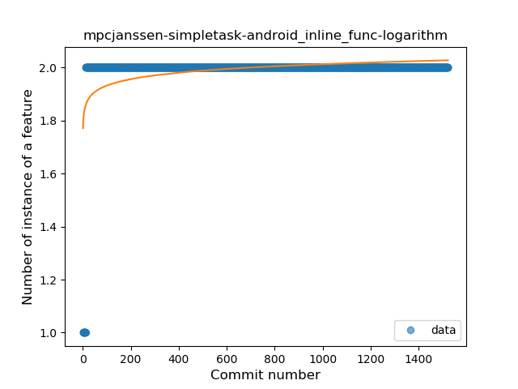
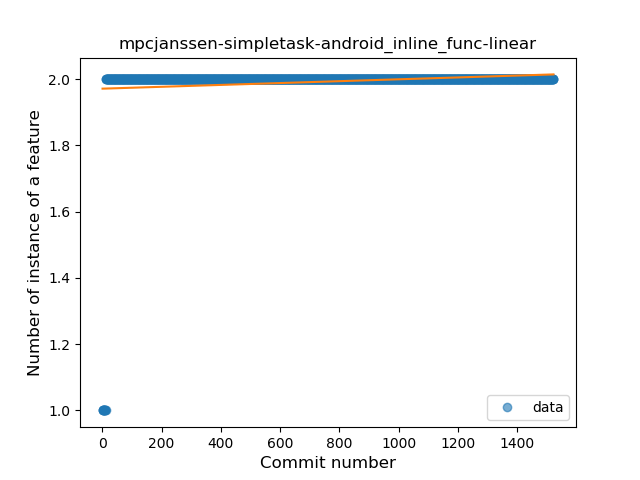
### <a name="overloaded_op">Overloaded Operator</a>
----
#### Functions
* **Plateau Sudden Decline - Binary Sigmoid:** 
    * **R_Squared:** 1.0
* **Sudden Decline - Exponential:** 
    * **R_Squared:** 0.76941931
* **Constant Decline - Linear:** 
    * **R_Squared:** 0.57007523
* **Sudden Rise Plateau - Logarithm:** 
    * **R_Squared:** -0.0

**Plots** :chart_with_upwards_trend:
-----

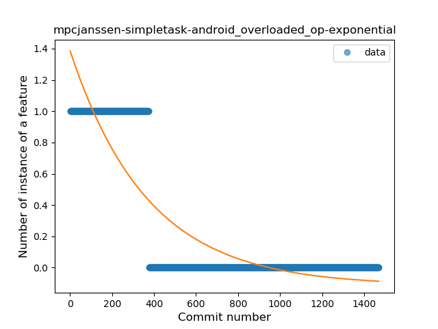
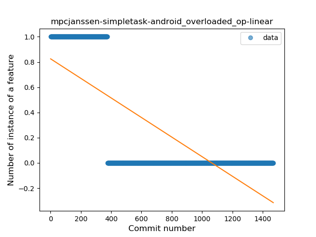
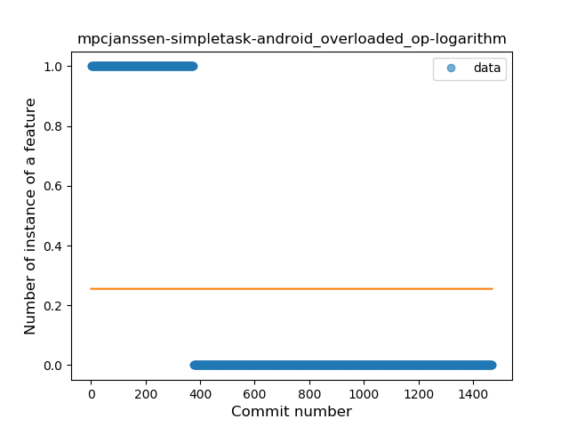
