## name-cantanima-chineseremainderclock
----
#### Metrics provided by Detekt
* Number of lines of code 1852
* Number of Kotlin files: 8
* Cyclomatic complexity: 186
* Cyclomatic complexity by thousands of lines: 165 

----
**5** features analyzed

*	<a href="#type_inference">Type Inference</a> 
*	<a href="#lambda">Lambda</a> 
*	<a href="#when_expr">When expression</a> 
*	<a href="#unsafe_call">Unsafe Call</a> 
*	<a href="#range_expr">Range Expression</a> 

### <a name="type_inference">Type Inference</a>
----
#### Functions
* **Constant Rise - Linear:** 
    * **R_Squared:** 0.87705194
* **Sudden Rise Plateau - Logarithm:** 
    * **R_Squared:** 0.87845673

**Plots** :chart_with_upwards_trend:
-----

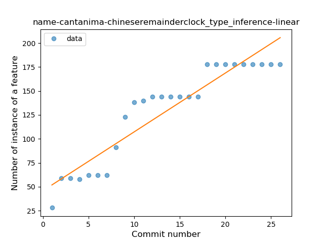
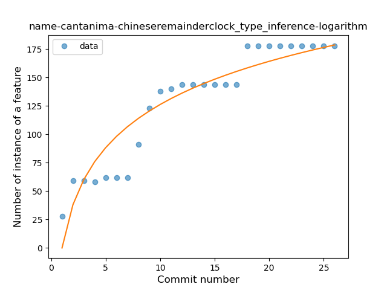
### <a name="lambda">Lambda</a>
----
#### Functions
* **Plateau Sudden Rise - Binary Sigmoid:** 
    * **R_Squared:** 1.0
* **Instability - Polinomial 4:** 
    * **R_Squared:** 0.88247694
* **Sudden Rise - Exponential:** 
    * **R_Squared:** 0.7594855
* **Constant Rise - Linear:** 
    * **R_Squared:** 0.68
* **Sudden Rise Plateau - Logarithm:** 
    * **R_Squared:** 0.36914718

**Plots** :chart_with_upwards_trend:
-----

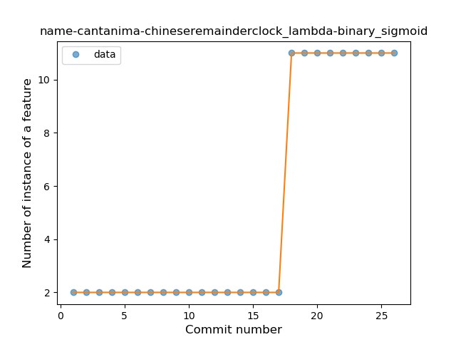
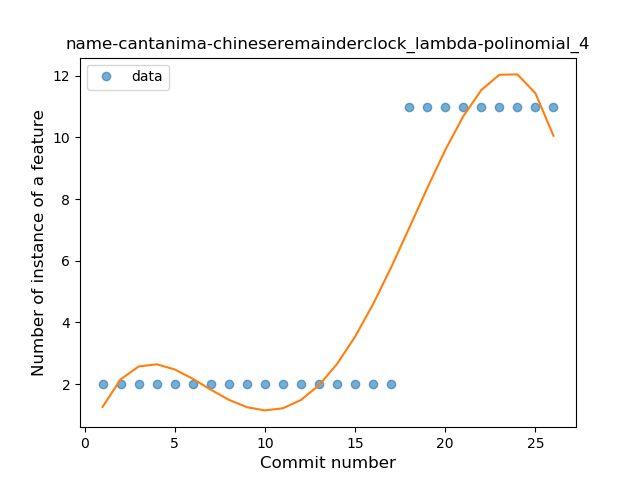
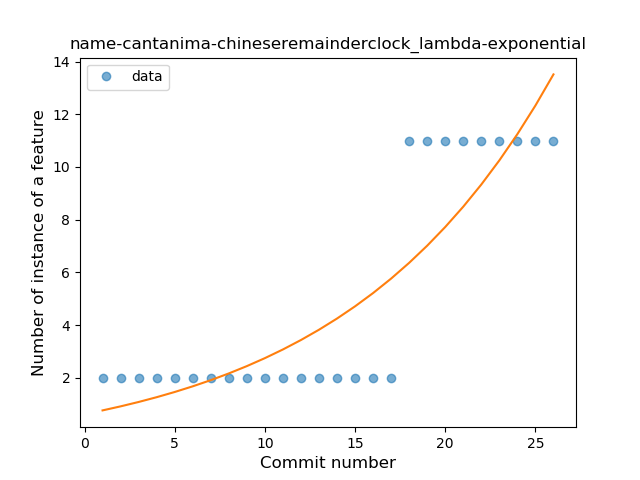
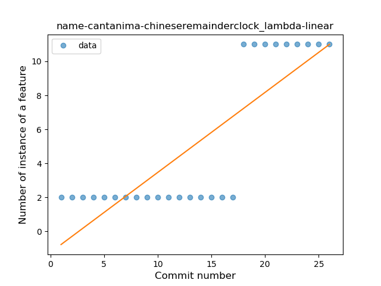
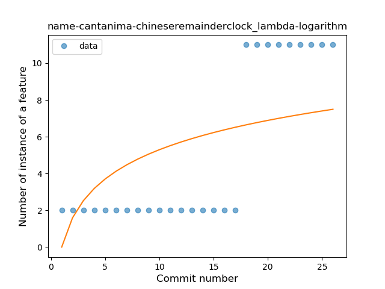
### <a name="when_expr">When expression</a>
----
#### Functions
* **Plateau Gradual Rise - Sigmoid:** 
    * **R_Squared:** 0.92194388
* **Instability - Polinomial 3:** )
    * **R_Squared:** 0.92565786
* **Constant Rise - Linear:** 
    * **R_Squared:** 0.89766644
* **Sudden Rise - Exponential:** 
    * **R_Squared:** 0.89885996
* **Sudden Rise Plateau - Logarithm:** 
    * **R_Squared:** 0.67693512

**Plots** :chart_with_upwards_trend:
-----

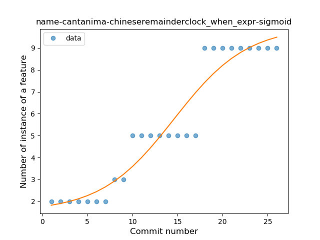
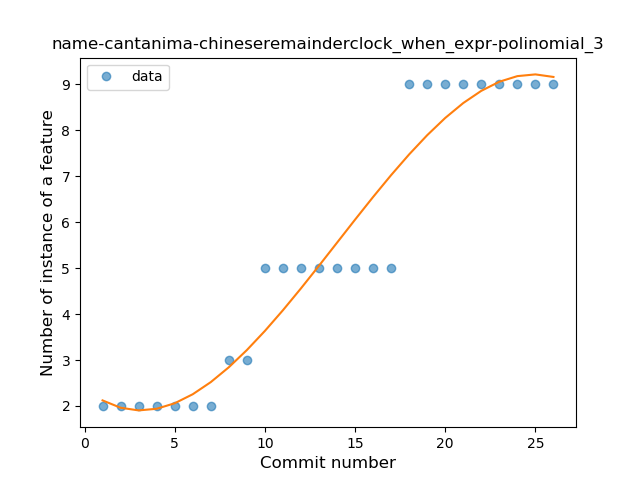
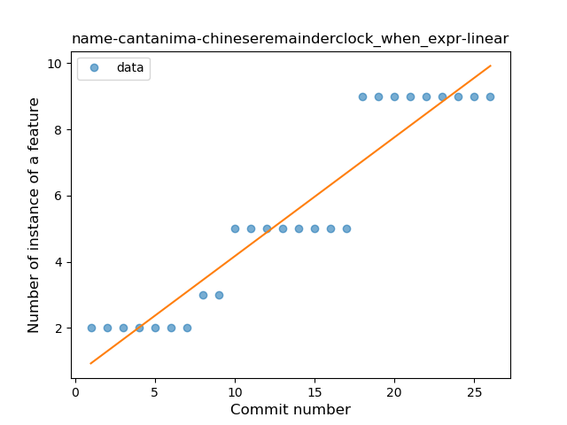
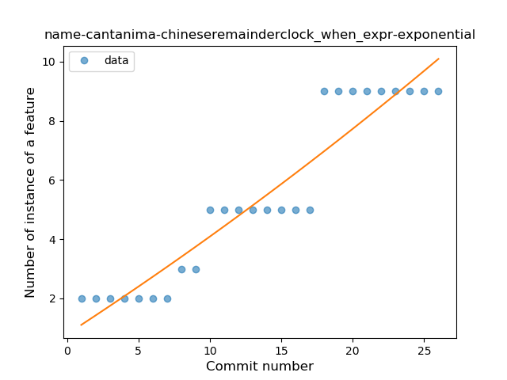
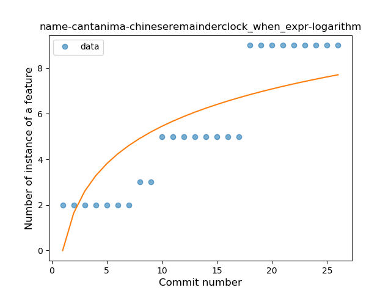
### <a name="unsafe_call">Unsafe Call</a>
----
#### Functions
* **Instability - Polinomial 4:** 
    * **R_Squared:** 0.67039312
* **Sudden Rise Plateau - Logarithm:** 
    * **R_Squared:** 0.53922392
* **Constant Rise - Linear:** 
    * **R_Squared:** 0.49220748

**Plots** :chart_with_upwards_trend:
-----

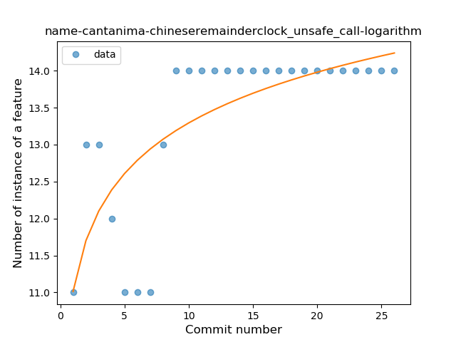
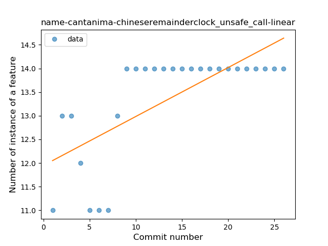
### <a name="range_expr">Range Expression</a>
----
#### Functions
* **Plateau Sudden Rise - Binary Sigmoid:** 
    * **R_Squared:** 0.52777777
* **Instability - Polinomial 4:** 
    * **R_Squared:** 0.15595312
* **Instability - Polinomial 3:** )
    * **R_Squared:** 0.05491
* **Sudden Rise Plateau - Logarithm:** 
    * **R_Squared:** 0.02046864
* **Constant Rise - Linear:** 
    * **R_Squared:** 0.00087719
* **Sudden Rise - Exponential:** 
    * **R_Squared:** 0.00087175

**Plots** :chart_with_upwards_trend:
-----

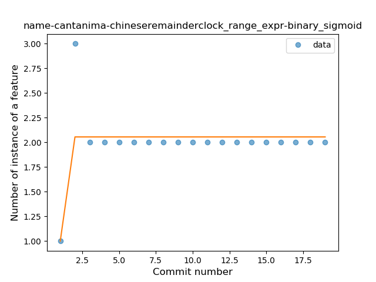
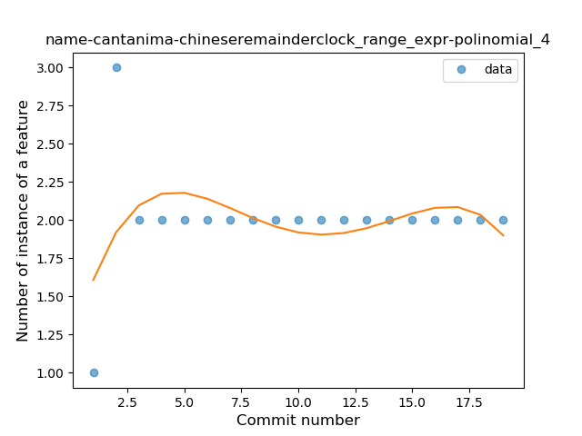
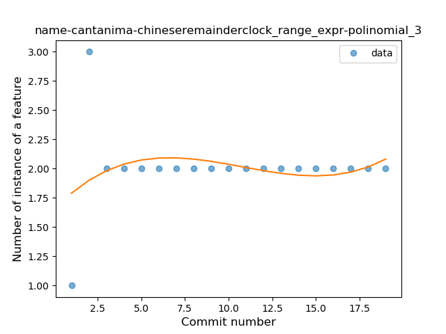
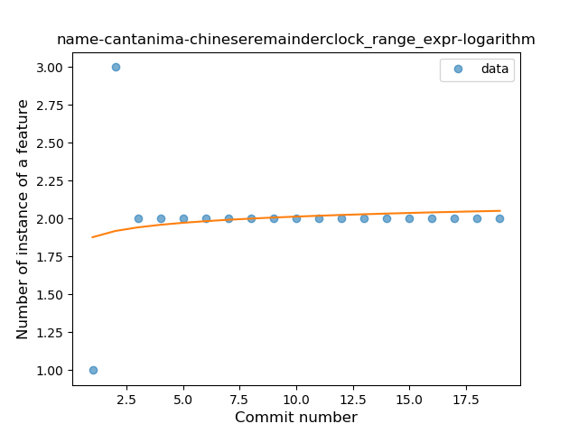
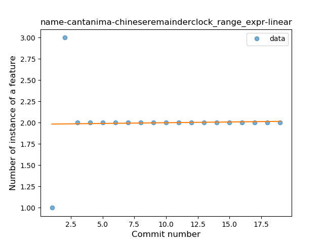
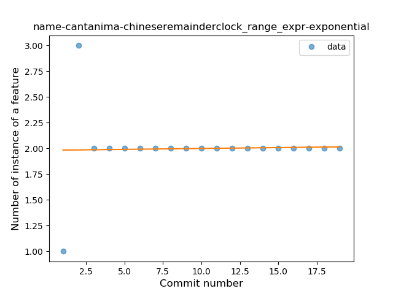
