## nao20010128nao-DroidComplex
----
#### Metrics provided by Detekt
* Number of lines of code 432
* Number of Kotlin files: 6
* Cyclomatic complexity: 66
* Cyclomatic complexity by thousands of lines: 283 

----
**7** features analyzed

*	<a href="#type_inference">Type Inference</a> 
*	<a href="#lambda">Lambda</a> 
*	<a href="#when_expr">When expression</a> 
*	<a href="#companion_object">Companion Object</a> 
*	<a href="#unsafe_call">Unsafe Call</a> 
*	<a href="#extension_function">Extension Function</a> 
*	<a href="#inline_func">Inline Function</a> 

### <a name="type_inference">Type Inference</a>
----
#### Functions
* **Plateau Gradual Rise - Sigmoid:** 
    * **R_Squared:** 0.85091738
* **Instability - Polinomial 4:** 
    * **R_Squared:** 0.74148944
* **Instability - Polinomial 3:** )
    * **R_Squared:** 0.70992921
* **Sudden Rise Plateau - Logarithm:** 
    * **R_Squared:** 0.39223046
* **Constant Rise - Linear:** 
    * **R_Squared:** 0.16264409

**Plots** :chart_with_upwards_trend:
-----

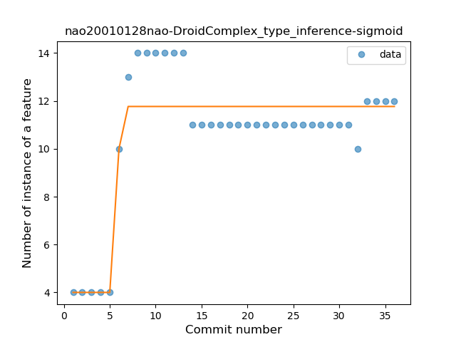
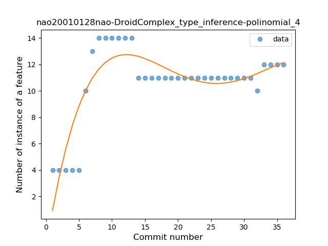
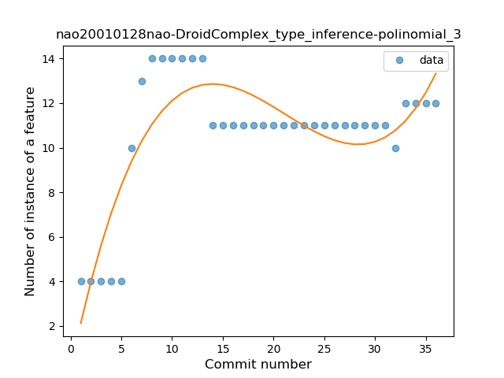
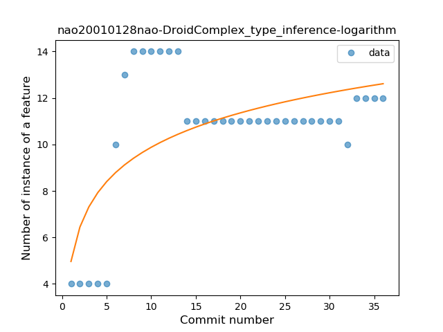
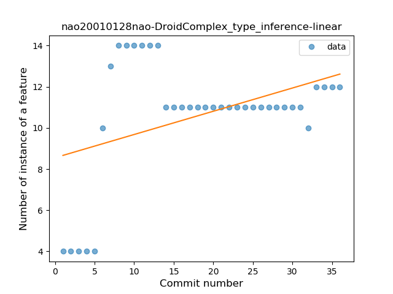
### <a name="lambda">Lambda</a>
----
#### Functions
* **Sudden Rise Plateau - Logarithm:** 
    * **R_Squared:** 0.87779987
* **Constant Rise - Linear:** 
    * **R_Squared:** 0.84408391

**Plots** :chart_with_upwards_trend:
-----

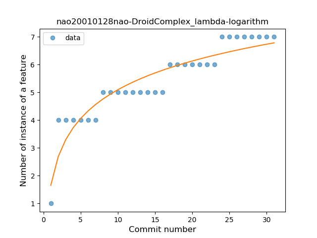

### <a name="when_expr">When expression</a>
----
#### Functions
* **Constant Rise - Linear:** 
    * **R_Squared:** 0.89677066
* **Sudden Rise Plateau - Logarithm:** 
    * **R_Squared:** 0.80221137

**Plots** :chart_with_upwards_trend:
-----

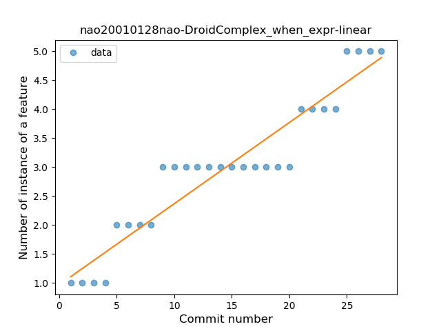
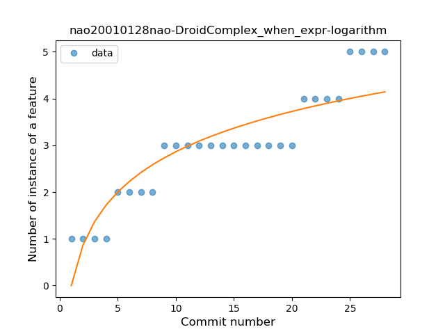
### <a name="companion_object">Companion Object</a>
----
#### Functions
* **Plateau Sudden Rise - Binary Sigmoid:** 
    * **R_Squared:** 1.0
* **Instability - Polinomial 3:** )
    * **R_Squared:** 0.72846074
* **Sudden Rise Plateau - Logarithm:** 
    * **R_Squared:** 0.5487851
* **Constant Rise - Linear:** 
    * **R_Squared:** 0.24816176

**Plots** :chart_with_upwards_trend:
-----

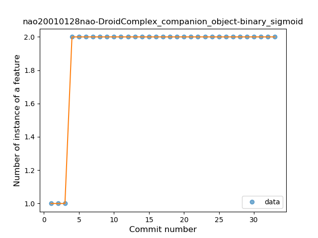
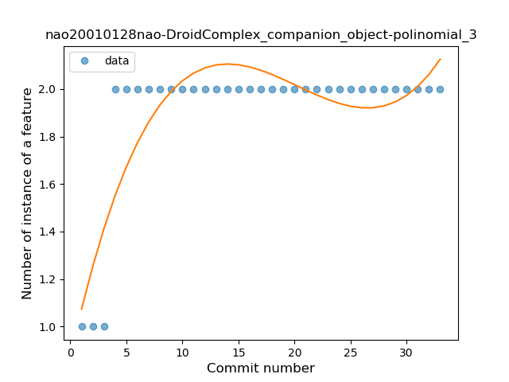
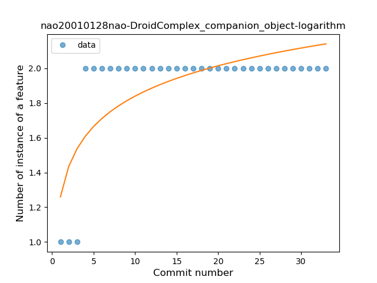
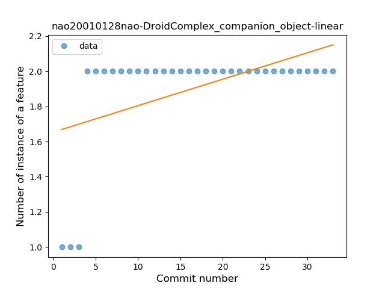
### <a name="unsafe_call">Unsafe Call</a>
----
#### Functions
* **Instability - Polinomial 4:** 
    * **R_Squared:** 0.9185372
* **Constant Rise - Linear:** 
    * **R_Squared:** 0.8061149
* **Sudden Rise Plateau - Logarithm:** 
    * **R_Squared:** 0.74255455

**Plots** :chart_with_upwards_trend:
-----

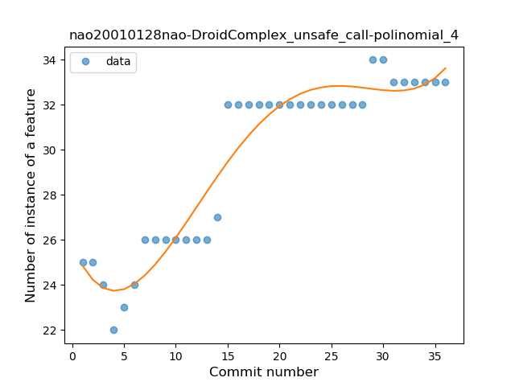

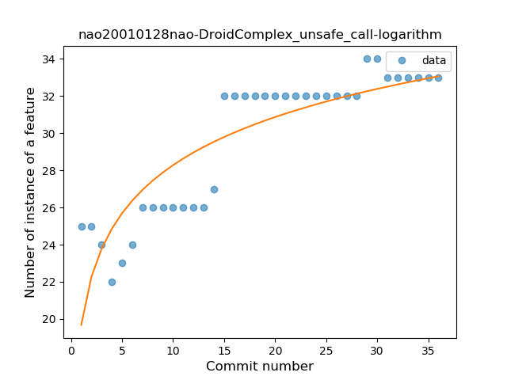
### <a name="extension_function">Extension Function</a>
----
#### Functions
* **Sudden Rise Plateau - Logarithm:** 
    * **R_Squared:** 0.89740522
* **Constant Rise - Linear:** 
    * **R_Squared:** 0.79323068

**Plots** :chart_with_upwards_trend:
-----

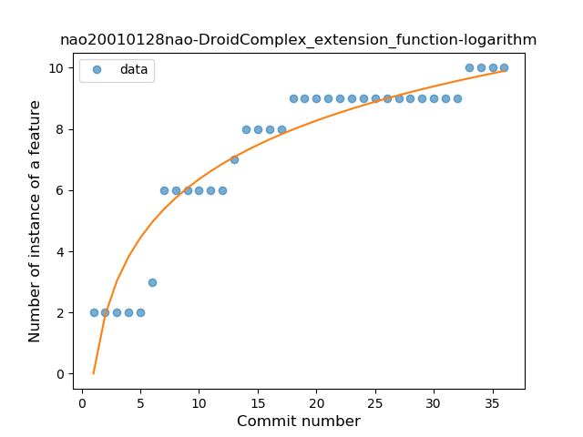
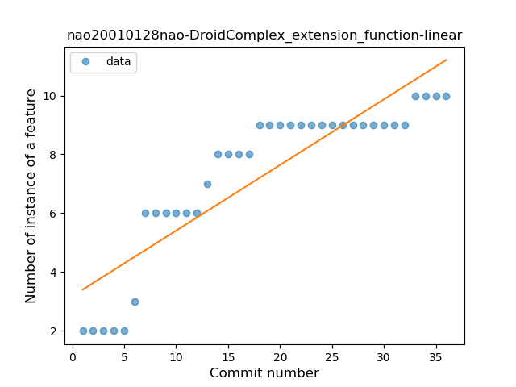
### <a name="inline_func">Inline Function</a>
----
#### Functions
* **Plateau Gradual Rise - Sigmoid:** 
    * **R_Squared:** 0.93786094
* **Sudden Rise Plateau - Logarithm:** 
    * **R_Squared:** 0.85725567
* **Constant Rise - Linear:** 
    * **R_Squared:** 0.70431358

**Plots** :chart_with_upwards_trend:
-----

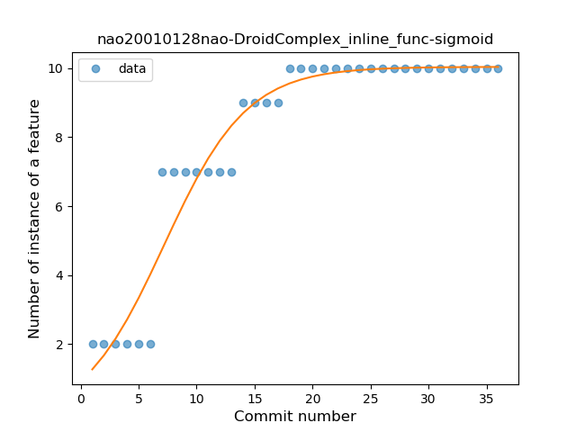
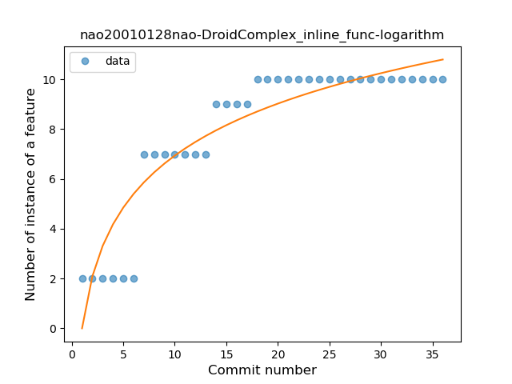

