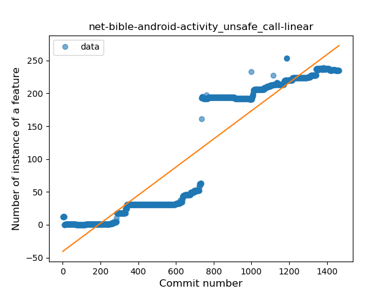
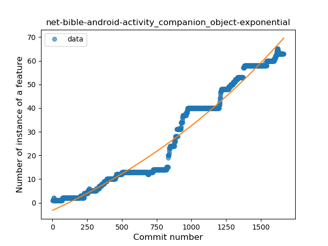
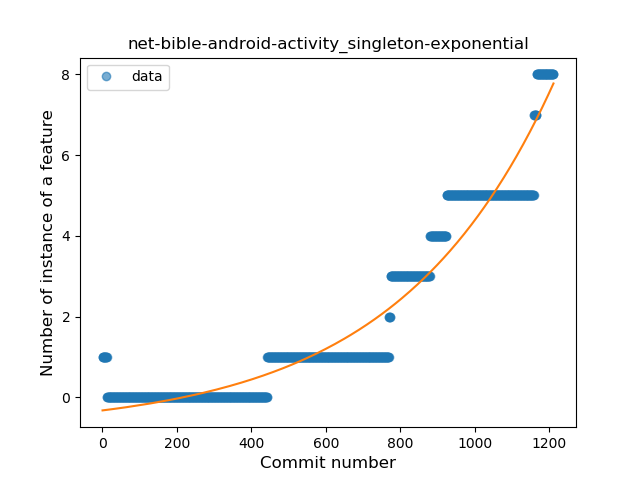
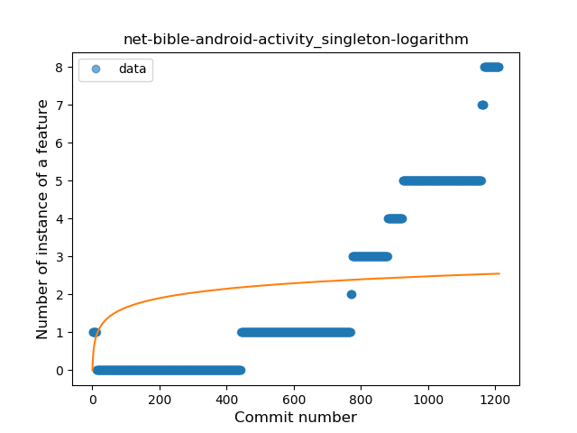
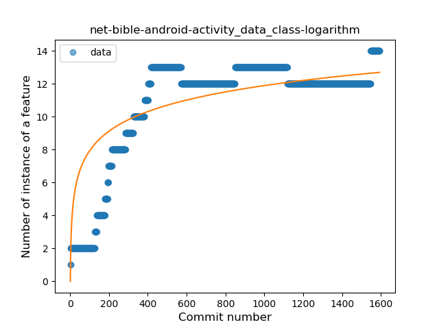
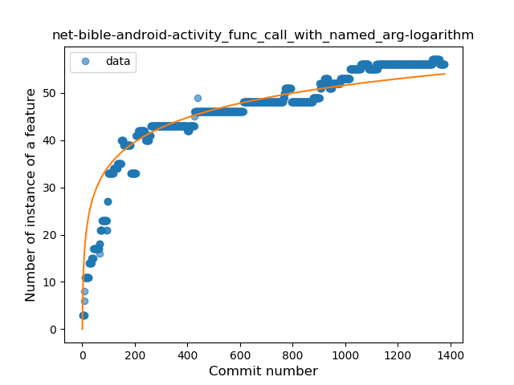
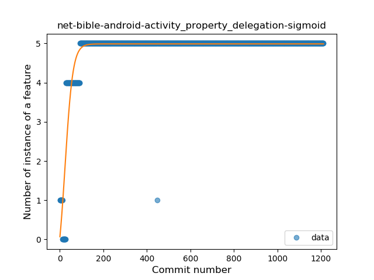
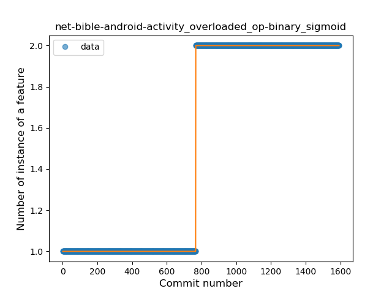

## net-bible-android-activity
----
#### Metrics provided by Detekt
* Number of lines of code 19549
* Number of Kotlin files: 108
* Cyclomatic complexity: 2515
* Cyclomatic complexity by thousands of lines: 259 

----
**16** features analyzed

*	<a href="#type_inference">Type Inference</a> 
*	<a href="#lambda">Lambda</a> 
*	<a href="#safe_call">Safe Call</a> 
*	<a href="#when_expr">When expression</a> 
*	<a href="#unsafe_call">Unsafe Call</a> 
*	<a href="#companion_object">Companion Object</a> 
*	<a href="#string_template">String Template</a> 
*	<a href="#func_with_default_value">Function with Default Value</a> 
*	<a href="#singleton">Singleton</a> 
*	<a href="#range_expr">Range Expression</a> 
*	<a href="#smart_cast">Smart Cast</a> 
*	<a href="#data_class">Data Class</a> 
*	<a href="#func_call_with_named_arg">Function call with Named Argument</a> 
*	<a href="#property_delegation">Property Delegation</a> 
*	<a href="#destructuring_declaration">Destructuring Declaration</a> 
*	<a href="#overloaded_op">Overloaded Operator</a> 

### <a name="type_inference">Type Inference</a>
----
#### Functions
* **Sudden Rise - Exponential:** 
    * **R_Squared:** 0.97033097
* **Constant Rise - Linear:** 
    * **R_Squared:** 0.95905513
* **Sudden Rise Plateau - Logarithm:** 
    * **R_Squared:** 0.28749062
* **Plateau Sudden Rise - Binary Sigmoid:** 
    * **R_Squared:** 0.18705811

**Plots** :chart_with_upwards_trend:
-----

### <a name="lambda">Lambda</a>
----
#### Functions
* **Sudden Rise - Exponential:** 
    * **R_Squared:** 0.9725071
* **Constant Rise - Linear:** 
    * **R_Squared:** 0.92271842
* **Sudden Rise Plateau - Logarithm:** 
    * **R_Squared:** 0.24610374
* **Plateau Sudden Rise - Binary Sigmoid:** 
    * **R_Squared:** 0.03518258

**Plots** :chart_with_upwards_trend:
-----

### <a name="safe_call">Safe Call</a>
----
#### Functions
* **Constant Rise - Linear:** 
    * **R_Squared:** 0.96777039
* **Sudden Rise Plateau - Logarithm:** 
    * **R_Squared:** 0.39105479

**Plots** :chart_with_upwards_trend:
-----

### <a name="when_expr">When expression</a>
----
#### Functions
* **Plateau Gradual Rise - Sigmoid:** 
    * **R_Squared:** 0.94879775
* **Constant Rise - Linear:** 
    * **R_Squared:** 0.90538493
* **Sudden Rise Plateau - Logarithm:** 
    * **R_Squared:** 0.31516489

**Plots** :chart_with_upwards_trend:
-----

### <a name="unsafe_call">Unsafe Call</a>
----
#### Functions
* **Constant Rise - Linear:** 
    * **R_Squared:** 0.87623451
* **Sudden Rise Plateau - Logarithm:** 
    * **R_Squared:** 0.26327754
* **Plateau Sudden Rise - Binary Sigmoid:** 
    * **R_Squared:** 0.09963888

**Plots** :chart_with_upwards_trend:
-----

### <a name="companion_object">Companion Object</a>
----
#### Functions
* **Sudden Rise - Exponential:** 
    * **R_Squared:** 0.96472244
* **Constant Rise - Linear:** 
    * **R_Squared:** 0.95001407
* **Plateau Sudden Rise - Binary Sigmoid:** 
    * **R_Squared:** 0.45391623
* **Sudden Rise Plateau - Logarithm:** 
    * **R_Squared:** 0.28455989

**Plots** :chart_with_upwards_trend:
-----

### <a name="string_template">String Template</a>
----
#### Functions
* **Sudden Rise - Exponential:** 
    * **R_Squared:** 0.98039696
* **Constant Rise - Linear:** 
    * **R_Squared:** 0.95993442
* **Sudden Rise Plateau - Logarithm:** 
    * **R_Squared:** 0.38669369
* **Plateau Sudden Rise - Binary Sigmoid:** 
    * **R_Squared:** 0.09305126

**Plots** :chart_with_upwards_trend:
-----

### <a name="func_with_default_value">Function with Default Value</a>
----
#### Functions
* **Constant Rise - Linear:** 
    * **R_Squared:** 0.9707047
* **Sudden Rise Plateau - Logarithm:** 
    * **R_Squared:** 0.47675966
* **Plateau Sudden Rise - Binary Sigmoid:** 
    * **R_Squared:** 0.08165554

**Plots** :chart_with_upwards_trend:
-----

### <a name="singleton">Singleton</a>
----
#### Functions
* **Sudden Rise - Exponential:** 
    * **R_Squared:** 0.93357541
* **Plateau Gradual Rise - Sigmoid:** 
    * **R_Squared:** 0.94197409
* **Constant Rise - Linear:** 
    * **R_Squared:** 0.81159267
* **Sudden Rise Plateau - Logarithm:** 
    * **R_Squared:** 0.17066807

**Plots** :chart_with_upwards_trend:
-----

### <a name="range_expr">Range Expression</a>
----
#### Functions
* **Sudden Rise - Exponential:** 
    * **R_Squared:** 0.93310262
* **Constant Rise - Linear:** 
    * **R_Squared:** 0.90797554
* **Sudden Rise Plateau - Logarithm:** 
    * **R_Squared:** 0.26148818

**Plots** :chart_with_upwards_trend:
-----

### <a name="smart_cast">Smart Cast</a>
----
#### Functions
* **Constant Rise - Linear:** 
    * **R_Squared:** 0.85692339
* **Sudden Rise Plateau - Logarithm:** 
    * **R_Squared:** 0.50656522

**Plots** :chart_with_upwards_trend:
-----

### <a name="data_class">Data Class</a>
----
#### Functions
* **Sudden Rise Plateau - Logarithm:** 
    * **R_Squared:** 0.63526405
* **Constant Rise - Linear:** 
    * **R_Squared:** 0.47693797

**Plots** :chart_with_upwards_trend:
-----

### <a name="func_call_with_named_arg">Function call with Named Argument</a>
----
#### Functions
* **Sudden Rise Plateau - Logarithm:** 
    * **R_Squared:** 0.87836078
* **Constant Rise - Linear:** 
    * **R_Squared:** 0.73188207

**Plots** :chart_with_upwards_trend:
-----

### <a name="property_delegation">Property Delegation</a>
----
#### Functions
* **Plateau Gradual Rise - Sigmoid:** 
    * **R_Squared:** 0.8436279
* **Sudden Rise Plateau - Logarithm:** 
    * **R_Squared:** 0.46479018
* **Constant Rise - Linear:** 
    * **R_Squared:** 0.12962227

**Plots** :chart_with_upwards_trend:
-----

### <a name="destructuring_declaration">Destructuring Declaration</a>
----
#### Functions
* **Sudden Rise - Exponential:** 
    * **R_Squared:** 0.88420222
* **Constant Rise - Linear:** 
    * **R_Squared:** 0.85947705
* **Sudden Rise Plateau - Logarithm:** 
    * **R_Squared:** 0.29375178

**Plots** :chart_with_upwards_trend:
-----

### <a name="overloaded_op">Overloaded Operator</a>
----
#### Functions
* **Plateau Sudden Rise - Binary Sigmoid:** 
    * **R_Squared:** 1.0
* **Constant Rise - Linear:** 
    * **R_Squared:** 0.74893498
* **Sudden Rise Plateau - Logarithm:** 
    * **R_Squared:** 0.44815429

**Plots** :chart_with_upwards_trend:
-----

