## net-codechunk-speedofsound
----
#### Metrics provided by Detekt
* Number of lines of code 1940
* Number of Kotlin files: 13
* Cyclomatic complexity: 195
* Cyclomatic complexity by thousands of lines: 236 

----
**6** features analyzed

*	<a href="#type_inference">Type Inference</a> 
*	<a href="#lambda">Lambda</a> 
*	<a href="#safe_call">Safe Call</a> 
*	<a href="#when_expr">When expression</a> 
*	<a href="#unsafe_call">Unsafe Call</a> 
*	<a href="#string_template">String Template</a> 

### <a name="type_inference">Type Inference</a>
----
#### Functions
* **Instability - Polinomial 4:** 
    * **R_Squared:** 0.75053973
* **Sudden Decline - Exponential:** 
    * **R_Squared:** 0.64927685
* **Constant Decline - Linear:** 
    * **R_Squared:** 0.55245007
* **Sudden Rise Plateau - Logarithm:** 
    * **R_Squared:** -0.0

**Plots** :chart_with_upwards_trend:
-----

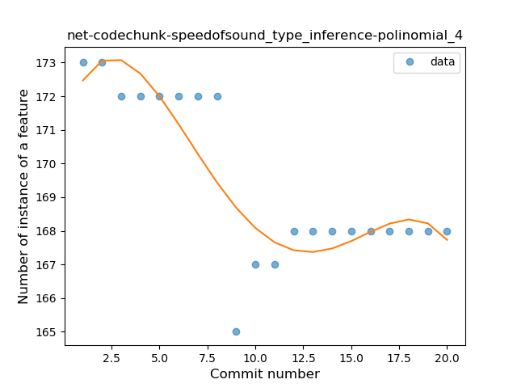
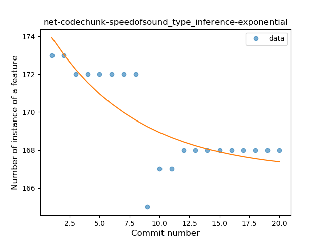
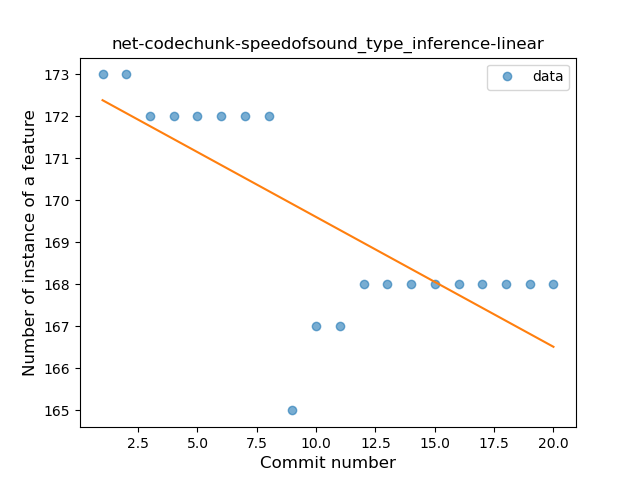
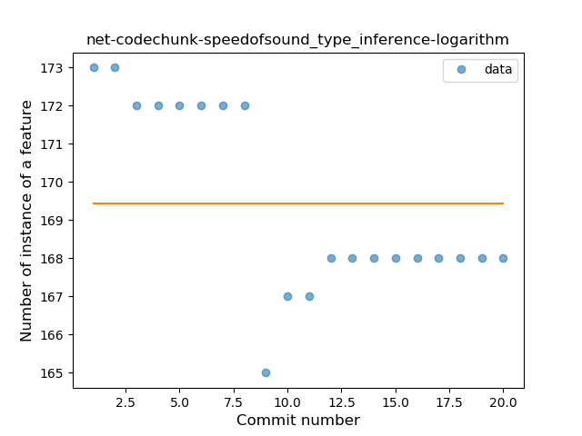
### <a name="lambda">Lambda</a>
----
#### Functions
* **Constant Rise - Linear:** 
    * **R_Squared:** 0.86226931
* **Sudden Rise Plateau - Logarithm:** 
    * **R_Squared:** 0.80931475

**Plots** :chart_with_upwards_trend:
-----

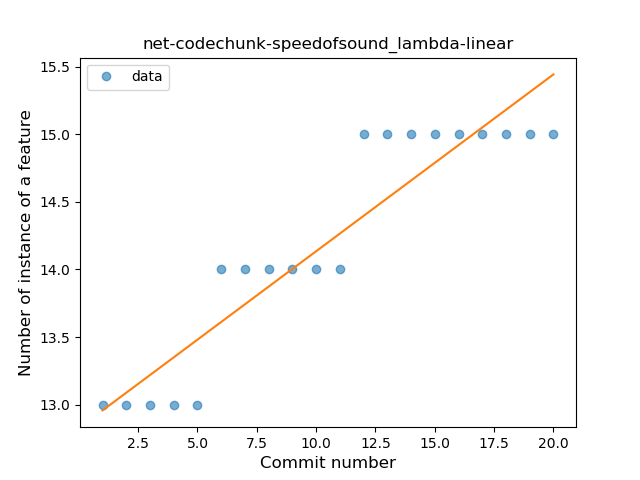
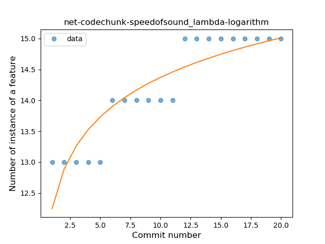
### <a name="safe_call">Safe Call</a>
----
#### Functions
* **Plateau Sudden Rise - Binary Sigmoid:** 
    * **R_Squared:** 1.0
* **Instability - Polinomial 4:** 
    * **R_Squared:** 0.86090793
* **Sudden Rise Plateau - Logarithm:** 
    * **R_Squared:** 0.72327509
* **Constant Rise - Linear:** 
    * **R_Squared:** 0.58928571

**Plots** :chart_with_upwards_trend:
-----

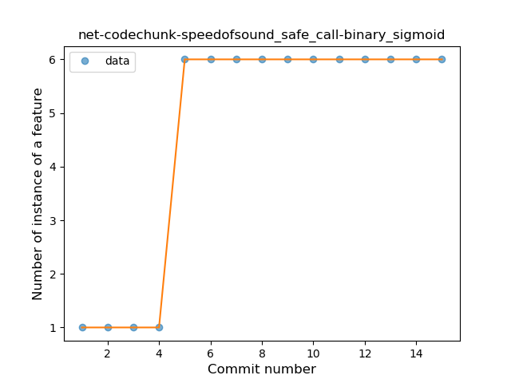
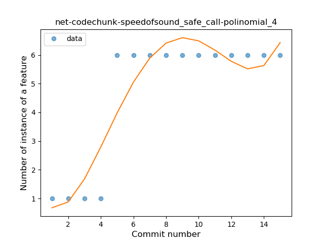
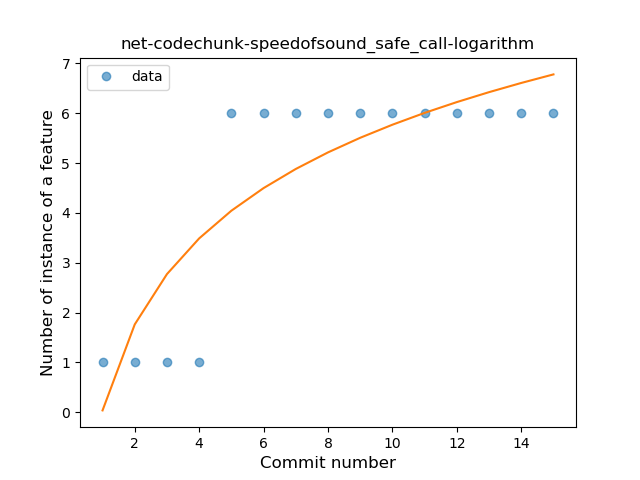
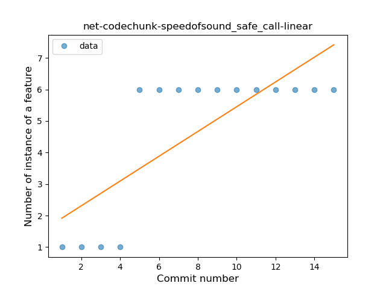
### <a name="when_expr">When expression</a>
----
#### Functions
* **Plateau Sudden Rise - Binary Sigmoid:** 
    * **R_Squared:** 1.0
* **Instability - Polinomial 4:** 
    * **R_Squared:** 0.86846913
* **Instability - Polinomial 3:** )
    * **R_Squared:** 0.85600831
* **Constant Rise - Linear:** 
    * **R_Squared:** 0.7443609
* **Sudden Rise Plateau - Logarithm:** 
    * **R_Squared:** 0.62866011

**Plots** :chart_with_upwards_trend:
-----

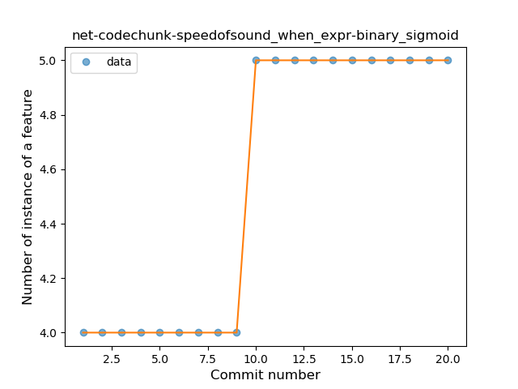
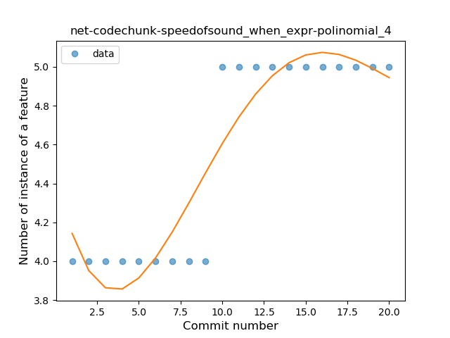
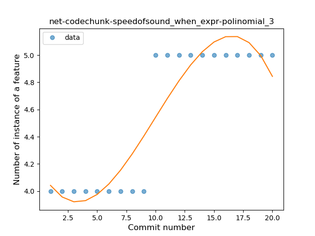
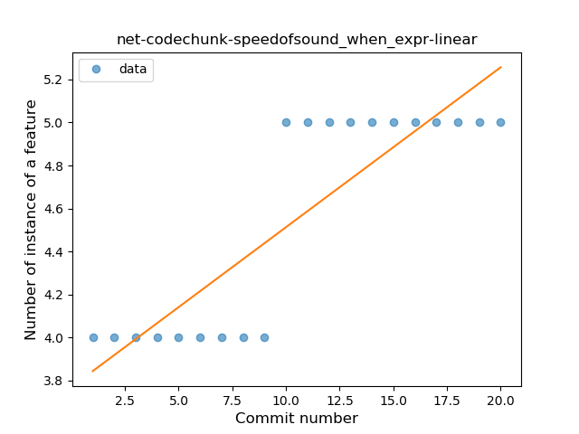
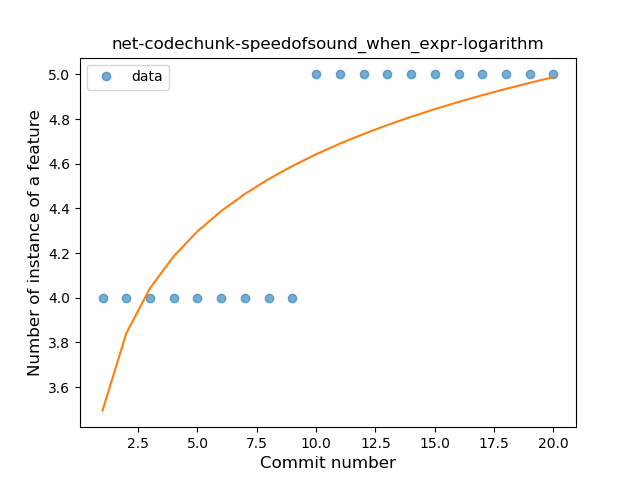
### <a name="unsafe_call">Unsafe Call</a>
----
#### Functions
* **Instability - Polinomial 4:** 
    * **R_Squared:** 0.91251919
* **Sudden Decline - Exponential:** 
    * **R_Squared:** 0.846793
* **Constant Decline - Linear:** 
    * **R_Squared:** 0.68832662
* **Sudden Rise Plateau - Logarithm:** 
    * **R_Squared:** -0.0

**Plots** :chart_with_upwards_trend:
-----

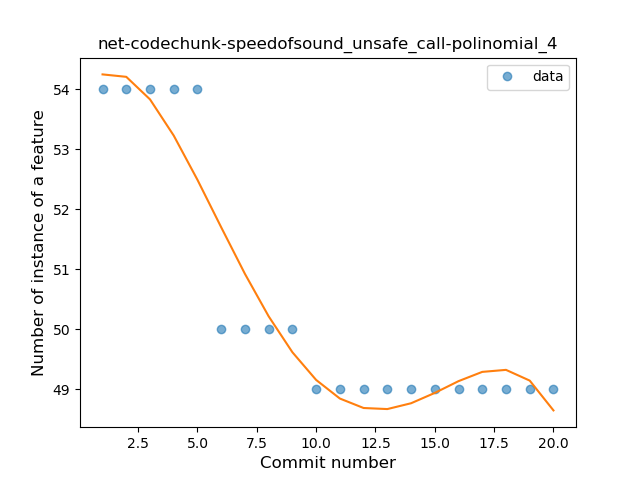
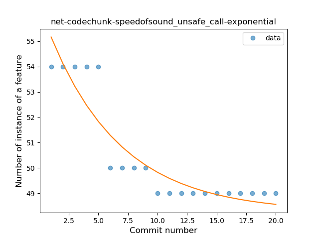
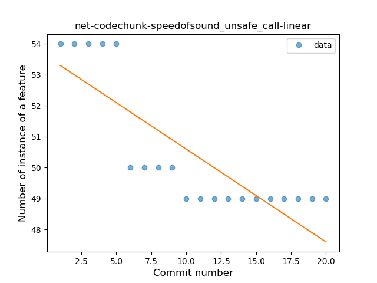
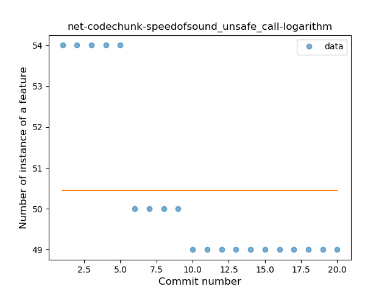
### <a name="string_template">String Template</a>
----
#### Functions
* **Instability - Polinomial 4:** 
    * **R_Squared:** 0.90603797
* **Instability - Polinomial 3:** )
    * **R_Squared:** 0.88495437
* **Constant Rise - Linear:** 
    * **R_Squared:** 0.77001746
* **Sudden Rise Plateau - Logarithm:** 
    * **R_Squared:** 0.6693761

**Plots** :chart_with_upwards_trend:
-----

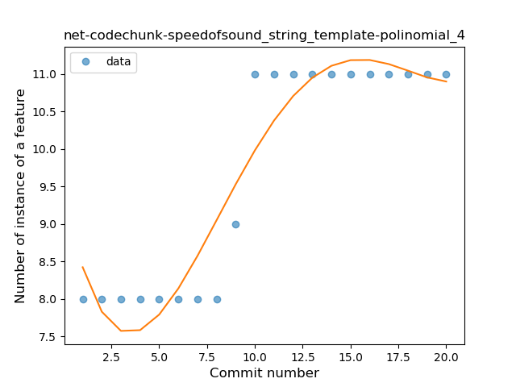
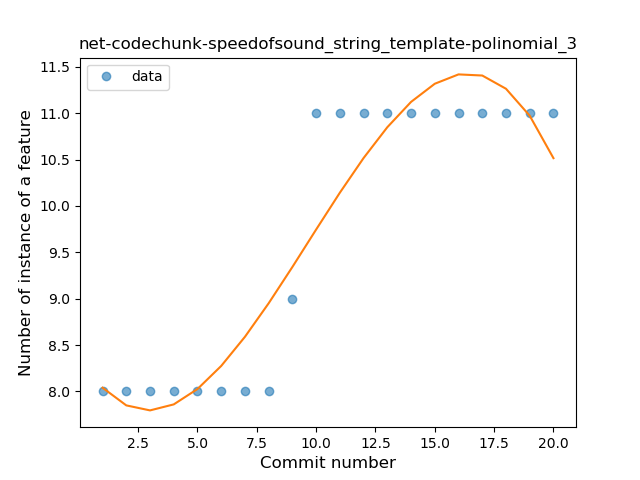
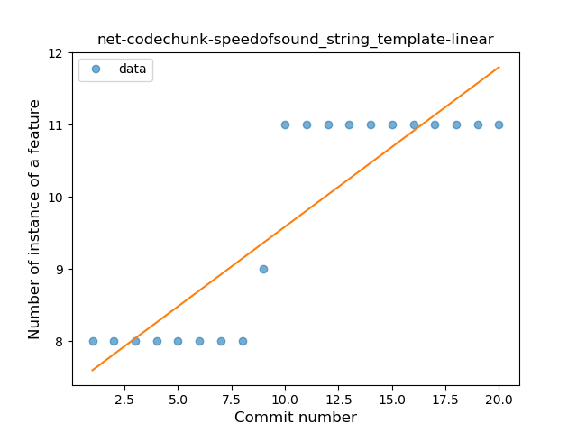
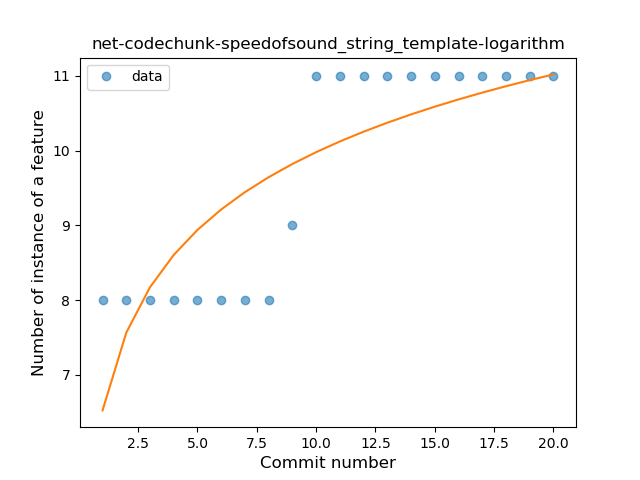
