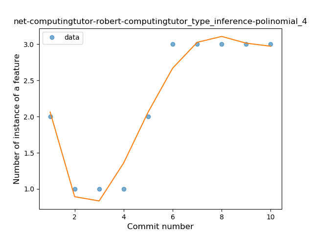
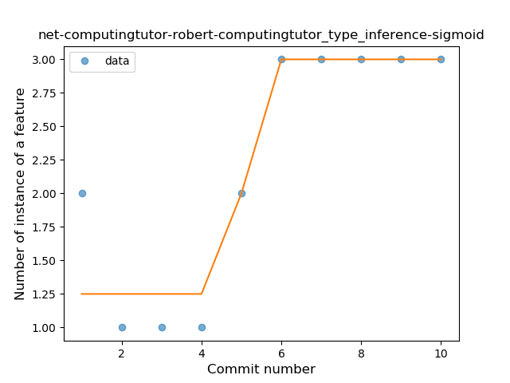
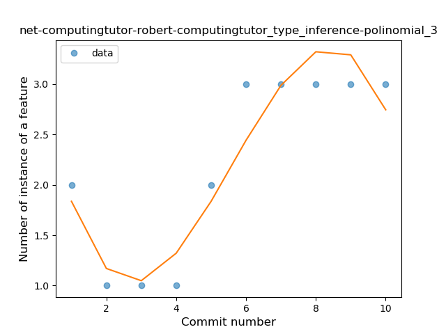
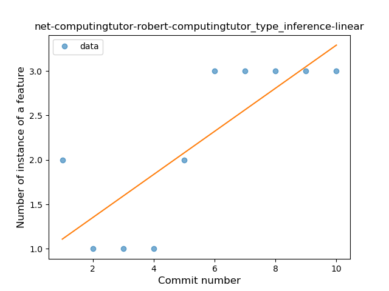
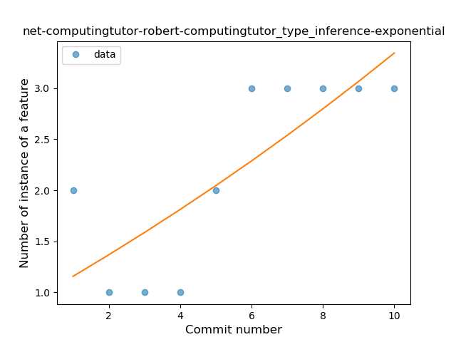
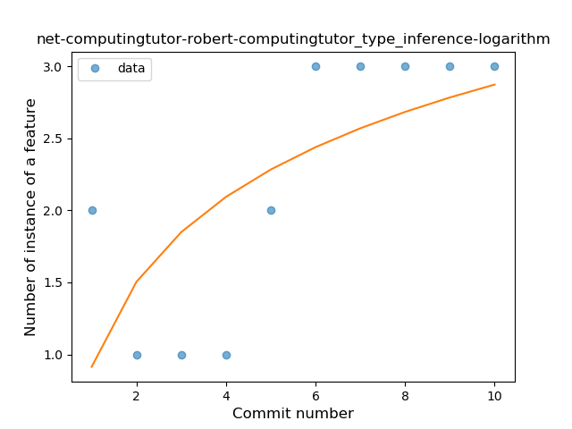
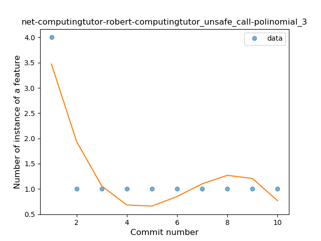
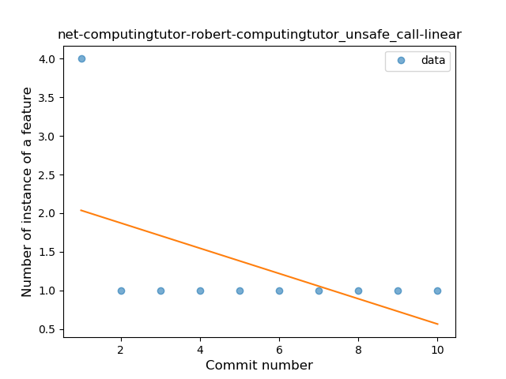
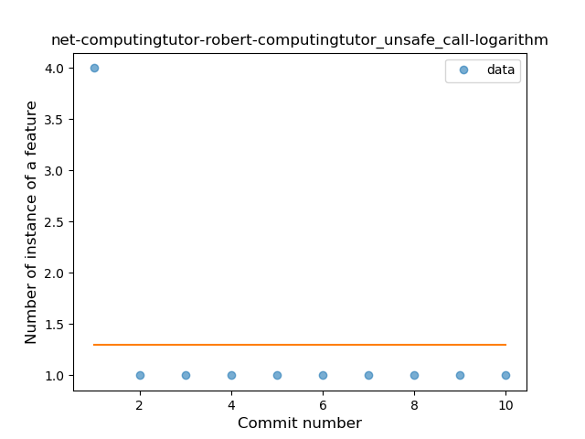

## net-computingtutor-robert-computingtutor
----
#### Metrics provided by Detekt
* Number of lines of code 240
* Number of Kotlin files: 4
* Cyclomatic complexity: 58
* Cyclomatic complexity by thousands of lines: 446 

----
**2** features analyzed

*	<a href="#type_inference">Type Inference</a> 
*	<a href="#unsafe_call">Unsafe Call</a> 

### <a name="type_inference">Type Inference</a>
----
#### Functions
* **Instability - Polinomial 4:** 
    * **R_Squared:** 0.96074101
* **Plateau Gradual Rise - Sigmoid:** 
    * **R_Squared:** 0.90131579
* **Instability - Polinomial 3:** )
    * **R_Squared:** 0.90111643
* **Constant Rise - Linear:** 
    * **R_Squared:** 0.63795853
* **Sudden Rise - Exponential:** 
    * **R_Squared:** 0.640167
* **Sudden Rise Plateau - Logarithm:** 
    * **R_Squared:** 0.46139946

**Plots** :chart_with_upwards_trend:
-----

### <a name="unsafe_call">Unsafe Call</a>
----
#### Functions
* **Instability - Polinomial 4:** 
    * **R_Squared:** 0.93006993
* **Instability - Polinomial 3:** )
    * **R_Squared:** 0.8041958
* **Constant Decline - Linear:** 
    * **R_Squared:** 0.27272727
* **Sudden Rise Plateau - Logarithm:** 
    * **R_Squared:** -0.0

**Plots** :chart_with_upwards_trend:
-----

