## net-frju-flym
----
#### Metrics provided by Detekt
* Number of lines of code 5096
* Number of Kotlin files: 43
* Cyclomatic complexity: 750
* Cyclomatic complexity by thousands of lines: 314 

----
**16** features analyzed

*	<a href="#type_inference">Type Inference</a> 
*	<a href="#lambda">Lambda</a> 
*	<a href="#safe_call">Safe Call</a> 
*	<a href="#when_expr">When expression</a> 
*	<a href="#unsafe_call">Unsafe Call</a> 
*	<a href="#companion_object">Companion Object</a> 
*	<a href="#string_template">String Template</a> 
*	<a href="#func_with_default_value">Function with Default Value</a> 
*	<a href="#singleton">Singleton</a> 
*	<a href="#range_expr">Range Expression</a> 
*	<a href="#smart_cast">Smart Cast</a> 
*	<a href="#data_class">Data Class</a> 
*	<a href="#func_call_with_named_arg">Function call with Named Argument</a> 
*	<a href="#extension_function">Extension Function</a> 
*	<a href="#property_delegation">Property Delegation</a> 
*	<a href="#inline_func">Inline Function</a> 

### <a name="type_inference">Type Inference</a>
----
#### Functions
* **Sudden Rise - Exponential:** 
    * **R_Squared:** 0.52664139
* **Constant Rise - Linear:** 
    * **R_Squared:** 0.36296473
* **Sudden Rise Plateau - Logarithm:** 
    * **R_Squared:** 0.07574073

**Plots** :chart_with_upwards_trend:
-----

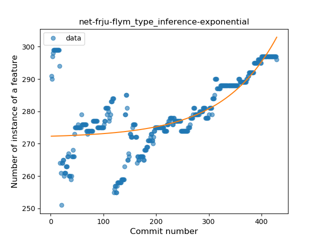

### <a name="lambda">Lambda</a>
----
#### Functions
* **Constant Rise - Linear:** 
    * **R_Squared:** 0.91270706
* **Sudden Rise Plateau - Logarithm:** 
    * **R_Squared:** 0.76634806
* **Plateau Sudden Rise - Binary Sigmoid:** 
    * **R_Squared:** 0.41742176

**Plots** :chart_with_upwards_trend:
-----

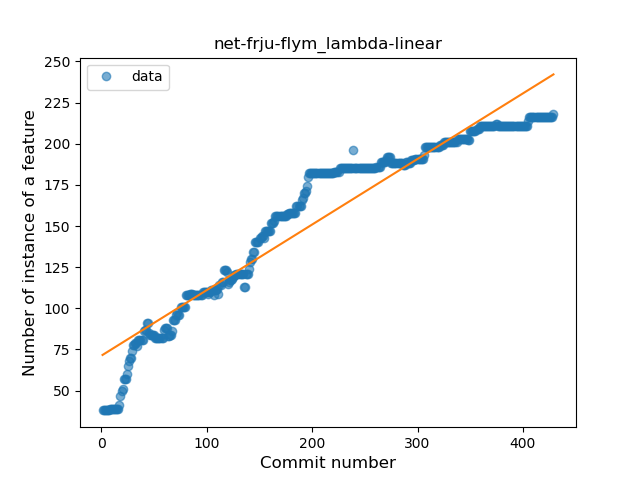

### <a name="safe_call">Safe Call</a>
----
#### Functions
* **Constant Rise - Linear:** 
    * **R_Squared:** 0.89815869
* **Sudden Rise Plateau - Logarithm:** 
    * **R_Squared:** 0.73570404
* **Plateau Sudden Rise - Binary Sigmoid:** 
    * **R_Squared:** 0.70138312

**Plots** :chart_with_upwards_trend:
-----

### <a name="when_expr">When expression</a>
----
#### Functions
* **Constant Rise - Linear:** 
    * **R_Squared:** 0.91086136
* **Sudden Rise Plateau - Logarithm:** 
    * **R_Squared:** 0.54317837

**Plots** :chart_with_upwards_trend:
-----

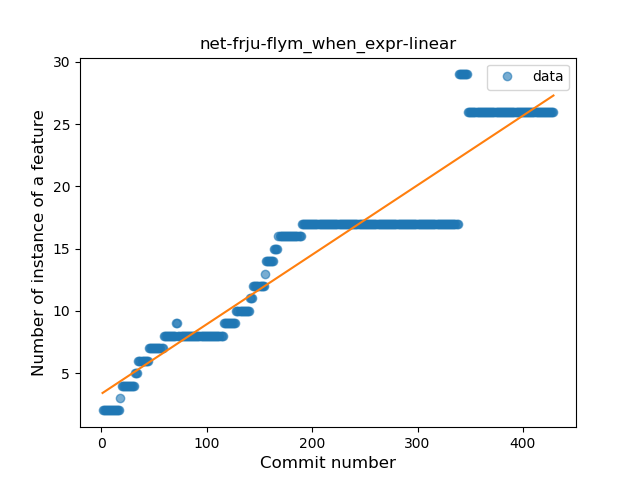

### <a name="unsafe_call">Unsafe Call</a>
----
#### Functions
* **Sudden Rise - Exponential:** 
    * **R_Squared:** 0.07188545
* **Constant Rise - Linear:** 
    * **R_Squared:** 0.00096467
* **Sudden Rise Plateau - Logarithm:** 
    * **R_Squared:** 0.0

**Plots** :chart_with_upwards_trend:
-----

### <a name="companion_object">Companion Object</a>
----
#### Functions
* **Constant Decline - Linear:** 
    * **R_Squared:** 0.68240009
* **Sudden Rise Plateau - Logarithm:** 
    * **R_Squared:** -0.0

**Plots** :chart_with_upwards_trend:
-----

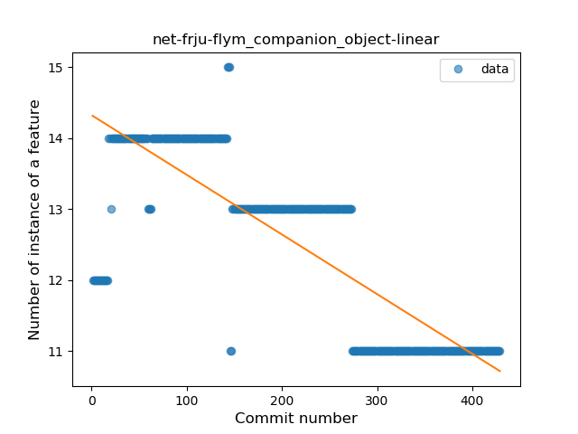

### <a name="string_template">String Template</a>
----
#### Functions
* **Constant Rise - Linear:** 
    * **R_Squared:** 0.61472612
* **Sudden Rise Plateau - Logarithm:** 
    * **R_Squared:** 0.57755452
* **Plateau Sudden Rise - Binary Sigmoid:** 
    * **R_Squared:** 0.32093145

**Plots** :chart_with_upwards_trend:
-----

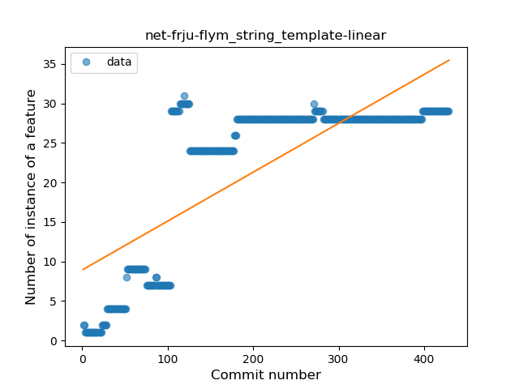

### <a name="func_with_default_value">Function with Default Value</a>
----
#### Functions
* **Constant Rise - Linear:** 
    * **R_Squared:** 0.88040797
* **Sudden Rise Plateau - Logarithm:** 
    * **R_Squared:** 0.77775337

**Plots** :chart_with_upwards_trend:
-----

### <a name="singleton">Singleton</a>
----
#### Functions
* **Plateau Sudden Decline - Binary Sigmoid:** 
    * **R_Squared:** 0.88892723
* **Sudden Decline - Exponential:** 
    * **R_Squared:** 0.84088545
* **Constant Decline - Linear:** 
    * **R_Squared:** 0.57737767
* **Sudden Rise Plateau - Logarithm:** 
    * **R_Squared:** -0.0

**Plots** :chart_with_upwards_trend:
-----

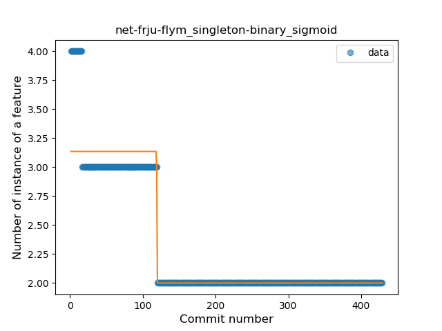

### <a name="range_expr">Range Expression</a>
----
#### Functions
* **Plateau Sudden Decline - Binary Sigmoid:** 
    * **R_Squared:** 0.78765909
* **Sudden Decline - Exponential:** 
    * **R_Squared:** 0.48271813
* **Constant Decline - Linear:** 
    * **R_Squared:** 0.27416074
* **Sudden Rise Plateau - Logarithm:** 
    * **R_Squared:** -0.0

**Plots** :chart_with_upwards_trend:
-----

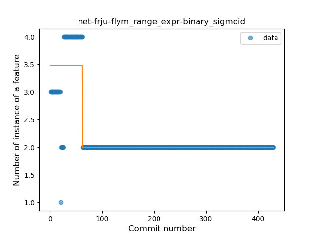

### <a name="smart_cast">Smart Cast</a>
----
#### Functions
* **Constant Rise - Linear:** 
    * **R_Squared:** 0.15746029
* **Sudden Rise Plateau - Logarithm:** 
    * **R_Squared:** 0.06228473

**Plots** :chart_with_upwards_trend:
-----

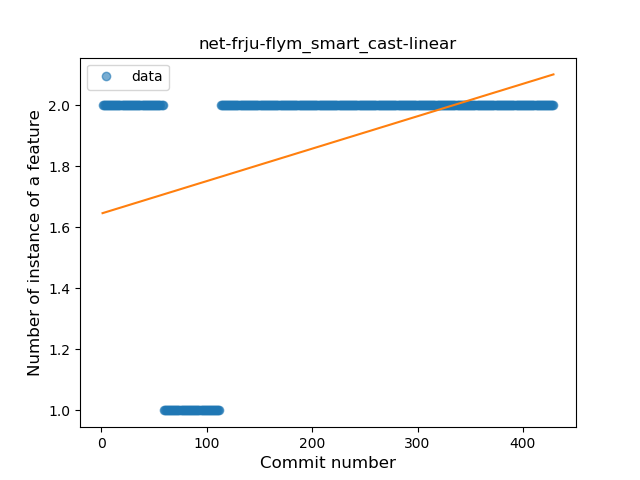

### <a name="data_class">Data Class</a>
----
#### Functions
* **Plateau Gradual Rise - Sigmoid:** 
    * **R_Squared:** 0.99601643
* **Sudden Rise - Exponential:** 
    * **R_Squared:** 0.7610989
* **Constant Rise - Linear:** 
    * **R_Squared:** 0.71643416
* **Sudden Rise Plateau - Logarithm:** 
    * **R_Squared:** 0.40257226

**Plots** :chart_with_upwards_trend:
-----

### <a name="func_call_with_named_arg">Function call with Named Argument</a>
----
#### Functions
* **Constant Rise - Linear:** 
    * **R_Squared:** 0.84735598
* **Sudden Rise Plateau - Logarithm:** 
    * **R_Squared:** 0.5533021

**Plots** :chart_with_upwards_trend:
-----

### <a name="extension_function">Extension Function</a>
----
#### Functions
* **Plateau Gradual Rise - Sigmoid:** 
    * **R_Squared:** 0.98630019
* **Sudden Rise - Exponential:** 
    * **R_Squared:** 0.79175231
* **Constant Rise - Linear:** 
    * **R_Squared:** 0.53682613
* **Sudden Rise Plateau - Logarithm:** 
    * **R_Squared:** 0.18369032

**Plots** :chart_with_upwards_trend:
-----

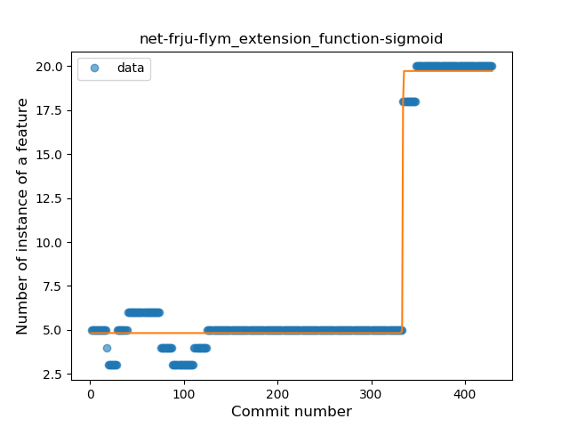

### <a name="property_delegation">Property Delegation</a>
----
#### Functions
* **Plateau Sudden Decline - Binary Sigmoid:** 
    * **R_Squared:** 1.0
* **Sudden Decline - Exponential:** 
    * **R_Squared:** 0.77289394
* **Constant Decline - Linear:** 
    * **R_Squared:** 0.53629646
* **Sudden Rise Plateau - Logarithm:** 
    * **R_Squared:** -0.0

**Plots** :chart_with_upwards_trend:
-----

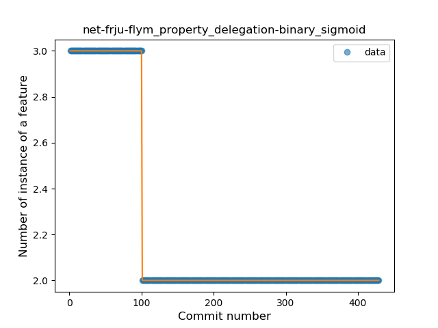

### <a name="inline_func">Inline Function</a>
----
#### Functions
* **Plateau Sudden Decline - Binary Sigmoid:** 
    * **R_Squared:** 1.0
* **Sudden Decline - Exponential:** 
    * **R_Squared:** 0.80576883
* **Constant Decline - Linear:** 
    * **R_Squared:** 0.1488806
* **Sudden Rise Plateau - Logarithm:** 
    * **R_Squared:** -0.0

**Plots** :chart_with_upwards_trend:
-----

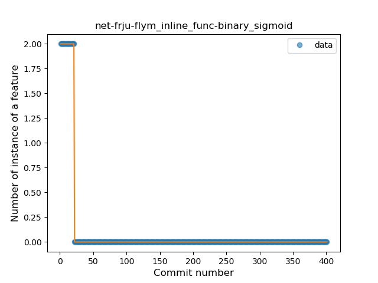
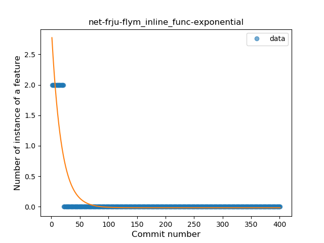

