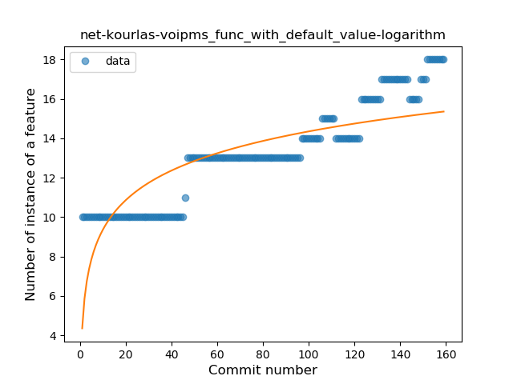

## net-kourlas-voipms
----
#### Metrics provided by Detekt
* Number of lines of code 12903
* Number of Kotlin files: 58
* Cyclomatic complexity: 1525
* Cyclomatic complexity by thousands of lines: 228 

----
**12** features analyzed

*	<a href="#type_inference">Type Inference</a> 
*	<a href="#lambda">Lambda</a> 
*	<a href="#safe_call">Safe Call</a> 
*	<a href="#when_expr">When expression</a> 
*	<a href="#unsafe_call">Unsafe Call</a> 
*	<a href="#companion_object">Companion Object</a> 
*	<a href="#string_template">String Template</a> 
*	<a href="#func_with_default_value">Function with Default Value</a> 
*	<a href="#range_expr">Range Expression</a> 
*	<a href="#smart_cast">Smart Cast</a> 
*	<a href="#func_call_with_named_arg">Function call with Named Argument</a> 
*	<a href="#destructuring_declaration">Destructuring Declaration</a> 

### <a name="type_inference">Type Inference</a>
----
#### Functions
* **Sudden Rise Plateau - Logarithm:** 
    * **R_Squared:** 0.71952699
* **Constant Rise - Linear:** 
    * **R_Squared:** 0.54928651
* **Plateau Sudden Rise - Binary Sigmoid:** 
    * **R_Squared:** 0.37346658

**Plots** :chart_with_upwards_trend:
-----

### <a name="lambda">Lambda</a>
----
#### Functions
* **Instability - Polinomial 3:** )
    * **R_Squared:** 0.948629
* **Sudden Rise - Exponential:** 
    * **R_Squared:** 0.9295661
* **Constant Rise - Linear:** 
    * **R_Squared:** 0.4651169
* **Sudden Rise Plateau - Logarithm:** 
    * **R_Squared:** 0.18094889

**Plots** :chart_with_upwards_trend:
-----

### <a name="safe_call">Safe Call</a>
----
#### Functions
* **Instability - Polinomial 3:** )
    * **R_Squared:** 0.93755207
* **Sudden Rise - Exponential:** 
    * **R_Squared:** 0.90584596
* **Constant Rise - Linear:** 
    * **R_Squared:** 0.69873836
* **Sudden Rise Plateau - Logarithm:** 
    * **R_Squared:** 0.44184582

**Plots** :chart_with_upwards_trend:
-----

### <a name="when_expr">When expression</a>
----
#### Functions
* **Constant Rise - Linear:** 
    * **R_Squared:** 0.89648031
* **Sudden Rise - Exponential:** 
    * **R_Squared:** 0.90184891
* **Sudden Rise Plateau - Logarithm:** 
    * **R_Squared:** 0.66192934

**Plots** :chart_with_upwards_trend:
-----

### <a name="unsafe_call">Unsafe Call</a>
----
#### Functions
* **Plateau Gradual Rise - Sigmoid:** 
    * **R_Squared:** 0.8932548
* **Constant Rise - Linear:** 
    * **R_Squared:** 0.86563811
* **Sudden Rise Plateau - Logarithm:** 
    * **R_Squared:** 0.68603674

**Plots** :chart_with_upwards_trend:
-----

### <a name="companion_object">Companion Object</a>
----
#### Functions
* **Constant Rise - Linear:** 
    * **R_Squared:** 0.8737772
* **Sudden Rise Plateau - Logarithm:** 
    * **R_Squared:** 0.72253995

**Plots** :chart_with_upwards_trend:
-----

### <a name="string_template">String Template</a>
----
#### Functions
* **Constant Rise - Linear:** 
    * **R_Squared:** 0.71115142
* **Sudden Rise Plateau - Logarithm:** 
    * **R_Squared:** 0.66659493

**Plots** :chart_with_upwards_trend:
-----

### <a name="func_with_default_value">Function with Default Value</a>
----
#### Functions
* **Constant Rise - Linear:** 
    * **R_Squared:** 0.91317872
* **Sudden Rise - Exponential:** 
    * **R_Squared:** 0.9195397
* **Sudden Rise Plateau - Logarithm:** 
    * **R_Squared:** 0.66111789

**Plots** :chart_with_upwards_trend:
-----

### <a name="range_expr">Range Expression</a>
----
#### Functions
* **Sudden Rise Plateau - Logarithm:** 
    * **R_Squared:** 0.19480182
* **Constant Rise - Linear:** 
    * **R_Squared:** 0.07299058

**Plots** :chart_with_upwards_trend:
-----

### <a name="smart_cast">Smart Cast</a>
----
#### Functions
* **Sudden Decline - Exponential:** 
    * **R_Squared:** 0.78078007
* **Constant Decline - Linear:** 
    * **R_Squared:** 0.59852088
* **Sudden Rise Plateau - Logarithm:** 
    * **R_Squared:** -0.0

**Plots** :chart_with_upwards_trend:
-----

### <a name="func_call_with_named_arg">Function call with Named Argument</a>
----
#### Functions
* **Sudden Rise - Exponential:** 
    * **R_Squared:** 0.83492729
* **Constant Rise - Linear:** 
    * **R_Squared:** 0.66749773
* **Sudden Rise Plateau - Logarithm:** 
    * **R_Squared:** 0.32163206

**Plots** :chart_with_upwards_trend:
-----

### <a name="destructuring_declaration">Destructuring Declaration</a>
----
#### Functions
* **Constant Decline - Linear:** 
    * **R_Squared:** 0.68449367
* **Sudden Rise Plateau - Logarithm:** 
    * **R_Squared:** -0.0

**Plots** :chart_with_upwards_trend:
-----

