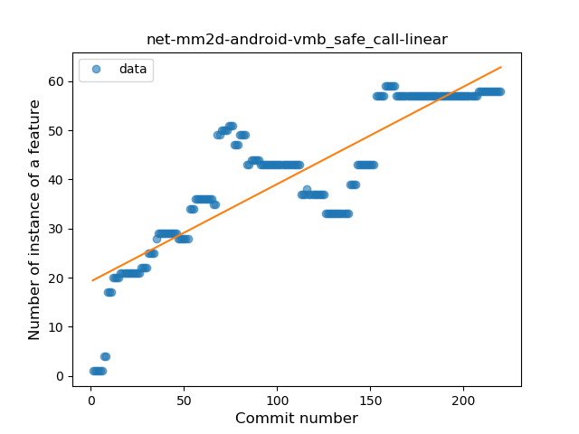
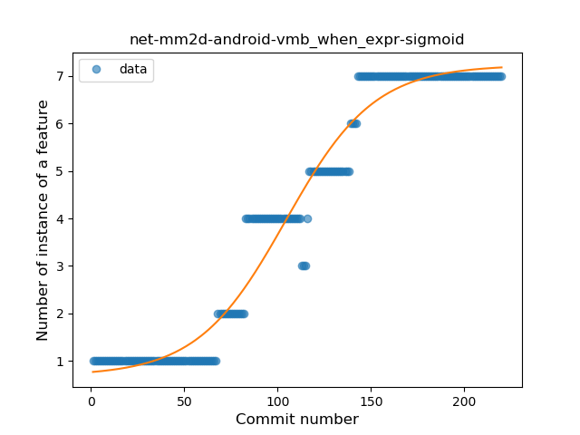
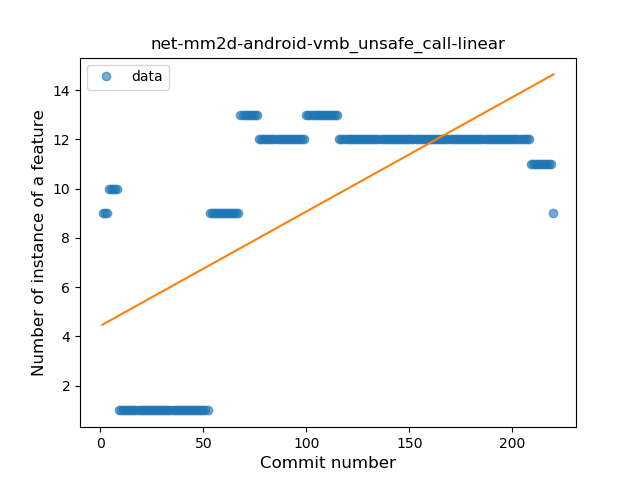
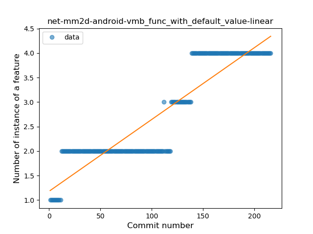
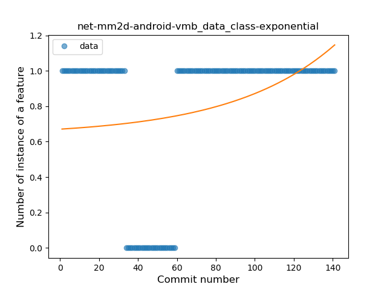

## net-mm2d-android-vmb
----
#### Metrics provided by Detekt
* Number of lines of code 3236
* Number of Kotlin files: 34
* Cyclomatic complexity: 447
* Cyclomatic complexity by thousands of lines: 293 

----
**13** features analyzed

*	<a href="#type_inference">Type Inference</a> 
*	<a href="#lambda">Lambda</a> 
*	<a href="#safe_call">Safe Call</a> 
*	<a href="#when_expr">When expression</a> 
*	<a href="#unsafe_call">Unsafe Call</a> 
*	<a href="#companion_object">Companion Object</a> 
*	<a href="#func_with_default_value">Function with Default Value</a> 
*	<a href="#singleton">Singleton</a> 
*	<a href="#range_expr">Range Expression</a> 
*	<a href="#smart_cast">Smart Cast</a> 
*	<a href="#data_class">Data Class</a> 
*	<a href="#extension_function">Extension Function</a> 
*	<a href="#property_delegation">Property Delegation</a> 

### <a name="type_inference">Type Inference</a>
----
#### Functions
* **Constant Rise - Linear:** 
    * **R_Squared:** 0.7685242
* **Sudden Rise Plateau - Logarithm:** 
    * **R_Squared:** 0.77378997

**Plots** :chart_with_upwards_trend:
-----

### <a name="lambda">Lambda</a>
----
#### Functions
* **Constant Rise - Linear:** 
    * **R_Squared:** 0.85084458
* **Sudden Rise Plateau - Logarithm:** 
    * **R_Squared:** 0.71536316

**Plots** :chart_with_upwards_trend:
-----

### <a name="safe_call">Safe Call</a>
----
#### Functions
* **Constant Rise - Linear:** 
    * **R_Squared:** 0.74782959
* **Sudden Rise Plateau - Logarithm:** 
    * **R_Squared:** 0.72377487
* **Plateau Gradual Rise - Sigmoid:** 
    * **R_Squared:** 0.41947102

**Plots** :chart_with_upwards_trend:
-----

### <a name="when_expr">When expression</a>
----
#### Functions
* **Plateau Gradual Rise - Sigmoid:** 
    * **R_Squared:** 0.96620386
* **Constant Rise - Linear:** 
    * **R_Squared:** 0.91076167
* **Sudden Rise Plateau - Logarithm:** 
    * **R_Squared:** 0.46194043

**Plots** :chart_with_upwards_trend:
-----

### <a name="unsafe_call">Unsafe Call</a>
----
#### Functions
* **Constant Rise - Linear:** 
    * **R_Squared:** 0.45011659
* **Sudden Rise Plateau - Logarithm:** 
    * **R_Squared:** 0.38816557
* **Plateau Sudden Rise - Binary Sigmoid:** 
    * **R_Squared:** 0.18719845

**Plots** :chart_with_upwards_trend:
-----

### <a name="companion_object">Companion Object</a>
----
#### Functions
* **Constant Rise - Linear:** 
    * **R_Squared:** 0.74065761
* **Sudden Rise Plateau - Logarithm:** 
    * **R_Squared:** 0.69874397

**Plots** :chart_with_upwards_trend:
-----

### <a name="func_with_default_value">Function with Default Value</a>
----
#### Functions
* **Plateau Gradual Rise - Sigmoid:** 
    * **R_Squared:** 0.93461082
* **Constant Rise - Linear:** 
    * **R_Squared:** 0.83171988
* **Sudden Rise - Exponential:** 
    * **R_Squared:** 0.83860084
* **Sudden Rise Plateau - Logarithm:** 
    * **R_Squared:** 0.58320533

**Plots** :chart_with_upwards_trend:
-----

### <a name="singleton">Singleton</a>
----
#### Functions
* **Plateau Gradual Rise - Sigmoid:** 
    * **R_Squared:** 0.93985767
* **Sudden Rise - Exponential:** 
    * **R_Squared:** 0.87900472
* **Constant Rise - Linear:** 
    * **R_Squared:** 0.84849208
* **Sudden Rise Plateau - Logarithm:** 
    * **R_Squared:** 0.51624359

**Plots** :chart_with_upwards_trend:
-----

### <a name="range_expr">Range Expression</a>
----
#### Functions
* **Plateau Sudden Rise - Binary Sigmoid:** 
    * **R_Squared:** 1.0
* **Constant Rise - Linear:** 
    * **R_Squared:** 0.74600228
* **Sudden Rise - Exponential:** 
    * **R_Squared:** 0.75046426
* **Sudden Rise Plateau - Logarithm:** 
    * **R_Squared:** 0.47492172

**Plots** :chart_with_upwards_trend:
-----

### <a name="smart_cast">Smart Cast</a>
----
#### Functions
* **Constant Rise - Linear:** 
    * **R_Squared:** 0.86357012
* **Sudden Rise - Exponential:** 
    * **R_Squared:** 0.86515295
* **Sudden Rise Plateau - Logarithm:** 
    * **R_Squared:** 0.49055692
* **Plateau Sudden Rise - Binary Sigmoid:** 
    * **R_Squared:** 0.04530898

**Plots** :chart_with_upwards_trend:
-----

### <a name="data_class">Data Class</a>
----
#### Functions
* **Sudden Rise - Exponential:** 
    * **R_Squared:** 0.11478862
* **Constant Rise - Linear:** 
    * **R_Squared:** 0.08191672
* **Sudden Rise Plateau - Logarithm:** 
    * **R_Squared:** 0.00551672

**Plots** :chart_with_upwards_trend:
-----

### <a name="extension_function">Extension Function</a>
----
#### Functions
* **Plateau Sudden Rise - Binary Sigmoid:** 
    * **R_Squared:** 1.0
* **Sudden Rise Plateau - Logarithm:** 
    * **R_Squared:** 0.67048759
* **Constant Rise - Linear:** 
    * **R_Squared:** 0.61037234

**Plots** :chart_with_upwards_trend:
-----

### <a name="property_delegation">Property Delegation</a>
----
#### Functions
* **Plateau Sudden Rise - Binary Sigmoid:** 
    * **R_Squared:** 0.44428202
* **Sudden Rise Plateau - Logarithm:** 
    * **R_Squared:** 0.04913001
* **Constant Decline - Linear:** 
    * **R_Squared:** 0.00432145

**Plots** :chart_with_upwards_trend:
-----

