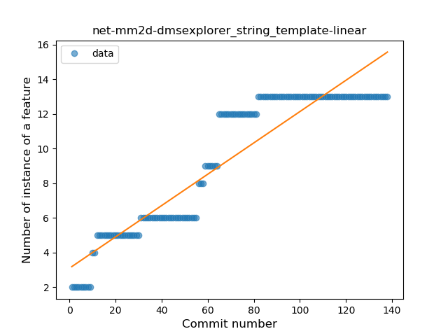
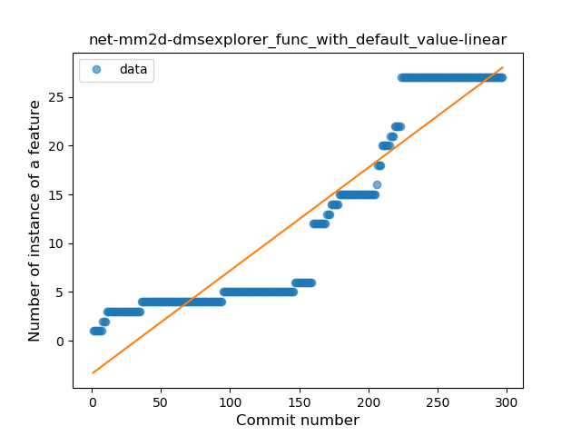
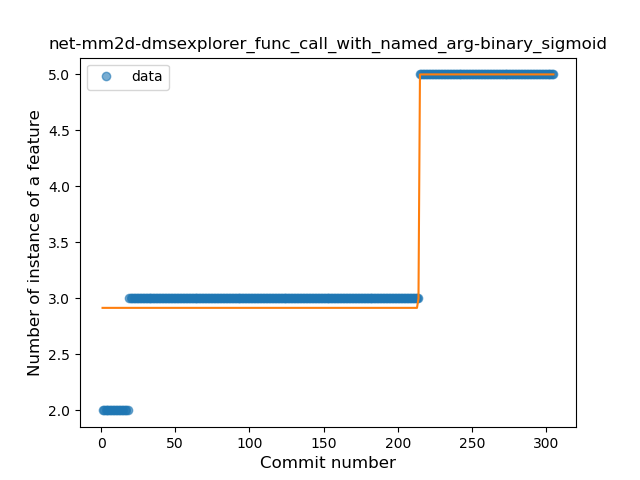

## net-mm2d-dmsexplorer
----
#### Metrics provided by Detekt
* Number of lines of code 17938
* Number of Kotlin files: 182
* Cyclomatic complexity: 2201
* Cyclomatic complexity by thousands of lines: 252 

----
**16** features analyzed

*	<a href="#type_inference">Type Inference</a> 
*	<a href="#lambda">Lambda</a> 
*	<a href="#safe_call">Safe Call</a> 
*	<a href="#when_expr">When expression</a> 
*	<a href="#unsafe_call">Unsafe Call</a> 
*	<a href="#companion_object">Companion Object</a> 
*	<a href="#string_template">String Template</a> 
*	<a href="#func_with_default_value">Function with Default Value</a> 
*	<a href="#singleton">Singleton</a> 
*	<a href="#range_expr">Range Expression</a> 
*	<a href="#smart_cast">Smart Cast</a> 
*	<a href="#func_call_with_named_arg">Function call with Named Argument</a> 
*	<a href="#extension_function">Extension Function</a> 
*	<a href="#property_delegation">Property Delegation</a> 
*	<a href="#destructuring_declaration">Destructuring Declaration</a> 
*	<a href="#overloaded_op">Overloaded Operator</a> 

### <a name="type_inference">Type Inference</a>
----
#### Functions
* **Sudden Rise - Exponential:** 
    * **R_Squared:** 0.90064363
* **Constant Rise - Linear:** 
    * **R_Squared:** 0.81981706
* **Sudden Rise Plateau - Logarithm:** 
    * **R_Squared:** 0.27438412
* **Plateau Sudden Rise - Binary Sigmoid:** 
    * **R_Squared:** 0.25975269

**Plots** :chart_with_upwards_trend:
-----

### <a name="lambda">Lambda</a>
----
#### Functions
* **Sudden Rise - Exponential:** 
    * **R_Squared:** 0.9291755
* **Constant Rise - Linear:** 
    * **R_Squared:** 0.818448
* **Plateau Sudden Rise - Binary Sigmoid:** 
    * **R_Squared:** 0.35730585
* **Sudden Rise Plateau - Logarithm:** 
    * **R_Squared:** 0.23435908

**Plots** :chart_with_upwards_trend:
-----

### <a name="safe_call">Safe Call</a>
----
#### Functions
* **Sudden Rise - Exponential:** 
    * **R_Squared:** 0.92065593
* **Constant Rise - Linear:** 
    * **R_Squared:** 0.75733978
* **Sudden Rise Plateau - Logarithm:** 
    * **R_Squared:** 0.19161189
* **Plateau Sudden Rise - Binary Sigmoid:** 
    * **R_Squared:** 0.08379731

**Plots** :chart_with_upwards_trend:
-----

### <a name="when_expr">When expression</a>
----
#### Functions
* **Plateau Gradual Rise - Sigmoid:** 
    * **R_Squared:** 0.98951958
* **Sudden Rise - Exponential:** 
    * **R_Squared:** 0.90583819
* **Constant Rise - Linear:** 
    * **R_Squared:** 0.79260483
* **Sudden Rise Plateau - Logarithm:** 
    * **R_Squared:** 0.23072532

**Plots** :chart_with_upwards_trend:
-----

### <a name="unsafe_call">Unsafe Call</a>
----
#### Functions
* **Constant Rise - Linear:** 
    * **R_Squared:** 0.57871887
* **Sudden Rise Plateau - Logarithm:** 
    * **R_Squared:** 0.19854075

**Plots** :chart_with_upwards_trend:
-----

### <a name="companion_object">Companion Object</a>
----
#### Functions
* **Sudden Rise - Exponential:** 
    * **R_Squared:** 0.88039218
* **Constant Rise - Linear:** 
    * **R_Squared:** 0.79064694
* **Sudden Rise Plateau - Logarithm:** 
    * **R_Squared:** 0.223142
* **Plateau Sudden Rise - Binary Sigmoid:** 
    * **R_Squared:** 0.06007828

**Plots** :chart_with_upwards_trend:
-----

### <a name="string_template">String Template</a>
----
#### Functions
* **Plateau Gradual Rise - Sigmoid:** 
    * **R_Squared:** 0.95517105
* **Constant Rise - Linear:** 
    * **R_Squared:** 0.86347919
* **Sudden Rise Plateau - Logarithm:** 
    * **R_Squared:** 0.70127651

**Plots** :chart_with_upwards_trend:
-----

### <a name="func_with_default_value">Function with Default Value</a>
----
#### Functions
* **Sudden Rise - Exponential:** 
    * **R_Squared:** 0.91814422
* **Constant Rise - Linear:** 
    * **R_Squared:** 0.86866759
* **Sudden Rise Plateau - Logarithm:** 
    * **R_Squared:** 0.31877281

**Plots** :chart_with_upwards_trend:
-----

### <a name="singleton">Singleton</a>
----
#### Functions
* **Constant Rise - Linear:** 
    * **R_Squared:** 0.92999479
* **Sudden Rise - Exponential:** 
    * **R_Squared:** 0.93882109
* **Sudden Rise Plateau - Logarithm:** 
    * **R_Squared:** 0.40630869
* **Plateau Sudden Rise - Binary Sigmoid:** 
    * **R_Squared:** 0.12674052

**Plots** :chart_with_upwards_trend:
-----

### <a name="range_expr">Range Expression</a>
----
#### Functions
* **Sudden Rise - Exponential:** 
    * **R_Squared:** 0.85325397
* **Constant Rise - Linear:** 
    * **R_Squared:** 0.80651672
* **Sudden Rise Plateau - Logarithm:** 
    * **R_Squared:** 0.2470036

**Plots** :chart_with_upwards_trend:
-----

### <a name="smart_cast">Smart Cast</a>
----
#### Functions
* **Plateau Gradual Rise - Sigmoid:** 
    * **R_Squared:** 0.95945971
* **Constant Rise - Linear:** 
    * **R_Squared:** 0.9311543
* **Sudden Rise Plateau - Logarithm:** 
    * **R_Squared:** 0.55387005

**Plots** :chart_with_upwards_trend:
-----

### <a name="func_call_with_named_arg">Function call with Named Argument</a>
----
#### Functions
* **Plateau Sudden Rise - Binary Sigmoid:** 
    * **R_Squared:** 0.94391438
* **Sudden Rise - Exponential:** 
    * **R_Squared:** 0.7723892
* **Constant Rise - Linear:** 
    * **R_Squared:** 0.70033085
* **Sudden Rise Plateau - Logarithm:** 
    * **R_Squared:** 0.4730422

**Plots** :chart_with_upwards_trend:
-----

### <a name="extension_function">Extension Function</a>
----
#### Functions
* **Plateau Gradual Rise - Sigmoid:** 
    * **R_Squared:** 0.92969592
* **Sudden Rise - Exponential:** 
    * **R_Squared:** 0.86420066
* **Constant Rise - Linear:** 
    * **R_Squared:** 0.82103426
* **Sudden Rise Plateau - Logarithm:** 
    * **R_Squared:** 0.27746118

**Plots** :chart_with_upwards_trend:
-----

### <a name="property_delegation">Property Delegation</a>
----
#### Functions
* **Sudden Rise - Exponential:** 
    * **R_Squared:** 0.8545268
* **Constant Rise - Linear:** 
    * **R_Squared:** 0.83958129
* **Sudden Rise Plateau - Logarithm:** 
    * **R_Squared:** 0.59895105

**Plots** :chart_with_upwards_trend:
-----

### <a name="destructuring_declaration">Destructuring Declaration</a>
----
#### Functions
* **Sudden Decline - Exponential:** 
    * **R_Squared:** 0.74081779
* **Constant Decline - Linear:** 
    * **R_Squared:** 0.60591182
* **Plateau Sudden Decline - Binary Sigmoid:** 
    * **R_Squared:** 0.09543245
* **Sudden Rise Plateau - Logarithm:** 
    * **R_Squared:** -0.0

**Plots** :chart_with_upwards_trend:
-----

### <a name="overloaded_op">Overloaded Operator</a>
----
#### Functions
* **Plateau Gradual Rise - Sigmoid:** 
    * **R_Squared:** 0.96737571
* **Sudden Rise - Exponential:** 
    * **R_Squared:** 0.86781209
* **Constant Rise - Linear:** 
    * **R_Squared:** 0.7485124
* **Sudden Rise Plateau - Logarithm:** 
    * **R_Squared:** 0.24222686

**Plots** :chart_with_upwards_trend:
-----

