## net-nonylene-photolinkviewer
----
#### Metrics provided by Detekt
* Number of lines of code 1522
* Number of Kotlin files: 17
* Cyclomatic complexity: 210
* Cyclomatic complexity by thousands of lines: 270 

----
**12** features analyzed

*	<a href="#type_inference">Type Inference</a> 
*	<a href="#lambda">Lambda</a> 
*	<a href="#safe_call">Safe Call</a> 
*	<a href="#when_expr">When expression</a> 
*	<a href="#unsafe_call">Unsafe Call</a> 
*	<a href="#companion_object">Companion Object</a> 
*	<a href="#string_template">String Template</a> 
*	<a href="#func_with_default_value">Function with Default Value</a> 
*	<a href="#singleton">Singleton</a> 
*	<a href="#range_expr">Range Expression</a> 
*	<a href="#extension_function">Extension Function</a> 
*	<a href="#property_delegation">Property Delegation</a> 

### <a name="type_inference">Type Inference</a>
----
#### Functions
* **Plateau Sudden Decline - Binary Sigmoid:** 
    * **R_Squared:** 0.21656488
* **Sudden Rise Plateau - Logarithm:** 
    * **R_Squared:** 0.13151636
* **Constant Rise - Linear:** 
    * **R_Squared:** 0.00328102

**Plots** :chart_with_upwards_trend:
-----

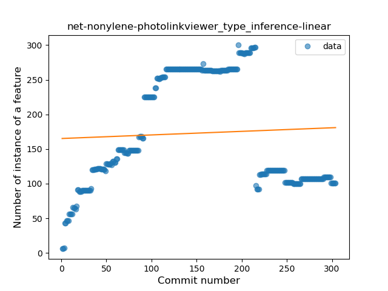
### <a name="lambda">Lambda</a>
----
#### Functions
* **Plateau Sudden Rise - Binary Sigmoid:** 
    * **R_Squared:** 0.32689238
* **Sudden Rise Plateau - Logarithm:** 
    * **R_Squared:** 0.21136305
* **Constant Rise - Linear:** 
    * **R_Squared:** 0.04570653

**Plots** :chart_with_upwards_trend:
-----

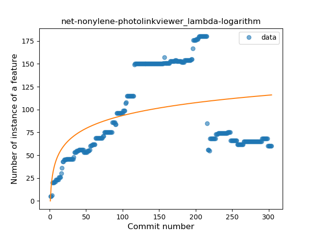
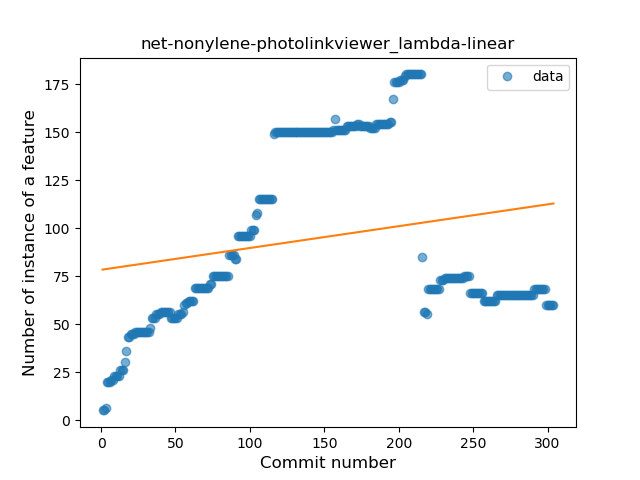
### <a name="safe_call">Safe Call</a>
----
#### Functions
* **Plateau Sudden Rise - Binary Sigmoid:** 
    * **R_Squared:** 0.06894885
* **Sudden Rise Plateau - Logarithm:** 
    * **R_Squared:** 0.04981825
* **Constant Decline - Linear:** 
    * **R_Squared:** 0.01153728

**Plots** :chart_with_upwards_trend:
-----

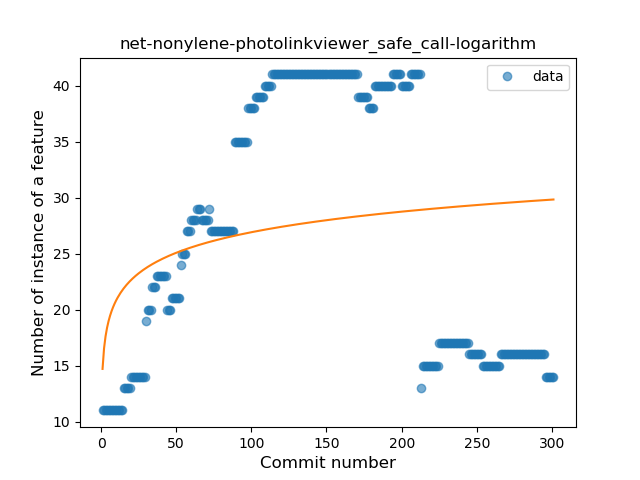
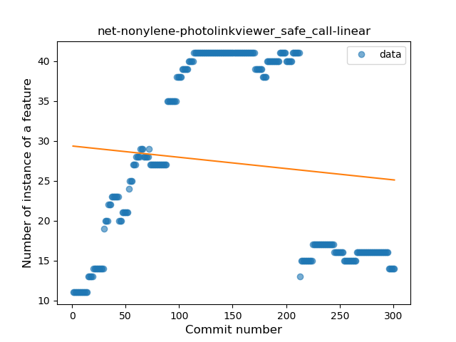
### <a name="when_expr">When expression</a>
----
#### Functions
* **Constant Decline - Linear:** 
    * **R_Squared:** 0.19957339
* **Sudden Rise Plateau - Logarithm:** 
    * **R_Squared:** -0.0

**Plots** :chart_with_upwards_trend:
-----

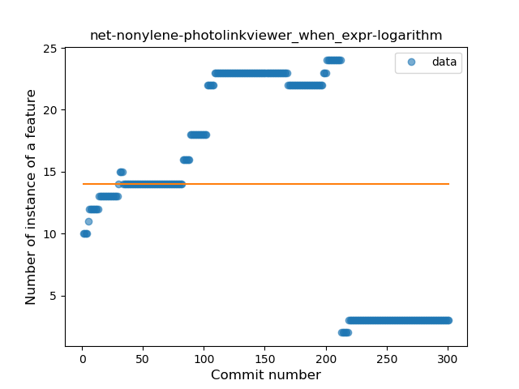
### <a name="unsafe_call">Unsafe Call</a>
----
#### Functions
* **Constant Decline - Linear:** 
    * **R_Squared:** 0.03197015
* **Sudden Rise Plateau - Logarithm:** 
    * **R_Squared:** 0.03836522
* **Plateau Sudden Rise - Binary Sigmoid:** 
    * **R_Squared:** 0.02411012
* **Sudden Decline - Exponential:** 
    * **R_Squared:** 0.0

**Plots** :chart_with_upwards_trend:
-----

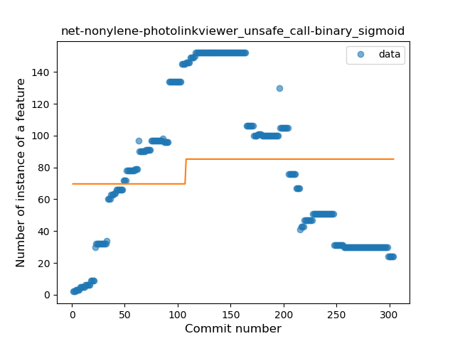
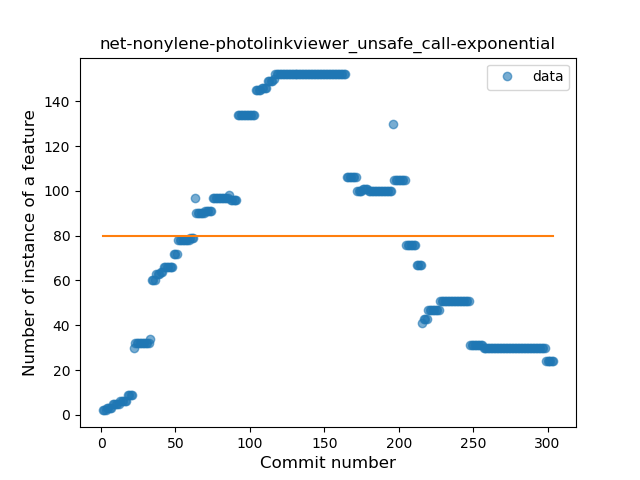
### <a name="companion_object">Companion Object</a>
----
#### Functions
* **Constant Rise - Linear:** 
    * **R_Squared:** 0.00016528
* **Sudden Rise - Exponential:** 
    * **R_Squared:** 0.0001631
* **Sudden Rise Plateau - Logarithm:** 
    * **R_Squared:** 0.00080533

**Plots** :chart_with_upwards_trend:
-----

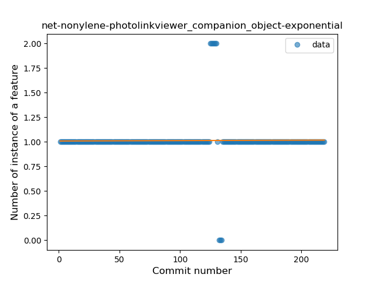
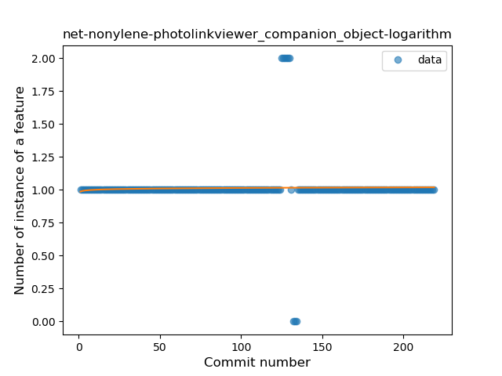
### <a name="string_template">String Template</a>
----
#### Functions
* **Constant Decline - Linear:** 
    * **R_Squared:** 0.30578846
* **Plateau Sudden Decline - Binary Sigmoid:** 
    * **R_Squared:** 0.02823413
* **Sudden Rise Plateau - Logarithm:** 
    * **R_Squared:** -0.0

**Plots** :chart_with_upwards_trend:
-----

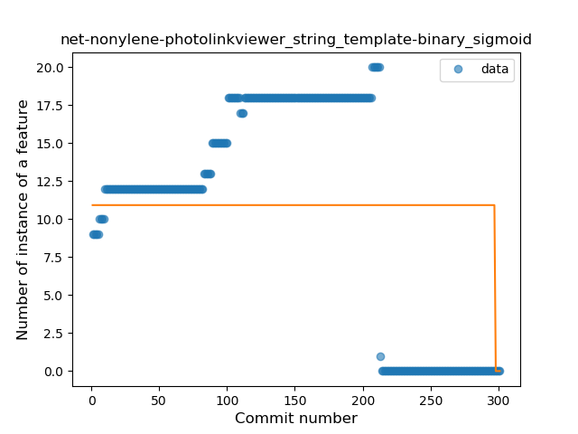
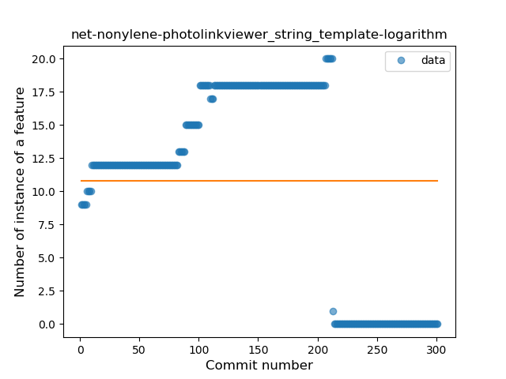
### <a name="func_with_default_value">Function with Default Value</a>
----
#### Functions
* **Sudden Decline - Exponential:** 
    * **R_Squared:** 0.19322671
* **Constant Decline - Linear:** 
    * **R_Squared:** 0.10265303
* **Sudden Rise Plateau - Logarithm:** 
    * **R_Squared:** -0.0

**Plots** :chart_with_upwards_trend:
-----

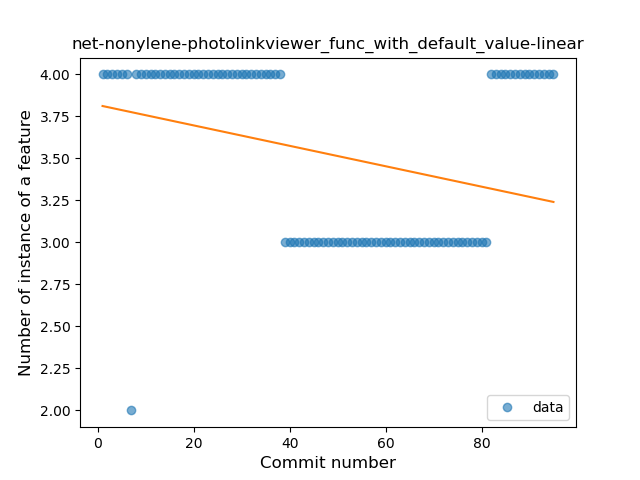
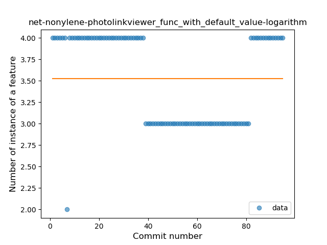
### <a name="singleton">Singleton</a>
----
#### Functions
* **Plateau Sudden Rise - Binary Sigmoid:** 
    * **R_Squared:** 0.15189799
* **Constant Decline - Linear:** 
    * **R_Squared:** 0.06718558
* **Sudden Rise Plateau - Logarithm:** 
    * **R_Squared:** 0.00880946

**Plots** :chart_with_upwards_trend:
-----

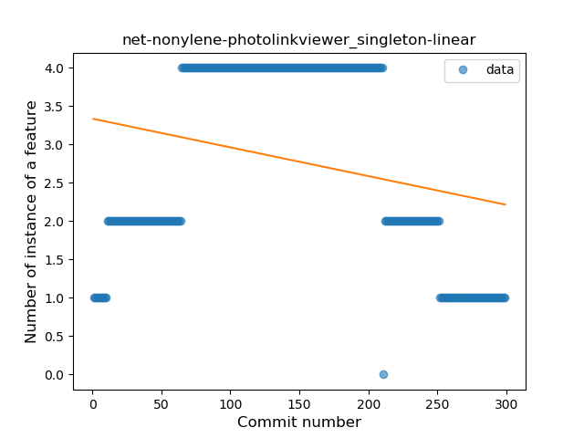
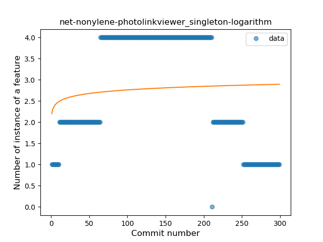
### <a name="range_expr">Range Expression</a>
----
#### Functions
* **Plateau Gradual Rise - Sigmoid:** 
    * **R_Squared:** 0.23655903
* **Sudden Rise Plateau - Logarithm:** 
    * **R_Squared:** 0.08691619
* **Constant Decline - Linear:** 
    * **R_Squared:** 0.00013641
* **Sudden Decline - Exponential:** 
    * **R_Squared:** 7.607e-05

**Plots** :chart_with_upwards_trend:
-----

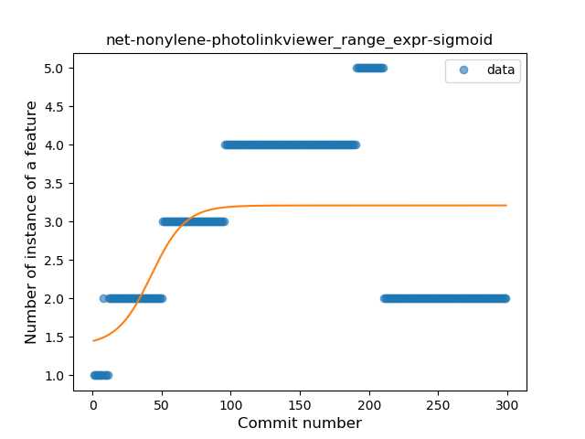
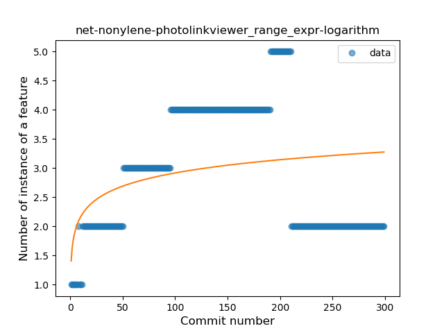
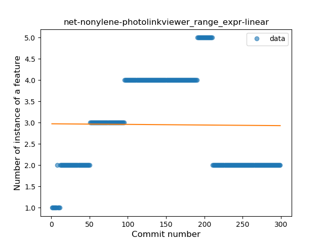
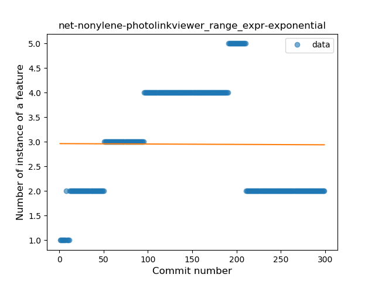
### <a name="extension_function">Extension Function</a>
----
#### Functions
* **Plateau Sudden Rise - Binary Sigmoid:** 
    * **R_Squared:** 0.26429771
* **Sudden Rise Plateau - Logarithm:** 
    * **R_Squared:** 0.17131806
* **Constant Rise - Linear:** 
    * **R_Squared:** 0.13086529

**Plots** :chart_with_upwards_trend:
-----

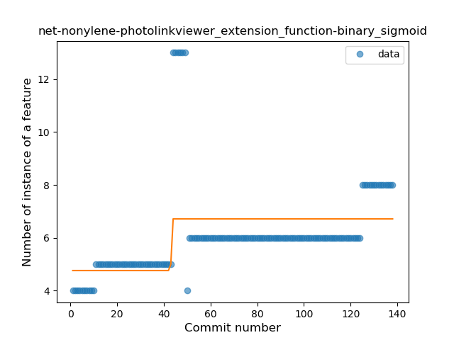
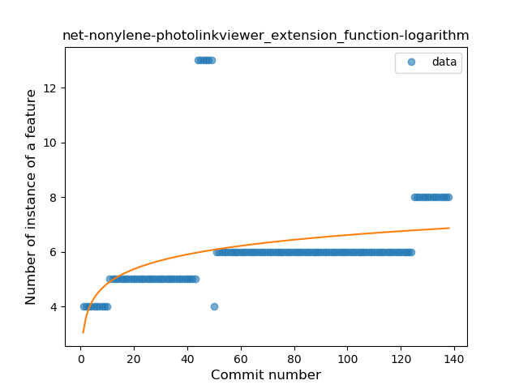
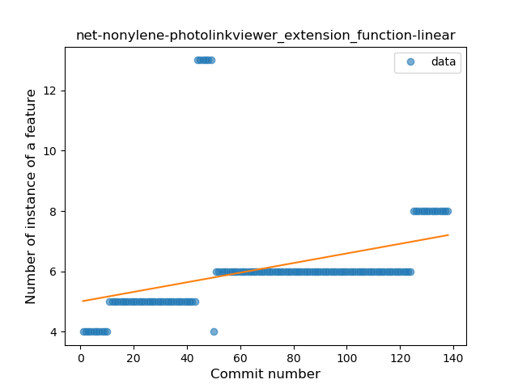
### <a name="property_delegation">Property Delegation</a>
----
#### Functions
* **Constant Rise - Linear:** 
    * **R_Squared:** 0.68701069
* **Sudden Rise - Exponential:** 
    * **R_Squared:** 0.68919016
* **Sudden Rise Plateau - Logarithm:** 
    * **R_Squared:** 0.22367761

**Plots** :chart_with_upwards_trend:
-----

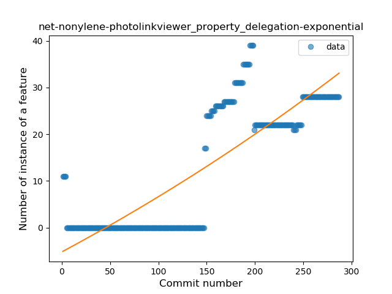
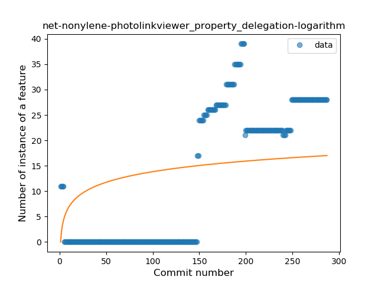
