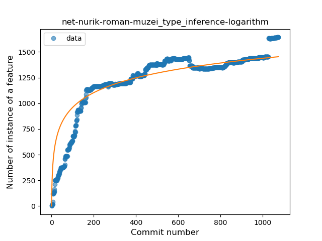
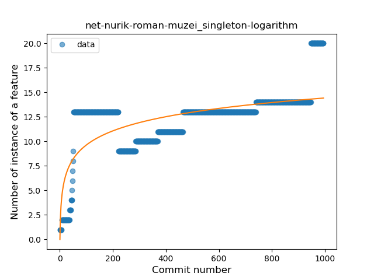

## net-nurik-roman-muzei
----
#### Metrics provided by Detekt
* Number of lines of code 23486
* Number of Kotlin files: 158
* Cyclomatic complexity: 2891
* Cyclomatic complexity by thousands of lines: 245 

----
**18** features analyzed

*	<a href="#type_inference">Type Inference</a> 
*	<a href="#lambda">Lambda</a> 
*	<a href="#safe_call">Safe Call</a> 
*	<a href="#when_expr">When expression</a> 
*	<a href="#unsafe_call">Unsafe Call</a> 
*	<a href="#companion_object">Companion Object</a> 
*	<a href="#string_template">String Template</a> 
*	<a href="#func_with_default_value">Function with Default Value</a> 
*	<a href="#singleton">Singleton</a> 
*	<a href="#range_expr">Range Expression</a> 
*	<a href="#smart_cast">Smart Cast</a> 
*	<a href="#data_class">Data Class</a> 
*	<a href="#func_call_with_named_arg">Function call with Named Argument</a> 
*	<a href="#extension_function">Extension Function</a> 
*	<a href="#property_delegation">Property Delegation</a> 
*	<a href="#destructuring_declaration">Destructuring Declaration</a> 
*	<a href="#coroutine">Coroutine</a> 
*	<a href="#sealed_class">Sealed Class</a> 

### <a name="type_inference">Type Inference</a>
----
#### Functions
* **Sudden Rise Plateau - Logarithm:** 
    * **R_Squared:** 0.81139657
* **Plateau Sudden Rise - Binary Sigmoid:** 
    * **R_Squared:** 0.65758142
* **Constant Rise - Linear:** 
    * **R_Squared:** 0.62497301

**Plots** :chart_with_upwards_trend:
-----

### <a name="lambda">Lambda</a>
----
#### Functions
* **Constant Rise - Linear:** 
    * **R_Squared:** 0.78924931
* **Sudden Rise Plateau - Logarithm:** 
    * **R_Squared:** 0.75275027
* **Plateau Sudden Rise - Binary Sigmoid:** 
    * **R_Squared:** 0.66865709

**Plots** :chart_with_upwards_trend:
-----

### <a name="safe_call">Safe Call</a>
----
#### Functions
* **Sudden Rise Plateau - Logarithm:** 
    * **R_Squared:** 0.80268703
* **Plateau Sudden Rise - Binary Sigmoid:** 
    * **R_Squared:** 0.56982509
* **Constant Rise - Linear:** 
    * **R_Squared:** 0.521283

**Plots** :chart_with_upwards_trend:
-----

### <a name="when_expr">When expression</a>
----
#### Functions
* **Sudden Rise Plateau - Logarithm:** 
    * **R_Squared:** 0.76469411
* **Constant Rise - Linear:** 
    * **R_Squared:** 0.74400693
* **Plateau Sudden Rise - Binary Sigmoid:** 
    * **R_Squared:** 0.22826785

**Plots** :chart_with_upwards_trend:
-----

### <a name="unsafe_call">Unsafe Call</a>
----
#### Functions
* **Sudden Rise - Exponential:** 
    * **R_Squared:** 0.44069591
* **Constant Rise - Linear:** 
    * **R_Squared:** 0.09864454
* **Sudden Rise Plateau - Logarithm:** 
    * **R_Squared:** 0.00257243
* **Plateau Sudden Rise - Binary Sigmoid:** 
    * **R_Squared:** 0.00112571

**Plots** :chart_with_upwards_trend:
-----

### <a name="companion_object">Companion Object</a>
----
#### Functions
* **Sudden Rise Plateau - Logarithm:** 
    * **R_Squared:** 0.85236536
* **Constant Rise - Linear:** 
    * **R_Squared:** 0.65079323
* **Plateau Sudden Rise - Binary Sigmoid:** 
    * **R_Squared:** 0.50169978

**Plots** :chart_with_upwards_trend:
-----

### <a name="string_template">String Template</a>
----
#### Functions
* **Constant Rise - Linear:** 
    * **R_Squared:** 0.74283262
* **Plateau Sudden Rise - Binary Sigmoid:** 
    * **R_Squared:** 0.72977379
* **Sudden Rise Plateau - Logarithm:** 
    * **R_Squared:** 0.7187528

**Plots** :chart_with_upwards_trend:
-----

### <a name="func_with_default_value">Function with Default Value</a>
----
#### Functions
* **Sudden Rise Plateau - Logarithm:** 
    * **R_Squared:** 0.7844112
* **Constant Rise - Linear:** 
    * **R_Squared:** 0.68368997
* **Plateau Sudden Rise - Binary Sigmoid:** 
    * **R_Squared:** 0.26965664

**Plots** :chart_with_upwards_trend:
-----

### <a name="singleton">Singleton</a>
----
#### Functions
* **Sudden Rise Plateau - Logarithm:** 
    * **R_Squared:** 0.49937488
* **Constant Rise - Linear:** 
    * **R_Squared:** 0.4472367
* **Sudden Rise - Exponential:** 
    * **R_Squared:** 0.45557637

**Plots** :chart_with_upwards_trend:
-----

### <a name="range_expr">Range Expression</a>
----
#### Functions
* **Sudden Rise Plateau - Logarithm:** 
    * **R_Squared:** 0.42186017
* **Plateau Sudden Rise - Binary Sigmoid:** 
    * **R_Squared:** 0.34075893
* **Constant Rise - Linear:** 
    * **R_Squared:** 0.09696826

**Plots** :chart_with_upwards_trend:
-----

### <a name="smart_cast">Smart Cast</a>
----
#### Functions
* **Constant Rise - Linear:** 
    * **R_Squared:** 0.79921476
* **Sudden Rise Plateau - Logarithm:** 
    * **R_Squared:** 0.52390843
* **Plateau Gradual Rise - Sigmoid:** 
    * **R_Squared:** 0.23225508

**Plots** :chart_with_upwards_trend:
-----

### <a name="data_class">Data Class</a>
----
#### Functions
* **Constant Rise - Linear:** 
    * **R_Squared:** 0.73421822
* **Sudden Rise Plateau - Logarithm:** 
    * **R_Squared:** 0.71272943

**Plots** :chart_with_upwards_trend:
-----

### <a name="func_call_with_named_arg">Function call with Named Argument</a>
----
#### Functions
* **Constant Rise - Linear:** 
    * **R_Squared:** 0.76385478
* **Sudden Rise Plateau - Logarithm:** 
    * **R_Squared:** 0.49048207

**Plots** :chart_with_upwards_trend:
-----

### <a name="extension_function">Extension Function</a>
----
#### Functions
* **Constant Rise - Linear:** 
    * **R_Squared:** 0.78477901
* **Sudden Rise Plateau - Logarithm:** 
    * **R_Squared:** 0.73166762
* **Plateau Sudden Rise - Binary Sigmoid:** 
    * **R_Squared:** 0.30975705

**Plots** :chart_with_upwards_trend:
-----

### <a name="property_delegation">Property Delegation</a>
----
#### Functions
* **Sudden Rise Plateau - Logarithm:** 
    * **R_Squared:** 0.83842193
* **Constant Rise - Linear:** 
    * **R_Squared:** 0.76170968
* **Plateau Sudden Rise - Binary Sigmoid:** 
    * **R_Squared:** 0.39656175

**Plots** :chart_with_upwards_trend:
-----

### <a name="destructuring_declaration">Destructuring Declaration</a>
----
#### Functions
* **Sudden Rise Plateau - Logarithm:** 
    * **R_Squared:** 0.51857827
* **Constant Rise - Linear:** 
    * **R_Squared:** 0.48984233

**Plots** :chart_with_upwards_trend:
-----

### <a name="coroutine">Coroutine</a>
----
#### Functions
* **Plateau Gradual Rise - Sigmoid:** 
    * **R_Squared:** 0.80026058
* **Sudden Rise Plateau - Logarithm:** 
    * **R_Squared:** 0.53486372
* **Constant Rise - Linear:** 
    * **R_Squared:** 0.16242924

**Plots** :chart_with_upwards_trend:
-----

### <a name="sealed_class">Sealed Class</a>
----
#### Functions
* **Plateau Sudden Rise - Binary Sigmoid:** 
    * **R_Squared:** 0.88738772
* **Constant Rise - Linear:** 
    * **R_Squared:** 0.66481374
* **Sudden Rise Plateau - Logarithm:** 
    * **R_Squared:** 0.47245479

**Plots** :chart_with_upwards_trend:
-----

