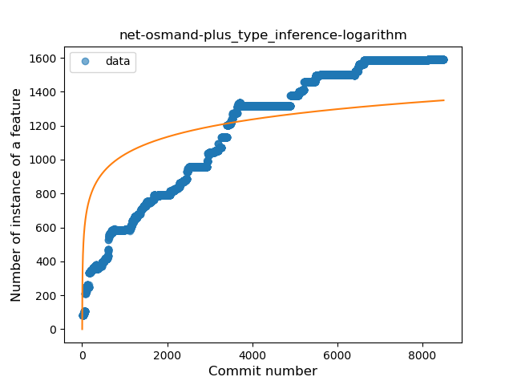
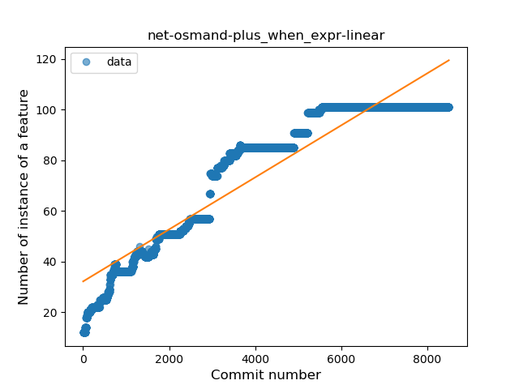
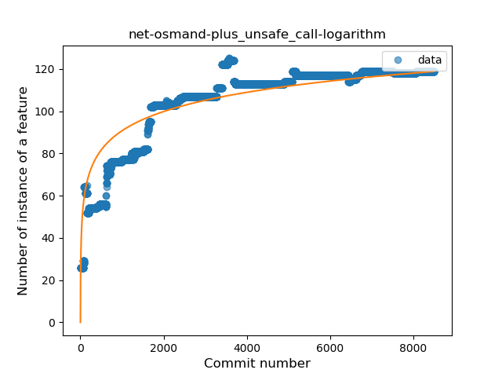
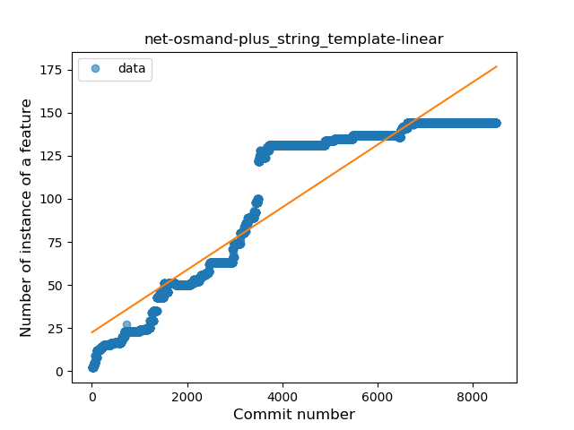
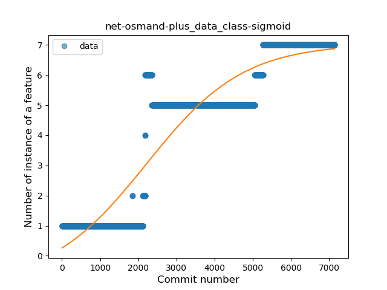

## net-osmand-plus
----
#### Metrics provided by Detekt
* Number of lines of code 15638
* Number of Kotlin files: 50
* Cyclomatic complexity: 3272
* Cyclomatic complexity by thousands of lines: 339 

----
**14** features analyzed

*	<a href="#type_inference">Type Inference</a> 
*	<a href="#lambda">Lambda</a> 
*	<a href="#safe_call">Safe Call</a> 
*	<a href="#when_expr">When expression</a> 
*	<a href="#unsafe_call">Unsafe Call</a> 
*	<a href="#companion_object">Companion Object</a> 
*	<a href="#string_template">String Template</a> 
*	<a href="#func_with_default_value">Function with Default Value</a> 
*	<a href="#singleton">Singleton</a> 
*	<a href="#range_expr">Range Expression</a> 
*	<a href="#smart_cast">Smart Cast</a> 
*	<a href="#data_class">Data Class</a> 
*	<a href="#func_call_with_named_arg">Function call with Named Argument</a> 
*	<a href="#destructuring_declaration">Destructuring Declaration</a> 

### <a name="type_inference">Type Inference</a>
----
#### Functions
* **Constant Rise - Linear:** 
    * **R_Squared:** 0.91078269
* **Sudden Rise - Exponential:** 
    * **R_Squared:** 0.90593263
* **Sudden Rise Plateau - Logarithm:** 
    * **R_Squared:** 0.55107024
* **Plateau Sudden Rise - Binary Sigmoid:** 
    * **R_Squared:** 0.03560726

**Plots** :chart_with_upwards_trend:
-----

### <a name="lambda">Lambda</a>
----
#### Functions
* **Constant Rise - Linear:** 
    * **R_Squared:** 0.91572051
* **Sudden Rise - Exponential:** 
    * **R_Squared:** 0.91100201
* **Sudden Rise Plateau - Logarithm:** 
    * **R_Squared:** 0.48462914
* **Plateau Sudden Rise - Binary Sigmoid:** 
    * **R_Squared:** 0.12858576

**Plots** :chart_with_upwards_trend:
-----

### <a name="safe_call">Safe Call</a>
----
#### Functions
* **Constant Rise - Linear:** 
    * **R_Squared:** 0.89036593
* **Sudden Rise - Exponential:** 
    * **R_Squared:** 0.88562921
* **Sudden Rise Plateau - Logarithm:** 
    * **R_Squared:** 0.56733524
* **Plateau Sudden Rise - Binary Sigmoid:** 
    * **R_Squared:** 0.17539464

**Plots** :chart_with_upwards_trend:
-----

### <a name="when_expr">When expression</a>
----
#### Functions
* **Constant Rise - Linear:** 
    * **R_Squared:** 0.88437651
* **Sudden Rise - Exponential:** 
    * **R_Squared:** 0.87991108
* **Sudden Rise Plateau - Logarithm:** 
    * **R_Squared:** 0.52969294
* **Plateau Sudden Rise - Binary Sigmoid:** 
    * **R_Squared:** 0.10820012

**Plots** :chart_with_upwards_trend:
-----

### <a name="unsafe_call">Unsafe Call</a>
----
#### Functions
* **Sudden Rise Plateau - Logarithm:** 
    * **R_Squared:** 0.81568783
* **Constant Rise - Linear:** 
    * **R_Squared:** 0.63442375
* **Sudden Rise - Exponential:** 
    * **R_Squared:** 0.62931544
* **Plateau Sudden Rise - Binary Sigmoid:** 
    * **R_Squared:** 0.12299952

**Plots** :chart_with_upwards_trend:
-----

### <a name="companion_object">Companion Object</a>
----
#### Functions
* **Constant Rise - Linear:** 
    * **R_Squared:** 0.8972811
* **Sudden Rise - Exponential:** 
    * **R_Squared:** 0.8938869
* **Plateau Sudden Rise - Binary Sigmoid:** 
    * **R_Squared:** 0.76899453
* **Sudden Rise Plateau - Logarithm:** 
    * **R_Squared:** 0.55840056

**Plots** :chart_with_upwards_trend:
-----

### <a name="string_template">String Template</a>
----
#### Functions
* **Constant Rise - Linear:** 
    * **R_Squared:** 0.85787296
* **Sudden Rise - Exponential:** 
    * **R_Squared:** 0.85348981
* **Sudden Rise Plateau - Logarithm:** 
    * **R_Squared:** 0.39737462
* **Plateau Sudden Rise - Binary Sigmoid:** 
    * **R_Squared:** 0.05762085

**Plots** :chart_with_upwards_trend:
-----

### <a name="func_with_default_value">Function with Default Value</a>
----
#### Functions
* **Constant Rise - Linear:** 
    * **R_Squared:** 0.74531626
* **Sudden Rise - Exponential:** 
    * **R_Squared:** 0.74097832
* **Sudden Rise Plateau - Logarithm:** 
    * **R_Squared:** 0.64626434
* **Plateau Sudden Rise - Binary Sigmoid:** 
    * **R_Squared:** 0.05599514

**Plots** :chart_with_upwards_trend:
-----

### <a name="singleton">Singleton</a>
----
#### Functions
* **Constant Rise - Linear:** 
    * **R_Squared:** 0.75594748
* **Sudden Rise Plateau - Logarithm:** 
    * **R_Squared:** 0.60071106

**Plots** :chart_with_upwards_trend:
-----

### <a name="range_expr">Range Expression</a>
----
#### Functions
* **Constant Rise - Linear:** 
    * **R_Squared:** 0.82018694
* **Sudden Rise Plateau - Logarithm:** 
    * **R_Squared:** 0.46982336

**Plots** :chart_with_upwards_trend:
-----

### <a name="smart_cast">Smart Cast</a>
----
#### Functions
* **Constant Rise - Linear:** 
    * **R_Squared:** 0.87534593
* **Sudden Rise - Exponential:** 
    * **R_Squared:** 0.87093939
* **Sudden Rise Plateau - Logarithm:** 
    * **R_Squared:** 0.40041781
* **Plateau Sudden Rise - Binary Sigmoid:** 
    * **R_Squared:** 0.02357291

**Plots** :chart_with_upwards_trend:
-----

### <a name="data_class">Data Class</a>
----
#### Functions
* **Plateau Gradual Rise - Sigmoid:** 
    * **R_Squared:** 0.86066232
* **Constant Rise - Linear:** 
    * **R_Squared:** 0.8297047
* **Sudden Rise Plateau - Logarithm:** 
    * **R_Squared:** 0.33372955

**Plots** :chart_with_upwards_trend:
-----

### <a name="func_call_with_named_arg">Function call with Named Argument</a>
----
#### Functions
* **Sudden Rise - Exponential:** 
    * **R_Squared:** 0.87669229
* **Plateau Gradual Rise - Sigmoid:** 
    * **R_Squared:** 0.8792483
* **Constant Rise - Linear:** 
    * **R_Squared:** 0.82581893
* **Sudden Rise Plateau - Logarithm:** 
    * **R_Squared:** 0.26266338

**Plots** :chart_with_upwards_trend:
-----

### <a name="destructuring_declaration">Destructuring Declaration</a>
----
#### Functions
* **Constant Rise - Linear:** 
    * **R_Squared:** 0.58743138
* **Sudden Rise - Exponential:** 
    * **R_Squared:** 0.58302573
* **Sudden Rise Plateau - Logarithm:** 
    * **R_Squared:** 0.52101098
* **Plateau Sudden Rise - Binary Sigmoid:** 
    * **R_Squared:** 0.00764358

**Plots** :chart_with_upwards_trend:
-----

