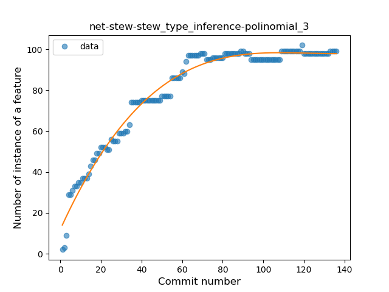
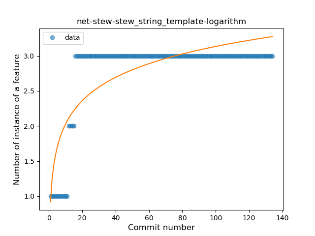
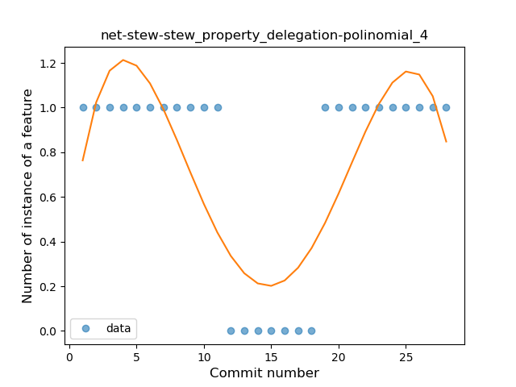
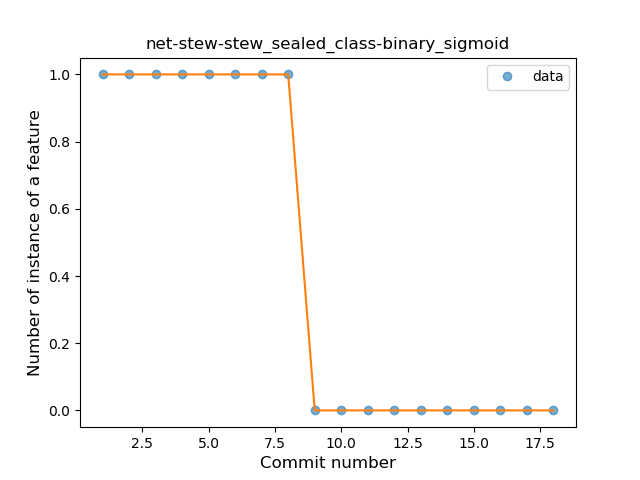

## net-stew-stew
----
#### Metrics provided by Detekt
* Number of lines of code 988
* Number of Kotlin files: 13
* Cyclomatic complexity: 170
* Cyclomatic complexity by thousands of lines: 303 

----
**14** features analyzed

*	<a href="#type_inference">Type Inference</a> 
*	<a href="#lambda">Lambda</a> 
*	<a href="#safe_call">Safe Call</a> 
*	<a href="#when_expr">When expression</a> 
*	<a href="#unsafe_call">Unsafe Call</a> 
*	<a href="#companion_object">Companion Object</a> 
*	<a href="#string_template">String Template</a> 
*	<a href="#func_with_default_value">Function with Default Value</a> 
*	<a href="#singleton">Singleton</a> 
*	<a href="#smart_cast">Smart Cast</a> 
*	<a href="#data_class">Data Class</a> 
*	<a href="#func_call_with_named_arg">Function call with Named Argument</a> 
*	<a href="#property_delegation">Property Delegation</a> 
*	<a href="#sealed_class">Sealed Class</a> 

### <a name="type_inference">Type Inference</a>
----
#### Functions
* **Instability - Polinomial 3:** )
    * **R_Squared:** 0.97627886
* **Sudden Rise Plateau - Logarithm:** 
    * **R_Squared:** 0.91335991
* **Constant Rise - Linear:** 
    * **R_Squared:** 0.75861739
* **Plateau Gradual Rise - Sigmoid:** 
    * **R_Squared:** 0.46952732

**Plots** :chart_with_upwards_trend:
-----

### <a name="lambda">Lambda</a>
----
#### Functions
* **Sudden Rise Plateau - Logarithm:** 
    * **R_Squared:** 0.91798956
* **Constant Rise - Linear:** 
    * **R_Squared:** 0.75527707
* **Plateau Gradual Rise - Sigmoid:** 
    * **R_Squared:** 0.55093295

**Plots** :chart_with_upwards_trend:
-----

### <a name="safe_call">Safe Call</a>
----
#### Functions
* **Sudden Rise - Exponential:** 
    * **R_Squared:** 0.68184499
* **Constant Rise - Linear:** 
    * **R_Squared:** 0.26447214
* **Sudden Rise Plateau - Logarithm:** 
    * **R_Squared:** 0.22119109

**Plots** :chart_with_upwards_trend:
-----

### <a name="when_expr">When expression</a>
----
#### Functions
* **Plateau Gradual Rise - Sigmoid:** 
    * **R_Squared:** 0.59432766
* **Sudden Rise - Exponential:** 
    * **R_Squared:** 0.38232879
* **Constant Rise - Linear:** 
    * **R_Squared:** 0.21571512
* **Sudden Rise Plateau - Logarithm:** 
    * **R_Squared:** 0.19756349

**Plots** :chart_with_upwards_trend:
-----

### <a name="unsafe_call">Unsafe Call</a>
----
#### Functions
* **Sudden Rise Plateau - Logarithm:** 
    * **R_Squared:** 0.35621674
* **Constant Rise - Linear:** 
    * **R_Squared:** 0.19376499
* **Plateau Gradual Rise - Sigmoid:** 
    * **R_Squared:** 0.17444183

**Plots** :chart_with_upwards_trend:
-----

### <a name="companion_object">Companion Object</a>
----
#### Functions
* **Plateau Gradual Rise - Sigmoid:** 
    * **R_Squared:** 0.91008578
* **Constant Rise - Linear:** 
    * **R_Squared:** 0.89672478
* **Sudden Rise Plateau - Logarithm:** 
    * **R_Squared:** 0.5872016

**Plots** :chart_with_upwards_trend:
-----

### <a name="string_template">String Template</a>
----
#### Functions
* **Plateau Gradual Rise - Sigmoid:** 
    * **R_Squared:** 0.98231627
* **Sudden Rise Plateau - Logarithm:** 
    * **R_Squared:** 0.6338136
* **Constant Rise - Linear:** 
    * **R_Squared:** 0.28583864

**Plots** :chart_with_upwards_trend:
-----

### <a name="func_with_default_value">Function with Default Value</a>
----
#### Functions
* **Plateau Sudden Rise - Binary Sigmoid:** 
    * **R_Squared:** 0.60856865
* **Sudden Rise - Exponential:** 
    * **R_Squared:** 0.48195064
* **Constant Rise - Linear:** 
    * **R_Squared:** 0.12867612
* **Sudden Rise Plateau - Logarithm:** 
    * **R_Squared:** 0.06917607

**Plots** :chart_with_upwards_trend:
-----

### <a name="singleton">Singleton</a>
----
#### Functions
* **Sudden Decline - Exponential:** 
    * **R_Squared:** 1.0
* **Constant Decline - Linear:** 
    * **R_Squared:** 0.02222222
* **Sudden Rise Plateau - Logarithm:** 
    * **R_Squared:** -0.0

**Plots** :chart_with_upwards_trend:
-----

### <a name="smart_cast">Smart Cast</a>
----
#### Functions
* **Instability - Polinomial 3:** )
    * **R_Squared:** 0.90315816
* **Instability - Polinomial 4:** 
    * **R_Squared:** 0.90905242
* **Constant Decline - Linear:** 
    * **R_Squared:** 0.7938398
* **Sudden Decline - Exponential:** 
    * **R_Squared:** 0.79788091
* **Sudden Rise Plateau - Logarithm:** 
    * **R_Squared:** 0.0

**Plots** :chart_with_upwards_trend:
-----

### <a name="data_class">Data Class</a>
----
#### Functions
* **Plateau Sudden Decline - Binary Sigmoid:** 
    * **R_Squared:** 0.88571429
* **Sudden Decline - Exponential:** 
    * **R_Squared:** 0.5844207
* **Constant Decline - Linear:** 
    * **R_Squared:** 0.46936392
* **Sudden Rise Plateau - Logarithm:** 
    * **R_Squared:** 0.0

**Plots** :chart_with_upwards_trend:
-----

### <a name="func_call_with_named_arg">Function call with Named Argument</a>
----
#### Functions
* **Sudden Rise - Exponential:** 
    * **R_Squared:** 0.6095425
* **Constant Rise - Linear:** 
    * **R_Squared:** 0.52707228
* **Sudden Rise Plateau - Logarithm:** 
    * **R_Squared:** 0.50414716

**Plots** :chart_with_upwards_trend:
-----

### <a name="property_delegation">Property Delegation</a>
----
#### Functions
* **Instability - Polinomial 4:** 
    * **R_Squared:** 0.64037329
* **Plateau Gradual Decline - Sigmoid:** 
    * **R_Squared:** 0.21568627
* **Sudden Decline - Exponential:** 
    * **R_Squared:** 0.0834827
* **Constant Decline - Linear:** 
    * **R_Squared:** 0.00127714
* **Sudden Rise Plateau - Logarithm:** 
    * **R_Squared:** -0.0

**Plots** :chart_with_upwards_trend:
-----

### <a name="sealed_class">Sealed Class</a>
----
#### Functions
* **Plateau Sudden Decline - Binary Sigmoid:** 
    * **R_Squared:** 1.0
* **Instability - Polinomial 4:** 
    * **R_Squared:** 0.87058824
* **Instability - Polinomial 3:** )
    * **R_Squared:** 0.85526316
* **Sudden Decline - Exponential:** 
    * **R_Squared:** 0.7534843
* **Constant Decline - Linear:** 
    * **R_Squared:** 0.74303406
* **Sudden Rise Plateau - Logarithm:** 
    * **R_Squared:** -0.0

**Plots** :chart_with_upwards_trend:
-----

