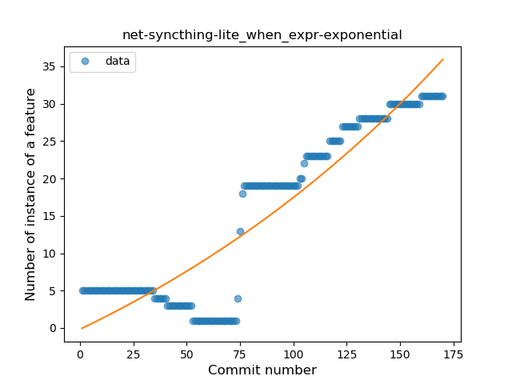
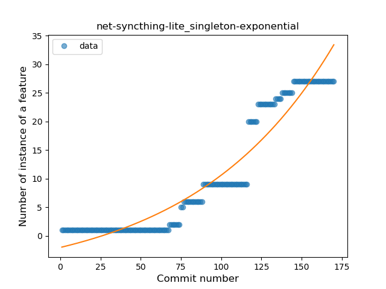
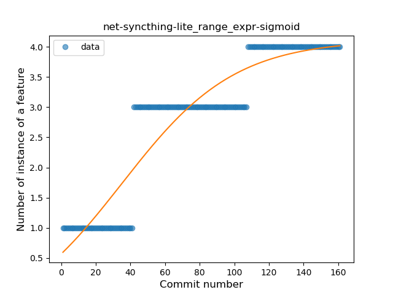
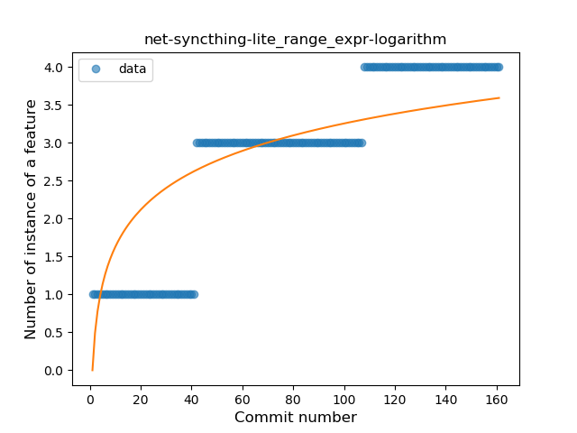
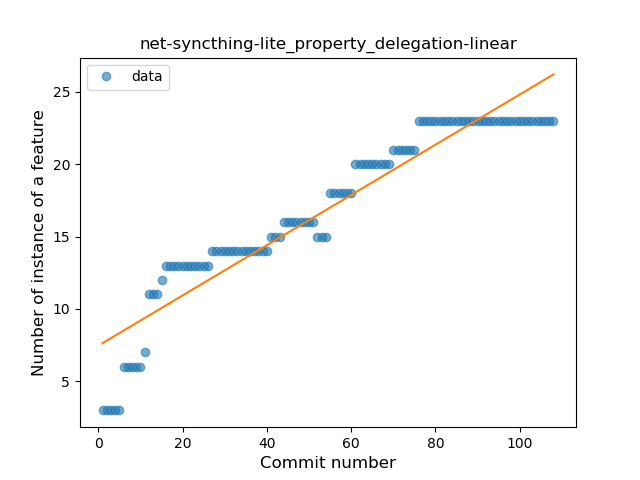
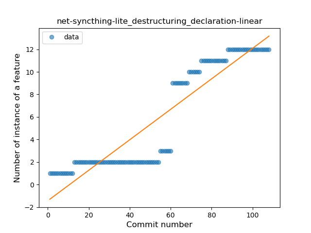
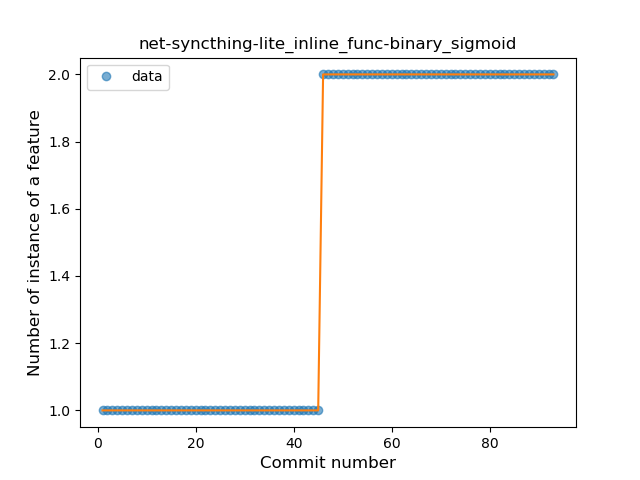
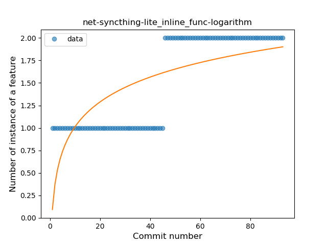

## net-syncthing-lite
----
#### Metrics provided by Detekt
* Number of lines of code 11329
* Number of Kotlin files: 132
* Cyclomatic complexity: 1434
* Cyclomatic complexity by thousands of lines: 249 

----
**19** features analyzed

*	<a href="#type_inference">Type Inference</a> 
*	<a href="#lambda">Lambda</a> 
*	<a href="#safe_call">Safe Call</a> 
*	<a href="#when_expr">When expression</a> 
*	<a href="#unsafe_call">Unsafe Call</a> 
*	<a href="#companion_object">Companion Object</a> 
*	<a href="#string_template">String Template</a> 
*	<a href="#func_with_default_value">Function with Default Value</a> 
*	<a href="#singleton">Singleton</a> 
*	<a href="#range_expr">Range Expression</a> 
*	<a href="#smart_cast">Smart Cast</a> 
*	<a href="#data_class">Data Class</a> 
*	<a href="#func_call_with_named_arg">Function call with Named Argument</a> 
*	<a href="#extension_function">Extension Function</a> 
*	<a href="#property_delegation">Property Delegation</a> 
*	<a href="#destructuring_declaration">Destructuring Declaration</a> 
*	<a href="#inline_func">Inline Function</a> 
*	<a href="#coroutine">Coroutine</a> 
*	<a href="#sealed_class">Sealed Class</a> 

### <a name="type_inference">Type Inference</a>
----
#### Functions
* **Instability - Polinomial 3:** )
    * **R_Squared:** 0.90969001
* **Constant Rise - Linear:** 
    * **R_Squared:** 0.84019386
* **Sudden Rise Plateau - Logarithm:** 
    * **R_Squared:** 0.4029238
* **Plateau Sudden Rise - Binary Sigmoid:** 
    * **R_Squared:** 0.15217089

**Plots** :chart_with_upwards_trend:
-----

### <a name="lambda">Lambda</a>
----
#### Functions
* **Instability - Polinomial 3:** )
    * **R_Squared:** 0.94949834
* **Constant Rise - Linear:** 
    * **R_Squared:** 0.91033719
* **Sudden Rise Plateau - Logarithm:** 
    * **R_Squared:** 0.41967466

**Plots** :chart_with_upwards_trend:
-----

### <a name="safe_call">Safe Call</a>
----
#### Functions
* **Sudden Rise Plateau - Logarithm:** 
    * **R_Squared:** 0.62750171
* **Constant Rise - Linear:** 
    * **R_Squared:** 0.48576369
* **Plateau Gradual Rise - Sigmoid:** 
    * **R_Squared:** 0.41859092

**Plots** :chart_with_upwards_trend:
-----

### <a name="when_expr">When expression</a>
----
#### Functions
* **Sudden Rise - Exponential:** 
    * **R_Squared:** 0.85002505
* **Constant Rise - Linear:** 
    * **R_Squared:** 0.83730829
* **Sudden Rise Plateau - Logarithm:** 
    * **R_Squared:** 0.36341268

**Plots** :chart_with_upwards_trend:
-----

### <a name="unsafe_call">Unsafe Call</a>
----
#### Functions
* **Instability - Polinomial 3:** )
    * **R_Squared:** 0.66680516
* **Constant Rise - Linear:** 
    * **R_Squared:** 0.46285738
* **Sudden Rise Plateau - Logarithm:** 
    * **R_Squared:** 0.2520159

**Plots** :chart_with_upwards_trend:
-----

### <a name="companion_object">Companion Object</a>
----
#### Functions
* **Instability - Polinomial 3:** )
    * **R_Squared:** 0.9270029
* **Constant Rise - Linear:** 
    * **R_Squared:** 0.85591283
* **Sudden Rise - Exponential:** 
    * **R_Squared:** 0.85667473
* **Plateau Gradual Rise - Sigmoid:** 
    * **R_Squared:** 0.80126285
* **Sudden Rise Plateau - Logarithm:** 
    * **R_Squared:** 0.38525766

**Plots** :chart_with_upwards_trend:
-----

### <a name="string_template">String Template</a>
----
#### Functions
* **Plateau Gradual Rise - Sigmoid:** 
    * **R_Squared:** 0.99479803
* **Instability - Polinomial 3:** )
    * **R_Squared:** 0.86568922
* **Constant Rise - Linear:** 
    * **R_Squared:** 0.754633
* **Sudden Rise Plateau - Logarithm:** 
    * **R_Squared:** 0.38928767

**Plots** :chart_with_upwards_trend:
-----

### <a name="func_with_default_value">Function with Default Value</a>
----
#### Functions
* **Instability - Polinomial 3:** )
    * **R_Squared:** 0.79178583
* **Plateau Sudden Rise - Binary Sigmoid:** 
    * **R_Squared:** 0.55984682
* **Sudden Rise Plateau - Logarithm:** 
    * **R_Squared:** 0.05107967
* **Constant Decline - Linear:** 
    * **R_Squared:** 0.0276704

**Plots** :chart_with_upwards_trend:
-----

### <a name="singleton">Singleton</a>
----
#### Functions
* **Sudden Rise - Exponential:** 
    * **R_Squared:** 0.92010794
* **Constant Rise - Linear:** 
    * **R_Squared:** 0.85137221
* **Sudden Rise Plateau - Logarithm:** 
    * **R_Squared:** 0.277105

**Plots** :chart_with_upwards_trend:
-----

### <a name="range_expr">Range Expression</a>
----
#### Functions
* **Plateau Gradual Rise - Sigmoid:** 
    * **R_Squared:** 0.87431373
* **Constant Rise - Linear:** 
    * **R_Squared:** 0.82274594
* **Sudden Rise Plateau - Logarithm:** 
    * **R_Squared:** 0.6616939

**Plots** :chart_with_upwards_trend:
-----

### <a name="smart_cast">Smart Cast</a>
----
#### Functions
* **Instability - Polinomial 3:** )
    * **R_Squared:** 0.94996447
* **Constant Rise - Linear:** 
    * **R_Squared:** 0.87898723
* **Sudden Rise Plateau - Logarithm:** 
    * **R_Squared:** 0.59726679

**Plots** :chart_with_upwards_trend:
-----

### <a name="data_class">Data Class</a>
----
#### Functions
* **Instability - Polinomial 3:** )
    * **R_Squared:** 0.93062088
* **Constant Rise - Linear:** 
    * **R_Squared:** 0.89254236
* **Sudden Rise Plateau - Logarithm:** 
    * **R_Squared:** 0.72833405
* **Plateau Sudden Rise - Binary Sigmoid:** 
    * **R_Squared:** 0.29236395

**Plots** :chart_with_upwards_trend:
-----

### <a name="func_call_with_named_arg">Function call with Named Argument</a>
----
#### Functions
* **Instability - Polinomial 3:** )
    * **R_Squared:** 0.96379122
* **Constant Rise - Linear:** 
    * **R_Squared:** 0.93048147
* **Sudden Rise - Exponential:** 
    * **R_Squared:** 0.93860957
* **Plateau Sudden Rise - Binary Sigmoid:** 
    * **R_Squared:** 0.64591267
* **Sudden Rise Plateau - Logarithm:** 
    * **R_Squared:** 0.39201293

**Plots** :chart_with_upwards_trend:
-----

### <a name="extension_function">Extension Function</a>
----
#### Functions
* **Constant Decline - Linear:** 
    * **R_Squared:** 0.26332654
* **Sudden Rise Plateau - Logarithm:** 
    * **R_Squared:** -0.0

**Plots** :chart_with_upwards_trend:
-----

### <a name="property_delegation">Property Delegation</a>
----
#### Functions
* **Constant Rise - Linear:** 
    * **R_Squared:** 0.89557665
* **Sudden Rise Plateau - Logarithm:** 
    * **R_Squared:** 0.86686493

**Plots** :chart_with_upwards_trend:
-----

### <a name="destructuring_declaration">Destructuring Declaration</a>
----
#### Functions
* **Plateau Gradual Rise - Sigmoid:** 
    * **R_Squared:** 0.97730369
* **Sudden Rise - Exponential:** 
    * **R_Squared:** 0.86388656
* **Constant Rise - Linear:** 
    * **R_Squared:** 0.84521167
* **Sudden Rise Plateau - Logarithm:** 
    * **R_Squared:** 0.38576581

**Plots** :chart_with_upwards_trend:
-----

### <a name="inline_func">Inline Function</a>
----
#### Functions
* **Plateau Sudden Rise - Binary Sigmoid:** 
    * **R_Squared:** 1.0
* **Constant Rise - Linear:** 
    * **R_Squared:** 0.7493062
* **Sudden Rise Plateau - Logarithm:** 
    * **R_Squared:** 0.53919272

**Plots** :chart_with_upwards_trend:
-----

### <a name="coroutine">Coroutine</a>
----
#### Functions
* **Instability - Polinomial 3:** )
    * **R_Squared:** 0.97058445
* **Sudden Rise - Exponential:** 
    * **R_Squared:** 0.93346616
* **Constant Rise - Linear:** 
    * **R_Squared:** 0.91722267
* **Sudden Rise Plateau - Logarithm:** 
    * **R_Squared:** 0.38655295
* **Plateau Sudden Rise - Binary Sigmoid:** 
    * **R_Squared:** 0.37044333

**Plots** :chart_with_upwards_trend:
-----

### <a name="sealed_class">Sealed Class</a>
----
#### Functions
* **Plateau Gradual Rise - Sigmoid:** 
    * **R_Squared:** 0.94513628
* **Sudden Rise - Exponential:** 
    * **R_Squared:** 0.90250336
* **Constant Rise - Linear:** 
    * **R_Squared:** 0.87571483
* **Sudden Rise Plateau - Logarithm:** 
    * **R_Squared:** 0.45127425

**Plots** :chart_with_upwards_trend:
-----

